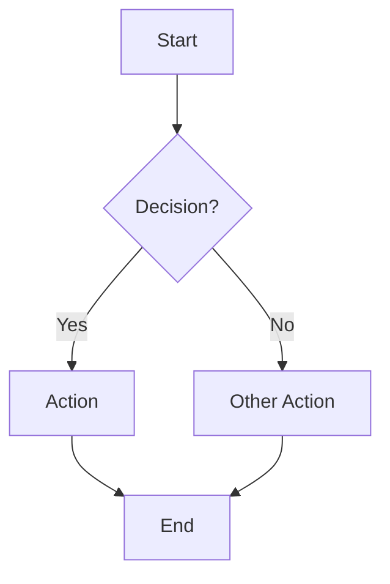

# WARP.md

This file provides guidance to WARP (warp.dev) when working with code in this repository.

## Monorepo layout and architecture

- This is a JavaScript/TypeScript monorepo managed by Turborepo with npm workspaces.
- Root workspaces are `apps/*` and `packages/*` (configured in `package.json`).
- High-level structure:
  - `apps/api`: NestJS Fastify HTTP API using Prisma and a shared `@repo/database` package.
  - `apps/web`: Next.js 14 app (React 18) for the main web experience.
  - `packages/database`: Shared Prisma + TypeScript database access layer, exposed as `@repo/database`.
  - `infra/docker`: Docker Compose for local Postgres and Redis.
  - `docs/*`: Architecture notes, API contracts, and onboarding docs for Nexus Connect (NCC).

### Root config

- `package.json`
  - Monorepo scripts and workspace configuration.
  - Key scripts:
    - `dev`: `turbo dev` (runs dev tasks for all apps/packages that define a `dev` script).
    - `dev:api`: `turbo dev --filter=api` (API-only dev).
    - `dev:all`: `turbo dev --parallel` (all dev targets in parallel; noisy but useful during local development).
    - `dev:clean`: `bash ./scripts/dev-clean.sh` (if present; use for cleaning/refreshing the dev environment).
    - `build`: `turbo build` (build all apps/packages that define a `build` script).
    - `lint`: `turbo lint` (fan-out lint tasks).
    - `check-types`: `turbo run check-types` (TS type checking across the workspace).
    - `format`: `prettier --write .` (opinionated formatting pass over the repo).
- `turbo.json`
  - Defines generic `dev`, `build`, `lint`, and `check-types` behaviors and dependencies.
  - `dev` is `persistent: true` and `cache: false` (long-running processes, e.g., API server, Next dev).
  - `build` tasks depend on `^build` (build upstream dependencies first).
  - `lint` and `check-types` also depend on their transitive equivalents.
- `tsconfig.json`
  - Root TS config extended by `apps/*` and `packages/*`.
  - Important `paths`:
    - `@repo/database/*` → `packages/database/src/*`
    - `@repo/types/*` → `packages/types/src/*` (planned or existing shared types package).

## Apps

### API (`apps/api`)

- Tech stack: NestJS 11, Fastify adapter, `@nestjs/config`, JWT auth, Passport, Redis, Prisma via `@repo/database`.
- Entry and build configuration:
  - `tsconfig.json` extends root config, sets `outDir` to `dist`, `rootDir` to `src`, and enables decorators.
  - `tsconfig.build.json` excludes `**/*.spec.ts`, `node_modules`, and `dist` for production builds.
- Scripts (from `apps/api/package.json`):
  - `dev`: `ts-node-dev --respawn --transpile-only src/main.ts` (start Nest API in watch mode).
  - `build`: `tsc -p tsconfig.build.json` (compile TS to JS in `dist/`).
  - `start`: `node dist/main.js` (run compiled API).
  - `check-types`: `tsc -p tsconfig.json --noEmit` (type-check API only).
  - `lint`: `eslint src --ext .ts` (API-only lint).

**Common API workflows**

- Run only the API in dev mode (preferred during backend work):
  - From repo root: `npm run dev:api`
  - Directly within `apps/api`: `npm run dev`
- Build and run compiled API:
  - From `apps/api`:
    - `npm run build`
    - `npm start`
- API-only lint and type-check:
  - From `apps/api`:
    - `npm run lint`
    - `npm run check-types`
- When editing Prisma/database logic used by the API, prefer to make changes in `packages/database` (see below) and import from there instead of accessing Prisma directly inside `apps/api`.

### Web (`apps/web`)

- Tech stack: Next.js 14, React 18, TypeScript.
- Scripts (from `apps/web/package.json`):
  - `dev`: `next dev -p 3000` (Next dev server on port 3000).
  - `build`: `next build` (production build).
  - `start`: `next start` (serve compiled app).
  - `lint`: `echo 'lint disabled'` (linting currently disabled at the app level; rely on root/Turbo lint if configured).
  - `check-types`: `tsc --noEmit` (type-check web app only).
- TS config: `apps/web/tsconfig.json` extends root TS config and enables Next.js-specific TS options (`jsx: preserve`, incremental builds, Next TS plugin).

**Common web workflows**

- Run only the web app in dev mode:
  - From repo root (if a script exists): `npm run dev:web` (see `docs/onboarding/README.md`).
  - Or from `apps/web`: `npm run dev` (Next dev server).
- Build and start web app:
  - From `apps/web`:
    - `npm run build`
    - `npm start`
- Web-only type-check:
  - From `apps/web`: `npm run check-types`

## Shared packages

### Database (`packages/database`)

- Purpose: shared database access layer using Prisma, reused by the API and any other services.
- `packages/database/package.json`:
  - Scripts:
    - `prisma:migrate`: `prisma migrate dev` (run dev migrations; requires `DATABASE_URL`).
    - `prisma:generate`: `prisma generate` (generate Prisma client).
    - `build`: `tsc -p tsconfig.json` (compile TS to `dist/`).
    - `check-types`: `tsc -p tsconfig.json --noEmit`.
    - `lint`: `eslint src --ext .ts`.
    - `import:xact`: `ts-node src/run-import-xact.ts` (custom CSV/Xact import routine – used for data ingestion/migrations).
  - Dependencies: `@prisma/client`, `csv-parse`.
- `tsconfig.json` extends root config, sets `outDir: dist`, and emits declarations/maps. Includes `src` and `prisma`, and configures `ts-node` in `transpileOnly` mode for scripts.

**Common database workflows**

- Run Prisma migrations (local dev):
  - From `packages/database`: `npm run prisma:migrate`
- Regenerate Prisma client after schema changes:
  - From `packages/database`: `npm run prisma:generate`
- Build and type-check the database package:
  - `npm run build`
  - `npm run check-types`
- Run the Xact import script:
  - From `packages/database`: `npm run import:xact`
  - Ensure required environment variables (e.g., `DATABASE_URL`) are configured before running.

## Infrastructure

### Docker (`infra/docker`)

- `infra/docker/docker-compose.yml` defines local infrastructure for backend services:
  - `postgres` (Postgres 16):
    - Port: `5432` on host.
    - Env vars: `POSTGRES_USER`, `POSTGRES_PASSWORD`, `POSTGRES_DB`.
    - Volume: `nexus-postgres-data`.
  - `redis` (Redis 7):
    - Port: `6380` on host mapped to `6379` in container.
    - Volume: `nexus-redis-data`.

**Common infra workflows**

- Start local Postgres and Redis for API development:
  - From repo root: `docker compose -f infra/docker/docker-compose.yml up -d`
- Stop local infra:
  - `docker compose -f infra/docker/docker-compose.yml down`

## Docs and domain knowledge

- `docs/README.md` explains doc layout:
  - `architecture/` for high-level system design.
  - `api-contracts/` for HTTP/tRPC contracts.
  - `onboarding/` for setup guides and runbooks.
- `docs/onboarding/README.md` contains additional app-level notes (including legacy references to `admin`, `mobile`, and tRPC migration plans). Treat these as context, not necessarily an exact reflection of the current filesystem.
- `docs/onboarding/ui-performance-sop.md` defines UI performance standards and patterns (memoization, lazy-loading, profiling). Follow this when adding or modifying pages in `apps/web`.
- `docs/architecture/ncc-overview.md` and `docs/data/Migrate Nexus API from Laravel to Node+tRPC and align monorepo structure.md` describe the desired future architecture:
  - Monorepo with `apps` (web, admin, mobile, api, ncc), `packages` (ui, types, config, database, email), `infra` (docker, terraform, github, scripts), and `docs`.
  - Node + tRPC backend in `apps/api` using Prisma and shared packages.
  - NCC (`apps/ncc`) as the primary control surface for NEXUS.
- When making architectural changes, consult these docs to stay aligned with the intended target state and keep them updated as the implementation evolves.

## Running common tasks from the root

Use these when coordinating across multiple apps/packages:

- Start dev for all apps/packages with dev scripts:
  - `npm run dev` (may be noisy; prefer filtered dev scripts when working on a single app).
- API-only dev:
  - `npm run dev:api`
- Build everything:
  - `npm run build`
- Lint everything (where lint scripts exist):
  - `npm run lint`
- Type-check everything:
  - `npm run check-types`
- Format the repo:
  - `npm run format`

## Database Schema Changes - CRITICAL SAFETY RULES

**NEVER use these commands without explicit user approval:**
- `prisma db push --force-reset` - WIPES ALL DATA
- `prisma migrate reset` - WIPES ALL DATA
- Any command with `--force` or `reset` flags on the database

**Always use migrations for schema changes:**
```bash
# CORRECT - preserves data, creates migration history
npm -w packages/database exec -- npx prisma migrate dev --name descriptive_name

# WRONG - no migration history, can cause data loss
npm -w packages/database exec -- npx prisma db push
```

**Before any schema change:**
1. Check if the change is additive (new nullable field, new table) - safe
2. Check if the change modifies existing data (rename, type change) - needs migration strategy
3. Check if the change removes data (drop column/table) - DANGEROUS, needs backup

**If `db push` fails with schema drift:**
- Do NOT use `--force-reset`
- Create a proper migration instead
- Or ask the user how they want to handle it

## Diagrams in NCC eDocs

As of Feb 18, 2026, NCC eDocs supports **Mermaid diagrams** natively. Documents containing `<div class="mermaid">` blocks will automatically render as flowcharts, architecture diagrams, etc.

### How to Add Diagrams

Use Mermaid syntax inside a `<div class="mermaid">` block:

```html
<div class="mermaid">
graph TD
    A[NCC Core] --> B[Estimating]
    B --> C[Scheduling & Gantt]
    C --> D[Daily Logs]
    D --> E[Time & Payroll]
    E --> F[Invoicing]

    subgraph Collaborator Technology
        G[Owner] -.->|scoped access| B
        G -.->|scoped access| C
    end

    style G fill:#fff3e0,stroke:#ef6c00,stroke-width:2px
</div>
```

### Tips

- **Test syntax first** at https://mermaid.live/ before pasting into documents
- **Use subgraphs** for grouping modules or logical sections
- **Dashed lines** (`-.->`) work well for cross-cutting concerns (e.g., Collaborator Technology)
- **Styling** with `style NodeName fill:#color,stroke:#color` for emphasis
- **Error handling**: If syntax is invalid, the viewer shows an error message with the problematic code

### Security

- Only Mermaid code is processed — no `<script>` or arbitrary JavaScript allowed
- All HTML is sanitized with DOMPurify before rendering
- Mermaid runs with `securityLevel: 'strict'` (no external resources, no eval)

### Supported Views

Mermaid diagrams render in:
- Normal document view
- Reader Mode (full-screen)
- Print / PDF export

### Future Extensions

The same pattern can be extended for:
- **KaTeX** — math equations (`<div class="katex">` or `$$ ... $$`)
- **Syntax highlighting** — code blocks with Prism.js

## Mobile Build & Deploy Contract

Whenever mobile changes are ready for production (user says "build", "deploy", "push to prod", or similar for mobile), Warp MUST follow this process:

### Android APK — Local Build (Default)
**Always build Android APKs locally** using the local build script. Do NOT use EAS cloud builds for Android.

```bash
# From apps/mobile:
bash scripts/build-android-local.sh release
```

- Builds a release APK locally using Gradle
- Automatically copies the APK to Google Drive: `~/Library/CloudStorage/GoogleDrive-paul.gagnon@keystone-restoration.com/My Drive/nexus-builds/`
- File naming: `nexus-mobile-release-YYYYMMDD-HHMMSS.apk`
- Also creates a `nexus-mobile-release-latest.apk` symlink
- Opens the Google Drive folder when complete

### iOS IPA — EAS Cloud Build + TestFlight
iOS builds use EAS Build (cloud) because Apple code signing requires it.

```bash
# From apps/mobile:
eas build --platform ios --profile production --non-interactive --no-wait

# After build completes, submit to TestFlight:
eas submit --platform ios --latest
```

- Uses the `production` profile in `eas.json`
- `autoIncrement: true` handles build numbers automatically
- After submission, the build appears in TestFlight for internal testing

### Version Bumping
Before building, bump the version in `apps/mobile/app.json`:
- Update both `version` and `runtimeVersion` fields
- Use semantic versioning: patch for fixes, minor for features, major for breaking changes

### Build Order
1. Bump version in `app.json`
2. Commit and push all changes to `main`
3. Build Android APK locally (save to Google Drive)
4. Start iOS EAS build (runs in background)
5. Submit iOS to TestFlight when build completes

## How future agents should work here

- Prefer running tasks via root `npm` scripts when touching multiple apps; drop into app/package directories only when you need fine-grained control.
- Align code changes with the target architecture in `docs/architecture/ncc-overview.md` and the API migration plan in `docs/data/Migrate Nexus API from Laravel to Node+tRPC and align monorepo structure.md`.
- When adding new backend capabilities, consider placing shared logic in `packages/database` (or future shared packages like `packages/types`) and consuming it from `apps/api` rather than duplicating logic in the app.
- For significant architectural changes, update the relevant docs in `docs/architecture` and `docs/onboarding` so they remain the source of truth for future contributors and agents.

## SOP Production Contract

Whenever a feature is marked ready for production (user says "push to production", "ready for prod", "finalize", or similar), Warp MUST generate an SOP document before or alongside the deployment.

### SOP Storage
- **Staging location:** `docs/sops-staging/` (Markdown files with frontmatter)
- **Final destination:** Nexus Documents system → "Unpublished SOPs" group
- SOPs remain in the unpublished group (collapsed list) until manually reviewed and published

### SOP Document Format

Each SOP must be a Markdown file with this structure:

```markdown
---
title: "[Module Name] SOP"
module: [module-name]
revision: "1.0"
tags: [sop, module-name, relevant-department, relevant-roles]
status: draft
created: YYYY-MM-DD
updated: YYYY-MM-DD
author: Warp
---

# [Module Name]

## Purpose
Brief description of what this module does and why it exists.

## Who Uses This
- List of roles/users who interact with this module

## Workflow

### Step-by-Step Process
1. Step one
2. Step two
3. ...

### Flowchart



## Key Features
- Feature 1
- Feature 2

## Related Modules
- [Other Module 1]
- [Other Module 2]

## Revision History
| Rev | Date | Changes |
|-----|------|--------|
| 1.0 | YYYY-MM-DD | Initial release |
```

### Revision Numbering
- New SOPs start at `revision: "1.0"`
- Minor updates (clarifications, typos): increment minor version (1.0 → 1.1)
- Major changes (workflow changes, new features): increment major version (1.1 → 2.0)
- Always update the `updated` date and add entry to Revision History

### Nexus Documents Integration
- The Nexus Documents system must have an **"Unpublished SOPs"** group/category
- This group displays as a collapsed list by default
- Admins can expand the list, review SOPs, and select for publication
- On publication, SOPs move to appropriate public category with role-based visibility

### Tagging Convention
- Always include: `sop`
- Module tag: `module-name` (e.g., `document-import`, `timecard`, `user-management`)
- Department tags as applicable: `admin`, `accounting`, `operations`, `hr`
- Role tags as applicable: `admin-only`, `manager`, `all-users`

## Document Visibility & Role-Based Access

All documents in the Nexus ecosystem (SOPs, CAMs, handbooks, etc.) support visibility controls via frontmatter:

```yaml
visibility:
  public: false              # Show on public website?
  internal: true             # Show in internal NCC docs?
  roles: [admin, pm, exec]   # Which roles can see this?
```

### Visibility Levels
- `public: true` — Visible on public website (marketing-ready)
- `public: false, internal: true` — Internal NCC docs only
- `public: false, internal: false` — Archived/hidden

### Standard Roles
| Role | Description |
|------|-------------|
| `all` | All authenticated users |
| `admin` | System administrators |
| `exec` | Executive team |
| `pm` | Project managers |
| `estimator` | Estimating team |
| `accounting` | Accounting/finance |
| `field` | Field crews |
| `client` | External clients (Collaborator Technology) |

### Default Visibility by Document Type
- **SOPs**: `internal: true, roles: [all]` (visible to all authenticated users)
- **CAMs (draft)**: `internal: true, roles: [admin]` (restricted until reviewed)
- **CAMs (validated)**: `internal: true, roles: [admin, exec, pm]` (expand as appropriate)
- **CAMs (published)**: `public: true, roles: [all]` (if approved for website)
- **Handbooks**: `internal: true, roles: [role-specific]` (auto-filter by reader's role)

### Handbook Auto-Filtering

When generating role-specific handbooks, documents are automatically filtered:

```typescript
// Example: Generate PM Handbook
const pmDocs = allDocs.filter(doc => 
  doc.visibility.internal && 
  (doc.visibility.roles.includes('all') || doc.visibility.roles.includes('pm'))
);
```

This allows a single source of truth with role-appropriate views.

## Session Memorialization Contract

At the end of significant development sessions, Warp MUST evaluate and potentially create documentation:

### 1. Create Session Export (When Appropriate)
- **Location:** `docs/sops-staging/session-[date]-[topic].md`
- **Include:** Problems solved, decisions made, code changes, lessons learned
- **Trigger:** User requests export, or session involved significant production changes

### 2. Evaluate for Competitive Advantage Modules (CAMs)

Score each significant feature/fix against these criteria (1-10 each):

| Criterion | Question |
|-----------|----------|
| **Uniqueness** | Do competitors have this? (1=common, 10=unique) |
| **Value** | How much does this help users? (1=minor, 10=critical) |
| **Demonstrable** | Can we show this in a demo? (1=hard, 10=easy) |
| **Defensible** | Is this hard to copy? (1=easy, 10=hard) |

**CAM Threshold:** Combined score ≥ 24/40 → Create CAM draft in `docs/cams/`

### 3. CAM Document Structure

CAMs are organized by **Mode** and **Category**:

**Modes:** `FIN` (Financial), `OPS` (Operations), `EST` (Estimating), `HR` (Workforce), `CLT` (Client Relations), `CMP` (Compliance), `TECH` (Technology)

**Categories:** `AUTO` (Automation), `INTL` (Intelligence), `INTG` (Integration), `VIS` (Visibility), `SPD` (Speed), `ACC` (Accuracy), `CMP` (Compliance), `COLLAB` (Collaboration)

**CAM ID Format:** `{MODE}-{CATEGORY}-{NNNN}` (e.g., `EST-SPD-0001`)

### 4. Storage & Sync
- Session exports: `docs/sops-staging/` → syncs to Nexus Documents "Unpublished SOPs"
- CAMs: `docs/cams/` → syncs to Nexus Documents "CAM Library"
- CAMs with `website: true` in frontmatter feed into website content pipeline

### 5. Automatic Document Sync

Warp SHOULD automatically sync documents to production after creating them:

```bash
# Sync all SOPs and CAMs to Nexus Documents
npm run docs:sync

# Or sync individually
npm run sops:sync    # SOPs only
npm run cams:sync    # CAMs only
```

**Requirements:**
- `NEXUS_API_TOKEN` must be set in `.env`
- Generate a service token (90-day expiry): `npm run api-token:generate`
- Token requires SUPER_ADMIN credentials

### 6. Session Closeout Prompt

After significant sessions, prompt user:
> "Session complete. Created [N] doc(s) and [M] CAM(s). Ready to sync to production?"

If user confirms, run `npm run docs:sync` to push to Nexus Documents.

### 7. Service Token Setup (One-Time)

To enable automatic sync:

```bash
# Generate a 90-day service token
SUPER_ADMIN_EMAIL=your@email.com SUPER_ADMIN_PASSWORD=yourpass npm run api-token:generate

# Add the output to .env
echo "NEXUS_API_TOKEN=eyJ..." >> .env
```

See full CAM system documentation: `docs/sops-staging/cam-competitive-advantage-system-sop.md`
