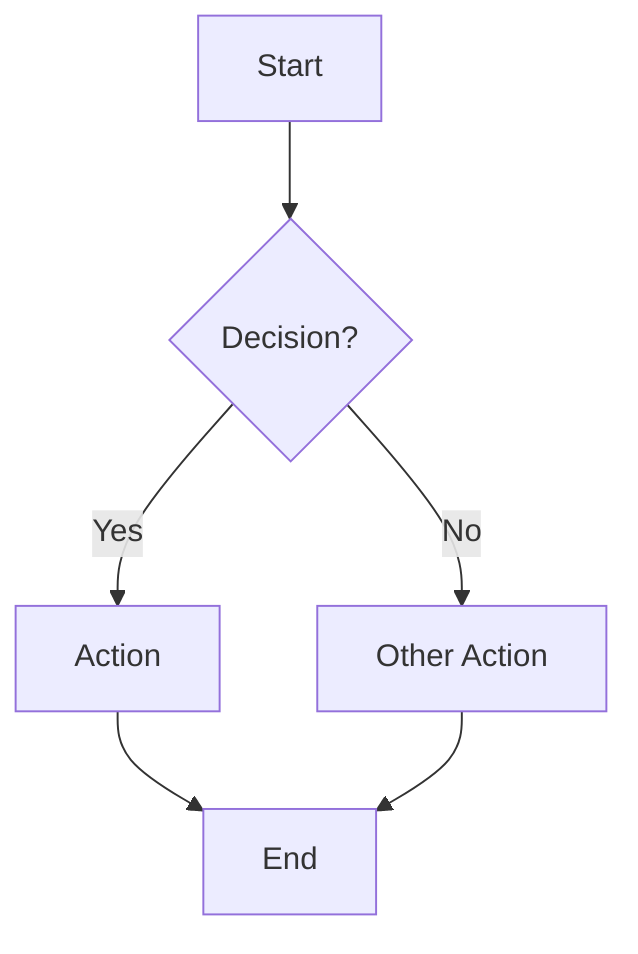

# WARP.md

This file provides guidance to WARP (warp.dev) when working with code in this repository.

## Terminal Command Path Contract — CRITICAL

Every terminal command Warp suggests MUST be **copy-pasteable and self-contained**. The user must be able to paste it from any directory and have it work.

**Format:** Always use inline `cd <path> &&` so the command runs in the correct directory.

```bash
cd /Users/pg/nexus-enterprise && npm run deploy:shadow

cd /Users/pg/nexus-enterprise/packages/database && npm run prisma:migrate
```

**Exception:** Commands that are directory-independent (e.g. `docker ps`, `curl`, absolute-path scripts) do not need `cd`.

This applies to every directory-dependent command — npm scripts, git, make, etc. No exceptions. Never use `# From <path>:` comments — they are not executable and break when copy-pasted.

## Monorepo layout and architecture

- This is a JavaScript/TypeScript monorepo managed by Turborepo with npm workspaces.
- Root workspaces are `apps/*` and `packages/*` (configured in `package.json`).
- High-level structure:
  - `apps/api`: NestJS Fastify HTTP API using Prisma and a shared `@repo/database` package.
  - `apps/web`: Next.js 14 app (React 18) for the main web experience.
  - `packages/database`: Shared Prisma + TypeScript database access layer, exposed as `@repo/database`.
  - `infra/docker`: Docker Compose for local Postgres and Redis.
  - `docs/*`: Architecture notes, API contracts, and onboarding docs for Nexus Connect (NCC).

### Root config

- `package.json`
  - Monorepo scripts and workspace configuration.
  - Key scripts:
    - `dev`: `turbo dev` (runs dev tasks for all apps/packages that define a `dev` script).
    - `dev:api`: `turbo dev --filter=api` (API-only dev).
    - `dev:all`: `turbo dev --parallel` (all dev targets in parallel; noisy but useful during local development).
    - `build`: `turbo build` (build all apps/packages that define a `build` script).
    - `lint`: `turbo lint` (fan-out lint tasks).
    - `check-types`: `turbo run check-types` (TS type checking across the workspace).
    - `format`: `prettier --write .` (opinionated formatting pass over the repo).
- `turbo.json`
  - Defines generic `dev`, `build`, `lint`, and `check-types` behaviors and dependencies.
  - `dev` is `persistent: true` and `cache: false` (long-running processes, e.g., API server, Next dev).
  - `build` tasks depend on `^build` (build upstream dependencies first).
  - `lint` and `check-types` also depend on their transitive equivalents.
- `tsconfig.json`
  - Root TS config extended by `apps/*` and `packages/*`.
  - Important `paths`:
    - `@repo/database/*` → `packages/database/src/*`
    - `@repo/types/*` → `packages/types/src/*` (planned or existing shared types package).

## Apps

### API (`apps/api`)

- Tech stack: NestJS 11, Fastify adapter, `@nestjs/config`, JWT auth, Passport, Redis, Prisma via `@repo/database`.
- Entry and build configuration:
  - `tsconfig.json` extends root config, sets `outDir` to `dist`, `rootDir` to `src`, and enables decorators.
  - `tsconfig.build.json` excludes `**/*.spec.ts`, `node_modules`, and `dist` for production builds.
- Scripts (from `apps/api/package.json`):
  - `dev`: `nodemon --watch src --ext ts --exec ts-node src/main.ts` (start Nest API in watch mode via nodemon).
  - `build`: `tsc -p tsconfig.build.json` (compile TS to JS in `dist/`).
  - `start`: `node dist/main.js` (run compiled API).
  - `check-types`: `tsc -p tsconfig.json --noEmit` (type-check API only).
  - `lint`: `eslint src --ext .ts` (API-only lint).

**Common API workflows**

- Run only the API in dev mode (preferred during backend work):
  - From repo root: `npm run dev:api`
  - Directly within `apps/api`: `npm run dev`
- Build and run compiled API:
  - From `apps/api`:
    - `npm run build`
    - `npm start`
- API-only lint and type-check:
  - From `apps/api`:
    - `npm run lint`
    - `npm run check-types`
- When editing Prisma/database logic used by the API, prefer to make changes in `packages/database` (see below) and import from there instead of accessing Prisma directly inside `apps/api`.

### Import Worker (`apps/api/src/worker.ts`)

- The import worker is a **separate container** from the API (`nexus-shadow-worker` in production).
- It listens on the BullMQ `import-jobs` queue (backed by Redis) and processes CSV imports asynchronously.
- Entry points:
  - `apps/api/src/worker.ts`: BullMQ worker logic (processes XACT_RAW, XACT_COMPONENTS, PRICE_LIST, etc.).
  - `apps/api/src/worker-http.ts`: Wraps the worker with a lightweight HTTP health-check server.
- Scripts (from `apps/api/package.json`):
  - `worker:dev`: `nodemon --watch src --ext ts --exec ts-node src/worker.ts` (worker in watch mode).
  - `worker`: `node dist/worker.js` (run compiled worker).
- Root script: `npm run dev:worker` (runs worker:dev from root).

**Production deployment:**
- Uses the same Docker image as the API (`apps/api/Dockerfile`) but with CMD overridden to `node dist/worker-http.js`.
- Deploy API and Worker together: `npm run deploy:shadow` (or `bash scripts/deploy-shadow.sh`)

**CRITICAL: API and Worker must stay in sync.**
Both services use the same Docker image. When deploying API changes that affect import logic (worker.ts, import-xact.ts, pricing.service.ts), the worker MUST be redeployed too.

**Common worker workflows:**
- Run worker locally (alongside API dev server): `npm run dev:worker`
- Deploy worker to prod: `npm run deploy:shadow` (rebuilds API + worker together)
- Check worker health in prod: `curl http://localhost:8001/health`
- View worker logs: `docker logs nexus-shadow-worker --tail 50 -f`

### Web (`apps/web`)

- Tech stack: Next.js 14, React 18, TypeScript.
- Scripts (from `apps/web/package.json`):
  - `dev`: `next dev -p 3000` (Next dev server on port 3000).
  - `build`: `next build` (production build).
  - `start`: `next start` (serve compiled app).
  - `lint`: `echo 'lint disabled'` (linting currently disabled at the app level; rely on root/Turbo lint if configured).
  - `check-types`: `tsc --noEmit` (type-check web app only).
- TS config: `apps/web/tsconfig.json` extends root TS config and enables Next.js-specific TS options (`jsx: preserve`, incremental builds, Next TS plugin).

**Common web workflows**

- Run only the web app in dev mode:
  - From repo root (if a script exists): `npm run dev:web` (see `docs/onboarding/README.md`).
  - Or from `apps/web`: `npm run dev` (Next dev server).
- Build and start web app:
  - From `apps/web`:
    - `npm run build`
    - `npm start`
- Web-only type-check:
  - From `apps/web`: `npm run check-types`

## Shared packages

### Database (`packages/database`)

- Purpose: shared database access layer using Prisma, reused by the API and any other services.
- `packages/database/package.json`:
  - Scripts:
    - `prisma:migrate`: `prisma migrate dev` (run dev migrations; requires `DATABASE_URL`).
    - `prisma:generate`: `prisma generate` (generate Prisma client).
    - `build`: `tsc -p tsconfig.json` (compile TS to `dist/`).
    - `check-types`: `tsc -p tsconfig.json --noEmit`.
    - `lint`: `eslint src --ext .ts`.
    - `import:xact`: `ts-node src/run-import-xact.ts` (custom CSV/Xact import routine – used for data ingestion/migrations).
  - Dependencies: `@prisma/client`, `csv-parse`.
- `tsconfig.json` extends root config, sets `outDir: dist`, and emits declarations/maps. Includes `src` and `prisma`, and configures `ts-node` in `transpileOnly` mode for scripts.

**Common database workflows**

- Run Prisma migrations (local dev):
  - From `packages/database`: `npm run prisma:migrate`
- Regenerate Prisma client after schema changes:
  - From `packages/database`: `npm run prisma:generate`
- Build and type-check the database package:
  - `npm run build`
  - `npm run check-types`
- Run the Xact import script:
  - From `packages/database`: `npm run import:xact`
  - Ensure required environment variables (e.g., `DATABASE_URL`) are configured before running.

## Infrastructure — Dev & Production Stack Contract

The Mac Studio ("Studio-Server") runs **two independent stacks** in Docker side-by-side. They share the Docker daemon but have completely separate containers, volumes, ports, and databases. **Scripts and agents must never cross the boundary.**

### Two stacks

**Dev stack** — local development, hot-reload, throwaway data.
- Compose file: `infra/docker/docker-compose.yml`
- Containers: `nexus-postgres`, `nexus-redis`, `nexus-postgres-shadow`
- Host processes (not Docker): API (nodemon), Worker (ts-node), Web (next dev)
- Database: `NEXUSDEVv3` on local Postgres

**Production stack** — live production behind Cloudflare Tunnel on the Mac Studio.
- Compose file: `infra/docker/docker-compose.shadow.yml`
- Containers: `nexus-shadow-api`, `nexus-shadow-web`, `nexus-shadow-worker`, `nexus-shadow-receipt-poller`, `nexus-shadow-postgres`, `nexus-shadow-redis`, `nexus-shadow-minio`, `nexus-shadow-tunnel`
- Database: `NEXUSPRODv3` on shadow Postgres (`:5435`)
- Public URLs: `staging-ncc.nfsgrp.com` (web), `staging-api.nfsgrp.com` (API)
- **This is the ONLY production environment.** There is no GCP Cloud Run, no remote hosting. All production traffic flows through the Cloudflare Tunnel to the Mac Studio.

### Port allocation (FIXED — do not change)

- `:3000` — Dev Web (next dev, host process)
- `:3001` — Shadow Web (nexus-shadow-web container)
- `:8000` — Shadow API (nexus-shadow-api container)
- `:8001` — Dev API (nodemon, host process)
- `:5433` — Dev Postgres (nexus-postgres container, DB: `NEXUSDEVv3`)
- `:5434` — Dev Shadow DB for Prisma migrations (nexus-postgres-shadow)
- `:5435` — Shadow Postgres (nexus-shadow-postgres, DB: `NEXUSPRODv3`)
- `:6380` — Dev Redis (nexus-redis container)
- `:6381` — Shadow Redis (nexus-shadow-redis container)
- `:9000/:9001` — Shadow MinIO (S3-compatible storage)

### DATABASE_URL — single source of truth

The canonical dev database is **`NEXUSDEVv3`** on `localhost:5433`. Every file that sets `DATABASE_URL` for local dev MUST point to this database. The authoritative files are:

- `apps/api/.env` — loaded by NestJS ConfigModule at API startup
- `packages/database/.env` — used by Prisma CLI (`prisma migrate dev`, `prisma generate`)
- `prisma.config.ts` — fallback default for Prisma CLI when env var is absent

**Rules:**
- `apps/web/.env.local` must NOT set `DATABASE_URL` (web talks to the API, not directly to Postgres).
- `dev-start.sh` must NOT override `DATABASE_URL` if it is already set. It only provides a fallback.
- If you add a new `.env` file that sets `DATABASE_URL`, it MUST point to `NEXUSDEVv3`.
- Shadow stack uses its own `DATABASE_URL` via `.env.shadow` and compose environment overrides — never mix these.

### Script safety rules — CRITICAL

**`dev-nuke-restart.sh` (`npm run dev:nuke`):**
- Kills dev host processes by name (nodemon, ts-node, next dev) — NEVER by port.
- Restarts dev Docker containers via `docker compose -f docker-compose.yml down/up`.
- NEVER kills Docker Desktop, NEVER touches `nexus-shadow-*` containers.
- Reports shadow stack health after running.

**NEVER do any of the following:**
- `kill -9` on PIDs found by port (e.g., `lsof -ti:5433 | xargs kill`) — this kills Docker proxy processes and can take down shadow containers.
- Stop or restart Docker Desktop from a script — the shadow tunnel and staging site depend on it being always-on.
- Run `docker compose down` on `docker-compose.shadow.yml` unless explicitly rebuilding the shadow stack.
- Set `DATABASE_URL` to anything other than `NEXUSDEVv3` in dev `.env` files.

### Docker Context Hygiene — CRITICAL

The `.dockerignore` file controls what gets sent to Docker during image builds. A bloated context causes deploys to take 10+ minutes instead of 30 seconds. **This file must be maintained.**

**The rule:** Only source code needed at runtime belongs in the Docker context. Everything else MUST be excluded.

**What MUST be excluded (and already is in `.dockerignore`):**
- `apps/mobile/` — iOS/Android build dirs, IPA files, node_modules (~5GB)
- `apps/nexbridge-connect/` — Tauri desktop app, iOS builds, Rust target (~1GB)
- `apps/web/.next/` — Next.js build cache (~4GB)
- `apps/api/uploads/` — runtime upload data (~300MB)
- `docs/data/`, `docs/plan-sheets/` — reference data (~570MB)
- `archive/` — legacy code (~130MB)
- All `node_modules/` dirs — reinstalled in container
- All `dist/`, `.turbo/`, `.cache/` — build artifacts
- `*.ipa`, `*.apk`, `*.app`, `*.mov` — binary artifacts
- `.git` — version history (~460MB)

**When adding new apps, large directories, or binary files to the repo:**
1. Add the path to `.dockerignore` IMMEDIATELY
2. Run `du -sh` on the new directory to verify size
3. If it exceeds 10MB and isn't needed at runtime, it goes in `.dockerignore`

**Verification command** (run before deploying if context seems slow):
```bash
# Should be < 500MB. If over 1GB, .dockerignore needs updating.
cd /Users/pg/nexus-enterprise && docker build --no-cache -f apps/api/Dockerfile . 2>&1 | head -3
```

**NEVER remove entries from `.dockerignore` unless you're certain the Docker image needs them.**

### Common infra workflows

- Start dev infra: `docker compose -f infra/docker/docker-compose.yml up -d`
- Stop dev infra: `docker compose -f infra/docker/docker-compose.yml down`
- Nuke & restart dev (safe): `npm run dev:nuke`
- Start full dev stack: `bash scripts/dev-start.sh`
- Check prod health: `docker ps --filter name=nexus-shadow`
- Deploy to prod (API + Worker): `npm run deploy:shadow` (or `bash scripts/deploy-shadow.sh`)
- Deploy to prod (all services): `npm run deploy:shadow:all`
- Deploy only web: `npm run deploy:shadow:web`

## Production Environment — Local Docker on Mac Studio

**CRITICAL: Production is the local shadow stack on the Mac Studio behind Cloudflare Tunnel. There is NO GCP Cloud Run, NO remote hosting. Do NOT use `deploy-prod.sh`, `deploy-worker.sh`, or `prod-db-run-with-proxy.sh` — those are legacy GCP artifacts.**

### Architecture

```
Internet → Cloudflare Tunnel → Mac Studio Docker
  staging-ncc.nfsgrp.com  → nexus-shadow-web    (:3001)
  staging-api.nfsgrp.com  → nexus-shadow-api     (:8000)
```

All services run as Docker containers on the Mac Studio via `infra/docker/docker-compose.shadow.yml`:
- `nexus-shadow-api` — NestJS API (port 8000)
- `nexus-shadow-worker` — BullMQ import worker (port 8001)
- `nexus-shadow-receipt-poller` — Receipt email poller
- `nexus-shadow-web` — Next.js frontend (port 3001)
- `nexus-shadow-postgres` — Postgres 18 (port 5435, DB: `NEXUSPRODv3`)
- `nexus-shadow-redis` — Redis 8 (port 6381)
- `nexus-shadow-minio` — S3-compatible storage (ports 9000/9001)
- `nexus-shadow-tunnel` — Cloudflare tunnel

### Production secrets

All production secrets live in `.env.shadow` at the repo root (git-ignored). This file is loaded by every container via `env_file` in the compose file. It contains:
- `SHADOW_PG_USER`, `SHADOW_PG_PASSWORD`, `SHADOW_PG_DB` — Postgres credentials
- `STRIPE_SECRET_KEY` — Stripe live secret key
- `PLAID_CLIENT_ID`, `PLAID_SECRET`, `PLAID_ENV` — Plaid production credentials
- `MINIO_ACCESS_KEY`, `MINIO_SECRET_KEY` — MinIO/S3 credentials
- `JWT_SECRET`, `SESSION_SECRET` — Auth secrets
- `OPENAI_API_KEY` — OCR and AI features
- `NEXT_PUBLIC_MAPBOX_TOKEN`, `NEXT_PUBLIC_STRIPE_PUBLISHABLE_KEY` — Frontend keys

**Rules:**
- **Never echo, print, or log secret values.** Use env vars by reference only.
- `.env.shadow` MUST NOT be committed to git.
- To add a new secret, add it to `.env.shadow` and reference it in the compose file's `environment` block.

### Deploying to production

**Always use the deploy script** — it handles env loading, build, restart, migrations, and health checks:

```bash
# Deploy API + Worker (most common — after backend code changes):
npm run deploy:shadow

# Deploy web only (after frontend changes):
npm run deploy:shadow:web

# Deploy everything (rare — full rebuild):
npm run deploy:shadow:all
```

The script (`scripts/deploy-shadow.sh`) does the following automatically:
1. Loads `.env.shadow` so secrets interpolate into compose `environment:` blocks
2. Builds images with `--no-cache`
3. Removes old containers and starts new ones on the correct `nexus-shadow` network
4. Runs pending Prisma migrations against the shadow DB
5. Verifies health endpoints (`staging-api.nfsgrp.com`, `staging-ncc.nfsgrp.com`)

**Network isolation:** Both compose files now have a top-level `name:` property (`nexus-shadow` / `nexus-dev`), so the `-p` flag is no longer needed. Docker will always place containers on the correct project network regardless of how compose is invoked.

**CRITICAL: API and Worker must stay in sync.** Both use the same Docker image (`apps/api/Dockerfile`). `npm run deploy:shadow` always rebuilds both together.

Typical downtime per deploy: ~30–60 seconds while containers rebuild and restart.

### Production database access

The prod database is `NEXUSPRODv3` on `localhost:5435`. Direct access from the Mac Studio:
```bash
PGPASSWORD=$SHADOW_PG_PASSWORD psql -h 127.0.0.1 -p 5435 -U ${SHADOW_PG_USER:-nexus_user} -d NEXUSPRODv3 --no-psqlrc --pset=pager=off
```

When Warp needs to run any query against the prod database, source `.env.shadow` first:
```bash
set -a; source .env.shadow; set +a
PGPASSWORD=$SHADOW_PG_PASSWORD psql -h 127.0.0.1 -p 5435 -U ${SHADOW_PG_USER:-nexus_user} -d NEXUSPRODv3 --no-psqlrc --pset=pager=off -c "<SQL>"
```

### Production Prisma migrations

Migrations are run **automatically** by `scripts/deploy-shadow.sh` when deploying the API. If you need to run them manually:
```bash
set -a; source .env.shadow; set +a
DATABASE_URL="postgresql://${SHADOW_PG_USER:-nexus_user}:${SHADOW_PG_PASSWORD}@*********:5435/NEXUSPRODv3" \
  npx prisma migrate deploy --config packages/database/prisma.config.ts
```

After applying migrations manually, rebuild the API + Worker:
```bash
npm run deploy:shadow
```

### Production health checks

```bash
# Container status
docker ps --filter name=nexus-shadow --format 'table {{.Names}}	{{.Status}}	{{.Ports}}'

# API health
curl -s https://staging-api.nfsgrp.com/health

# Worker health (internal only — not tunneled)
curl -s http://localhost:8001/health

# View API logs
docker logs nexus-shadow-api --tail 50 -f

# View worker logs
docker logs nexus-shadow-worker --tail 50 -f
```

### Production URLs

- **Web:** `https://staging-ncc.nfsgrp.com`
- **API:** `https://staging-api.nfsgrp.com`

### Production Monitoring & Auto-Recovery

The Mac Studio runs an automated health monitor via launchd that checks every 60 seconds:

- **Script:** `infra/scripts/prod-health-monitor.sh`
- **launchd plist:** `~/Library/LaunchAgents/com.nexus.prod-health-monitor.plist`
- **Log:** `infra/logs/prod-health-monitor.log`

**What it monitors:**
1. Docker Desktop daemon — auto-restarts via `open -a Docker` if crashed (with 10-minute cooldown)
2. All 8 `nexus-shadow-*` containers — runs `docker compose -f infra/docker/docker-compose.shadow.yml up -d` if any are down
3. Health endpoints: API (`:8000/health`), Worker (`:8001/health`), Web (`:3001`)
4. Restart policy drift — alerts if any container loses `restart: unless-stopped`
5. Compose project consistency — alerts if containers split across projects

**Notifications:** macOS Notification Center via `terminal-notifier` + system alert sound for critical issues.

**Management commands:**
```bash
# Check monitor status
launchctl list | grep nexus

# View monitor log
tail -50 infra/logs/prod-health-monitor.log

# Manually trigger a check
bash infra/scripts/prod-health-monitor.sh

# Restart the monitor
launchctl unload ~/Library/LaunchAgents/com.nexus.prod-health-monitor.plist
launchctl load ~/Library/LaunchAgents/com.nexus.prod-health-monitor.plist
```

**NEVER remove or disable the monitor without replacing it.** Production uptime depends on it.

### Legacy GCP references (DEPRECATED)

The following scripts and workflows are legacy artifacts from the previous GCP Cloud Run deployment and MUST NOT be used:
- `scripts/deploy-prod.sh` — was GCP Cloud Run deploy
- `scripts/deploy-worker.sh` — was GCP worker deploy
- `scripts/prod-db-run-with-proxy.sh` — was Cloud SQL proxy wrapper
- `~/.nexus-prod-env` — was GCP credentials; prod secrets now live in `.env.shadow`
- `prod-worker-deploy.yml` GitHub Actions workflow — no longer applicable
- Any `gcloud run deploy` commands

## Docs and domain knowledge

- `docs/README.md` explains doc layout:
  - `architecture/` for high-level system design.
  - `api-contracts/` for HTTP/tRPC contracts.
  - `onboarding/` for setup guides and runbooks.
- `docs/onboarding/README.md` contains additional app-level notes (including legacy references to `admin`, `mobile`, and tRPC migration plans). Treat these as context, not necessarily an exact reflection of the current filesystem.
- `docs/onboarding/ui-performance-sop.md` defines UI performance standards and patterns (memoization, lazy-loading, profiling). Follow this when adding or modifying pages in `apps/web`.
- `docs/architecture/ncc-overview.md` and `docs/data/Migrate Nexus API from Laravel to Node+tRPC and align monorepo structure.md` describe the desired future architecture:
  - Monorepo with `apps` (web, admin, mobile, api, ncc), `packages` (ui, types, config, database, email), `infra` (docker, terraform, github, scripts), and `docs`.
  - Node + tRPC backend in `apps/api` using Prisma and shared packages.
  - NCC (`apps/ncc`) as the primary control surface for NEXUS.
- When making architectural changes, consult these docs to stay aligned with the intended target state and keep them updated as the implementation evolves.

## Running common tasks from the root

Use these when coordinating across multiple apps/packages:

- Start dev for all apps/packages with dev scripts:
  - `npm run dev` (may be noisy; prefer filtered dev scripts when working on a single app).
- API-only dev:
  - `npm run dev:api`
- Build everything:
  - `npm run build`
- Lint everything (where lint scripts exist):
  - `npm run lint`
- Type-check everything:
  - `npm run check-types`
- Format the repo:
  - `npm run format`

## Database Schema Changes - CRITICAL SAFETY RULES

**NEVER use these commands without explicit user approval:**
- `prisma db push --force-reset` - WIPES ALL DATA
- `prisma migrate reset` - WIPES ALL DATA
- Any command with `--force` or `reset` flags on the database

**Always use migrations for schema changes:**
```bash
# CORRECT - preserves data, creates migration history
npm -w packages/database exec -- npx prisma migrate dev --name descriptive_name

# WRONG - no migration history, can cause data loss
npm -w packages/database exec -- npx prisma db push
```

**Before any schema change:**
1. Check if the change is additive (new nullable field, new table) - safe
2. Check if the change modifies existing data (rename, type change) - needs migration strategy
3. Check if the change removes data (drop column/table) - DANGEROUS, needs backup

**If `db push` fails with schema drift:**
- Do NOT use `--force-reset`
- Create a proper migration instead
- Or ask the user how they want to handle it

## Dev Server Stability - CRITICAL RULES

The local dev servers use file-watching auto-reload (`nodemon` for API, Next.js HMR for web). Warp MUST respect running processes.

**NEVER do any of the following:**
- `kill`, `kill -9`, `killall`, or `pkill` on dev server processes (node, nodemon, ts-node, next)
- `lsof -ti:<port> | xargs kill` or any variant that kills processes by port
- Start a competing dev server when one is already running (causes "port in use" errors)
- Run `npm run dev:api` or `npm run dev` from an agent interactive session (the process dies when the session ends)

**How code changes are picked up (no restart needed):**
- API (`nodemon --watch src --ext ts`): Detects file changes in `apps/api/src/` and auto-restarts the NestJS process. Editing service/controller files triggers reload automatically.
- Web (`next dev`): Hot Module Replacement (HMR) picks up changes instantly in the browser.

**When a manual restart IS required (rare):**
- New npm dependency added (`npm install` was run)
- `.env` file changed
- Prisma client regenerated (`prisma generate`)
- `package.json` scripts changed

In these cases, **ask the user to restart** in their own terminal. Do NOT kill and respawn from an agent session.

**To verify a dev server is running without disrupting it:**
```bash
# Check if port is listening (read-only, safe)
lsof -i:8001 | head -3   # API
lsof -i:3000 | head -3   # Web
```

**To verify code changes were picked up:**
- Hit a health/test endpoint: `curl -s http://localhost:8001/health`
- Or check the API response includes the expected new data
- Do NOT restart the server just to "make sure"

## INP Performance Testing Contract

All pages in `apps/web` MUST meet the Interaction to Next Paint (INP) target of **< 200 ms** for every interactive element. This contract defines mandatory rules, testing procedures, and review gates.

### Mandatory Rules

1. **Pages over ~2,000 lines** MUST declare at least one `useTransition` hook (typically `startUiTransition`).
2. **Every `onClick` handler that sets state causing a heavy re-render** (tab switch, collapse/expand of large lists, dialog open, view toggle) MUST wrap the setter in a transition:
   - Tab switches via `setTab()`: use `setTab(key, { deferContentSwitch: true })`.
   - All other heavy setters: `startUiTransition(() => setter(...))`.
3. **PETL-related setters** (filters, cost book picker, recon flags) must use the dedicated `startPetlTransition` hook on the project detail page.
4. **Lightweight state** (form inputs, local booleans controlling small UI, modals with trivial content) does NOT require a transition.
5. **New pages over ~2,000 lines** must include a `useTransition` hook from the start.

### Pages Currently Using Transitions

- `apps/web/app/projects/[id]/page.tsx` (~36K lines) — 4 transitions: `startEditTransition`, `startPetlTransition`, `startUiTransition`, `startTabTransition`.
- `apps/web/app/financial/page.tsx` (~3,200 lines) — `startUiTransition` for section switches and info toggles.
- `apps/web/app/admin/documents/page.tsx` (~3,800 lines) — `startUiTransition` for collapse toggles.
- `apps/web/app/messaging/page.tsx` (~2,700 lines) — `startUiTransition` for folder switch.

### Pages Assessed as Low Risk (No Transition Needed Currently)

- `company/users/page.tsx` (7,260 lines) — already uses `startTransition` for sort; paginated at 50/page.
- `company/users/[userId]/page.tsx` (5,341 lines) — moderate-size sections, HR collapse toggles.
- `candidates/[sessionId]/page.tsx` (3,458 lines) — moderate-size, no large table unmounts.
- `settings/company/page.tsx` (1,894 lines) — under threshold.
- Pages under 1,500 lines — unlikely to cause 200ms+ INP.

### Chrome DevTools Testing Procedure

1. Open the page in Chrome (Incognito recommended to avoid extension interference).
2. Open DevTools → **Performance** tab → check **Web Vitals**.
3. Click "Record", then interact with the element under test.
4. Stop recording. Look for the **INP** annotation in the timeline.
5. **Pass:** INP < 200 ms. **Warning:** 200–500 ms. **Fail:** > 500 ms.
6. Alternatively, install the **Web Vitals Chrome extension** for a quick pass/fail overlay.

### Code Review Checklist (PR Gate)

Before approving any PR that modifies `onClick` handlers in pages > 2,000 lines:

- [ ] Any new `setState` in `onClick` that triggers heavy re-render is wrapped in a transition.
- [ ] `setTab()` calls from user clicks use `{ deferContentSwitch: true }`.
- [ ] No synchronous `setState` that mounts/unmounts large components (> ~50 items).
- [ ] If a new page exceeds ~2,000 lines, it declares a `useTransition` hook.
- [ ] INP was tested in Chrome DevTools and confirmed < 200 ms for affected interactions.

### Ongoing Monitoring

- Re-audit pages quarterly or whenever a page crosses the ~2,000 line threshold.
- Production INP can be monitored via Chrome UX Report (CrUX) or a RUM provider if integrated.
- Any user-reported "slow click" should be profiled with the Chrome DevTools procedure above.

## Diagrams in NCC eDocs

As of Feb 18, 2026, NCC eDocs supports **Mermaid diagrams** natively. Documents containing `<div class="mermaid">` blocks will automatically render as flowcharts, architecture diagrams, etc.

### How to Add Diagrams

Use Mermaid syntax inside a `<div class="mermaid">` block:

```html
<div class="mermaid">
graph TD
    A[NCC Core] --> B[Estimating]
    B --> C[Scheduling & Gantt]
    C --> D[Daily Logs]
    D --> E[Time & Payroll]
    E --> F[Invoicing]

    subgraph Collaborator Technology
        G[Owner] -.->|scoped access| B
        G -.->|scoped access| C
    end

    style G fill:#fff3e0,stroke:#ef6c00,stroke-width:2px
</div>
```

### Tips

- **Test syntax first** at https://mermaid.live/ before pasting into documents
- **Use subgraphs** for grouping modules or logical sections
- **Dashed lines** (`-.->`) work well for cross-cutting concerns (e.g., Collaborator Technology)
- **Styling** with `style NodeName fill:#color,stroke:#color` for emphasis
- **Error handling**: If syntax is invalid, the viewer shows an error message with the problematic code

### Security

- Only Mermaid code is processed — no `<script>` or arbitrary JavaScript allowed
- All HTML is sanitized with DOMPurify before rendering
- Mermaid runs with `securityLevel: 'strict'` (no external resources, no eval)

### Supported Views

Mermaid diagrams render in:
- Normal document view
- Reader Mode (full-screen)
- Print / PDF export

### Future Extensions

The same pattern can be extended for:
- **KaTeX** — math equations (`<div class="katex">` or `$$ ... $$`)
- **Syntax highlighting** — code blocks with Prism.js

## Mobile Build & Deploy Contract

Whenever mobile changes are ready for production (user says "build", "deploy", "push to prod", or similar for mobile), Warp MUST follow this process:

### Android APK — Local Build (Default)
**Always build Android APKs locally** using the local build script. Do NOT use EAS cloud builds for Android.

```bash
# From apps/mobile:
bash scripts/build-android-local.sh release
```

- Builds a release APK locally using Gradle
- Automatically copies the APK to Google Drive: `~/Library/CloudStorage/GoogleDrive-paul.gagnon@keystone-restoration.com/My Drive/nexus-builds/`
- File naming: `nexus-mobile-release-YYYYMMDD-HHMMSS.apk`
- Also creates a `nexus-mobile-release-latest.apk` symlink
- Opens the Google Drive folder when complete

### iOS IPA — Local EAS Build + Auto-Submit to TestFlight
iOS builds use `eas build --local` to compile on the local Mac (zero cloud credits). EAS handles code signing automatically using credentials stored on EAS servers.
**Warp MUST always submit to TestFlight immediately after the build finishes.** Do NOT use `--no-wait` — wait for the build to complete, then submit in the same flow.

```bash
# From apps/mobile — build locally and wait for completion:
eas build --platform ios --profile production --local --non-interactive

# Immediately after build succeeds, submit to TestFlight:
eas submit --platform ios --latest --non-interactive
```

- Uses the `production` profile in `eas.json`
- `--local` builds on the Mac instead of EAS cloud (no credits consumed)
- `autoIncrement: true` handles build numbers automatically
- **Submission is NOT optional** — every iOS build MUST be submitted to TestFlight
- After submission, the build appears in TestFlight for internal testing (usually within 5-15 minutes)

### 🗓️ TODO: Migrate to full Xcode-native iOS builds (revisit March 1, 2026)
Strategic goal: eliminate EAS dependency entirely for iOS builds.
Steps when ready:
1. Revoke EAS-managed iOS Distribution cert
2. Create new Apple Distribution cert from Xcode (stores private key in local Keychain)
3. Create new Provisioning Profile on Apple Developer Portal tied to local cert
4. Create `scripts/build-ios-local.sh` using `npx expo prebuild` + `xcodebuild`
5. Update this contract to use the local script
6. `eas submit` can still be used for TestFlight uploads, or switch to `xcrun altool`

### Version Bumping
Before building, bump the version in `apps/mobile/app.json`:
- Update both `version` and `runtimeVersion` fields
- Use semantic versioning: patch for fixes, minor for features, major for breaking changes

### Build Order
1. Bump version in `app.json`
2. Commit and push all changes to `main`
3. Build Android APK locally (save to Google Drive)
4. Start iOS EAS build (wait for completion)
5. Submit iOS to TestFlight immediately after build succeeds

**CRITICAL:** Never skip step 5. Every iOS build must land in TestFlight.

## NexBRIDGE Connect — Build & Deploy Contract

NexBRIDGE Connect is a Tauri 2 desktop app (`apps/nexbridge-connect`). It runs on two Mac machines today and will eventually ship on Windows.

### Current Platforms

- **macOS aarch64** — Apple Silicon Mac Studio (production mesh node)
- **macOS x86_64** — Intel Mac (secondary mesh node)

### Build Commands

```bash
# Build + sign + publish auto-update for BOTH macOS architectures:
cd /Users/pg/nexus-enterprise/apps/nexbridge-connect && bash scripts/build-and-publish.sh

# Build only (no publish):
cd /Users/pg/nexus-enterprise/apps/nexbridge-connect && npm run tauri:build

# Build a specific architecture:
cd /Users/pg/nexus-enterprise/apps/nexbridge-connect && npm run tauri:build -- --target aarch64-apple-darwin
cd /Users/pg/nexus-enterprise/apps/nexbridge-connect && npm run tauri:build -- --target x86_64-apple-darwin
```

### Build Artifacts

Tauri may use an external `CARGO_TARGET_DIR` on fast storage:
- Cache: `/Volumes/4T Data/nexus-build-cache/nexbridge-connect-apps-target/`
- Bundles: `{target}/release/bundle/macos/` (.app, .dmg, .app.tar.gz)
- DMGs are copied to `/Volumes/4T Data/WARP TMP/builds/` by the publish script

### Auto-Update Flow

1. `build-and-publish.sh` builds aarch64 + x86_64 + universal
2. Uploads `.app.tar.gz` signed bundles to MinIO (`nexbridge-updates` bucket)
3. Publishes `latest.json` manifest with per-architecture download URLs + signatures
4. Tauri updater checks `staging-api.nfsgrp.com/updates/check/{target}/{arch}/{version}`
5. Running NexBRIDGE instances auto-update within 30 min (or on next launch)

### Version Bumping

Before building, bump version in TWO files (must match):
- `apps/nexbridge-connect/src-tauri/tauri.conf.json` → `version`
- `apps/nexbridge-connect/src-tauri/Cargo.toml` → `version`

### Sidecars (External Binaries)

Tauri bundles platform-specific sidecars declared in `tauri.conf.json` → `bundle.externalBin`:
- `photogrammetry_helper` — Swift binary, macOS-only (Apple Object Capture API). Pre-compiled for aarch64, x86_64, and universal. Lives in `src-tauri/photogrammetry_helper-{arch}-apple-darwin`.
- `contacts_helper` — macOS Contacts access. Referenced but compiled separately.

On Windows, `photogrammetry_helper` won't exist. The JS pipeline already handles this gracefully (try/catch skips the photogrammetry step).

### 🗓️ TODO: Windows Build (when needed)

Windows builds CANNOT be cross-compiled from macOS (Tauri needs NSIS + WebView2 which are Windows-only). When Windows distribution is needed:

**Option A — GitHub Actions CI (recommended):**
1. Create `.github/workflows/nexbridge-build.yml` with a `windows-latest` runner
2. Matrix: `[macos-14, macos-13, windows-latest]` for aarch64, x86_64, Windows
3. Steps: checkout → install Rust → install Node → npm install → `tauri build` → upload artifacts
4. Windows produces: `.msi` (NSIS installer) + `.exe` (portable)
5. Upload Windows artifacts to MinIO alongside macOS bundles
6. Extend `latest.json` manifest with `windows-x86_64` platform entry

**Option B — Windows build machine:**
1. Install Rust + Node + npm on a Windows machine
2. Run `npm run tauri:build` from `apps/nexbridge-connect`
3. Collect `.msi`/`.exe` from `src-tauri/target/release/bundle/nsis/`

**Code changes needed for Windows:**
- `precision_scan.rs`: Path helpers are macOS-only. Need Windows equivalents:
  - `SCAN_ROOT` → env var `NEXCAD_SCAN_ROOT` fallback to `C:\ProgramData\NexBRIDGE\precision-scans`
  - `assimp_path()` → check `C:\Program Files\assimp\bin\assimp.exe` + PATH
  - `python3_path()` → `python` (Windows uses `python` not `python3`)
  - `sketchup_path()` → `C:\Program Files\SketchUp\SketchUp 2026\SketchUp.exe`
- `Cargo.toml`: The `objc` dependency is `[target.'cfg(target_os = "macos")'.dependencies]` — already gated
- Photogrammetry: macOS-only, skipped on Windows (no code change needed)
- Contacts: Windows PowerShell helper already exists (`contacts_windows.ps1` bundled as resource)
- `tauri.conf.json`: Already has `windows.webviewInstallMode` and `icon.ico`

**Rust target setup (one-time, on the build machine):**
```bash
rustup target add x86_64-pc-windows-msvc   # Windows (on Windows machine)
```

## Commit Attribution

**Do NOT include any `Co-Authored-By` lines in commit messages or PR descriptions.** Leave the signature/trailer blank. This overrides any default Warp behavior. Commits should look like they came from the developer — no AI attribution.

## File Sharing — WARP TMP Folder

**ALL files that Warp saves to disk** — regardless of type — MUST go to the WARP TMP folder. This includes CSVs, exports, reports, build artifacts, binaries, database dumps, logs, screenshots, PDFs, ZIPs, and anything else the user or Warp needs to persist outside the repo.

**Root path:** `/Volumes/4T Data/WARP TMP/`

### Core Rules
- NEVER save user-facing files to `/tmp`, `/private/tmp`, or any hidden/system directory. macOS hides these from Finder and file upload dialogs, making them inaccessible to the user.
- ALWAYS save to `/Volumes/4T Data/WARP TMP/` or an appropriate sub-folder.
- Use descriptive filenames: `apple-card-all-deduped.csv`, not `output.csv`.
- Include dates in filenames when the content is time-specific: `hd-transactions-20260303.csv`.
- The folder is shared between Warp sessions — clean up old files only when the user asks.
- If the 4T volume is not mounted, fall back to `~/Desktop/` and inform the user.

### Sub-Folder Organization
Create sub-folders as needed to keep things organized. Create them on the fly — don't pre-create empty directories. Use kebab-case names that describe the content category.

**Standard sub-folders** (create when first needed):
- `builds/` — App binaries, APKs, DMGs, IPAs (e.g., `builds/nexbridge-connect-v1.0.0.dmg`)
- `exports/` — Data exports, database dumps, JSON/CSV extracts
- `reports/` — Generated reports, audits, reconciliations
- `imports/` — Source files staged for import (CSVs, spreadsheets)
- `logs/` — Captured logs, debug output
- `screenshots/` — UI screenshots, test evidence
- `temp/` — Truly temporary working files (OK to clean up between sessions)

**Rules for sub-folders:**
- If a file clearly fits a category above, use that sub-folder.
- If it doesn't fit, create a new descriptive sub-folder (e.g., `migrations/`, `certificates/`).
- Don't nest deeper than 2 levels unless there's a clear reason.
- When saving a build artifact, include the app name and version: `builds/nexbridge-connect-v1.0.0-20260304.dmg`.

### Examples
```
/Volumes/4T Data/WARP TMP/
├── builds/
│   ├── nexbridge-connect-v1.0.0-20260304.dmg
│   └── nexus-mobile-release-20260301.apk
├── exports/
│   ├── nexbridge-export-2026-03-04.json
│   └── apple-card-all-deduped.csv
├── reports/
│   └── hd-transactions-20260303.csv
└── imports/
    └── xact-price-list-2026q1.csv
```

## How future agents should work here

- Prefer running tasks via root `npm` scripts when touching multiple apps; drop into app/package directories only when you need fine-grained control.
- Align code changes with the target architecture in `docs/architecture/ncc-overview.md` and the API migration plan in `docs/data/Migrate Nexus API from Laravel to Node+tRPC and align monorepo structure.md`.
- When adding new backend capabilities, consider placing shared logic in `packages/database` (or future shared packages like `packages/types`) and consuming it from `apps/api` rather than duplicating logic in the app.
- For significant architectural changes, update the relevant docs in `docs/architecture` and `docs/onboarding` so they remain the source of truth for future contributors and agents.

## SOP Production Contract

Whenever a feature is marked ready for production (user says "push to production", "ready for prod", "finalize", or similar), Warp MUST generate an SOP document before or alongside the deployment.

### SOP Storage
- **Staging location:** `docs/sops-staging/` (Markdown files with frontmatter)
- **Final destination:** Nexus Documents system → "Unpublished SOPs" group
- SOPs remain in the unpublished group (collapsed list) until manually reviewed and published

### SOP Document Format

Each SOP must be a Markdown file with this structure:

```markdown
---
title: "[Module Name] SOP"
module: [module-name]
revision: "1.0"
tags: [sop, module-name, relevant-department, relevant-roles]
status: draft
created: YYYY-MM-DD
updated: YYYY-MM-DD
author: Warp
---

# [Module Name]

## Purpose
Brief description of what this module does and why it exists.

## Who Uses This
- List of roles/users who interact with this module

## Workflow

### Step-by-Step Process
1. Step one
2. Step two
3. ...

### Flowchart


```mermaid
flowchart TD
    A[Start] --> B{Decision?}
    B -->|Yes| C[Action]
    B -->|No| D[Other Action]
    C --> E[End]
    D --> E
```

## Key Features
- Feature 1
- Feature 2

## Related Modules
- [Other Module 1]
- [Other Module 2]

## Revision History
| Rev | Date | Changes |
|-----|------|--------|
| 1.0 | YYYY-MM-DD | Initial release |
```

### Revision Numbering
- New SOPs start at `revision: "1.0"`
- Minor updates (clarifications, typos): increment minor version (1.0 → 1.1)
- Major changes (workflow changes, new features): increment major version (1.1 → 2.0)
- Always update the `updated` date and add entry to Revision History

### Nexus Documents Integration
- The Nexus Documents system must have an **"Unpublished SOPs"** group/category
- This group displays as a collapsed list by default
- Admins can expand the list, review SOPs, and select for publication
- On publication, SOPs move to appropriate public category with role-based visibility

### Tagging Convention
- Always include: `sop`
- Module tag: `module-name` (e.g., `document-import`, `timecard`, `user-management`)
- Department tags as applicable: `admin`, `accounting`, `operations`, `hr`
- Role tags as applicable: `admin-only`, `manager`, `all-users`

## Document Visibility & Role-Based Access

All documents in the Nexus ecosystem (SOPs, CAMs, handbooks, etc.) support visibility controls via frontmatter:

```yaml
visibility:
  public: false              # Show on public website?
  internal: true             # Show in internal NCC docs?
  roles: [admin, pm, exec]   # Which roles can see this?
```

### Visibility Levels
- `public: true` — Visible on public website (marketing-ready)
- `public: false, internal: true` — Internal NCC docs only
- `public: false, internal: false` — Archived/hidden

### Standard Roles
| Role | Description |
|------|-------------|
| `all` | All authenticated users |
| `admin` | System administrators |
| `exec` | Executive team |
| `pm` | Project managers |
| `estimator` | Estimating team |
| `accounting` | Accounting/finance |
| `field` | Field crews |
| `client` | External clients (Collaborator Technology) |

### Default Visibility by Document Type
- **SOPs**: `internal: true, roles: [all]` (visible to all authenticated users)
- **CAMs (draft)**: `internal: true, roles: [admin]` (restricted until reviewed)
- **CAMs (validated)**: `internal: true, roles: [admin, exec, pm]` (expand as appropriate)
- **CAMs (published)**: `public: true, roles: [all]` (if approved for website)
- **Handbooks**: `internal: true, roles: [role-specific]` (auto-filter by reader's role)

### Handbook Auto-Filtering

When generating role-specific handbooks, documents are automatically filtered:

```typescript
// Example: Generate PM Handbook
const pmDocs = allDocs.filter(doc => 
  doc.visibility.internal && 
  (doc.visibility.roles.includes('all') || doc.visibility.roles.includes('pm'))
);
```

This allows a single source of truth with role-appropriate views.

## Session Memorialization Contract

At the end of significant development sessions, Warp MUST evaluate and potentially create documentation:

### 1. Create Session Export (When Appropriate)
- **Location:** `docs/sops-staging/session-[date]-[topic].md`
- **Include:** Problems solved, decisions made, code changes, lessons learned
- **Trigger:** User requests export, or session involved significant production changes

### 2. Evaluate for Competitive Advantage Modules (CAMs)

Score each significant feature/fix against these criteria (1-10 each):

| Criterion | Question |
|-----------|----------|
| **Uniqueness** | Do competitors have this? (1=common, 10=unique) |
| **Value** | How much does this help users? (1=minor, 10=critical) |
| **Demonstrable** | Can we show this in a demo? (1=hard, 10=easy) |
| **Defensible** | Is this hard to copy? (1=easy, 10=hard) |

**CAM Threshold:** Combined score ≥ 24/40 → Create CAM draft in `docs/cams/`

### 3. CAM Document Structure

CAMs are organized by **Mode** and **Category**:

**Modes:** `FIN` (Financial), `OPS` (Operations), `EST` (Estimating), `HR` (Workforce), `CLT` (Client Relations), `CMP` (Compliance), `TECH` (Technology)

**Categories:** `AUTO` (Automation), `INTL` (Intelligence), `INTG` (Integration), `VIS` (Visibility), `SPD` (Speed), `ACC` (Accuracy), `CMP` (Compliance), `COLLAB` (Collaboration)

**CAM ID Format:** `{MODE}-{CATEGORY}-{NNNN}` (e.g., `EST-SPD-0001`)

### 4. Storage & Sync
- Session exports: `docs/sops-staging/` → syncs to Nexus Documents "Unpublished SOPs"
- CAMs: `docs/cams/` → syncs to Nexus Documents "CAM Library"
- CAMs with `website: true` in frontmatter feed into website content pipeline

### 5. Automatic Document Sync

Warp SHOULD automatically sync documents to production after creating them:

```bash
# Sync all SOPs and CAMs to Nexus Documents
npm run docs:sync

# Or sync individually
npm run sops:sync    # SOPs only
npm run cams:sync    # CAMs only
```

**Requirements:**
- `NEXUS_API_TOKEN` must be set in `.env`
- Generate a service token (90-day expiry): `npm run api-token:generate`
- Token requires SUPER_ADMIN credentials

### 6. Session Closeout Prompt

After significant sessions, prompt user:
> "Session complete. Created [N] doc(s) and [M] CAM(s). Ready to sync to production?"

If user confirms, run `npm run docs:sync` to push to Nexus Documents.

### 7. Service Token Setup (One-Time)

To enable automatic sync:

```bash
# Generate a 90-day service token
SUPER_ADMIN_EMAIL=your@email.com SUPER_ADMIN_PASSWORD=yourpass npm run api-token:generate

# Add the output to .env
echo "NEXUS_API_TOKEN=eyJ..." >> .env
```

See full CAM system documentation: `docs/sops-staging/cam-competitive-advantage-system-sop.md`

## Feature Development → CAM & Training Documentation Contract — CRITICAL

Every feature development session MUST include a documentation evaluation step. This is a mandatory part of the development workflow, not an afterthought.

### When This Contract Applies

This contract is triggered whenever Warp:
- Builds a new feature or module
- Makes significant enhancements to an existing feature
- Implements a new integration or workflow
- Fixes a bug that reveals a competitive advantage (e.g., a novel error-handling pattern)

Minor changes (typo fixes, config tweaks, dependency bumps) do NOT trigger this contract.

### Step 1: CAM Evaluation (Mandatory)

After completing the feature code, Warp MUST score it against the four CAM criteria:

| Criterion | Question | Score Range |
|-----------|----------|-------------|
| **Uniqueness** | Do competitors have this? | 1 (common) → 10 (unique) |
| **Value** | How much does this help users? | 1 (minor) → 10 (critical) |
| **Demonstrable** | Can we show this in a demo? | 1 (hard) → 10 (easy) |
| **Defensible** | Is this hard to copy? | 1 (easy) → 10 (hard) |

**Decision matrix:**
- **Score ≥ 24/40** → Proceed to Step 2 (create/update CAM)
- **Score 16–23/40** → Note the feature as a potential future CAM; skip Steps 2–4
- **Score < 16/40** → No CAM action needed

Report the score to the user: *"Feature scored [N]/40 on the CAM scale (U:[x] V:[x] D:[x] Def:[x]). [Qualifies/Does not qualify] as a CAM."*

### Step 2: Create or Update CAM Document

If the feature qualifies (≥ 24/40):

**New CAM:** Create a markdown file in `docs/cams/` following the naming convention `{MODE}-{CATEGORY}-{NNNN}-descriptive-name.md`. Use the standard CAM frontmatter schema (see existing CAMs for reference). Assign the next available sequence number within the MODE-CATEGORY pair.

**Existing CAM:** If the feature enhances a capability already documented in a CAM, update the existing CAM document:
- Bump the revision (minor for enhancements, major for architectural changes)
- Update the `updated` date
- Add a Revision History entry
- Update technical implementation sections to reflect new code

### Step 3: Update CAM-LIBRARY.md

After creating or updating a CAM, update `docs/cams/CAM-LIBRARY.md`:
- Add/update the entry in the appropriate Mode section TOC table
- Add/update the executive summary in the corresponding section
- Update the Portfolio Heatmap counts if a new CAM was added
- Update the Top 10 list if the new CAM's score qualifies
- Update the total CAM count in the header
- Add a Revision History entry

### Step 4: Evaluate Training Documentation Impact

For every CAM created or updated, evaluate whether supporting training documentation needs to be created or updated:

**New training doc needed if:**
- The feature introduces a new user-facing workflow
- The feature changes an existing workflow that users follow
- The feature requires admin configuration or setup

**Training doc locations:**
- SOPs: `docs/sops-staging/` (for operational procedures)
- Handbooks: Referenced in the CAM's "Related Modules" section
- The CAM document itself serves as the primary technical training document

**If training updates are needed:**
- Create/update the SOP in `docs/sops-staging/`
- Cross-reference the SOP and CAM (each should link to the other)
- Follow the SOP Production Contract format (see SOP section above)

### Step 5: Report to User

After completing documentation, report:
> "Documentation updated: [created/updated] CAM [CAM-ID] ([score]/40), [created/updated] [N] training doc(s). CAM-LIBRARY.md updated to [N] total CAMs."

### Step 6: Deploy to PIP (Production Investor Portal) — MANDATORY

Every new or updated CAM MUST be deployed to the PIP immediately. The PIP is the live CAM Library accessible at `https://staging-ncc.nfsgrp.com/cam-access/[token]` — it reads CAMs from `docs/cams/` inside the production API container.

**The CAM does not exist on the PIP until the API is redeployed.** The `sop-sync.service.ts` reads `docs/cams/` from disk at request time via `parseAllSops(CAMS_DIR)`. No database sync step is needed — the deploy copies the files into the container image.

**Deploy command:**
```bash
cd /Users/pg/nexus-enterprise && npm run deploy:shadow
```

**After deploy, verify the CAM appears:**
```bash
curl -s https://staging-api.nfsgrp.com/health
```

**Rules:**
- NEVER create a CAM and leave it undeployed. The PIP is the single source of truth for investors and stakeholders.
- If the deploy fails, report the failure to the user and retry.
- The PIP is restricted to ADMIN and above via CNDA+ gated access tokens — it is NOT publicly visible without a valid token.
- After deploy, report: *"CAM [CAM-ID] is now live on the PIP."*

**Daily CAM Digest (Automatic):**
- `CamDigestService` runs via `@Cron` at **08:00 CST daily** (14:00 UTC).
- Scans `docs/cams/` for any CAM files where `frontmatter.created` or `frontmatter.updated` matches yesterday's date.
- Sends a branded digest email to **all PIP users** (tokens with CNDA accepted + questionnaire completed).
- Only fires when there are new/updated CAMs — no empty digest emails.
- Each recipient gets their personal PIP link in the CTA button.
- Service: `apps/api/src/modules/cam-access/cam-digest.service.ts`
- Email template: `EmailService.sendCamDigest()` in `apps/api/src/common/email.service.ts`
- No action required from Warp — the digest runs automatically after deploy.

### Quick Reference: The 6-Step Checklist

1. **Score** the feature (4 criteria, 1–10 each)
2. **Create/update** the CAM document if ≥ 24/40
3. **Update** `CAM-LIBRARY.md` (TOC, heatmap, summary, Top 10, revision history)
4. **Evaluate** training documentation impact and create/update as needed
5. **Report** to the user with CAM ID and score
6. **Deploy** to production (`npm run deploy:shadow`) so the CAM is live on the PIP

**NEVER skip this evaluation.** Even features that don't qualify as CAMs should have their score reported so the user has visibility into the evaluation.
