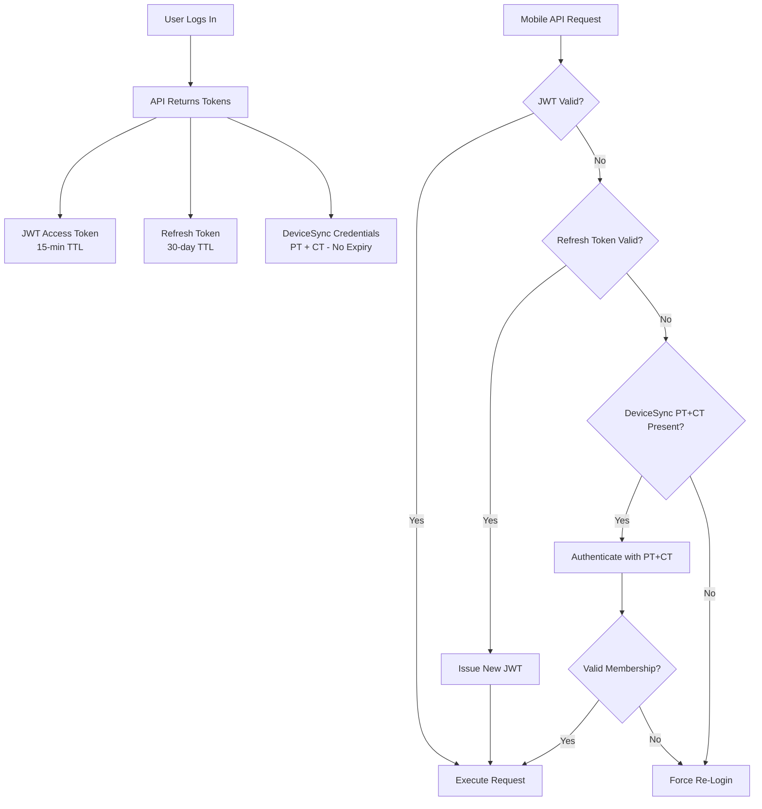

# Multi-Tenant Authentication with Person + Company Tokens

## Problem Statement

Users in the Nexus system can belong to multiple organizations (companies/tenants). This creates challenges for mobile authentication:

1. **Multiple Memberships**: A single user might work on projects for multiple companies
2. **JWT Limitations**: Traditional JWT tokens are scoped to one company at login
3. **Offline-First Requirements**: Mobile apps need to sync data even when JWTs expire
4. **Re-authentication Friction**: Users shouldn't need to re-authenticate when switching contexts

## Solution: Permanent Token Signature (PT + CT)

We implement a **dual-token authentication signature** that combines:

- **Person Token (PT)**: Permanent, globally unique identifier for the user
- **Company Token (CT)**: Permanent identifier for the tenant/organization

### Token Structure

```
Authorization: DeviceSync <PersonToken>:<CompanyToken>
```

Example:
```
Authorization: DeviceSync a1b2c3d4-e5f6-7890-abcd-ef1234567890:x9y8z7w6-v5u4-3210-fedc-ba0987654321
```

## Architecture

### Database Schema

#### Person Token (User.syncToken)
- **Field**: `User.syncToken` (UUID)
- **Scope**: Global - identifies the user across all companies
- **Generation**: Created on first mobile login (if not exists)
- **Lifespan**: Permanent until explicitly revoked
- **Revocation**: User regenerates their `syncToken` (logs out all devices)

#### Company Token (Company.workerInviteToken)
- **Field**: `Company.workerInviteToken` (UUID)
- **Scope**: Tenant-level - identifies the organization
- **Generation**: Created when company is registered
- **Lifespan**: Permanent, can be regenerated by admin
- **Revocation**: Admin regenerates token (invalidates all devices for that company)

### Authentication Flow



## Multi-Tenant Scenarios

### Scenario 1: User Belongs to Multiple Companies

**Setup**:
- User `user@example.com` has memberships in:
  - Company A (General Contractor)
  - Company B (Subcontractor)

**Flow**:
1. User logs into mobile app, selects Company A
2. API returns:
   - JWT scoped to Company A
   - Refresh token scoped to Company A
   - **PT**: User's permanent syncToken
   - **CT**: Company A's workerInviteToken
3. Mobile app stores all credentials
4. User performs sync operations using JWT (primary)
5. When JWT expires, app uses PT + CT for Company A context
6. **Switching companies**: User logs out, logs back in with Company B
   - Same PT, different CT
   - New JWT + Refresh scoped to Company B

### Scenario 2: Offline Sync After Extended Period

**Setup**:
- User goes offline for 31+ days (refresh token expired)

**Flow**:
1. Mobile app attempts API request
2. JWT expired → tries refresh
3. Refresh token expired (> 30 days)
4. **DeviceSync fallback**: Uses PT + CT
5. API validates:
   - User exists with matching syncToken (PT)
   - Company exists with matching workerInviteToken (CT)
   - User has active membership in that company
6. Request succeeds without re-authentication

## Implementation Details

### Mobile Client (React Native/Expo)

**Storage** (`apps/mobile/src/storage/tokens.ts`):
```typescript
// Secure storage keys
SYNC_USER_TOKEN = "nexus.sync.userToken"      // Person Token
SYNC_COMPANY_TOKEN = "nexus.sync.companyToken" // Company Token

// On login
await setSyncCredentials({
  userToken: response.syncCredentials.userToken,
  companyToken: response.syncCredentials.companyToken
});
```

**Authentication Chain** (`apps/mobile/src/api/client.ts`):
```typescript
1. Try JWT Bearer token
2. If 401 → Try refresh token
3. If refresh fails → Try DeviceSync (PT + CT)
4. If DeviceSync fails → Force re-login
```

### API Server (NestJS)

**Strategy** (`apps/api/src/modules/auth/device-sync.strategy.ts`):
```typescript
1. Parse "DeviceSync PT:CT" header
2. Look up User by syncToken (PT)
3. Look up Company by workerInviteToken (CT)
4. Verify CompanyMembership exists and is active
5. Return authenticated context (same shape as JWT)
```

**Guard Usage** (`@UseGuards(CombinedAuthGuard)`):
- Accepts **either** JWT or DeviceSync authentication
- Tries JWT first, falls back to DeviceSync
- Used on all mobile sync endpoints

### Endpoints Updated for DeviceSync

All mobile sync endpoints now support PT + CT authentication:

- ✅ `/timecard/me/*` (clock in, clock out, status, recent)
- ✅ `/inventory/holdings/*` (move assets, get holdings)
- ✅ `/daily-logs` (create, update, attachments)
- ✅ `/projects/:id/daily-logs` (list, create)
- ✅ `/projects/:id/petl/percentage-edits` (Field PETL updates)
- ✅ `/projects/:id/petl-field/qty-flags` (quantity flags)
- ✅ `/projects` (list, get, create)

## Security Considerations

### Token Protection
- **Storage**: Tokens stored in secure/encrypted storage (Keychain on iOS, Keystore on Android)
- **Transmission**: Only over HTTPS
- **Logging**: Never log tokens or include in error reports

### Revocation Strategies

1. **User-Level Revocation**:
   ```sql
   UPDATE User SET syncToken = gen_random_uuid() WHERE id = 'user-id';
   ```
   - Logs out all devices for that user across all companies

2. **Company-Level Revocation**:
   ```sql
   UPDATE Company SET workerInviteToken = gen_random_uuid() WHERE id = 'company-id';
   ```
   - Invalidates all devices for that company (all users)

3. **Selective Revocation**:
   - Deactivate CompanyMembership: `UPDATE CompanyMembership SET isActive = false`
   - DeviceSync validation checks `isActive` flag

### Rate Limiting
- DeviceSync auth attempts rate-limited per IP
- After 5 failed attempts: 15-minute block
- All failures logged for security audit

### Audit Trail
Every DeviceSync authentication logs:
- Timestamp
- User ID
- Company ID
- Device identifier (if available)
- IP address
- Success/failure status

## Benefits

1. **Seamless Multi-Tenant Access**: Users naturally work across multiple companies
2. **Offline-Resilient**: No forced re-authentication after extended offline periods
3. **Flexible Revocation**: Granular control at user, company, or membership level
4. **Security**: Permanent tokens don't mean permanent access - membership validation at every request
5. **Backward Compatible**: Existing JWT auth continues to work; DeviceSync is fallback only

## Future Enhancements

1. **Context Switching API**: Allow switching company context without full re-login
2. **Token Rotation**: Periodic automatic rotation of PT/CT with migration grace period
3. **Device Registration**: Bind PT+CT to specific device IDs for additional security
4. **Analytics**: Track PT+CT usage patterns for security monitoring

---

**Last Updated**: 2026-02-12
**Authors**: Warp AI, PG
**Status**: Implemented
