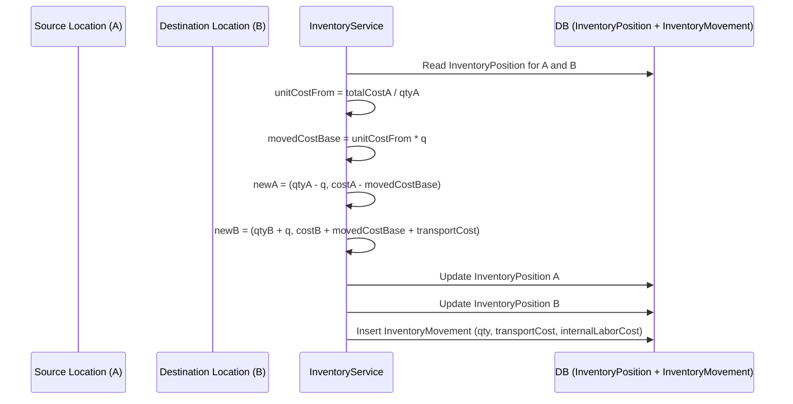

# Nexus Asset, Inventory & Forecasting SOP (v1)

## 1. Purpose & scope

This document defines how Nexus:

- Treats **assets** (materials, consumables, equipment, rentals, workers in future).
- Tracks **locations** and **movements**.
- Manages **inventory valuation** (QTY + dollars per location).
- Links PETL/SOW tasks to **actual material consumption**.
- Performs **material forecasting** (need-on-site dates and order-by dates).
- Drives **purchase suggestions / POs** from the forecast.

Scope: v1 implementation for materials/consumables and equipment, with advanced forecasting powered by PETL.

---

## 2. Core concepts

### 2.1 Asset types

Nexus treats the following as assets:

- **MATERIAL** – construction materials (e.g., studs, drywall, granite).
- **CONSUMABLE** – items that are used up (e.g., sealant, fasteners).
- **EQUIPMENT_OWNED** – company-owned equipment.
- **EQUIPMENT_RENTAL** – rented equipment (with rental contracts).
- (Future) **WORKER** – people as assets tied to tenants/projects.

For v1, we focus on:

- Materials and consumables (including costing and forecasting).
- Equipment and rentals for location tracking (basic).

### 2.2 Locations

Locations are hierarchical and typed:

- `SITE`, `BUILDING`, `FLOOR`, `ROOM` – physical project hierarchy.
- `WAREHOUSE`, `YARD`, `STORAGE` – storage and staging areas.
- `SUPPLIER` – material suppliers (yard, fabricator, distributor).
- `VENDOR` – rental vendors (for equipment).
- `TRANSIT` – logical “in transit” legs (Supplier → Project).
- `LOGICAL` – special logical endpoints (e.g., INSTALLED, CONSUMED).

**Invariant:** Every non‑EOL asset/material is always “somewhere” via a `Location`.

### 2.3 InventoryPosition (QTY + dollars per location)

For each **(company, itemType, itemId, location)**, Nexus keeps an `InventoryPosition`:

- `quantity` – how many units are at this location.
- `totalCost` – total inventory value at this location.
- **Unit cost** is derived: `unitCost = totalCost / quantity`.

This is the source of truth for “how much do we have here and what is it worth?”.

### 2.4 InventoryMovement (events + costing)

Every movement of inventory is recorded as an `InventoryMovement`:

- `itemType`, `itemId`
- `fromLocationId` → `toLocationId`
- `quantity`
- `reason` (TRANSFER, DELIVERY, INSTALL, CONSUME, etc.)
- **Cost fields**:
  - `transportCost` – external costs (freight, BOM delivery).
  - `internalLaborCost` – internal handling/documenting cost.

**Rule:** Location changes and inventory valuation changes always flow through an `InventoryMovement`. No direct edits to positions or current location without a movement.

### 2.5 Costing semantics

When moving `q` units from A → B:

1. Compute `unitCostFrom = posA.totalCost / posA.quantity`.
2. Baseline moved cost: `movedCostBase = unitCostFrom * q`.
3. Decrement source:

   - `posA.quantity -= q`
   - `posA.totalCost -= movedCostBase`

4. Increment destination:

   - `posB.quantity += q`
   - `posB.totalCost += movedCostBase + transportCost_capitalized`

5. New destination unit cost:

   - `unitCostTo = posB.totalCost / posB.quantity`.

**Capitalization rule (v1):**

- Capitalize **external transport cost** into inventory.
- Record **internal labor cost** on `InventoryMovement` for reporting, but do not add it into `totalCost` at the destination.

### 2.6 PETL / SOW as the driver of consumption

PETL/SOW defines the **scope and timing** of work:

- Each `SowItem` is a task/scope line (e.g., “Install granite countertop – Unit 302”).
- Each `SowItem` is linked to:
  - A **particle/room** (where work happens).
  - Material components / cost-book items (what is needed).
- `AssetUsage` (or similar) links **materials** (assets) to **SowItem** planned quantities.

**Principle:** PETL completion drives *actual* material consumption, and inventory follows.

### 2.7 MaterialRequirement & forecasting

For each **(Project, SOW item, Material)**, Nexus maintains a `MaterialRequirement`:

- `plannedQty` – amount of material planned for that scope.
- `netQtyToOrder` – net amount to order after considering on‑hand and inbound.
- `requiredOnSiteDate` – when material must be on site/ready.
- `dateToOrder` – latest date to place the order (working days).
- Lead time snapshot:
  - `leadTimeDays`, `totalLeadDays` (from supplier item data).
- `status` – PLANNED, DUE_SOON, LATE, ORDERED, RECEIVED, etc.

This is the core surface for **forecasting** and **purchase suggestions**.

---

## 3. Day-to-day operations

### 3.1 Creating materials & suppliers

1. Define material items (usually on `CompanyPriceListItem` / price list).
2. For each material + supplier pair, create a `SupplierItem` with:
   - `avgLeadTimeDays`
   - `p80LeadTimeDays` (and optional `p95LeadTimeDays`)
   - `shippingDays`
   - `internalBufferDays`
   - `minOrderQty` (optional).
3. Define project `Location`s:
   - Project storage (`WAREHOUSE`/`STORAGE`).
   - Rooms/particles (`ROOM`).
   - Supplier yards (`SUPPLIER`).
   - Transit legs (`TRANSIT`) when needed.

### 3.2 Receiving & moving materials (with cost)

When materials are received from a supplier:

1. Create an `InventoryMovement`:
   - `fromLocationId = SUPPLIER` (or null for first load).
   - `toLocationId = project warehouse/staging`.
   - `quantity = receivedQty`.
   - `transportCost = freight / delivery from BOM or invoice`.
   - `internalLaborCost = crew time to receive/move (optional v1).`
2. The system:
   - Updates `InventoryPosition`s at supplier/warehouse.
   - Computes new `unitCost` at destination (landed cost).

When materials move within the project (e.g., warehouse → floor → room), use similar `InventoryMovement`s with no or minimal transport cost, but still capturing internal labor if you care.

### 3.3 Installation & consumption

For **materials that become part of the building** (e.g., granite):

- Treat movement from storage → room → installed as:
  - `reason = INSTALL`.
- Optionally:
  - Keep quantity in the room location and treat it as installed there, or
  - Move into a logical `LOGICAL/INSTALLED` location under that room.
- Mark associated material usage as **EOL**:
  - For materials: `eolStatus = MATERIAL_EOL`.
  - For consumables: `eolStatus = CONSUMABLE_EOL` when `CONSUME`.

For **consumables**:

- When used, either:
  - Move to a `CONSUMED` logical location, or
  - Directly decrement inventory at the current location using a movement+transaction pattern.
- Record `AssetTransaction` (kind `CONSUME`) for traceability.

---

## 4. PETL-driven consumption workflow

### 4.1 Planning: link materials to SOW items

When PETL/SOW is created or imported:

1. For each `SowItem`, identify **material components** (company price list items).
2. Create `AssetUsage` (or an equivalent link) per material:
   - `assetId` / material reference.
   - `sowItemId`.
   - `plannedQty`.
   - `status = PLANNED`.

This establishes **planned material demand per task**.

### 4.2 Task completion updates inventory

When PETL completion updates (e.g., `SowItem.percentComplete` changes):

1. Compute target consumed quantity:

   - `targetConsumed = plannedQty * percentComplete`.

2. Compare with what[?2004l[?25ht[?2004h[?25l's already consumed:

   - `deltaToConsume = targetConsumed - consumedQtySoFar`.

3. If `deltaToConsume > 0`, call a helper like:

   - `consumeForSowItem(companyId, projectId, sowItemId, assetId, deltaQty, fromLocationId, endpointLocationId, movedByUserId)`.

4. That helper:
   - Moves material from storage to endpoint (room/particle) via `InventoryMovement`.
   - Updates `InventoryPosition` (qty and cost).
   - Records an `AssetTransaction` tied to `SowItem`/`AssetUsage`.

Result: **PETL completion drives consumption**, and inventory positions and cost adjust automatically.

---

## 5. Forecasting & “date to order”

### 5.1 Inputs

For each material requirement:

- SOW/PETL schedule:
  - `plannedTaskStartDate` (+ optional `plannedTaskEndDate`).
- Supplier lead times:
  - `avgLeadTimeDays`, `p80LeadTimeDays`, (optional `p95LeadTimeDays`).
  - `shippingDays`.
  - `internalBufferDays` (preferred staging time).
- Work calendar:
  - Working days & holidays for the project.

### 5.2 Need-on-site and order-by dates

For each `(SowItem, Material)` row:

1. **Required-on-site date**:

   - `requiredOnSiteDate = taskStartDate - internalBufferDays`  
     (using working-day arithmetic).

2. **Lead time for risk level**:

   - For normal risk: `leadTimeDays = p80LeadTimeDays`.
   - For high risk: `leadTimeDays = p95LeadTimeDays` or `p80 + safetyDays`.

3. **Total lead days**:

   - `totalLeadDays = leadTimeDays + shippingDays`.

4. **Date to order (working days)**:

   - `dateToOrder = requiredOnSiteDate - totalLeadDays`  
     (using working days on the project calendar).

### 5.3 Net quantity to order

For each requirement:

- `grossQty = plannedQty` for the SOW line.
- `onHand` = inventory quantity for that material in relevant project locations.
- `alreadyReserved` = material planned for earlier SOW needs (same material, earlier `requiredOnSiteDate`).
- `inbound` = open POs / scheduled deliveries arriving before `requiredOnSiteDate`.

Then:

- `availableForThisRequirement = onHand - alreadyReserved + inbound`.
- `netQtyToOrder = max(0, grossQty - availableForThisRequirement)`.

### 5.4 Status flags

Update `MaterialRequirement.status` based on dates & coverage:

- `PLANNED` – dateToOrder in the future; not yet ordered.
- `DUE_SOON` – dateToOrder within next N working days.
- `LATE` – today > dateToOrder and requirement not covered.
- `ORDERED` – PO placed that covers `netQtyToOrder`.
- `RECEIVED` – inventory/inbound fully covers `plannedQty`.
- `CANCELED` – scope removed or alternative design decided.

---

## 6. Purchase suggestions & POs

### 6.1 Grouping requirements into POs

For each **(Project, Supplier)**:

1. Select `MaterialRequirement` rows with:
   - `supplierItemId` = supplier.
   - `status` in (`PLANNED`, `DUE_SOON`, `LATE`).
   - `netQtyToOrder > 0`.

2. Group them based on:
   - Similar `dateToOrder` (e.g., same week).
   - Similar `requiredOnSiteDate` (to avoid early deliveries causing storage issues).

3. Generate a **draft PurchaseOrder**:

   - Header: project, supplier, order date.
   - Lines:
     - Material item, `netQtyToOrder`, unit price, `needOnSiteDate`.
     - Optionally aggregate multiple requirements for the same material.

4. Link PO lines back to `MaterialRequirement` rows and set:
   - `status = ORDERED` for covered requirements.

### 6.2 Closing the loop on receipt

When PO deliveries arrive:

1. Record `InventoryMovement` (supplier → project location) with quantity and freight cost.
2. Update `InventoryPosition` (QTY + cost).
3. Mark `MaterialRequirement.status` to `RECEIVED` once:
   - On-hand + inbound meets or exceeds `plannedQty` for that requirement.

---

## 7. Reporting & endpoint cost

### 7.1 Endpoint (room) cost

For a given room/particle or endpoint:

- **Material cost**:
  - Sum of `InventoryPosition.totalCost` for installed material at that location.
- **Internal handling cost**:
  - Sum of `InventoryMovement.internalLaborCost` where `toLocationId` is that endpoint.

Optionally compute:

- `fullyBurdenedUnitCost = (materialCost + internalHandlingCost) / totalQtyInstalled`.

### 7.2 PETL line cost

For a given `SowItem`:

- **Planned vs actual**:
  - Planned material cost: from PETL/Xact data.
  - Actual material cost: sum of `AssetTransaction.totalCost` (kind CONSUME) linked to that `SowItem`.
- **Variance**:
  - `variance = actualCost - plannedCost`.

---

## 8. Key invariants & rules (summary)

1. **No move without destination**: asset/location changes must go through `InventoryMovement` with a `toLocationId`.
2. **InventoryPosition is authoritative** for QTY + cost at each location.
3. **Only external transport costs** are capitalized into inventory in v1.
4. **Internal labor costs** are captured on movements for reporting, not valuation.
5. **PETL is the driver** of material consumption; inventory follows PETL completion via delta consumption logic.
6. **MaterialRequirement** is the central planning artifact:
   - It tells you *when* you need material, *how much* net you need, and *when* to order.

---

## 9. Visual diagrams

### 9.1 High-level architecture

```mermaid
flowchart LR
  subgraph PETL[PETL / SOW]
    SOW[Sow Items]
    Alloc[Material Allocations / AssetUsage]
  end

  subgraph Inv[Inventory]
    InvPos[InventoryPosition<br/>(qty + cost per location)]
    InvMove[InventoryMovement<br/>(from/to + qty + cost)]
  end

  subgraph Forecast[Forecasting]
    MR[MaterialRequirement]
  end

  subgraph Proc[Procurement]
    PO[Purchase Orders]
  end

  SOW --> Alloc
  Alloc --> MR
  MR --> PO
  PO --> InvMove
  InvMove --> InvPos

  Alloc --> InvMove
  InvMove --> Alloc
```

- PETL/SOW defines **what work happens where and when** and what materials are needed.
- Inventory tracks **where materials are and what they cost**.
- Forecasting turns PETL + lead times + inventory into **MaterialRequirements**.
- Procurement turns requirements into **POs**, which feed inventory on receipt.

### 9.2 Inventory movement and costing



This diagram shows the **single transaction** that updates positions and records the movement with costs.

### 9.3 PETL-driven consumption

```mermaid
flowchart LR
  PETL[SowItem<br/>percentComplete] --> Calc[Compute targetConsumed<br/>(plannedQty * percentComplete)]
  Calc --> Delta[deltaToConsume = targetConsumed - consumedSoFar]
  Delta -->|deltaToConsume > 0| Consume[consumeForSowItem]

  subgraph Inventory Flow
    Consume --> Move[InventoryService.moveWithCost<br/>(storage → room)]
    Move --> InvPos[Update InventoryPosition]
    Move --> InvMove[Insert InventoryMovement]
  end

  Consume --> Tx[Create AssetTransaction<br/>(kind = CONSUME, link to SowItem)]
```

PETL completion drives **delta consumption**, which triggers inventory movements and cost transactions.

### 9.4 Forecasting and order timing

```mermaid
flowchart LR
  SOW[SowItem schedule<br/>(plannedStartDate)] --> Need[Compute requiredOnSiteDate]
  Need --> LT[Apply SupplierItem lead time<br/>(p80LeadTimeDays + shipping)]
  LT --> DTO[Compute dateToOrder<br/>(working days)]

  DTO --> MR[MaterialRequirement
  - plannedQty
  - requiredOnSiteDate
  - dateToOrder
  - netQtyToOrder]

  MR --> Status[Set status:
  PLANNED / DUE_SOON / LATE / ORDERED / RECEIVED]

  MR --> PO[Suggest/Generate Purchase Orders]
```

This diagram shows how **PETL dates + lead times** become `requiredOnSiteDate`, `dateToOrder`, and ultimately purchase activity.
