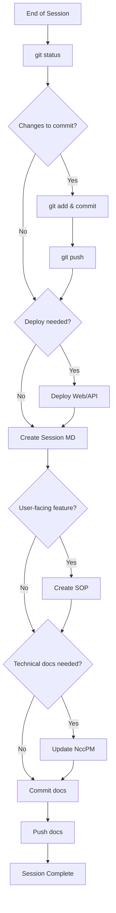

# Session Closeout Procedure

## Purpose
Ensures development context is captured and preserved at the end of each coding session. This enables continuity between sessions, even with different Warp agents or after extended breaks.

## Prerequisites
- All code changes are complete (or at a stable stopping point)
- You're ready to end the current development session

## Steps

### 1. Verify Code State
```bash
git status
```
- Ensure all intended changes are staged
- Review any untracked files that should be committed

### 2. Commit All Changes
```bash
git add -A
git commit -m "feat/fix/chore: descriptive message

Co-Authored-By: Warp <agent@warp.dev>"
```

### 3. Push to Origin
```bash
git push origin main
```

### 4. Deploy if Ready for Production
**Web (Vercel):**
```bash
vercel --prod --archive=tgz
```

**API (Cloud Run):**
```bash
./scripts/deploy-api-prod-env.sh
```

### 5. Create Session Markdown
Create a file at `docs/sessions/YYYY-MM-DD-<topic>.md` containing:

```markdown
# Session: [Topic/Feature Name]
**Date:** [Date]

## Summary
[1-2 sentence overview of what was accomplished]

## Features Implemented
[List of features with brief descriptions]

## Commits
[List of commit hashes and messages]

## Deployments
[Status of each deployment target]

## Files Modified
[Organized by app/package]

## Pending
[Any unfinished work or next steps]

## How to Continue
[Commands or context needed to pick up where you left off]
```

### 6. Create/Update SOPs (if feature went to production)
If a user-facing feature was deployed:
1. Create SOP in `docs/sops-staging/[feature]-sop.md`
2. Follow SOP format from WARP.md

### 7. Update NccPM (if applicable)
If session involved:
- **New module/feature** → Create or update module spec in `docs/nccpm/modules/`
- **Architecture decision** → Create ADR in `docs/nccpm/decisions/`
- **New procedure** → Document in `docs/nccpm/procedures/`

### 8. Commit Documentation
```bash
git add docs/
git commit -m "docs: add session notes and update documentation

Co-Authored-By: Warp <agent@warp.dev>"
git push origin main
```

## Expected Outcome
- All code committed and pushed
- Session markdown captures context for future sessions
- SOPs staged for user-facing features
- NccPM updated with any technical documentation
- Clean working tree (`git status` shows nothing to commit)

## Flowchart



## Troubleshooting

### Forgot what was changed this session
```bash
git --no-pager log --oneline -20  # Recent commits
git --no-pager diff HEAD~5        # Changes in last 5 commits
```

### Session interrupted before closeout
On next session start, run:
```bash
git status
git --no-pager log --oneline -10
```
Then complete any missing closeout steps.

## Revision History
| Rev | Date | Changes |
|-----|------|---------|
| 1.0 | 2026-02-16 | Initial procedure |
