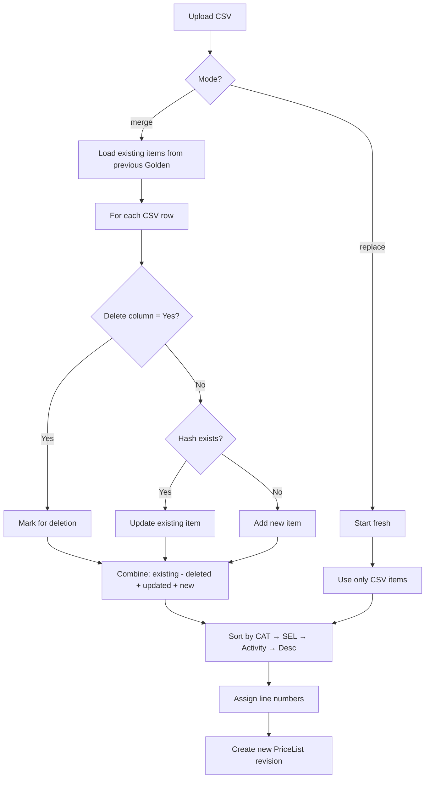

# Session: Golden PETL Incremental Merge Import
**Date:** 2026-02-19
**Status:** Implemented & Deployed

## Summary
Implemented incremental merge mode for Golden PETL (Price List) imports, changing the default behavior from full replacement to merge/upsert.

## Problem Statement
Previously, uploading a new Golden PETL file **replaced** all items - any items not in the new CSV were lost from the active price list. Users needed an **incremental merge** mode that:
- Keeps existing items not in the new upload
- Updates existing items that match (same CAT+SEL+Activity+Description)
- Adds new items from the upload

## Key Decisions

### 1. Uniqueness Key
Golden PETL records are uniqued by `canonicalKeyHash`, which is a SHA-256 hash of:
- **CAT** (Category)
- **SEL** (Selection)
- **Activity** (column M)
- **Description**

### 2. Import Modes
| Mode | Behavior |
|------|----------|
| `merge` (default) | Keeps existing + adds/updates from CSV |
| `replace` | Full replacement (previous behavior) |

### 3. Delete Support
- CSV `Delete` column recognized (`Yes`, `Y`, `1`, `true`)
- Only works in merge mode
- Items marked for deletion are removed from the new price list

## Implementation

### Files Modified
- `apps/api/src/modules/pricing/pricing.service.ts` - Merge logic + delete support
- `apps/api/src/modules/pricing/pricing.controller.ts` - Accept mode param
- `apps/api/src/worker.ts` - Pass mode to import function

### API Changes
```typescript
// POST /pricing/price-list/import
// POST /pricing/price-list/import-from-uri
// Body can include: { mode: 'merge' | 'replace' }
// Default: 'merge'
```

### Return Value Enhancement
```typescript
{
  priceListId: string,
  revision: number,
  itemCount: number,
  mode: 'merge' | 'replace',
  mergeStats: {
    updatedCount: number,
    addedCount: number,
    deletedCount: number,
    unchangedCount: number
  } | null
}
```

## Merge Logic Flow



## Testing Notes
To test merge mode:
1. Upload initial Golden PETL CSV
2. Upload second CSV with:
   - Some existing items (should update)
   - Some new items (should add)
   - Some items with `Delete,Yes` (should remove)
3. Verify merge stats in response

## Commit
```
75b26835 feat(pricing): add incremental merge mode for Golden PETL import
```

## Future Enhancements (from plan)
- UI toggle for merge/replace mode
- Admin delete button per row in Golden Price List view
- UI to show merge stats after import

## Related Documentation
- `docs/architecture/csv-imports-and-petl-standard.md`
- `docs/sops-staging/local-price-extrapolation-sop.md`
