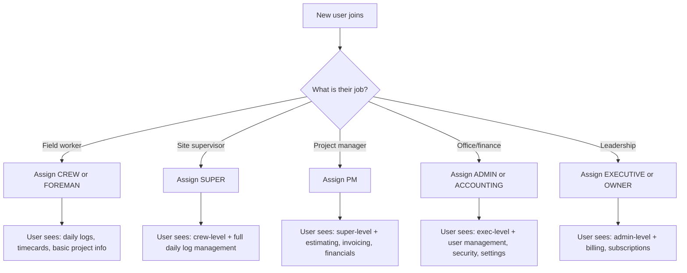
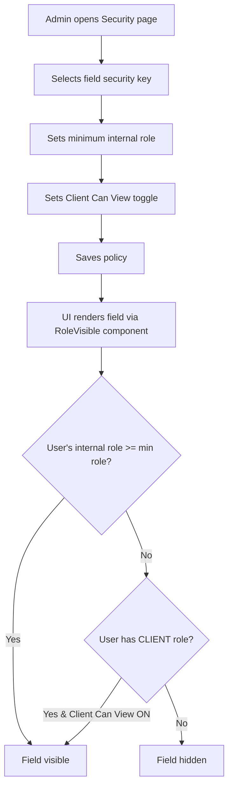
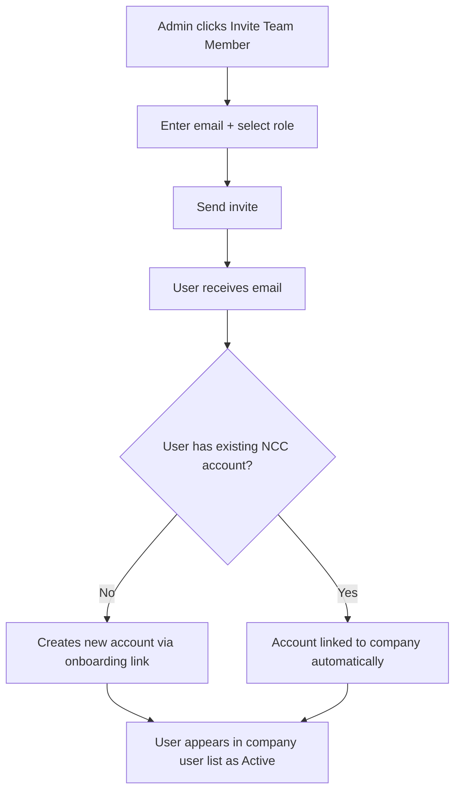
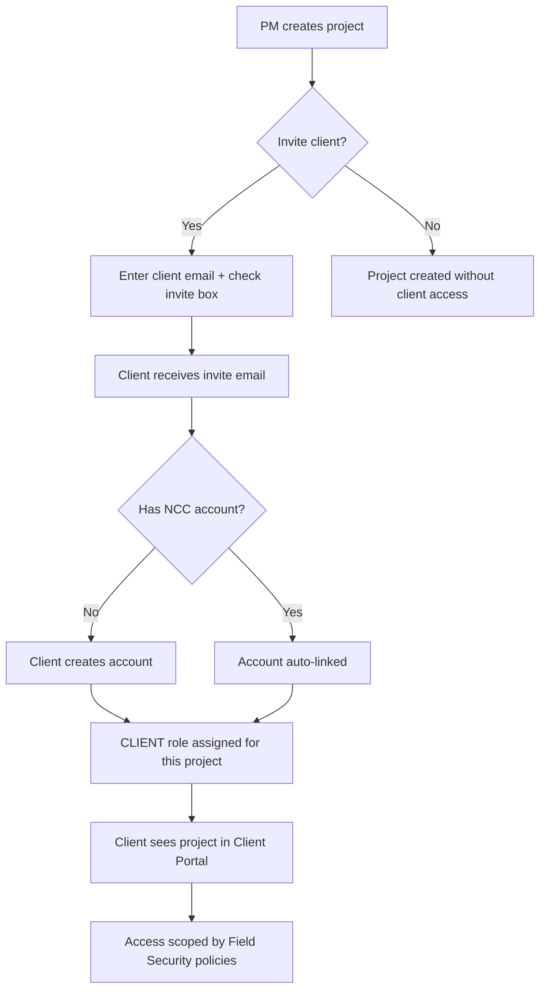
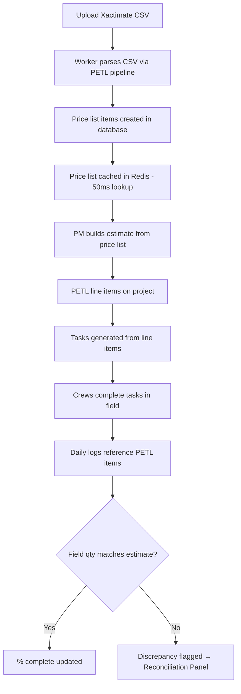
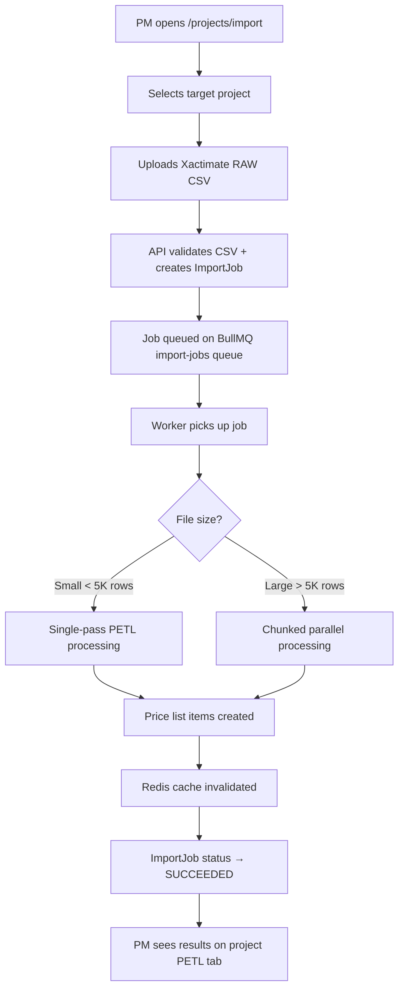
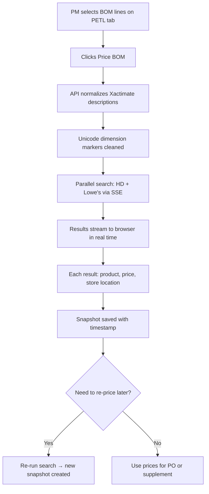
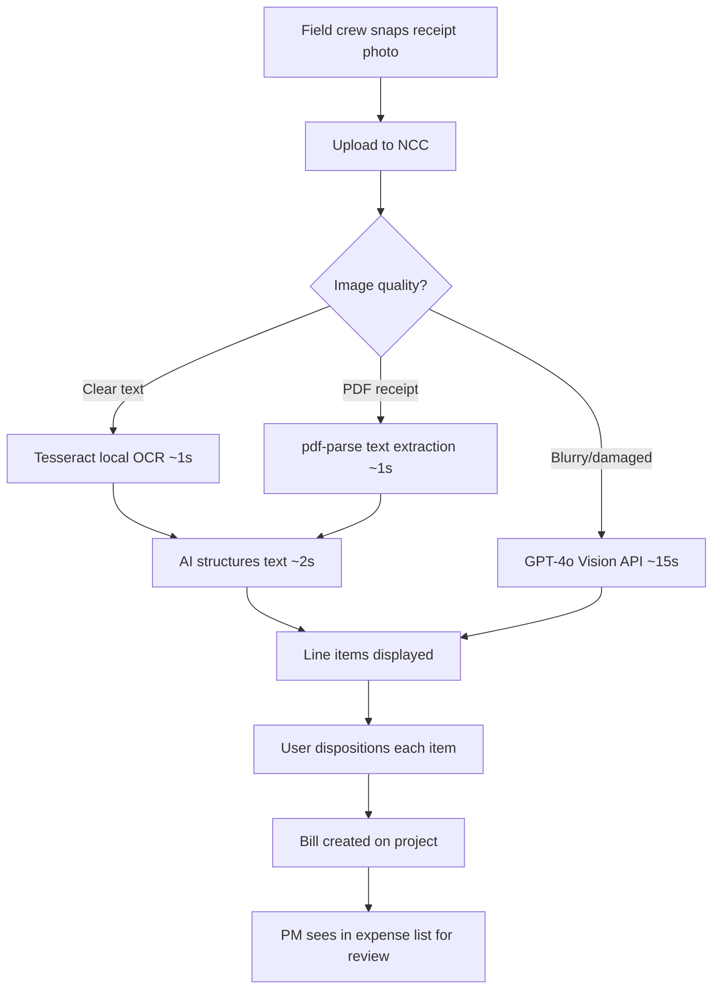
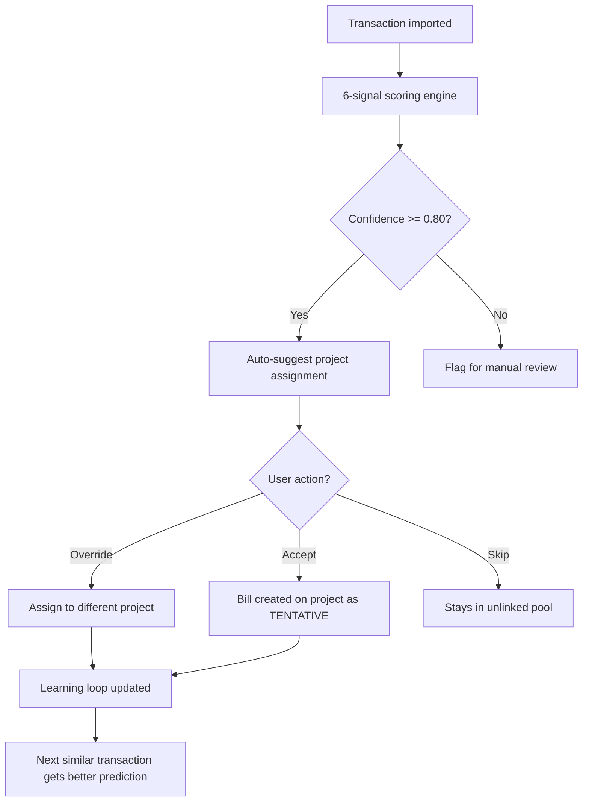

# NEXUS SYSTEM NCC — Module Master Class

> **46 training procedures** across **8 module groups** · Format: Full Operations Training

> **Living Documents:** Each section below is now maintained as an individual living document in [`docs/training-manuals/`](../training-manuals/TRAINING-LIBRARY.md). The individual files are the **source of truth** — this compiled version is a convenience snapshot. See the [Training Library Index](../training-manuals/TRAINING-LIBRARY.md) for the full table of contents with links.

---

## How to Read This Manual

This is the companion training manual for the NCC platform. While the **Competitive Advantage Manual (CAM)** explains *what makes each feature unique*, this manual teaches you *how to use it*.

Every procedure includes:
- **Who Uses This** — which roles interact with this feature
- **Step-by-Step** — exactly what to click and where
- **Flowchart** — visual decision/process diagram
- **Tips & Troubleshooting** — practical guidance from real usage
- **Powered By (CAM)** — links to the competitive advantage module(s) that power the feature, and *why that advantage matters for this workflow*

### Role Tags

Each section is tagged with the roles that need to know this procedure:

| Tag | Role | Typical Use |
|-----|------|-------------|
| 👑 OWNER | Company owner | Full system access, billing, company settings |
| 🔧 ADMIN | Administrator | User management, security policies, configuration |
| 📋 PM | Project Manager | Project lifecycle, estimating, invoicing, daily operations |
| 🏗️ FIELD | Field crew / Superintendent | Daily logs, receipts, timecards, compliance |
| 💰 ACCOUNTING | Bookkeeper / Finance | Transactions, reconciliation, invoicing, reports |
| 👤 CLIENT | External collaborator | Portal access, approvals, document viewing |

### Difficulty Levels

| Level | Meaning |
|-------|---------|
| 🟢 Basic | New user can complete in < 5 minutes |
| 🟡 Intermediate | Requires familiarity with NCC navigation |
| 🔴 Advanced | Multi-step workflow, requires understanding of related modules |

---

## Module Groups (Training Areas)

🔐 **Chapter 1: Security, Roles & Company Setup** — 6 sections
💰 **Chapter 2: Estimating & Xactimate Import** — 7 sections
🧾 **Chapter 3: Expense Capture & Receipt Management** — 7 sections
📄 **Chapter 4: Invoicing & Financial Operations** — 7 sections
📁 **Chapter 5: Project Management & Daily Operations** — 7 sections
📑 **Chapter 6: Documents, eDocs & Templates** — 5 sections
🔧 **Chapter 7: Assets, Equipment & Suppliers** — 4 sections
✅ **Chapter 8: Compliance & Safety** — 3 sections

---

**Chapter 1: 🔐 Security, Roles & Company Setup**

Your organization's foundation — user access, permissions, field-level security, client collaboration, and module subscriptions.

*6 sections in this chapter*

---

## Section 1 — Company Settings & Branding

🟢 Basic · 👑 OWNER · 🔧 ADMIN

### Purpose

Company settings define your organization's identity in NCC — the name, address, logo, and defaults that appear on invoices, documents, and client-facing portals. This is the first thing to configure when onboarding.

### Who Uses This

- **Owners** — set up the company profile during initial onboarding
- **Admins** — update branding, address changes, logo updates

### Step-by-Step Procedure

1. Navigate to **Settings → Company** (`/settings/company`).
2. Fill in your company name, address, phone, and email.
3. Upload your company logo (PNG or JPG, recommended 400×400px minimum).
4. Set default project settings (currency, timezone, tax rate if applicable).
5. Click **Save Changes**.

### Tips & Best Practices

- Upload a square logo — it's used in invoices, documents, and the client portal header.
- Your company address will appear as the return address on invoices. Make sure it's your legal business address.
- Changes to company settings apply immediately across all modules — existing documents retain the settings from when they were generated.

### Troubleshooting

| Issue | Solution |
|-------|----------|
| Logo appears blurry | Upload a higher-resolution image (minimum 400×400px) |
| Settings not saving | Check that all required fields are filled — name and email are mandatory |
| Old logo still showing | Hard-refresh the browser (Cmd+Shift+R) to clear cached images |

---

## Section 2 — User Roles & Permissions

🟡 Intermediate · 👑 OWNER · 🔧 ADMIN

### Purpose

NCC uses a hierarchical role system that controls what each user can see, edit, and manage. Understanding the role hierarchy is critical — it determines everything from which financial fields are visible to who can approve invoices.

### Who Uses This

- **Owners** — assign roles to all team members, including admins
- **Admins** — manage roles for non-admin users

### The Role Hierarchy

NCC uses an internal role hierarchy where each level inherits all permissions of the levels below it:

```
CREW → FOREMAN → SUPER → PM → EXECUTIVE → ADMIN → OWNER → SUPER_ADMIN
```

**CLIENT** is a separate, independent role — it is NOT part of the internal hierarchy. Client access is controlled independently via Field Security Policies (see Section 4).

| Role | Label | Typical User | Key Access |
|------|-------|-------------|------------|
| CREW | Crew+ | Field laborer | Daily logs, timecards, basic project view |
| FOREMAN | Foreman+ | Lead worker | Crew-level + task assignment, material requests |
| SUPER | Super+ | Superintendent | Foreman-level + full daily log management |
| PM | PM+ | Project Manager | Super-level + estimating, invoicing, project financials |
| EXECUTIVE | Exec+ | VP / Director | PM-level + company-wide financial reports, dashboards |
| ADMIN | Admin+ | Office administrator | Exec-level + user management, security policies, settings |
| OWNER | Owner+ | Company owner | Admin-level + billing, subscription management, company deletion |
| SUPER_ADMIN | Superuser | NCC system admin | Full platform access (NCC staff only) |

### Step-by-Step: Viewing and Managing Roles

1. Navigate to **Settings → Roles** (`/settings/roles`).
2. The left panel lists all **Role Profiles** — both NCC Standard roles and any custom roles.
3. Click a role to view its permissions on the right panel.
4. Permissions are organized by **section** (Projects, Financial, People, Reports).
5. Each permission resource shows View, Add, Edit, Delete capabilities.

### Step-by-Step: Assigning a Role to a User

1. Navigate to **Company → Users** (`/company/users`).
2. Find the user and click their name to open their profile.
3. Under **Role**, select the appropriate role from the dropdown.
4. Click **Save**. The user's access changes take effect immediately.

### Flowchart



### Tips & Best Practices

- **Principle of least privilege** — start users at the lowest role that covers their needs. You can always promote.
- **ADMIN vs OWNER** — Admins can manage users and settings but cannot change billing or delete the company. Only Owners can.
- **Protected roles** (ADMIN, OWNER, SUPER_ADMIN) require confirmation before modification — this prevents accidental lockout.
- Role changes take effect immediately. If a PM is demoted to CREW, they instantly lose access to financial data.

### Troubleshooting

| Issue | Solution |
|-------|----------|
| User can't see financial data | Check their role — only PM+ can see project financials by default |
| Can't change a user's role | Only ADMIN+ can change roles. OWNER role can only be changed by another OWNER |
| User sees "Access Denied" on a page | Their role is below the minimum required. Check the Field Security settings (Section 3) |

---

## Section 3 — Field-Level Security Policies

🔴 Advanced · 👑 OWNER · 🔧 ADMIN

### Purpose

Beyond role-based page access, NCC provides **field-level security** — granular control over individual data fields. You can hide specific fields (like pay rates, profit margins, or SSNs) from certain roles while keeping the rest of the page visible. This is what separates NCC from competitors that only offer page-level access control.

### Who Uses This

- **Owners/Admins** — configure which fields are visible to which roles
- **PMs/Execs** — validate that their teams see the right data
- **Support** — troubleshoot "why can't I see this field?" questions

### How Field Security Works

Every securable field in NCC has a **Security Key** (e.g., `petl.itemAmount`, `project.margin`, `worker.payRate`). For each key, you set:

1. **Minimum Internal Role** — the lowest role in the hierarchy that can see this field (e.g., "PM+" means PM, Executive, Admin, Owner, and Super_Admin can see it)
2. **Client Can View** — an independent toggle. Setting this to ON does NOT grant internal access — it only controls whether the CLIENT role can see the field.

### Application Map — Securable Fields

NCC organizes securable fields by module:

**Projects**
- Project Overview: address, status, actor info, budget, cost to date, profit margin
- PETL: line item total, RCV amount, percent complete, unit price, labor cost, material cost
- Timecards: pay rate, total pay, overtime hours
- Change Orders: amount, markup percentage

**Financial**
- Overview: revenue, expenses, profit, cash flow
- Invoices: amount, paid, balance due

**People**
- Worker Profiles: base pay rate, bill rate, SSN (last 4), bank account, home address
- HR Records: salary, performance rating, disciplinary notes

**Reports**
- Financial Reports: P&L data, payroll data, cost analysis
- Operational Reports: productivity metrics, resource utilization

### Step-by-Step Procedure

1. Navigate to **Admin → Security** (`/admin/security`).
2. The page displays the **Application Map** — a tree of modules, pages, and fields.
3. For each field, you see a row with:
   - The field name and description
   - A **role dropdown** for minimum internal access (Crew+ through Superuser)
   - A **Client Can View** toggle (independent from the internal hierarchy)
4. To restrict a field: click the role dropdown and select a higher minimum role.
   - Example: Set `worker.payRate` to "Admin+" so only Admins and Owners can see pay rates.
5. To enable client visibility: toggle **Client Can View** to ON.
   - Example: Enable client view on `project.status` so clients in the portal can see project status.
6. Click **Save** at the bottom.

### Flowchart



### Tips & Best Practices

- **Start restrictive, then open up.** It's safer to hide a field and get a request to show it than to accidentally expose sensitive data.
- **Common pattern:** Hide `worker.payRate`, `worker.ssn`, `worker.bankAccount`, and `hr.salary` from everyone below ADMIN. These are the most sensitive fields.
- **Client visibility is your friend.** Use it to show clients exactly what they need (project status, budget) without showing internal data (margin, cost breakdown).
- **Use the Security Inspector overlay** (available in admin mode) to visually audit which fields are visible for each role — it highlights each field with its security key.

### Troubleshooting

| Issue | Solution |
|-------|----------|
| A field is hidden but shouldn't be | Check that the user's role meets the minimum — and that the field isn't being hidden by a *different* security key covering the same area |
| Client can see financial data they shouldn't | Check the Client Can View toggle for each financial field — remember it's independent from internal roles |
| Changes to security policies not taking effect | Policies update in real-time — have the user refresh their browser. If still stale, clear localStorage |

### Powered By — CAM Reference

> **Why this matters:** Most construction PM tools offer only page-level access (you can see the page or you can't). NCC's field-level security means a Foreman can view the PETL tab to see line item descriptions and quantities — but the dollar amounts are hidden because `petl.itemAmount` is set to PM+. No other platform in this space offers this granularity.
>
> This workflow is powered by the platform's **Field Security Policy** engine, which stores policies in the database and evaluates them dynamically via the `RoleVisible` component. The independent CLIENT toggle is part of the **Collaborator Technology** architecture documented in **CLT-COLLAB-0001** (Client Tenant Tier) and **CLT-COLLAB-0002** (Dual-User Portal Routing).

---

## Section 4 — Inviting & Managing Users

🟢 Basic · 👑 OWNER · 🔧 ADMIN

### Purpose

Add team members to your NCC organization, assign them roles, and manage their access. NCC supports email-based invitations with automatic onboarding.

### Who Uses This

- **Owners** — invite the initial team during setup
- **Admins** — ongoing user management as the team grows

### Step-by-Step: Inviting a New User

1. Navigate to **Company → Users** (`/company/users`).
2. Click **Invite Team Member** (top right).
3. Enter the user's email address.
4. Select their **role** (see Section 2 for role descriptions).
5. Optionally assign them to specific projects.
6. Click **Send Invite**.
7. The user receives an email with a link to create their account and set a password.

### Step-by-Step: Managing Existing Users

1. Navigate to **Company → Users** (`/company/users`).
2. The user list shows: name, email, role, status (Active/Invited/Disabled), and last active date.
3. Click a user to open their profile page (`/company/users/[userId]`).
4. From the profile you can:
   - **Change role** — select a new role from the dropdown
   - **Disable account** — deactivates the user without deleting their data
   - **View HR records** — salary, performance, disciplinary notes (ADMIN+ only)
   - **View activity** — last login, projects assigned, recent actions

### Flowchart



### Tips & Best Practices

- **Batch onboarding:** You can invite multiple users in sequence — each gets their own invite email.
- **Disabled vs. deleted:** Always *disable* instead of *delete*. Disabled users retain their history (daily logs, approvals, timecards) but can't log in. Deleting a user could orphan their records.
- **Re-invite:** If someone didn't receive the invite, you can resend from their profile page.

---

## Section 5 — Client Access & Collaborator Technology

🟡 Intermediate · 👑 OWNER · 🔧 ADMIN · 📋 PM

### Purpose

NCC's Collaborator Technology lets you invite clients directly into the platform — giving them a real login, a portal showing their projects, and scoped access controlled by Field Security. Clients don't just view a read-only report; they get a live dashboard on their actual project data.

### Who Uses This

- **PMs** — invite clients during project creation (one checkbox)
- **Admins** — configure what clients can see via Field Security
- **Clients** — access their portal, view project status, approve documents

### Step-by-Step: Inviting a Client During Project Creation

1. Navigate to **Projects → New Project** (`/projects`).
2. Fill in project details (name, address, type, etc.).
3. In the **Client** section, enter the client's email address.
4. Check the **"Invite client to portal"** checkbox.
5. Click **Create Project**.
6. The client receives an email invitation. When they accept:
   - They create an NCC account (or link to an existing one)
   - They're assigned the CLIENT role for this project
   - They see the **Client Portal** (`/client-portal`) with all projects where they're a collaborator

### Step-by-Step: Managing Client Access After Creation

1. Navigate to **Settings → Clients** (`/settings/clients`) to see all client users.
2. Or open a specific project and view the **Collaborators** section.
3. Client visibility is controlled by **Field Security** (Section 3) — use the "Client Can View" toggles to show/hide specific fields.
4. Clients can view:
   - Project overview (name, status, address — if Client Can View is ON)
   - Documents shared with them
   - Financial summaries (if enabled via Field Security)
   - Approval workflows (change orders, invoices)

### The Client Portal Experience

When a client logs in, they see the Client Portal (`/client-portal`):
- **Projects** — every project where they're a collaborator, across all companies on NCC
- **Finance** — financial summaries for their projects (scoped by Field Security)
- **Collaborations** — cross-company view of all active collaborations
- **Documents** — documents shared with them

### Flowchart



### Tips & Best Practices

- **Every client invite is a product demo.** The client experiences NCC on their actual project data. If they're impressed, they can upgrade to a full subscriber — this is the acquisition flywheel.
- **Dual-user routing:** If a client also works for a contractor company on NCC, they have ONE login that spans both roles. The system routes them to the correct view based on context.
- **Start with minimal visibility.** Enable Client Can View on project status and documents first. Add financial visibility only after discussing with the client.

### Powered By — CAM Reference

> **CLT-COLLAB-0001 — Client Tenant Tier: Acquisition Flywheel** (30/40 ⭐ Strong)
> *Why this matters:* Every client portal invitation is a zero-friction product demo on real data. No other construction PM tool converts project clients into platform subscribers through live collaboration. The client doesn't see a static PDF — they see a living project dashboard that updates in real time.
>
> **CLT-COLLAB-0002 — Dual-User Portal Routing** (29/40 ✅ Qualified)
> *Why this matters:* A single person can be both a client (on one project) and an internal PM (on another). NCC handles this with one login and automatic context switching. Traditional PM tools force rigid silos — you're either internal or external, never both.

---

## Section 6 — Module Subscriptions & Billing

🟡 Intermediate · 👑 OWNER

### Purpose

NCC uses a modular subscription model — you pay for the features you use. The Modules page lets Owners browse available premium modules, purchase them via Stripe, and manage active subscriptions.

### Who Uses This

- **Owners** — purchase and manage module subscriptions
- **Admins** — view which modules are active (read-only)

### Step-by-Step Procedure

1. Navigate to **Settings → Modules** (`/settings/modules`).
2. The page displays two sections:
   - **Purchased Modules** — modules your company already owns
   - **Available Modules** — premium modules available for purchase
3. To purchase a module:
   - Click **Purchase** on the desired module card.
   - A Stripe payment modal appears.
   - Enter payment information and confirm.
   - On success, the module activates immediately.
4. Purchased modules show the purchase date and are permanent (one-time purchase, lifetime access).

### Tips & Best Practices

- **Entitlement guards fail-open.** If there's ever a billing system outage, NCC does NOT block access to your purchased modules. Field work is never interrupted by a billing glitch. This is a deliberate architectural decision.
- **Check the NexFIT wizard** (`/nexfit`) to get personalized module recommendations based on your company size, trade, and pain points — it shows projected ROI for each module.

### Powered By — CAM Reference

> **FIN-INTG-0001 — Living Membership: Modular Commerce** (30/40 ⭐ Strong)
> *Why this matters:* Most construction SaaS forces flat-tier pricing — you either get everything or nothing. NCC's per-module subscriptions with Stripe mean a 5-person roofing crew pays only for what they use, while a 200-person GC unlocks the full platform. Redis-cached entitlement checks keep the UI fast, and the fail-open safety net means a Stripe outage never stops a crew in the field.
>
> **CLT-INTL-0001 — NexFIT: Module Discovery & ROI Engine** (36/40 🏆 Elite)
> *Why this matters:* NexFIT's 8-question wizard analyzes your company profile and recommends the modules with the highest projected ROI. It uses NexOP data from all 47 CAMs to calculate personalized dollar savings. No competitor offers an interactive ROI engine tied to actual operational metrics.

---

**Chapter 2: 💰 Estimating & Xactimate Import**

The estimating pipeline — from Xactimate CSV import through price list management, BOM pricing, AI-assisted selections, and field quantity reconciliation.

*7 sections in this chapter*

---

## Section 7 — Understanding PETL (Price, Estimate, Task, Log)

🟡 Intermediate · 📋 PM · 💰 ACCOUNTING

### Purpose

PETL is the core data model that powers NCC's estimating engine. Every line item on a project flows through the PETL pipeline — from initial price list import through estimate creation, task tracking, and daily log integration. Understanding PETL is essential for anyone who works with estimates, invoices, or project financials.

### Who Uses This

- **PMs** — create and manage estimates, review PETL line items
- **Accounting** — understand how estimate data flows into invoicing
- **Admins** — configure price lists and import workflows

### What PETL Means

| Letter | Stage | What Happens |
|--------|-------|-------------|
| **P** — Price | Price List Import | Upload your cost book (Xactimate, custom CSV). Prices are cached in Redis for instant lookup. |
| **E** — Estimate | Line Item Creation | Build the project estimate from price list items. Each line has quantity, unit price, labor/material split. |
| **T** — Task | Task Generation | Estimate line items can generate tasks assigned to crews. Completion tracking feeds back to % complete. |
| **L** — Log | Daily Log Integration | Field observations reference PETL items. Quantity discrepancies flagged by crews flow back to the Reconciliation Panel. |

### How PETL Line Items Are Structured

Each PETL line item contains:
- **Category & Selection** — from the Xactimate cost book (e.g., Category: "Drywall", Selection: "Remove & replace")
- **Description** — the full line item description
- **Quantity & Unit** — how much (e.g., 150 SF, 12 EA, 200 LF)
- **Unit Price** — price per unit from the cost book
- **Total Amount** — quantity × unit price
- **RCV Amount** — Replacement Cost Value (for insurance estimates)
- **Labor / Material Split** — broken out for crew scheduling and material ordering
- **Percent Complete** — tracks progress from task completion and daily logs

### Step-by-Step: Viewing PETL on a Project

1. Open a project → navigate to the **PETL** tab.
2. You'll see the full estimate broken into categories and line items.
3. Use the **Cost Book Picker** to switch between imported price lists.
4. Click any line item to expand its details — unit breakdown, labor/material split, and linked tasks.
5. The **Reconciliation Panel** (top of PETL tab) shows any field quantity discrepancies flagged by crews.

### Flowchart



### Powered By — CAM Reference

> **EST-SPD-0001 — Redis Price List Caching** (29/40 ✅ Qualified)
> *Why this matters:* PETL price lists can contain 54,000+ items. Without caching, every lookup takes 500–800ms. NCC caches the entire list in Redis and serves it in ~50ms — a 16× speedup. The cache auto-invalidates on every new import, so data is always fresh. If Redis goes down, a synchronous DB fallback ensures zero downtime. No competing platform delivers sub-100ms price list access at this scale.

---

## Section 8 — Importing from Xactimate

🔴 Advanced · 📋 PM · 🔧 ADMIN

### Purpose

The Xactimate import is the primary way to bring external estimates into NCC. It accepts CSV exports from Xactimate (the industry-standard estimating tool used by insurance restoration contractors) and converts them into NCC PETL line items. The import runs asynchronously via a background worker — large files (50,000+ rows) complete without freezing the browser.

### Who Uses This

- **PMs** — upload Xactimate CSVs for their projects
- **Admins** — manage the Golden Price List (master cost book)

### Before You Start

- Export your estimate from Xactimate as a CSV file.
- Xactimate exports two types of CSV:
  - **RAW** — the full line-item estimate (Category, Selection, Description, Quantity, Unit, Price)
  - **Components** — the component breakdown of each line item (detailed material/labor split)
- You need at least PM role to import.

### Step-by-Step: Importing an Xactimate Estimate

1. Navigate to **Projects → Import** (`/projects/import`).
2. Select the **target project** from the dropdown (or pass `?projectId=...` in the URL to pre-select).
3. **Upload RAW CSV:**
   - Click **Choose File** in the "Xactimate RAW Import" section.
   - Select your Xactimate RAW CSV file.
   - Click **Upload & Import**.
   - A job is created and queued. The progress panel shows real-time status:
     - `QUEUED` → `RUNNING` (with progress messages) → `SUCCEEDED` or `FAILED`
   - The "Script Window" shows timestamped log entries as the worker processes rows.
4. **Upload Components CSV** (optional but recommended):
   - Click **Choose File** in the "Xactimate Components Import" section.
   - Select the Components CSV.
   - Click **Upload & Import**.
   - Same async job flow as RAW.
5. **Upload Comparator Estimates** (optional):
   - If you have alternative estimates for comparison, upload them in the "Comparator Estimates" section.
   - Multiple files can be uploaded simultaneously.

### What Happens During Import

The import worker follows the PETL pipeline:

1. **Parse** — CSV rows are read and validated. Unicode dimension markers from Xactimate (`'`, `′`, `"`, `″`) are normalized.
2. **Enrich** — Each row is matched to the appropriate price list item using Category + Selection + Component Code lookups.
3. **Transform** — Rows are aggregated, deduplicated (by content hash), and normalized into NCC's data model.
4. **Load** — Data is written to Postgres in batches using `createMany` for performance.

For large files, the worker uses **chunked parallel processing** — the CSV is split into partitions that run simultaneously across worker threads.

### Flowchart



### Deduplication

NCC generates a **content hash** for each imported row based on (Category + Selection + Description + Unit). If you re-import the same CSV, duplicate rows are automatically detected and skipped — your existing line items are preserved, not duplicated.

### Tips & Best Practices

- **Always import RAW first, then Components.** The Components import references RAW line items.
- **Watch the Script Window.** It shows real-time worker output — if something fails, the error details appear here.
- **Large imports (50K+ rows) are normal.** The chunked pipeline handles them. Expect 30–90 seconds depending on file size.
- **Re-importing is safe.** The deduplication hash prevents duplicates. Changed rows will update, new rows will be added.
- **Price list imports refresh the Redis cache.** After import, the next price list lookup will be a cold load (~600ms), then all subsequent lookups are cached (~50ms).

### Troubleshooting

| Issue | Solution |
|-------|----------|
| Import stuck at QUEUED | Check that the import worker is running (`npm run dev:worker` locally, or verify `nexus-shadow-worker` is healthy in production) |
| Import FAILED with "Invalid CSV format" | Verify the CSV is a genuine Xactimate export — NCC expects specific column headers (CAT, SEL, DESC, QTY, UNIT, PRICE) |
| Duplicate items appearing | The dedup hash uses Category+Selection+Description+Unit. If any of these differ slightly (e.g., trailing spaces), they'll be treated as separate items. Clean the CSV before re-importing. |
| Components import fails with "No matching RAW items" | Components reference RAW items by Category+Selection. Import RAW first, then Components. |
| Very large file (100K+ rows) timing out | This is expected to complete but may take 2–3 minutes. Don't close the browser — the job continues in the background. Refresh the page to see current status. |

### Powered By — CAM Reference

> **EST-SPD-0001 — Redis Price List Caching** (29/40 ✅ Qualified)
> *Why this matters:* After import, the entire price list is cached in Redis and auto-invalidated. Estimators get 50ms lookups on 54,000+ items instead of waiting 800ms per query. The cache is the reason the PETL tab loads instantly even with massive cost books.
>
> **TECH-ACC-0001 — Graceful Sync Fallback** (28/40 ✅ Qualified)
> *Why this matters:* If Redis or BullMQ goes down during import, NCC doesn't silently drop the job. It detects the outage and switches to synchronous processing — slower, but every row is processed. When infrastructure recovers, the fast path resumes automatically. No other construction platform has this resilience.

---

## Section 9 — Price List Management & Cost Books

🟡 Intermediate · 📋 PM · 🔧 ADMIN

### Purpose

Price lists (cost books) are the foundation of every estimate in NCC. They define what things cost — materials, labor, equipment — organized by category and selection code. NCC supports multiple price lists per company, with one designated as the "Golden" (active master) list.

### Who Uses This

- **PMs** — select which cost book to use for each project
- **Admins** — upload and manage price lists

### Key Concepts

- **Golden Price List** — the currently active master cost book. Used as the default for new estimates.
- **Price List Items** — individual rows in the cost book (Category, Selection, Description, Unit, Unit Price, Labor%, Material%).
- **Price List Components** — optional detailed breakdown of each item (individual material and labor components).
- **Cost Book Picker** — the dropdown on the project PETL tab that lets PMs switch between available price lists.

### Step-by-Step: Uploading a New Price List

1. Navigate to **Projects → Import** (`/projects/import`).
2. Upload a **RAW CSV** — this creates or updates the Golden Price List.
3. Optionally upload a **Components CSV** for detailed breakdowns.
4. The new price list becomes the Golden list automatically.
5. Redis cache is invalidated — the next lookup loads fresh data.

### Step-by-Step: Using the Cost Book Picker

1. Open a project → **PETL** tab.
2. Click the **Cost Book Picker** dropdown at the top of the PETL section.
3. Select the price list you want to use for this project.
4. Line item prices update to reflect the selected cost book.
5. You can switch between cost books at any time — the PETL items adjust accordingly.

### Powered By — CAM Reference

> **EST-SPD-0001 — Redis Price List Caching** (29/40 ✅ Qualified)
> *Why this matters:* 54,000 prices in 50ms. The entire Golden Price List is cached in Redis with a 1-hour TTL. Every PETL import auto-invalidates the cache so data is always fresh. If Redis goes down, a synchronous DB fallback kicks in. Competitors like Xactimate use desktop file sync; Buildertrend and CoConstruct use direct DB queries with no caching. NCC is 16× faster.
>
> **FIN-INTL-0003 — NexPRICE: Regional Pricing Intelligence** (35/40 🏆 Elite)
> *Why this matters:* Every tenant's purchases passively feed an anonymized Master Cost Book. Over time, NCC builds a crowdsourced regional pricing database — real purchase prices, not estimates — normalized by ZIP-level cost-of-living index. Your cost book gets smarter as more companies use the platform.

---

## Section 10 — BOM Pricing: HD & Lowe's Price Comparison

🔴 Advanced · 📋 PM

### Purpose

Turn any Xactimate estimate into a live-priced Bill of Materials by searching Home Depot and Lowe's simultaneously. Results stream to your browser in real time with store-level detail (name, address, phone) and timestamped price snapshots for insurance supplement evidence.

### Who Uses This

- **PMs** — price BOM lines against retail suppliers for purchasing decisions
- **Estimators** — compare retail pricing to cost book estimates for bid accuracy

### Step-by-Step Procedure

1. Open a project → **PETL** tab.
2. Select the BOM lines you want to price (checkbox selection).
3. Click **🔍 Price BOM** (or equivalent action button).
4. The system runs **simultaneous searches** against Home Depot and Lowe's.
5. Results stream to your browser via SSE (Server-Sent Events) — you see prices appearing in real time, one line at a time.
6. Each result shows:
   - **Product name & SKU** from the retailer
   - **Price** (current retail)
   - **Store name, address, and phone** — the nearest store with the item in stock
7. Results are saved as a **timestamped snapshot** — re-run weekly to track price movement.
8. Historical snapshots are never overwritten.

### Flowchart



### Use Cases

- **Pre-construction pricing** — import Xactimate estimate, price all BOM lines in 3 minutes vs. 3–5 hours manually.
- **Mid-project re-pricing** — materials spike. Re-run search, compare to original snapshot. The price difference report supports insurance supplement requests.
- **Supplier negotiation** — Lowe's is consistently 8% cheaper on lumber? Use the store contact info to negotiate bulk discounts.

### Tips & Best Practices

- **Xactimate descriptions contain Unicode characters** (feet: `'`, `′`; inches: `"`, `″`). NCC normalizes these automatically — you don't need to clean the CSV.
- **Snapshots are your evidence.** Timestamped price snapshots are admissible evidence for insurance supplement negotiations. Run a search before and after a price spike to document the difference.
- **Store-level results matter.** The nearest Home Depot might not have the item, but one 10 miles away does. Each result includes the specific store with availability.

### Troubleshooting

| Issue | Solution |
|-------|----------|
| Search returns no results for some items | The Xactimate description may be too specific. The normalization engine strips codes and abbreviations, but highly specialized items may not have retail equivalents |
| SSE stream stalls mid-search | This can happen on slow connections. Refresh the page — already-completed results are saved in the snapshot |
| Prices seem wrong for my area | Results are based on the nearest store to your company address. Verify your company address in Settings → Company |

### Powered By — CAM Reference

> **EST-INTG-0001 — Multi-Provider BOM Pricing Pipeline** (32/40 ⭐ Strong)
> *Why this matters:* No competitor offers live multi-supplier pricing with SSE streaming + store locations + snapshot history. Procore has procurement but no real-time search. Xactimate has pricing but from its own static database, not live retail. The pipeline saves 3–5 hours per project of manual lookup and captures $2.5K–$7.5K in supplier delta per project. NexOP contribution: ~2.99% of revenue — the #2 highest-impact CAM in the entire portfolio.

---

## Section 11 — AI-Assisted Selections with NexPLAN

🔴 Advanced · 📋 PM

### Purpose

NexPLAN lets you upload a floor plan, describe your layout in plain English, and receive a complete material selection package — SVG floor plan, product image gallery, vendor quote sheet — in minutes instead of hours.

### Who Uses This

- **PMs** — create selection packages for kitchens, bathrooms, and other finish work
- **Clients** — review and approve selections via the Client Portal

### Step-by-Step Procedure

1. Open a project → **PLANS** tab → **Selections** sub-section.
2. Click **New Planning Room** for the room you're designing (e.g., "Kitchen", "Master Bath").
3. **Upload a floor plan** — photo or scan of the architectural drawing.
4. NCC's AI analyzes the floor plan: identifies walls, doors, windows, appliance locations, and extracts dimensions.
5. **Describe your layout** in the chat:
   - Example: *"L-shaped kitchen with peninsula off the third cabinet, fridge at the end, dishwasher next to the sink"*
6. The AI proposes a layout using real vendor products with actual dimensions, respecting wall lengths and clearances.
7. Review the proposed layout — the AI shows:
   - **SVG floor plan** with numbered positions
   - **Product image gallery** with real vendor photos
   - **Order summary** with pricing
8. Click **Generate Selection Sheet** to create a professional eDoc.
9. The eDoc auto-imports into Nexus Documents and can be shared with clients.

### Tips & Best Practices

- **Be specific about layout constraints.** "Peninsula off the third cabinet" gives better results than "add an island somewhere."
- **The AI validates dimensions.** If you request a 36" cabinet in a 30" space, it will flag the conflict and suggest alternatives.
- **Selection Sheets are shareable.** Generate the eDoc and share it with the client via Collaborator Technology — they can approve or request changes.
- **Vendor catalogs are expanding.** Currently supports BWC Dorian Gray Shaker (~60 SKUs). HD, Lowe's, CliqStudios integration planned.

### Powered By — CAM Reference

> **EST-AUTO-0002 — NexPLAN: AI-Assisted Selections & Planning** (36/40 🏆 Elite)
> *Why this matters:* No construction or restoration platform combines AI floor plan analysis + natural language layout design + real vendor product fitting + automated eDoc generation. Buildertrend has a basic selection checklist. CoConstruct has manual form builders. NexPLAN eliminates 2–4 hours of manual work per room and produces carrier-grade documentation for insurance supplements. Scored 10/10 on demonstrability — the demo IS the feature. NexOP contribution: ~0.60% of revenue.

---

## Section 12 — Field Quantity Discrepancies

🟡 Intermediate · 🏗️ FIELD · 📋 PM

### Purpose

When field crews discover that the estimated quantities don't match reality — more drywall damage than scoped, fewer fixtures than listed — they can flag the discrepancy directly from the daily log. The discrepancy flows instantly to the PM's Reconciliation Panel on the PETL tab, where it can be reviewed and used to file a supplement.

### Who Uses This

- **Field crews** — flag quantity mismatches from the daily log
- **PMs** — review discrepancies in the Reconciliation Panel, file supplements

### Step-by-Step: Flagging a Discrepancy (Field)

1. Open the project → **Daily Log**.
2. While logging observations, find the PETL line item that's incorrect.
3. Click the **⚠️ Flag Qty** button on the line item.
4. Enter the **field quantity** (what you actually see) and a **note** explaining the discrepancy.
5. Submit the flag.

### Step-by-Step: Reviewing Discrepancies (PM)

1. Open the project → **PETL** tab.
2. Look for the **Discrepancy Banner** at the top — it shows the count of unreviewed flags.
3. Open the **Reconciliation Panel** to see all flagged items.
4. For each discrepancy, you see:
   - Original estimate quantity
   - Field-reported quantity
   - Crew member who flagged it
   - Their note/explanation
5. Mark each as **Reviewed** (accept the field qty) or **Dismissed** (keep the estimate).
6. Accepted discrepancies can feed directly into a supplement filing.

### Powered By — CAM Reference

> **OPS-VIS-0001a — Field Qty Discrepancy Pipeline** (28/40 ✅ Qualified)
> *Why this matters:* Estimate quantities never match field reality perfectly. In every other system, discrepancies are communicated verbally or via text — and they get lost. Under-billed scope is the result. NCC's pipeline creates a structured, auditable path from field observation to PM review to supplement filing. The discrepancy is flagged the same day it's discovered, not weeks later. NexOP contribution: ~0.61% of revenue.

---

## Section 13 — Cross-Project Duplicate Expense Detection (NexDupE)

🔴 Advanced · 📋 PM · 💰 ACCOUNTING

### Purpose

The same receipt or credit card transaction can accidentally end up on multiple projects — especially with HD Pro Xtra receipts that have generic job names. NexDupE scans across all your projects simultaneously, finds the duplicates, and lets you disposition them with a GAAP-compliant archival that preserves the audit trail.

### Who Uses This

- **PMs** — run the scanner for their projects, disposition flagged duplicates
- **Accounting** — periodic company-wide scans, review archived dispositions

### Step-by-Step Procedure

1. Navigate to **Financial** (`/financial`) → click **🔍 Duplicate Expenses**.
2. The scanner runs across all projects in your company.
3. Results appear with badges:
   - **EXACT** — same `sourceTransactionId` on different projects (100% confidence)
   - **FUZZY** — same vendor (alias-aware), similar amount (±1%), close date (±3 days)
4. Click **Compare Side-by-Side** on any match.
5. The full-screen comparison modal shows both bills with:
   - All line items, amounts, and dates
   - Attached receipt images (if any)
   - OCR data (if applicable)
6. Choose a disposition:
   - **Not Duplicate** — different purchases, both stay active
   - **Confirmed Duplicate (DupE)** — one bill stays PRIMARY, the other becomes SibE
   - **Same Vendor, Different Purchase** — distinct purchases from the same merchant
   - **Intentional Split Across Projects** — deliberate cost allocation
7. On confirmation:
   - A **PNG screenshot** of the comparison is permanently saved
   - The bill comparison data is **frozen as JSON** (survives bill deletion)
   - For confirmed duplicates, the losing bill becomes **SibE** (Sibling Expense):
     - Greyed out in project expense lists
     - DUPLICATE_OFFSET line item nets to $0 (GAAP-compliant)
     - Does NOT count toward project totals
     - Permanently attached for audit trail

### Vendor Alias Map

NCC recognizes 11 merchant families (60+ aliases):
- Home Depot ↔ HD ↔ The Home Depot ↔ HD Pro ↔ HD Supply
- Lowe's ↔ Lowes ↔ Lowes Home Improvement
- Sherwin-Williams ↔ SW ↔ Sherwin Williams
- 84 Lumber ↔ Eighty Four Lumber
- (and 7 more families)

Store numbers are stripped before comparison — "Home Depot #0604" matches "HOME DEPOT #1832".

### Tips & Best Practices

- **Run the scanner monthly** — duplicates accumulate over time, especially with multiple credit cards.
- **Dispositioned groups are permanently excluded** from future scans, so the scanner gets faster over time.
- **SibE bills remain in the matching pool** — if an old receipt resurfaces through a different import, it will be flagged against the active PRIMARY expense.
- **The PNG snapshot is your evidence.** If an auditor questions a disposition, show them the frozen comparison screenshot.

### Powered By — CAM Reference

> **EST-ACC-0001 — NexDupE: Cross-Project Duplicate Expense Detection** (32/40 ⭐ Strong)
> *Why this matters:* No major contractor software does cross-project duplicate detection with visual evidence archival. Competitors check within a single project — NCC scans across your entire portfolio. The GAAP-compliant SibE mechanism zeros out the financial impact while keeping both records for the audit trail. The permanent PNG snapshot means the disposition evidence survives even if the original bills are later deleted. NexOP contribution: ~0.35% of revenue.

---

**Chapter 3: 🧾 Expense Capture & Receipt Management**

The full expense lifecycle — from snapping a receipt in the field through OCR processing, transaction import, smart assignment, auto-billing, multi-source verification, and duplicate scanning.

*7 sections in this chapter*

---

## Section 14 — Receipt Capture Workflow

🟢 Basic · 🏗️ FIELD · 📋 PM

### Purpose

Capture receipts in the field by photographing them with your phone. NCC's OCR engine extracts every line item — vendor, amounts, SKUs, quantities — and creates a bill on the project in seconds.

### Who Uses This

- **Field crews** — snap receipts at the store or job site
- **PMs** — review captured receipts and approve expense allocations

### Step-by-Step Procedure

1. Open a project → **New Daily Log**.
2. In the **Receipt / Expense** section, tap **📷 Add Receipt**.
3. Take a photo of the receipt (or select from camera roll).
4. NCC runs OCR:
   - Clear receipt → ~3 seconds (Tesseract local extraction + AI structuring)
   - Blurry/damaged → ~15 seconds (GPT-4o vision fallback)
   - PDF receipt → ~2 seconds (text extraction, no image processing)
5. Results appear immediately:
   - **Vendor name** (auto-detected)
   - **Date and total**
   - **Every line item** with quantity, unit price, and description
6. **Disposition each line item:**
   - **Keep on Job** — stays on the current project (default)
   - **Credit (Personal)** — marked as personal expense, credited back
   - **Move to Project** — reassigned to a different project
7. The bill is created on the project with the net total after dispositions.

### Flowchart



### Powered By — CAM Reference

> **FIN-AUTO-0001 — Inline Receipt OCR** (30/40 ⭐ Strong)
> *Why this matters:* No construction PM tool offers line-item-level receipt control with AI-powered OCR. Field crews capture dozens of receipts per week. NCC extracts every line item, lets you exclude personal purchases per-item, handles credit deductions, and computes the net total — all inline in the daily log form. Competitors like Procore offer receipt scanning but only at the receipt level, not the line-item level.
>
> **FIN-SPD-0001 — Hybrid Receipt OCR Pipeline** (31/40 ⭐ Strong)
> *Why this matters:* The 3-second processing time is not magic — it's architecture. Tesseract.js extracts text locally in ~1 second, then a fast AI model (Grok) structures it. The vision API is only used as a fallback for damaged receipts. This hybrid pipeline is 10× faster and 10× cheaper than cloud-only OCR. No competitor uses a local+AI hybrid approach.

---

## Section 15 — Transaction Import (Apple Card, Bank CSV, Plaid)

🟡 Intermediate · 💰 ACCOUNTING · 🔧 ADMIN

### Purpose

Import credit card and bank transactions into NCC to create a complete financial picture. Supports Apple Card CSV, generic bank CSV exports, and Plaid-connected accounts for automatic import.

### Who Uses This

- **Accounting/Bookkeepers** — weekly or monthly transaction imports
- **Admins** — configure Plaid connections for automatic bank feeds

### Step-by-Step: CSV Import

1. Navigate to **Financial** (`/financial`) → **Import Transactions** (or the import section on the financial page).
2. Click **Upload CSV**.
3. Select your CSV file (Apple Card statement, Chase CSV, generic bank export).
4. NCC auto-detects the format and maps columns.
5. Transactions appear in the **Prescreen Queue** for assignment.

### Step-by-Step: Plaid Connection

1. Navigate to **Settings → Billing** or the Financial integration section.
2. Click **Connect Bank Account**.
3. Follow the Plaid Link flow to authenticate with your bank.
4. Transactions are imported automatically on a recurring basis.
5. New transactions appear in the Prescreen Queue.

### Powered By — CAM Reference

> **FIN-VIS-0001 — Purchase Reconciliation Audit Chain** (33/40 ⭐ Strong)
> *Why this matters:* Imported transactions are the first link in a 5-layer audit chain. A $14K Apple Card payment is one lump sum on the bank statement — NCC decomposes it into the 247 individual charges it covers, then traces each charge to a receipt, then to individual line items, then to a PM-approved project allocation. No other construction platform provides this level of financial traceability.

---

## Section 16 — Prescreening & Smart Assignment

🟡 Intermediate · 💰 ACCOUNTING · 📋 PM

### Purpose

When transactions are imported, NCC's prescreening engine predicts which project each charge belongs to — using a 6-signal intelligence engine that learns from your corrections over time.

### Who Uses This

- **Accounting** — review prescreen suggestions, accept or override assignments
- **PMs** — see transactions auto-assigned to their projects

### How Prescreening Works

For each imported transaction, NCC evaluates 6 signals:

1. **Vendor pattern** — "HOME DEPOT" historically goes to active construction projects
2. **Amount range** — $400–$600 charges from HD typically match material purchases
3. **Date proximity** — charges near daily log dates for a specific project score higher
4. **Historical assignment** — what project did similar charges go to last month?
5. **Active project status** — only suggests active projects, not completed ones
6. **PM feedback loop** — every accept, reject, and override improves future predictions

### Step-by-Step Procedure

1. Navigate to **Financial** (`/financial`).
2. The **Prescreen Queue** shows imported transactions with suggested assignments.
3. Each transaction shows:
   - Description (e.g., "HOME DEPOT #0604 $485.23")
   - Suggested project (with confidence score, e.g., 0.92)
   - Auto-classification (PROJECT_MATERIAL, ENTERTAINMENT, FUEL, etc.)
4. For each transaction:
   - **Accept** — confirms the suggestion (transaction assigned to that project)
   - **Override** — assign to a different project (this trains the learning loop)
   - **Skip** — leave unassigned for now
5. Accepted transactions create `TENTATIVE` bills on the project.

### Flowchart



### Powered By — CAM Reference

> **FIN-INTL-0002 — Smart Prescreen Learning Loop** (33/40 ⭐ Strong)
> *Why this matters:* Every imported transaction must be manually assigned to a project in every other system. It's a bookkeeper time sink that scales linearly with transaction volume. NCC's 6-signal intelligence engine predicts the assignment with a self-improving feedback loop — accepts, rejects, and overrides compound into higher accuracy. By month 3, routine purchases approach zero-touch assignment. No competitor has a learning loop for transaction-to-project matching. NexOP contribution: ~0.60% of revenue.

---

## Section 17 — Auto-Bill Creation from Transactions

🟢 Basic · 💰 ACCOUNTING · 📋 PM

### Purpose

When a transaction is assigned to a project (either via prescreening or manual assignment), NCC automatically creates a bill — no second step required. If the person assigning the transaction is also the PM for that project, the bill skips the approval queue entirely.

### Who Uses This

- **Accounting** — assigns transactions; bills are created automatically
- **PMs** — see auto-created bills in their project expense list; dual-role PM detection skips approval

### How It Works

1. Transaction is assigned to a project (via prescreen accept, manual assignment, or receipt capture).
2. A `ProjectBill` is created instantly with:
   - Amount, vendor, date from the transaction
   - Status: `DRAFT` (if assigner is NOT the PM) or `APPROVED` (if assigner IS the PM)
   - Source linked to the original transaction for audit trail
3. The PM receives the bill in their review queue (unless they were the assigner).

### Powered By — CAM Reference

> **FIN-AUTO-0002 — Transaction-to-Bill Auto-Posting** (32/40 ⭐ Strong)
> *Why this matters:* In every other system, assigning a transaction to a project and creating a bill are two separate actions. Users do one and forget the other — creating the "assigned but never billed" gap. NCC eliminates this gap entirely. The dual-role PM detection is unique: if the bookkeeper who assigns the transaction is also the PM for that project, the bill auto-approves, saving another manual step. NexOP contribution: ~0.75% of revenue.

---

## Section 18 — Multi-Source Convergence: NexVERIFY

🔴 Advanced · 💰 ACCOUNTING · 📋 PM

### Purpose

When the same purchase is captured from two sources — a crew member snaps the receipt AND the credit card charge appears in the bank feed — every other system either misses the duplicate (inflating costs 2×) or deletes one (losing the audit trail). NexVERIFY detects the convergence, keeps both records, and uses a GAAP-clean offset to zero out the financial impact while preserving the audit chain.

### Who Uses This

- **Accounting** — convergence detection runs automatically during transaction assignment
- **PMs** — see verification badges on expenses, can drill into the convergence details

### How NexVERIFY Detects Convergence

Every time a bill is about to be created, NexVERIFY checks against existing bills on that project:

| Signal | Tolerance | Required? |
|--------|-----------|-----------|
| Vendor match | Fuzzy alias groups (11 merchant families, 60+ aliases) | Yes |
| Amount match | ±1% (floor $0.50 for micro-purchases) | Yes |
| Date proximity | ±3 calendar days | Yes |
| Amount precision | < 0.1% variance → +0.30 confidence bonus | No (bonus) |
| Date precision | Same day → +0.15 confidence bonus | No (bonus) |

### What Happens on Detection

1. The incoming bill is assigned a role:
   - **PRIMARY** — the source of truth (richest data — line items, SKUs, dispositions)
   - **VERIFICATION** — the corroborating record (nets to $0 via offset)
2. The VERIFICATION bill gets a `DUPLICATE_OFFSET` line item that zeroes its total.
3. Both bills remain visible — the PRIMARY shows as normal, the VERIFICATION shows with a "Verified ✓" badge and greyed-out amount.
4. The audit chain is complete: two independent sources corroborate the same purchase.

### Step-by-Step: Reviewing a Convergence

1. Open a project → **Expenses** section.
2. Look for bills with a **"Verified ✓"** badge — these have a convergence pair.
3. Click the badge to see the linked record:
   - Which record is PRIMARY (usually the receipt — it has line items)
   - Which is VERIFICATION (usually the CC charge — it corroborates the amount)
   - The variance between the two amounts
   - Timestamps showing when each was captured

### Powered By — CAM Reference

> **FIN-ACC-0001 — NexVERIFY: Multi-Source Expense Convergence** (34/40 ⭐ Strong)
> *Why this matters:* This is the highest-impact CAM in the portfolio at ~7.50% NexOP. The duplicate expense epidemic inflates project costs by an average of ~6% across the industry — most companies don't even know it's happening. NexVERIFY doesn't delete duplicates (losing the audit trail) — it converts them into verification evidence. The receipt stays as the source of truth with full line items. The CC charge becomes proof that the expense was corroborated by the bank. Two sources, one truth, zero phantom costs. No competitor offers this.
>
> **FIN-ACC-0002 — Zero-Loss Receipt Capture** (36/40 🏆 Elite)
> *Why this matters:* The receipt-first model is structurally broken — 15–25% of receipts are never captured. NCC inverts the model: the moment a banking transaction is assigned to a project, a bill materializes instantly. The receipt enriches it later — it's evidence, not the trigger. This eliminates three failure points: receipt loss, expense report abandonment, and bill creation neglect. Highest value score (10/10) in the entire CAM portfolio.

---

## Section 19 — Cross-Project Duplicate Scanner

🔴 Advanced · 💰 ACCOUNTING · 📋 PM

### Purpose

While NexVERIFY handles within-project duplicates (same purchase from two sources on one project), the Cross-Project Duplicate Scanner finds the same expense posted to *different* projects. This is the company-wide version of NexDupE.

### Who Uses This

- **Accounting** — run periodic company-wide scans
- **PMs** — scan specific projects they manage

### Step-by-Step Procedure

See **Section 13** (NexDupE) for the full procedure — the workflow is identical:
1. Financial → 🔍 Duplicate Expenses → scan runs → results with EXACT/FUZZY badges → side-by-side comparison → disposition → SibE archival.

### Powered By — CAM Reference

> **FIN-ACC-0003 — Cross-Project Duplicate Expense Scanner** (31/40 ⭐ Strong)
> *Why this matters:* Cross-project duplicates are more common than within-project duplicates because they span different accounting silos. A receipt scanned for Job A and a CC charge assigned to Job B for the same $485 purchase — nobody catches this with manual review because the PM for Job A never sees Job B's expenses. The dual-strategy scanner (exact transaction ID match + fuzzy vendor/amount/date) catches what humans can't. Status: validated (production-tested). NexOP contribution: ~0.45% of revenue.

---

## Section 20 — Receipt OCR: The Complete Pipeline

🟡 Intermediate · 🏗️ FIELD · 📋 PM

### Purpose

A deeper look at what happens behind the scenes when you upload a receipt — the three processing paths, format-specific handling for construction vendors, and quality validation.

### Who Uses This

- **Field crews** — understand why some receipts process in 3 seconds and others take 15
- **PMs** — troubleshoot OCR results that seem incorrect

### The Three Processing Paths

| Input Type | Path | Speed | Accuracy |
|-----------|------|-------|----------|
| Clear phone photo | Tesseract.js (local) → Grok (fast AI) | ~3 seconds | High |
| Blurry/damaged photo | Tesseract.js (fails) → GPT-4o Vision | ~15 seconds | High (vision fallback) |
| PDF receipt (email) | pdf-parse text extraction → Grok (fast AI) | ~2 seconds | Highest |

### Construction-Specific Features

- **Home Depot format recognition** — correct parsing of HD Pro Xtra receipts with job names, tax exempt numbers, and military discounts
- **Lowe's format recognition** — handles Lowe's-specific line formatting
- **Multi-receipt merge** — upload multiple receipts; line items from all receipts appear in a single combined view
- **Per-item checkbox exclusion** — uncheck personal items (snacks, drinks) so they don't count toward the project total
- **Credit deduction** — enter credit amounts that reduce the net total
- **Live net total** — updates instantly as you include/exclude items

### Powered By — CAM Reference

> **FIN-SPD-0001 — Hybrid Receipt OCR Pipeline** (31/40 ⭐ Strong)
> *Why this matters:* The 3-second vs. 30-second difference is not a minor optimization — it's the difference between a crew member scanning receipts at every stop and giving up after the second one. Tesseract.js runs entirely in the browser for text extraction (~1 second), then a fast AI model structures the output (~2 seconds). The vision API fallback handles edge cases. This three-path architecture (photo/PDF/damaged) is unique in construction tech. 10× speed improvement, 10× cost reduction vs. cloud-only OCR.

---

**Chapter 4: 📄 Invoicing & Financial Operations**

Invoice creation, client rate adjustments, bidirectional pricing, retail transparency, purchase reconciliation, and financial agreements.

*7 sections in this chapter*

---

## Section 21 — Invoice Creation & Configuration

🟡 Intermediate · 📋 PM · 💰 ACCOUNTING

### Purpose
Create professional invoices from project data — pulling line items from PETL, applying markup, and generating client-ready documents.

### Who Uses This
- **PMs** — create invoices from project estimates
- **Accounting** — review, adjust, and send invoices

*Full procedure: Coming in Phase 2*

---

## Section 22 — Client Rate Adjustments & Discounts

🟡 Intermediate · 📋 PM · 💰 ACCOUNTING

### Purpose
Apply negotiated client rates while maintaining full cost book pricing on record. Every discount is tracked with a reason code, and client rate memory pre-populates agreed rates on future projects.

### Powered By — CAM Reference
> **FIN-ACC-0004 — Client Rate Adjustment System** (31/40 ⭐ Strong)
> *Why this matters:* Negotiated client rates create invisible discounts in every other system — the reasoning is lost, consistency across projects is impossible. NCC auto-generates dual invoice lines (full price + companion credit) with reason codes. Institutional knowledge of client agreements survives PM turnover.

*Full procedure: Coming in Phase 2*

---

## Section 23 — Bidirectional Invoice Pricing Engine

🔴 Advanced · 📋 PM · 💰 ACCOUNTING

### Purpose
Edit any pricing field on an invoice — original price, markup %, final amount, discount $, discount % — and everything else recalculates instantly. Six interdependent fields stay in sync bidirectionally.

### Powered By — CAM Reference
> **FIN-ACC-0005 — Bidirectional Invoice Pricing Engine** (26/40 ✅ Qualified)
> *Why this matters:* Manual markup/discount calculations are error-prone. NCC's six-field bidirectional engine means you can edit the final price and the markup % auto-adjusts, or edit the discount $ and the final price recalculates. Every field stays consistent.

*Full procedure: Coming in Phase 2*

---

## Section 24 — Invoice Retail Transparency Display

🟢 Basic · 📋 PM · 👤 CLIENT

### Purpose
Show clients the value of every discount on every invoice line — four-column display showing original retail rate, billed amount, discount amount, and net.

### Powered By — CAM Reference
> **FIN-VIS-0002 — Invoice Retail Transparency Display** (24/40 ✅ Qualified)
> *Why this matters:* Discounted invoices in other systems show only the final price. Clients don't see the value of their discount; internal teams can't verify accuracy. NCC's four-column display makes every discount visible and auditable.

*Full procedure: Coming in Phase 2*

---

## Section 25 — Purchase Reconciliation & Audit Chain

🔴 Advanced · 💰 ACCOUNTING

### Purpose
The complete 5-layer audit chain that traces every dollar from checking account outflow → CC payment → individual charges → OCR receipt line items → PM-approved project allocation.

### Powered By — CAM Reference
> **FIN-VIS-0001 — Purchase Reconciliation Audit Chain** (33/40 ⭐ Strong)
> *Why this matters:* A $14K credit card payment is one lump sum on the bank statement. Nobody can drill into the 247 individual charges it covers — until NCC. Five layers of traceability with auto-classification, CC-to-checking linking, per-line receipt disposition, and forced PM review. An auditor can start at the checking outflow and drill all the way down to a single receipt line item. NexOP contribution: ~0.66% of revenue.

*Full procedure: Coming in Phase 2*

---

## Section 26 — Invoice Tracker & Autopay Review

🟡 Intermediate · 💰 ACCOUNTING · 📋 PM

### Purpose
Track invoice status across all projects with payment monitoring and autopay review workflows.

### Powered By — CAM Reference
> **FIN-VIS-0003 — Invoice Tracker & Autopay Review** — Track payment status, identify overdue invoices, and manage autopay review queues.

*Full procedure: Coming in Phase 2*

---

## Section 27 — Financial Agreements & Service Contracts

🟡 Intermediate · 👑 OWNER · 📋 PM

### Purpose
Create and manage financial agreements — service contracts, retainers, payment plans — tied to specific projects or the company level.

*Full procedure: Coming in Phase 2*

---

**Chapter 5: 📁 Project Management & Daily Operations**

Project lifecycle from creation through daily logging, task management, messaging, and file handling.

*7 sections in this chapter*

---

## Section 28 — Creating a Project

🟢 Basic · 📋 PM

### Purpose
Create a new project with client invite, team assignment, and initial configuration. One checkbox invites the client into the Collaborator Technology portal.

### Powered By — CAM Reference
> **CLT-COLLAB-0001 — Client Tenant Tier: Acquisition Flywheel** (30/40 ⭐ Strong)
> *Why this matters:* Every project creation with a client invite is simultaneously a product demo. The client experiences NCC on real data — live dashboards, real documents, actual financial summaries.

*Full procedure: Coming in Phase 2*

---

## Section 29 — Project Detail: Tabs Overview

🟢 Basic · 📋 PM · 🏗️ FIELD

### Purpose
Navigate the project detail page — Overview, PETL, Daily Logs, Tasks, Expenses, Invoices, Documents, Plans, Timecards, Collaborators.

*Full procedure: Coming in Phase 2*

---

## Section 30 — Daily Logs: Observations, Tasks, Photos

🟢 Basic · 🏗️ FIELD · 📋 PM

### Purpose
Create daily logs with field observations, photos, task updates, receipt captures, and time entries. The daily log is the primary data capture surface for field crews.

*Full procedure: Coming in Phase 2*

---

## Section 31 — Task Management & Urgency Dashboard

🟡 Intermediate · 📋 PM

### Purpose
Manage tasks with color-coded urgency (red=overdue, yellow=today, green=ahead) and badge counts. Tasks from daily log observations auto-link back to the originating log.

### Powered By — CAM Reference
> **OPS-VIS-0002 — Urgency-Based Task Dashboard** (29/40 ✅ Qualified)
> *Why this matters:* Tasks and daily logs are separate silos in every other tool. NCC links them — a field observation creates a task that links back to the log entry. The urgency dashboard with 60-second refresh means PMs always know what's overdue without manually checking each project.

*Full procedure: Coming in Phase 2*

---

## Section 32 — Group Task Cascading

🟡 Intermediate · 📋 PM

### Purpose
On multi-PM projects, a single task with group membership — when any member completes it, everyone is cleared. Reduces task volume by up to 66%.

### Powered By — CAM Reference
> **OPS-AUTO-0001 — Group Task Cascading Completion** (26/40 ✅ Qualified)
> *Why this matters:* Multi-PM projects create N identical tasks per issue. When one PM resolves it, N-1 orphaned tasks remain — causing alert fatigue and ignored todo lists. NCC's cascading completion eliminates the duplication while preserving attribution (who actually completed it).

*Full procedure: Coming in Phase 2*

---

## Section 33 — Messaging & Communication

🟢 Basic · All Roles

### Purpose
Internal messaging system with folder organization, read receipts, and project-linked conversations.

*Full procedure: Coming in Phase 2*

---

## Section 34 — Files & Document Attachments

🟢 Basic · 📋 PM · 🏗️ FIELD

### Purpose
Upload, organize, and share files within projects — photos, documents, plans, and attachments.

*Full procedure: Coming in Phase 2*

---

**Chapter 6: 📑 Documents, eDocs & Templates**

The document management system — library, templates, eDoc viewer, sharing, and integrated diagrams.

*5 sections in this chapter*

---

## Section 35 — Document Library Overview

🟢 Basic · All Roles

### Purpose
Central document hub for all company documents — SOPs, templates, manuals, policies, and project documents.

*Full procedure: Coming in Phase 3*

---

## Section 36 — Creating & Managing Templates

🟡 Intermediate · 🔧 ADMIN · 📋 PM

### Purpose
Create reusable document templates for contracts, proposals, reports, and standardized forms.

*Full procedure: Coming in Phase 3*

---

## Section 37 — eDoc Viewer & Reader Mode

🟢 Basic · All Roles

### Purpose
View documents in the integrated eDoc viewer — full-screen reader mode, print/PDF export, and Mermaid diagram rendering.

### Powered By — CAM Reference
> **OPS-VIS-0004 — Nexus eDocs: Integrated Document Management** — Documents render natively in NCC with Mermaid diagrams, code blocks, and print-optimized layouts. No external PDF viewer required.

*Full procedure: Coming in Phase 3*

---

## Section 38 — Document Sharing & Viral Distribution

🟡 Intermediate · 📋 PM · 🔧 ADMIN

### Purpose
Share documents with token-gated links. Viewers can invite other viewers. Progressive identity: Anonymous → VIEWER → Marketplace → Subscriber.

### Powered By — CAM Reference
> **CLT-COLLAB-0003 — Viral Document Sharing & Graduated Identity** (35/40 🏆 Elite)
> *Why this matters:* Every shared document is a seed for platform growth. Token-gated sharing with viewer-invites-viewer mechanics means documents propagate through professional networks organically. The 4-tier identity system converts anonymous viewers into marketplace participants without aggressive gates. Consumer-grade growth mechanics applied to B2B construction.

*Full procedure: Coming in Phase 3*

---

## Section 39 — Mermaid Diagrams in Documents

🟢 Basic · All Roles

### Purpose
Add flowcharts, architecture diagrams, and process maps to any NCC document using Mermaid syntax inside `<div class="mermaid">` blocks.

*Full procedure: Coming in Phase 3*

---

**Chapter 7: 🔧 Assets, Equipment & Suppliers**

Asset registry, personal equipment sharing, supplier intelligence, and equipment cost tracking.

*4 sections in this chapter*

---

## Section 40 — Company Asset Registry

🟢 Basic · 🔧 ADMIN · 📋 PM

### Purpose
Track company-owned assets — vehicles, equipment, tools — with maintenance schedules and assignment tracking.

*Full procedure: Coming in Phase 3*

---

## Section 41 — Personal Asset Sharing: Phantom Fleet

🟡 Intermediate · All Roles

### Purpose
Make personal equipment visible to the company — with owner-controlled privacy. Dual ownership model (company/personal) with maintenance pools.

### Powered By — CAM Reference
> **OPS-COLLAB-0001 — Phantom Fleet: Personal Asset Sharing** (31/40 ⭐ Strong)
> *Why this matters:* Every GC sits on a phantom fleet of personal equipment they can't see, schedule, or leverage. NCC's dual ownership model lets employees register personal tools and equipment with privacy controls (private/company/custom visibility). The company gains visibility into available resources without employees losing control of their property. No competitor offers this.

*Full procedure: Coming in Phase 3*

---

## Section 42 — Supplier Management & NexFIND

🟡 Intermediate · 📋 PM · 🏗️ FIELD

### Purpose
Manage suppliers and leverage NCC's crowdsourced supplier intelligence network. Every receipt OCR automatically builds your verified supplier map.

### Powered By — CAM Reference
> **OPS-INTL-0001 — NexFIND: Supplier Intelligence Network** (35/40 🏆 Elite)
> *Why this matters:* Crews waste 30–60 minutes per material run figuring out where to buy — especially in new markets. NCC's supplier map grows from receipts, searches, navigation, and project creation across ALL tenants. Enter a new market and see verified suppliers from the network instantly. This is the strongest network-effect moat in the platform. NexOP contribution: ~0.54% of revenue.
>
> **OPS-INTG-0001 — NexFIND Receipt Bridge: Verified Suppliers** (30/40 ⭐ Strong)
> *Why this matters:* Every receipt you OCR automatically adds that vendor to your verified supplier map — real vendor, real address, confirmed by actual purchases. 3-tier deduplication prevents duplicates. Zero data entry overhead. Your supplier database grows passively as your teams work.

*Full procedure: Coming in Phase 3*

---

## Section 43 — Equipment Cost Tracking

🟡 Intermediate · 📋 PM · 💰 ACCOUNTING

### Purpose
Track equipment costs per project — usage hours, fuel, maintenance, and depreciation allocation.

*Full procedure: Coming in Phase 3*

---

**Chapter 8: ✅ Compliance & Safety**

Site compliance, safety documentation, OSHA reference library, and safety training.

*3 sections in this chapter*

---

## Section 44 — NexCheck: Site Compliance Kiosk

🔴 Advanced · 📋 PM · 🔧 ADMIN

### Purpose
NFC-powered site check-in/check-out with safety document acknowledgment, real-time digital roster, and geo-fence integration. Turn any phone or tablet into a compliance kiosk.

### Powered By — CAM Reference
> **CMP-AUTO-0001 — NexCheck: Site Compliance Kiosk** (34/40 ⭐ Strong)
> *Why this matters:* Paper sign-in sheets, printed JSAs, and missing sign-out records are the norm in construction. NexCheck replaces all of it with an NFC tap: identify the worker, walk through required documents (with a frequency engine: ONCE/DAILY/ON_CHANGE), capture a finger signature, and build a real-time digital roster. Three-tier sign-out with geo-fence integration means you always know who's on site. Kiosk delegation lets remote PMs manage compliance from anywhere. NexOP contribution: ~0.40% of revenue.

*Full procedure: Coming in Phase 3*

---

## Section 45 — OSHA eCFR Reference Library

🟢 Basic · 📋 PM · 🔧 ADMIN · 🏗️ FIELD

### Purpose
Access the complete OSHA 29 CFR 1926 (Construction Safety Standards) directly inside NCC — auto-imported from the official eCFR API, always current, zero manual updates.

### Powered By — CAM Reference
> **CMP-INTG-0001 — OSHA eCFR Auto-Sync** (33/40 ⭐ Strong)
> *Why this matters:* OSHA compliance requires current regulations, but nobody maintains them in the PM system. NCC auto-imports the complete 29 CFR 1926 from the official eCFR API with change detection and content-hash versioning. When OSHA updates a regulation, NCC picks it up automatically. Structured as a navigable manual with subparts as chapters. No competitor offers this.

*Full procedure: Coming in Phase 3*

---

## Section 46 — Safety Training: HazCom & PPE

🟢 Basic · 🏗️ FIELD · 📋 PM

### Purpose
Access safety training materials — HazCom programs, PPE requirements, toolbox talks — through the Learning module.

*Full procedure: Coming in Phase 3*

---

## Cross-Reference: Training Sections → CAM IDs

This table maps every training section to the CAM(s) that power it, making it easy to cross-reference between this manual and the CAM Library.

| Section | Training Topic | CAM ID(s) | CAM Score |
|---------|---------------|-----------|-----------|
| 3 | Field Security Policies | CLT-COLLAB-0001, CLT-COLLAB-0002 | 30, 29 |
| 5 | Client Access & Collaborator Technology | CLT-COLLAB-0001, CLT-COLLAB-0002 | 30, 29 |
| 6 | Module Subscriptions & Billing | FIN-INTG-0001, CLT-INTL-0001 | 30, 36 |
| 7 | PETL Overview | EST-SPD-0001 | 29 |
| 8 | Xactimate Import | EST-SPD-0001, TECH-ACC-0001 | 29, 28 |
| 9 | Price List Management | EST-SPD-0001, FIN-INTL-0003 | 29, 35 |
| 10 | BOM Pricing | EST-INTG-0001 | 32 |
| 11 | NexPLAN Selections | EST-AUTO-0002 | 36 |
| 12 | Field Qty Discrepancies | OPS-VIS-0001a | 28 |
| 13 | NexDupE | EST-ACC-0001 | 32 |
| 14 | Receipt Capture | FIN-AUTO-0001, FIN-SPD-0001 | 30, 31 |
| 15 | Transaction Import | FIN-VIS-0001 | 33 |
| 16 | Prescreening | FIN-INTL-0002 | 33 |
| 17 | Auto-Bill Creation | FIN-AUTO-0002 | 32 |
| 18 | NexVERIFY | FIN-ACC-0001, FIN-ACC-0002 | 34, 36 |
| 19 | Cross-Project Duplicates | FIN-ACC-0003 | 31 |
| 20 | OCR Pipeline | FIN-SPD-0001 | 31 |
| 22 | Client Rate Adjustments | FIN-ACC-0004 | 31 |
| 23 | Bidirectional Pricing | FIN-ACC-0005 | 26 |
| 24 | Retail Transparency | FIN-VIS-0002 | 24 |
| 25 | Purchase Reconciliation | FIN-VIS-0001 | 33 |
| 28 | Project Creation | CLT-COLLAB-0001 | 30 |
| 31 | Task Dashboard | OPS-VIS-0002 | 29 |
| 32 | Group Task Cascading | OPS-AUTO-0001 | 26 |
| 37 | eDoc Viewer | OPS-VIS-0004 | — |
| 38 | Document Sharing | CLT-COLLAB-0003 | 35 |
| 41 | Phantom Fleet | OPS-COLLAB-0001 | 31 |
| 42 | NexFIND Suppliers | OPS-INTL-0001, OPS-INTG-0001 | 35, 30 |
| 44 | NexCheck Compliance | CMP-AUTO-0001 | 34 |
| 45 | OSHA eCFR Library | CMP-INTG-0001 | 33 |

---

## Revision History

| Rev | Date | Changes |
|-----|------|---------|
| 1.0 | 2026-03-11 | Initial release — 46 sections across 8 chapters. Phase 1 (Ch1–Ch3) fully written with step-by-step procedures, flowcharts, and CAM cross-references. Chapters 4–8 structured with CAM references and stubs for Phase 2/3 authoring. |
| 1.1 | 2026-03-11 | Decomposed into 46 individual living documents in `docs/training-manuals/`. Individual files are now the source of truth. Added Training Library index reference. |
