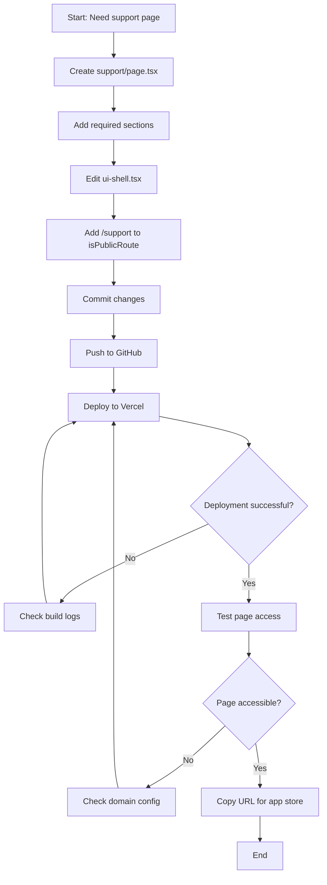

# App Support Page Creation

## Purpose
This SOP documents how to create and deploy public-facing support pages required for mobile app store submissions (Apple App Store, Google Play Store). These pages must be accessible without authentication.

## Who Uses This
- Mobile app developers preparing store submissions
- Web developers maintaining public documentation
- Product managers coordinating app releases

## Workflow

### Step-by-Step Process

#### 1. Create Support Page Component

Create a new Next.js page in the web app:

**File:** `apps/web/app/support/page.tsx`

```typescript
import React from "react";

export const metadata = {
  title: "App Support - Nexus Connect",
  description: "Support and help for Nexus Connect mobile and web applications",
};

export default function SupportPage() {
  return (
    <div style={{ maxWidth: "800px", margin: "0 auto", padding: "40px 20px" }}>
      <h1>Nexus Connect Support</h1>
      
      <section>
        <h2>About</h2>
        <p>Brief description of your app...</p>
      </section>
      
      <section>
        <h2>Contact Support</h2>
        <ul>
          <li>Email: support@nfsgrp.com</li>
          <li>Web: https://ncc.nfsgrp.com</li>
        </ul>
      </section>
      
      <section>
        <h2>System Requirements</h2>
        <p><strong>Mobile:</strong> iOS 13.0+, Android 6.0+</p>
        <p><strong>Web:</strong> Modern browsers (Chrome, Safari, Firefox, Edge)</p>
      </section>
    </div>
  );
}
```

**Required sections:**
- App description and purpose
- Contact information (email, website)
- Getting help / support options
- System requirements
- Privacy policy link (if applicable)
- Terms of service link (if applicable)

#### 2. Make Page Publicly Accessible

Edit the UI shell to allow unauthenticated access:

**File:** `apps/web/app/ui-shell.tsx`

Find the `isPublicRoute` constant and add the support path:

```typescript
const isPublicRoute =
  path === "/apply" ||
  path.startsWith("/apply/") ||
  path.startsWith("/onboarding/") ||
  path === "/reset-password" ||
  path.startsWith("/reset-password/") ||
  path === "/support";  // Add this line
```

This ensures the page renders without navigation/auth checks.

#### 3. Commit Changes

```bash
cd /Users/pg/nexus-enterprise
git add apps/web/app/support/ apps/web/app/ui-shell.tsx
git commit -m "Add public app support page for app store submission

- Created /support page with contact info and help resources
- Made support page publicly accessible (no login required)
- URL: https://ncc.nfsgrp.com/support

Co-Authored-By: Warp <agent@warp.dev>"
```

#### 4. Deploy to Production

Push changes to remote repository:
```bash
git push origin main
```

Deploy to Vercel (production):
```bash
vercel --prod --yes --archive=tgz
```

**Expected deployment time:** 5-10 minutes

#### 5. Verify Deployment

Test the support page:
1. Open browser (incognito/private mode to test without auth)
2. Navigate to: `https://[your-domain]/support`
3. Verify page loads without login prompt
4. Check all sections render correctly
5. Test all contact links work

### Flowchart



## Key Features

- **No authentication required**: Users can access without logging in
- **Mobile responsive**: Works on all device sizes
- **App store compliant**: Meets requirements for Apple App Store and Google Play
- **Easy to update**: Standard Next.js page component

## App Store Submission URLs

After deployment, use these URLs:

- **Apple App Store:** Support URL field
- **Google Play:** Website field (optional but recommended)
- **TestFlight:** Privacy policy URL (if no separate privacy page)

**Production URL:**
```
https://ncc.nfsgrp.com/support
```

**Fallback URL (if custom domain not configured):**
```
https://nexus-enterprise-web.vercel.app/support
```

## Domain Configuration

If custom domain doesn't work:

1. **Check Vercel domain settings:**
   ```bash
   vercel domains ls
   ```

2. **Add domain if missing:**
   ```bash
   vercel domains add ncc.nfsgrp.com
   ```

3. **Configure DNS records** (in your domain registrar):
   - Type: `CNAME`
   - Name: `ncc`
   - Value: `cname.vercel-dns.com`

4. **Wait for DNS propagation** (5-60 minutes)

## Related Modules

- [Web Application Deployment]
- [Mobile App Store Submissions]
- [Public Pages Management]

## Revision History

| Rev | Date | Changes |
|-----|------|---------|
| 1.0 | 2026-02-16 | Initial release |
