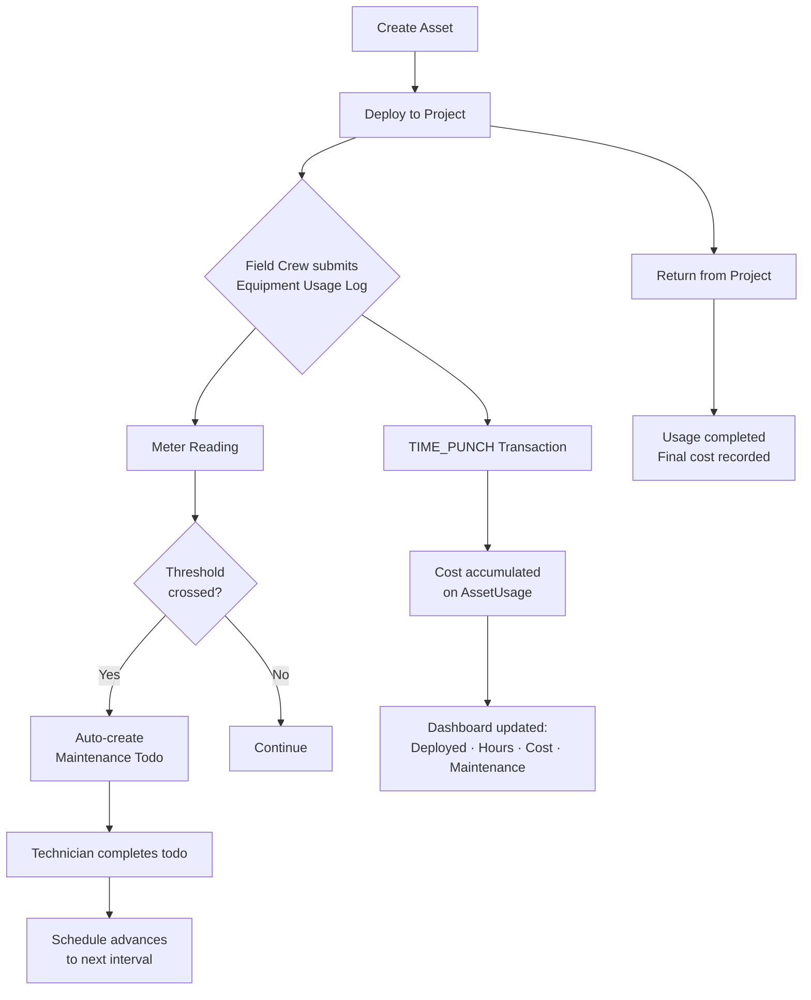

# Asset-Logistics Integration: Equipment Cost Engine & Deployment Pipeline

## Purpose
Provides a unified system for tracking equipment deployment to project sites, recording field usage hours and meter readings, computing equipment costs automatically, managing maintenance lifecycles, and surfacing equipment utilization data on project dashboards.

## Who Uses This
- **Project Managers**: View equipment utilization on project SUMMARY tab, monitor costs and upcoming maintenance
- **Field Crews**: Submit daily equipment usage logs from mobile (hours, meter readings)
- **Admins / Operations**: Manage asset CRUD, deployment workflows, maintenance templates, cost analysis
- **Estimators**: Reference equipment cost summaries for project budgeting

## Workflow

### Equipment Deployment Flow
1. Admin creates an Asset via `POST /assets` (name, type, rate, OEM details)
2. Admin deploys asset to project via `POST /assets/:id/deploy` (creates AssetUsage + InventoryMovement + transit cost estimate)
3. Field crew logs daily equipment hours via mobile app (New Daily Log → Equipment Usage type)
4. System auto-creates TIME_PUNCH transactions + optional meter readings
5. Meter readings auto-trigger maintenance todos when thresholds are crossed
6. PM views equipment dashboard on project SUMMARY tab (deployed count, hours, cost, maintenance alerts)
7. When job is done, admin returns asset via `POST /assets/:id/return`

### Daily Equipment Usage Log (Mobile)
1. Open New Daily Log screen
2. Select project
3. Tap "Equipment Usage" type chip
4. System loads deployed equipment for that project
5. Tap "+ Add Equipment Entry"
6. Select asset, enter hours, optionally select meter type and enter reading
7. Add more entries as needed
8. Save — system creates TIME_PUNCH transactions + meter readings automatically

### Maintenance Lifecycle
1. Admin creates a Maintenance Template with rules (e.g., "Oil Change every 250 hours")
2. Apply template to an asset → creates schedules per rule
3. When meter reading crosses threshold → auto-creates MaintenanceTodo
4. Daily 6 AM cron checks time-based schedules → creates todos for overdue items
5. Technician completes todo → schedule advances to next interval

### Flowchart

## Key Features
- **Equipment CRUD with OEM fields**: manufacturer, model, serial/VIN, year
- **Deploy/Return workflow**: Creates InventoryMovements with haversine transit cost estimates
- **TIME_PUNCH cost engine**: Effective rate cascades (override → snapshot → base), auto-accumulates into usage total
- **Meter-based maintenance**: HOURS, MILES, RUN_CYCLES, GENERATOR_HOURS with configurable thresholds
- **Time-based maintenance**: Cron at 6 AM scans for overdue schedules
- **Maintenance templates**: Reusable profiles that apply multiple rules to an asset in one action
- **EQUIPMENT_USAGE daily log type**: Mobile-first form with asset picker, hours, meter readings
- **Equipment dashboard widget**: 4-card row on project SUMMARY tab (Deployed, Hours 7d, Cost, Maintenance)
- **Project equipment summary API**: `GET /assets/project-summary?projectId=X`

## API Endpoints

### Asset Management
- `GET /assets` — List assets (filters: assetType, isActive, search)
- `GET /assets/:id` — Asset detail with usages, transactions, meter readings, maintenance todos
- `POST /assets` — Create asset
- `PATCH /assets/:id` — Update asset
- `DELETE /assets/:id` — Soft-deactivate asset
- `GET /assets/:id/cost-summary` — Cost breakdown by project
- `GET /assets/project-summary?projectId=X` — Equipment utilization for a project

### Deployment
- `POST /assets/:id/deploy` — Deploy to project site
- `POST /assets/:id/return` — Return from project
- `POST /asset-usages/:id/time-punch` — Record hours of use

### Maintenance
- `GET /maintenance-templates` — List templates
- `POST /maintenance-templates` — Create template with rules
- `PATCH /maintenance-templates/:id` — Update template
- `POST /assets/:id/maintenance/apply-template` — Apply template to asset
- `GET /assets/:id/maintenance` — Schedules + recent todos
- `POST /assets/:id/maintenance/meter-reading` — Record meter reading
- `GET /assets/:id/maintenance/meter-history` — Meter reading history
- `GET /maintenance-todos` — List todos (filters: assetId, status, overdue)
- `PATCH /maintenance-todos/:id` — Update/complete todo

## Related Modules
- Inventory Movement system (transit cost, location tracking)
- Daily Log system (EQUIPMENT_USAGE type integration)
- Task/Escalation system (maintenance todos follow same urgency patterns)
- Project SUMMARY dashboard

## Revision History
| Rev | Date | Changes |
|-----|------|---------|
| 1.0 | 2026-02-27 | Initial release — full Equipment Cost Engine & Deployment Pipeline |
