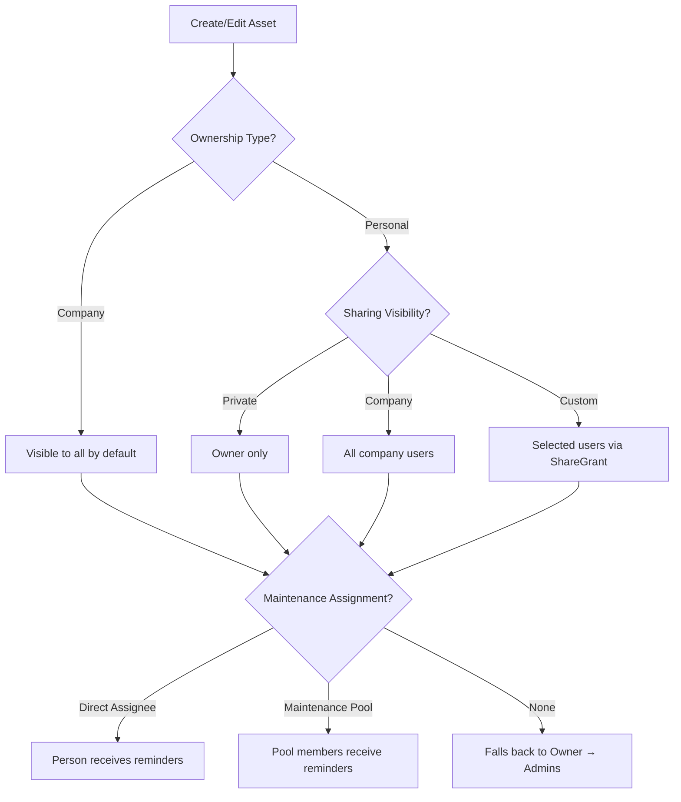

# Personal Asset Ownership, Maintenance Pools & Sharing Controls

## Purpose
Enables individual employees to track personal assets alongside company assets within Nexus. Personal assets can be selectively shared with the company for rental or utilization. Maintenance responsibilities are decoupled from ownership via maintenance pools and direct assignees.

## Who Uses This
- **All employees** — manage personal asset inventories
- **Project managers** — view shared assets available for projects
- **Admins** — manage company assets, maintenance pools, and all sharing settings
- **Maintenance crews** — receive maintenance reminders based on pool or direct assignment

## Workflow

### Personal Asset Registration
1. Navigate to **Assets** page
2. Click **+ New Asset**
3. Select **Ownership Type**: Company or Personal
4. Fill in asset details (name, category, serial number, etc.)
5. For personal assets, set **Sharing Visibility**:
   - **Private** — only you can see it
   - **Company** — visible to all company users
   - **Custom** — share with specific users
6. Optionally assign a **Maintenance Assignee** (person) or **Maintenance Pool** (group)
7. Save

### Sharing Personal Assets
1. From **My Assets** tab, select an asset
2. In the detail view, adjust **Sharing Visibility**
3. For Custom sharing, use **Share** to add specific users
4. Shared assets appear in the company's asset list with a sharing badge

### Maintenance Pool Management
1. Navigate to **Assets** → **Maintenance Pools** (admin only)
2. Create a pool (e.g., "Fleet Maintenance Team")
3. Add members to the pool
4. Assign the pool to assets that require periodic maintenance
5. Maintenance notifications follow the resolution chain: Direct Assignee → Pool Members → Owner → Admins

### Flowchart

## Key Features
- **Dual ownership model** — Company and Personal assets coexist in one system
- **Privacy-first personal assets** — default to Private, owner controls visibility
- **Granular sharing** — share with entire company or specific individuals
- **Maintenance pools** — group-based maintenance responsibility
- **Notification resolution chain** — ensures someone always gets maintenance alerts
- **CSV import/export** — ownership columns included in template
- **Filtered views** — All / Company / Personal / My Assets tabs

## Data Model
- `Asset.ownershipType` — COMPANY or PERSONAL
- `Asset.sharingVisibility` — PRIVATE, COMPANY, or CUSTOM
- `Asset.ownerId` — links personal assets to their owner (User)
- `Asset.maintenanceAssigneeId` — direct person for maintenance
- `Asset.maintenancePoolId` — group for maintenance
- `MaintenancePool` — named group with members
- `AssetShareGrant` — per-user sharing record for Custom visibility

## Related Modules
- Asset Management (core)
- User Management (ownership, sharing targets)
- Notifications (maintenance reminders)

## Revision History
| Rev | Date | Changes |
|-----|------|--------|
| 1.0 | 2025-02-28 | Initial release — personal ownership, maintenance pools, sharing controls |
