# BOM Material Pricing Pipeline

## Purpose

Enable project managers and estimators to search real-time material prices from multiple suppliers (Home Depot, Lowe's) directly from a project's Bill of Materials. Prices are captured with store locations and persisted as snapshots for historical cost tracking and PO generation.

## Who Uses This

- **Project Managers** — compare supplier pricing, select best-value materials
- **Estimators** — validate estimate pricing against current retail availability
- **Executives** — review cost trends via snapshot history
- **Accounting** — reference store locations and pricing for PO/invoice reconciliation

## Workflow

### Step-by-Step Process

1. Navigate to a project's **BOM** tab on the Project Detail page.
2. The BOM table displays all imported material lines from the Xactimate estimate.
3. **Select materials**: Use the checkboxes on the left of each BOM row to select which lines to price-search. Use "Select All" for a full batch.
4. Click **Search Selected** to initiate a multi-provider pricing search.
5. The system streams results in real time via SSE — each material line updates as its search completes. A progress indicator shows lines completed vs. total.
6. Results display per line:
   - **Home Depot** price, product name, thumbnail, store name + location
   - **Lowe's** price, product name, thumbnail, store name + location
   - **Availability** status when provided by the supplier API
7. Review results. Prices are automatically saved as a **pricing snapshot** with timestamp.
8. To re-search (e.g., after market changes), select lines and search again. New results create a new snapshot; prior snapshots are preserved.

### Flowchart

```mermaid
flowchart TD
    A[Open Project → BOM Tab] --> B[Select Material Lines]
    B --> C[Click Search Selected]
    C --> D[SSE Stream Starts]
    D --> E{For Each Line}
    E --> F[Query Home Depot via SerpAPI/BigBox]
    E --> G[Query Lowe's via SerpAPI Google Shopping]
    F --> H[Return Price + Store Location]
    G --> H
    H --> I[Save to BomPricingProduct]
    I --> J[Stream Progress to Browser]
    J --> E
    E -->|All Done| K[Save Pricing Snapshot]
    K --> L[Display Results in BOM Table]

    style D fill:#dbeafe,stroke:#2563eb,stroke-width:2px
    style K fill:#d1fae5,stroke:#059669,stroke-width:2px
```

## Key Features

- **Multi-Provider Search**: Home Depot and Lowe's searched simultaneously for each material line.
- **SSE Streaming**: Real-time progress — no page reload, no polling. Each line result appears as it completes.
- **Store Location Capture**: Store name, full address, and phone number saved with each pricing result for PO/invoice traceability.
- **Snapshot Persistence**: Every search run saves a timestamped snapshot. Historical snapshots are preserved for cost trending.
- **Pre-Search Selection**: Checkboxes allow targeted searches (e.g., only high-value items) instead of searching the entire BOM.
- **Unicode-Safe Search Queries**: Xactimate dimension markers (foot/inch symbols in various Unicode forms) are normalized before querying suppliers.

## Data Model

Each search result is stored as a `BomPricingProduct` record:
- `bomLineItemId` — links to the BOM material line
- `supplier` — "home_depot" or "lowes"
- `productName`, `price`, `productUrl`, `thumbnailUrl`
- `storeName`, `storeAddress`, `storeCity`, `storeState`, `storeZip`, `storePhone`
- `snapshotId` — groups results into a single search run
- `searchedAt` — timestamp of the search

## Providers

| Provider | Engine | API Key | Notes |
|----------|--------|---------|-------|
| Home Depot (primary) | SerpAPI `home_depot` engine | `SERPAPI_KEY` | Direct product search |
| Home Depot (fallback) | BigBox API | `BIGBOX_KEY` | Used if SerpAPI unavailable |
| Lowe's | SerpAPI `google_shopping` engine | `SERPAPI_KEY` | Appends "lowes" to query, filters by source |

## Troubleshooting

- **No results for a line**: The Xactimate description may be too specific. The system normalizes dimensions and strips codes, but very niche items may not have retail equivalents.
- **Store location missing**: Some SerpAPI responses don't include store data (online-only listings). The fields will be null.
- **Streaming disconnects**: If the browser tab is backgrounded during search, the SSE connection may drop. Re-select lines and search again.
- **Stale prices**: Prices are point-in-time. Re-run search periodically (weekly recommended) for active projects.

## Related Modules

- [PETL (Project Estimate Task List)](./petl-sop.md) — source of material line items
- [Supplier Catalog](../architecture/supplier-catalog.md) — technical architecture for provider integrations
- [Financial Module](./financial-sop.md) — PO generation from BOM pricing data (planned)

## Revision History

| Rev | Date | Changes |
|-----|------|---------|
| 1.0 | 2026-02-26 | Initial release — HD + Lowe's multi-provider search, SSE streaming, snapshot persistence, store locations |
