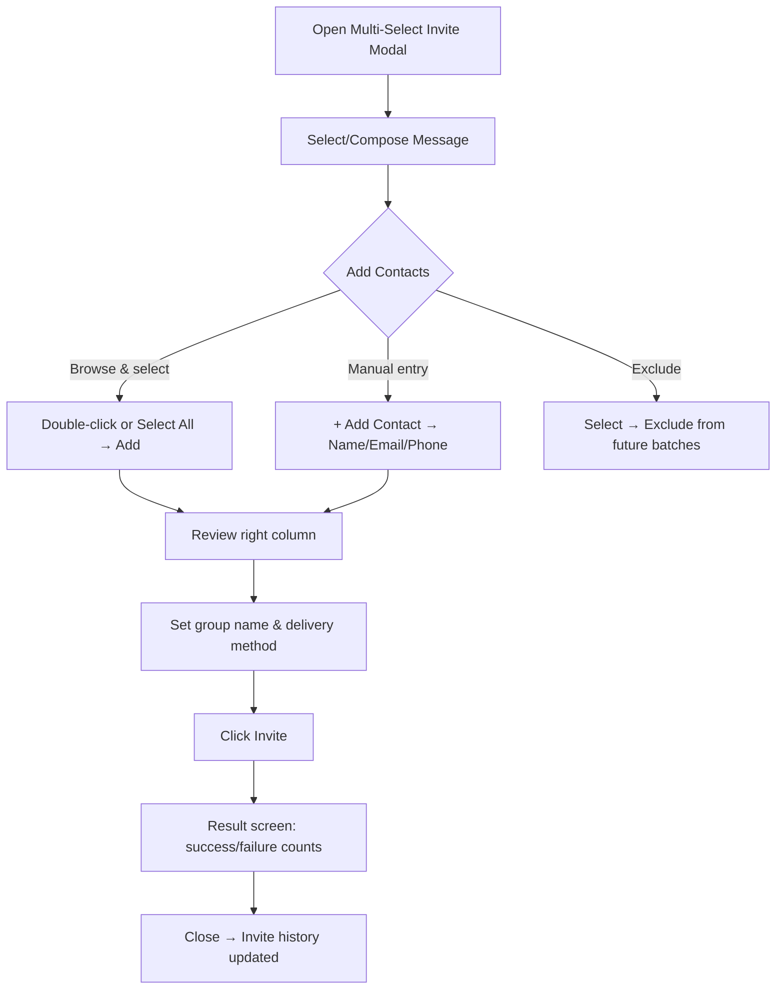

# CAM Multi-Select Invite

## Purpose

The Multi-Select Invite system allows administrators to bulk-send CAM Library invitations to contacts (personal and work) from a single modal interface. Invitations include a personalized message, are tracked as named groups for recall, and support exclude lists to prevent repeat sends.

## Who Uses This

- **SUPER_ADMIN** and **ADMIN** users with access to `/system/cam-dashboard`
- Used for distributing the Competitive Advantage Manual to prospects, partners, and clients

## Workflow

### Sending a Batch Invite

1. Navigate to **System → 🏆 CAM Dashboard → Invites tab**
2. Click the green **👥 Multi-Select Invite** button
3. The modal opens with three sections:
   - **Message bar** (top): Select or compose the invite message
   - **Contact picker** (center): Dual-column selector at 75% screen height
   - **Send controls** (bottom): Group name, delivery method, send button

### Step-by-Step: Selecting Contacts

1. **Browse contacts**: Left column loads all personal + work contacts (200 at a time, scroll to load more)
2. **Search**: Type in the search box to filter by name, email, or phone
3. **Select individually**: Double-click a contact to move them to the right column
4. **Select in bulk**: Check the select-all checkbox (or individual checkboxes), then click **Add Selected →**
5. **Remove from selection**: Click the **×** button next to any contact in the right column
6. **Exclude contacts**: Select contacts and click **Exclude** to permanently hide them from future invite sessions (recoverable from the Excluded tab)

### Step-by-Step: Adding Contacts Not in the System

1. Click **+ Add Contact** at the top of the left column
2. Fill in **Name** (required), **Email**, and/or **Phone**
3. Click **Add & Select** — the contact is saved to your Personal Contacts and added to the right column
4. The new contact persists across sessions and will appear in future invite batches

### Step-by-Step: Managing Canned Messages

1. **Select a template**: Use the dropdown at the top of the modal
2. **Edit the message**: Modify the text area content as needed
3. **Save as New**: Click to save the current text as a new named template
4. **Update**: Overwrite the currently selected template with new text
5. **Delete**: Remove a template permanently
6. **Set Default**: Mark a template as the auto-loaded default for future sessions

### Step-by-Step: Sending

1. **Group name**: Enter a name for this batch (defaults to today's date `YYYYMMDD`)
2. **Delivery method**: Toggle Email and/or SMS
3. Click **Invite [N] People**
4. The result screen shows success/failure counts per recipient
5. Close the modal — the invite history table updates immediately

### Flowchart

## Managing Invite Groups

After sending, each batch becomes a named **Invite Group** visible in the 📂 Invite Groups section:

- **View group**: Click a group card to filter the invite history table to that group's recipients
- **Rename group**: Double-click the group name to edit it inline
- **Clear filter**: Click the yellow **✕** badge to return to the full invite history

## Invite History

The invite history table shows all CAM Library invitations with:

- **Sortable columns**: Click any column header (Recipient, Email, Views, Status, Group, Created) to sort ▲/▼
- **Search**: Type in the search box to filter across name, email, status, and group name
- **Group filter**: Click a group name badge in the table to filter to that group

## Excluding Contacts

- **Exclude**: In the modal, select contacts → click **Exclude**. They are hidden from future invite sessions.
- **Recover**: Open the **Excluded** tab in the modal to see all excluded contacts. Toggle them back to available.
- Exclusion is persistent — it survives across sessions and modal reopens.

## Key Features

- Dual-column contact picker with progressive scroll (200 contacts per batch)
- Select-all checkbox with indeterminate state
- Canned message templates with full CRUD
- Named invite groups for batch recall and tracking
- Manual contact entry that persists to Personal Contacts
- Client-side search across all invite history fields
- Sortable invite history with group filtering

## Related Modules

- [CAM Portal Viral Referral System (CLT-COLLAB-0004)](../../docs/cams/CAM-LIBRARY.md)
- [CNDA+ Gated Access System (CMP-CMP-0001)](../../docs/cams/CAM-LIBRARY.md)
- Personal Contacts (`/settings/personal-contacts`)

## Revision History

| Rev | Date | Changes |
|-----|------|---------|
| 1.0 | 2026-03-13 | Initial release — full Multi-Select Invite SOP |
