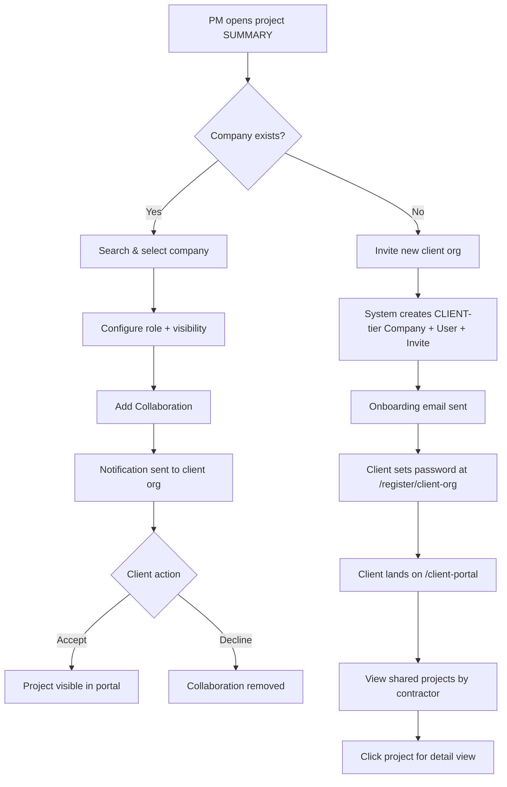

# Client Collaboration & Tenant Tier System

## Purpose
Enables contractors to formally invite external client organizations into projects with controlled visibility. Client organizations are treated as limited-tenant companies (CLIENT tier) that can view their shared projects through a dedicated portal, accept or decline collaboration invitations, and potentially upgrade to full CONTRACTOR tier via subscription.

## Who Uses This
- **Project Managers / Admins** — Invite client orgs, manage collaboration roles and visibility per project
- **Company Owners** — Create and manage client organization invitations
- **Client Org Users** — Access the client portal to view shared projects and respond to invitations
- **SUPER_ADMIN** — Full access to all collaboration management

## Workflow

### Inviting a Client Organization (New)

#### Step-by-Step Process
1. Open a project → SUMMARY tab
2. Scroll to the **Collaborating Organizations** panel (below Participants)
3. Click **+ Add**
4. Search for the company name
5. If the company doesn't exist, click **"Invite a new organization →"**
6. Fill in: Organization Name (required), Contact Email (required), First Name, Last Name
7. Click **Send Invite** — this creates:
   - A new Company record with `tier: CLIENT`
   - A new User with the contact email (placeholder password)
   - An OWNER membership linking the user to the company
   - A CompanyInvite token (14-day expiry)
   - An onboarding email sent to the contact
8. The new company is pre-selected — configure Role and Visibility, then click **Add Collaboration**

### Inviting an Existing Company

1. Open project → SUMMARY tab → Collaborating Organizations → + Add
2. Type the company name in search — select from results
3. Set **Role** (Client, Subcontractor, Prime GC, Consultant, Inspector)
4. Set **Visibility** (Limited or Full)
5. Optionally add notes (e.g., "Primary insurance adjuster")
6. Click **Add Collaboration**

### Client Onboarding Flow

1. Client receives onboarding email with a link to `/register/client-org?token=...`
2. Page validates the token, displays org name and email (pre-filled)
3. Client sets their password and submits
4. On success, they're authenticated and redirected to `/client-portal`

### Client Portal — Viewing Projects

1. Navigate to `/client-portal`
2. Page shows all projects shared with the client's organization, grouped by contractor
3. Each project shows: name, address, status badge, role badge
4. Click a project to view its details (scoped to collaboration visibility level)

### Client Portal — Managing Invitations

1. Navigate to `/client-portal/collaborations` (or click "Pending Invites" button)
2. View all pending collaboration invitations
3. Each invitation shows: project name, inviting contractor, assigned role, invite date, notes
4. Click **Accept** to join the project or **Decline** to reject

### Revoking a Collaboration

1. Open project → SUMMARY tab → Collaborating Organizations
2. Find the company in the list
3. Click **Revoke** — collaboration is soft-deactivated (can be re-invited later)

### Flowchart

## Key Features
- **Tenant Tier Architecture** — Companies are either CLIENT (limited) or CONTRACTOR (full). CLIENT tier can upgrade via subscription.
- **Cross-Tenant Project Sharing** — ProjectCollaboration model links projects to external companies with role + visibility controls.
- **Smart Notification Routing** — System detects existing partner relationships and adjusts notification tone (new invite vs. new project with existing partner).
- **Collaboration Reactivation** — Previously revoked collaborations can be re-invited without creating duplicates (unique constraint: `[projectId, companyId]`).
- **Role-Based Collaboration** — Five collaboration roles: CLIENT, SUB, PRIME_GC, CONSULTANT, INSPECTOR.
- **Visibility Levels** — LIMITED (scoped project data) and FULL (broad access).

## API Endpoints

### Contractor-Side (Project Collaboration Controller)
- `POST /projects/:id/collaborations` — Add collaboration
- `GET /projects/:id/collaborations` — List collaborations on a project
- `PATCH /projects/:id/collaborations/:collabId` — Update role/visibility/notes
- `DELETE /projects/:id/collaborations/:collabId` — Revoke (soft-delete)

### Portal-Side (Collaboration Portal Controller)
- `GET /portal/collaborations` — List pending invitations for caller's company
- `POST /portal/collaborations/:id/accept` — Accept invitation
- `POST /portal/collaborations/:id/decline` — Decline invitation
- `GET /projects/portal/my-projects` — List cross-tenant projects (grouped by company)
- `GET /projects/portal/:id` — View specific project via collaboration access

### Client Org Management
- `POST /companies/invite-client-org` — Create CLIENT-tier company + invite
- `GET /auth/client-org-onboarding?token=...` — Validate onboarding token
- `POST /auth/client-org-onboarding` — Set password + authenticate
- `GET /companies/search?q=...` — Search companies for collaboration picker

## Database Schema

### New Models
- **ProjectCollaboration** — Links `projectId` + `companyId` with role, visibility, invited/accepted timestamps, notes, active flag. Unique constraint on `[projectId, companyId]`.

### New Enums
- **CompanyTier** — `CLIENT | CONTRACTOR`
- **CollaborationRole** — `CLIENT | SUB | PRIME_GC | CONSULTANT | INSPECTOR`

### Modified Models
- **Company** — Added `tier` field (defaults to `CONTRACTOR`)

## Architectural Note (2026-03-06)

> **Individual client invites now use a simplified model.** As of 2026-03-06, inviting a client to a single project no longer requires creating a CLIENT-tier Company. Instead, the client is a User (`userType: CLIENT`) linked to the project via a TenantClient record. See `client-invite-from-project-creation-sop.md` for the new flow.
>
> **This SOP still applies to tenant-to-tenant collaboration** — subcontractors, prime GCs, consultants, and inspectors. These use the ProjectCollaboration model and require a full Company entity on both sides. The CLIENT-tier Company model is retained for backward compatibility with existing collaborations but is no longer the default for individual client invites.

## Related Modules
- Project Management (project detail page)
- Company & User Management (invite flow)
- Notifications (collaboration alerts)
- Authentication (client org onboarding)
- **Client Invite from Project Creation** (simplified individual client flow)

## Revision History
| Rev | Date | Changes |
|-----|------|--------|
| 1.0 | 2026-03-05 | Initial release — Phases 1-4 complete |
| 1.1 | 2026-03-06 | Added architectural note: individual client invites now use TenantClient+User model |
