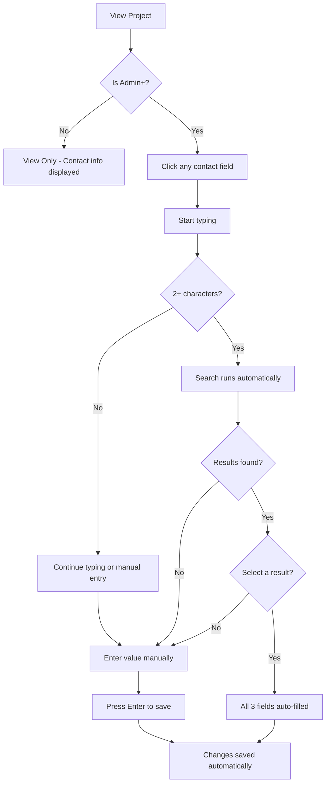

# Client Contact Linking

## Purpose
The Client Contact Linking feature allows users to efficiently manage client contact information across multiple projects. Instead of manually entering the same client details for each project, users can search for existing contacts and auto-fill all fields with a single click. This ensures consistency across projects and reduces data entry errors.

## Who Uses This
- **Admins & Owners**: Can edit client contact information inline on any project
- **Project Managers**: Can view client contact information
- **Foremen & Crew**: Can view client contact information (read-only)

## Workflow

### Viewing Client Contact Information
1. Navigate to any project detail page
2. The **Client Contact** section appears on the right side of the project header
3. Displays:
   - Name (with edit icon if Admin+)
   - Phone (clickable to call)
   - Email (clickable to send email)
4. If no contact information exists, placeholder text is shown ("No name", "No phone", "No email")

### Editing Client Contact Information (Admin+ Only)

#### Manual Entry
1. Click on any field (Name, Phone, or Email)
2. Type the new value
3. Press **Enter** to save, or **Escape** to cancel
4. The field updates immediately

#### Using Auto-Search to Link Existing Contacts
1. Click on any field (Name, Phone, or Email)
2. Start typing (minimum 2 characters)
3. A dropdown appears showing matching contacts from:
   - Other projects in your company
   - The tenant client database
4. Each result shows:
   - Contact name
   - Email, phone, and company (if available)
5. Click on a result to **auto-fill all three fields** (name, phone, email)
6. Changes are saved automatically

### Flowchart

## Key Features

### Inline Editing
- Click directly on any field to edit
- No separate edit mode required
- Changes save on Enter or when clicking away

### Smart Search
- Searches across all projects in your company
- Finds contacts by name, email, or phone
- Deduplicates results (same contact won't appear twice)
- Shows contact source for context

### Auto-Fill
- Selecting a search result fills ALL contact fields at once
- Saves time when the same client has multiple projects
- Ensures consistency across projects

### Always Visible
- Client contact section is always shown, even when empty
- Placeholder text indicates missing information
- Encourages complete data entry

## Data Sources

The search pulls contacts from two sources:

1. **Tenant Client Database**: Formally registered clients shared across your company
2. **Project Contacts**: Contact information entered on other projects

Results are automatically deduplicated by email or phone number.

## Related Modules
- Project Management
- Invoicing (uses client contact for correspondence)
- Client Portal (future)

## Troubleshooting

| Issue | Solution |
|-------|----------|
| Search not showing results | Ensure you've typed at least 2 characters |
| Can't edit contact fields | Only Admin and Owner roles can edit |
| Contact not found in search | The contact may not exist on any other project yet - enter manually |

## Revision History

| Rev | Date | Changes |
|-----|------|---------|
| 1.0 | 2025-02-15 | Initial release |
