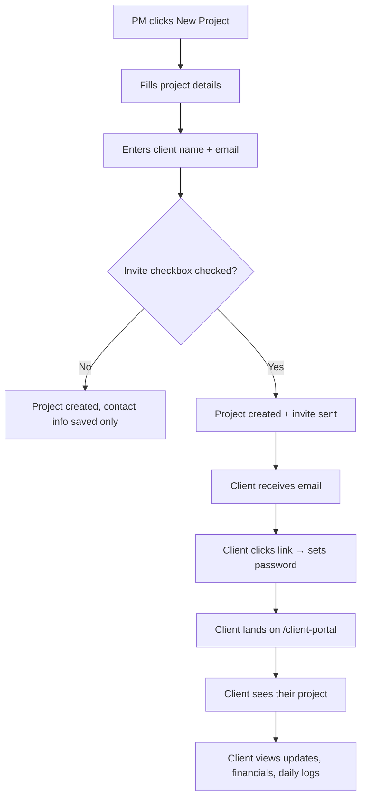

> 🚧 **PRE-IMPLEMENTATION — Feature Not Yet Built**
> This SOP documents the **intended design** agreed upon in the 2026-03-06 session. The following components are pending implementation:
> 1. Auth changes — client-only login without `CompanyMembership` (sentinel `companyId` + `@ClientAllowed` guard)
> 2. `inviteProjectClient()` service method on the API
> 3. Project creation API — accept `inviteClient` flag
> 4. Frontend — invite checkbox on the New Project form
> 5. Client onboarding page — simplified `/register/client?token=...` variant
> 6. Client portal — query via `TenantClient.userId`
> 7. Sidebar role indicator (client badge on client-only projects)
>
> Until these are built, contact info only (no invite) is the current behavior. See [session export](./session-2026-03-06-client-onboarding-simplification.md) for full context.

# Client Invite from Project Creation

## Purpose
Enables PMs and Admins to invite a client directly when creating a project. The client receives an email, sets a password, and immediately sees their project in the client portal. No separate "client organization" is created — the client is a user with scoped access to their project(s).

## Who Uses This
- **Project Managers / Admins** — Invite clients during project creation
- **Clients** — Receive invite, set password, view their project(s)

## Workflow

### Inviting a Client During Project Creation

#### Step-by-Step Process
1. Click **New Project** in the projects sidebar
2. Fill in required project details (Name, Address, City, State)
3. In the **Client Contact** section, enter:
   - **Client Name** (required for invite)
   - **Email** (required for invite)
   - **Phone** (optional)
4. The **"Invite client to view this project on Nexus"** checkbox is checked by default when an email is present
5. To skip the invite (contact-only), uncheck the box
6. Click **Create Project**
7. If the invite box was checked, the system:
   - Creates a User account for the client (or finds an existing one by email)
   - Links the client to the project via a TenantClient record
   - Sends an onboarding email with a secure link
8. A confirmation appears: "Invite sent to {email}"

### Client Receives the Invite

1. Client receives an email: "{Contractor Name} has invited you to view your project on Nexus"
2. Email contains a **Set Up Your Account** button linking to `/register/client?token=...`
3. Client clicks the link → sees the project name and contractor name
4. Client sets a password (minimum 8 characters)
5. On success, client is logged in and redirected to `/client-portal`

### Client Views Their Projects

1. Client logs into Nexus → lands on `/client-portal`
2. Portal shows all projects where the client has been invited, grouped by contractor
3. Each project shows: name, address, status
4. Client clicks a project to see scoped details (updates, financials, daily logs)

### Flowchart

## Key Features

### One-Step Invite
- Invite happens during project creation — no extra navigation needed
- Checkbox defaults to ON when email is present, OFF when no email
- PM can still enter contact info without inviting (uncheck the box)

### No Client Organization
- Clients are individual users, not separate companies/tenants
- A client with projects from multiple contractors sees all of them in one portal
- No "organization setup" step — just name, email, password

### Scoped Visibility
- Clients see only their project(s), not the contractor's full project list
- Within a project, clients see: updates, financials, daily logs
- Clients do NOT see: estimating tools, scheduling, invoicing, PETL, crew management

### Existing Client Detection
- If the email matches an existing user, no duplicate account is created
- The existing user gets access to the new project automatically
- If the user already has a password set, they receive a notification instead of an onboarding link

### Dual-Role Support
- A client user can later register as a contractor (create their own Company)
- Their client project access persists — visible in the portal alongside their own projects
- Project sidebar shows a "Client" badge on projects where the user has client-only access

## Data Model

### How Access is Tracked
- **User** — The client's account (`userType: CLIENT`)
- **TenantClient** — Links the client to a contractor's company. Has a `userId` field pointing to the User. Multiple TenantClient records can point to the same User (one per contractor)
- **Project.tenantClientId** — Links the project to the TenantClient record

### Access Resolution
When a client logs in:
1. Find all TenantClient records where `userId = current user`
2. Find all Projects where `tenantClientId` matches those TenantClient IDs
3. Group by contractor company → display in portal

## Differences from Tenant-to-Tenant Collaboration

This flow is for **individual client access**. For company-to-company collaboration (subcontractors, prime GCs, consultants, inspectors), use the Collaborating Organizations panel on the project SUMMARY tab. That flow uses the `ProjectCollaboration` model and requires a full Company entity on both sides.

| | Client Invite (this SOP) | Tenant Collaboration |
|---|---|---|
| **Who** | Individual client person | External company/org |
| **Creates** | User + TenantClient link | ProjectCollaboration record |
| **Company needed?** | No | Yes (both sides) |
| **Access scope** | Limited (updates, financials, logs) | Configurable (LIMITED or FULL) |
| **Use case** | Homeowner, insurance adjuster, property manager viewing their project | Subcontractor, GC, consultant collaborating on project |

## Related Modules
- Project Management (project creation form)
- [Client Portal](./client-portal-sop.md) (project viewing, dual-role navigation)
- Authentication (client login)
- [Client Contact Linking](./client-contact-linking-sop.md) (inline search on project detail — reuses same contact fields)

## Revision History
| Rev | Date | Changes |
|-----|------|---------|
| 1.1 | 2026-03-06 | Added pre-implementation notice; linked Client Portal SOP and Client Contact Linking SOP |
| 1.0 | 2026-03-06 | Initial draft — simplified client invite model |
