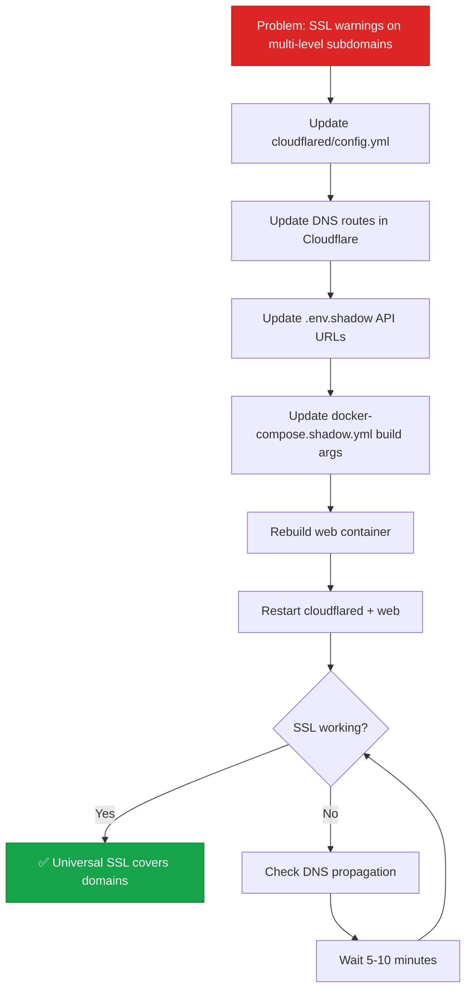

# Cloudflare SSL Domain Flattening SOP

## Purpose
Documents the fix for SSL/TLS certificate coverage on multi-level subdomains in the Cloudflare Tunnel setup for the shadow (production) stack. Explains why the original domain structure caused SSL warnings and how flattening to single-level subdomains resolved it.

## Who Uses This
- DevOps managing Cloudflare Tunnel configuration
- Admins troubleshooting SSL certificate warnings
- Anyone setting up new Cloudflare Tunnel routes

## Problem: Multi-Level Subdomains Not Covered by Universal SSL

### Original Domain Structure
The shadow/production stack was exposed via Cloudflare Tunnel using:

| Service | Original Domain | Subdomain Levels |
|---------|----------------|------------------|
| Web | `staging.ncc.nfsgrp.com` | 2 (`staging` + `ncc`) |
| API | `api-staging.ncc.nfsgrp.com` | 3 (`api-staging` + `ncc`) |

### SSL Coverage Issue

**Cloudflare Universal SSL certificates** (free tier) only cover:
- ✅ Apex domain: `nfsgrp.com`
- ✅ One-level subdomains: `*.nfsgrp.com` (e.g., `ncc.nfsgrp.com`, `staging.nfsgrp.com`)
- ❌ Multi-level subdomains: `*.*.nfsgrp.com` (e.g., `api-staging.ncc.nfsgrp.com`)

**Result:**
- `staging.ncc.nfsgrp.com` → 2 levels → ❌ **Not covered**
- `api-staging.ncc.nfsgrp.com` → 3 levels → ❌ **Not covered**

**User impact:**
- Browser SSL warnings ("Your connection is not private")
- API calls fail with certificate errors
- Mixed content warnings in web app

### Why This Happens

From Cloudflare docs:
> "By default, Cloudflare Universal SSL certificates only cover your apex domain and one level of subdomain."
>
> Examples:
> - `example.com` ✅ Covered
> - `www.example.com` ✅ Covered
> - `docs.example.com` ✅ Covered
> - `dev.docs.example.com` ❌ **Not covered**
> - `test.dev.api.example.com` ❌ **Not covered**

## Solution: Flatten to Single-Level Subdomains

### New Domain Structure

| Service | New Domain | Subdomain Levels | SSL Coverage |
|---------|-----------|------------------|--------------|
| Web | `staging-ncc.nfsgrp.com` | 1 (`staging-ncc`) | ✅ Universal SSL |
| API | `staging-api.nfsgrp.com` | 1 (`staging-api`) | ✅ Universal SSL |

### Benefits
- ✅ Free Universal SSL coverage (no paid plans needed)
- ✅ Automatic SSL renewal by Cloudflare
- ✅ No browser warnings
- ✅ No certificate management overhead
- ✅ Future-proof (works for all Cloudflare accounts)

## Implementation Steps

### Step 1: Update Cloudflare Tunnel Configuration

**File:** `infra/cloudflared/config.yml`

**Before:**
```yaml
ingress:
  - hostname: staging.ncc.nfsgrp.com
    service: http://web:3000

  - hostname: api-staging.ncc.nfsgrp.com
    service: http://api:8000

  - service: http_status:404
```

**After:**
```yaml
ingress:
  - hostname: staging-ncc.nfsgrp.com
    service: http://web:3000

  - hostname: staging-api.nfsgrp.com
    service: http://api:8000

  - service: http_status:404
```

### Step 2: Update DNS Routes

**Remove old routes:**
```bash
cloudflared tunnel route dns delete nexus-shadow staging.ncc.nfsgrp.com
cloudflared tunnel route dns delete nexus-shadow api-staging.ncc.nfsgrp.com
```

**Add new routes:**
```bash
cloudflared tunnel route dns nexus-shadow staging-ncc.nfsgrp.com
cloudflared tunnel route dns nexus-shadow staging-api.nfsgrp.com
```

**Or via Cloudflare Dashboard:**
1. Log in to Cloudflare dashboard
2. Select domain: `nfsgrp.com`
3. Go to **Zero Trust** → **Networks** → **Tunnels**
4. Edit tunnel `nexus-shadow`
5. Under **Public Hostnames**:
   - Delete old: `staging.ncc.nfsgrp.com`, `api-staging.ncc.nfsgrp.com`
   - Add new: `staging-ncc.nfsgrp.com` → `http://web:3000`
   - Add new: `staging-api.nfsgrp.com` → `http://api:8000`

### Step 3: Update Shadow Stack Environment

**File:** `.env.shadow`

Update any references to the API URL:

**Before:**
```bash
NEXT_PUBLIC_API_BASE_URL=https://api-staging.ncc.nfsgrp.com
NEXT_PUBLIC_API_URL=https://api-staging.ncc.nfsgrp.com
```

**After:**
```bash
NEXT_PUBLIC_API_BASE_URL=https://staging-api.nfsgrp.com
NEXT_PUBLIC_API_URL=https://staging-api.nfsgrp.com
```

### Step 4: Update Web Dockerfile Build Args

**File:** `infra/docker/docker-compose.shadow.yml`

**Before:**
```yaml
web:
  build:
    context: ../..
    dockerfile: apps/web/Dockerfile
    args:
      NEXT_PUBLIC_API_BASE_URL: https://api-staging.ncc.nfsgrp.com
      NEXT_PUBLIC_API_URL: https://api-staging.ncc.nfsgrp.com
```

**After:**
```yaml
web:
  build:
    context: ../..
    dockerfile: apps/web/Dockerfile
    args:
      NEXT_PUBLIC_API_BASE_URL: https://staging-api.nfsgrp.com
      NEXT_PUBLIC_API_URL: https://staging-api.nfsgrp.com
```

### Step 5: Rebuild and Restart Shadow Stack

```bash
# Rebuild web with new API URL
docker compose -f infra/docker/docker-compose.shadow.yml build web

# Restart tunnel + web
docker compose -f infra/docker/docker-compose.shadow.yml restart cloudflared web

# Or restart entire stack if needed
docker compose -f infra/docker/docker-compose.shadow.yml restart
```

### Step 6: Verify SSL Coverage

**Test SSL certificates:**
```bash
# Web
curl -I https://staging-ncc.nfsgrp.com

# API
curl -I https://staging-api.nfsgrp.com

# Should see:
# HTTP/2 200
# server: cloudflare
# (No SSL warnings)
```

**Check in browser:**
1. Visit `https://staging-ncc.nfsgrp.com`
2. Click padlock icon in address bar
3. Should show: "Connection is secure" ✅
4. Certificate should be issued by Cloudflare

**Verify API from web:**
Open browser console on `https://staging-ncc.nfsgrp.com` and run:
```javascript
fetch('https://staging-api.nfsgrp.com/health')
  .then(r => r.json())
  .then(console.log)
```
Should succeed with no CORS or SSL errors.

## Workflow Diagram



## Alternative Solutions (Not Chosen)

### Option 1: Enable Total TLS
**Cost:** $25/month (Cloudflare Pro plan)

**Pros:**
- Covers all multi-level subdomains automatically
- No domain restructuring needed

**Cons:**
- ❌ Monthly cost
- ❌ Overkill for 2 subdomains
- ❌ Not cost-effective for small deployments

### Option 2: Advanced Certificate Manager
**Cost:** $10/month (add-on)

**Pros:**
- Precise control over certificate coverage

**Cons:**
- ❌ Monthly cost
- ❌ Still more expensive than flattening
- ❌ Manual certificate management

### Option 3: Custom Certificate Upload
**Cost:** Free (but manual)

**Pros:**
- No Cloudflare costs

**Cons:**
- ❌ Manual renewal every 90 days
- ❌ Requires Let's Encrypt or similar
- ❌ More operational overhead

**Why we chose domain flattening:**
- ✅ Free forever
- ✅ Automatic SSL management by Cloudflare
- ✅ No ongoing costs or manual renewals
- ✅ Simple one-time config change

## Troubleshooting

### Issue: DNS not resolving after route change
**Symptoms:** `nslookup staging-ncc.nfsgrp.com` returns NXDOMAIN

**Fix:**
1. Verify DNS route was added: Check Cloudflare dashboard → DNS → Records
2. Wait for propagation (usually 1-5 minutes, max 24 hours)
3. Flush local DNS cache:
   ```bash
   sudo dscacheutil -flushcache; sudo killall -HUP mDNSResponder
   ```

### Issue: Still seeing SSL warnings after change
**Symptoms:** Browser shows "Not Secure" on new domain

**Fix:**
1. Check DNS is resolving: `nslookup staging-ncc.nfsgrp.com`
2. Verify Cloudflare proxy is active (orange cloud in DNS settings)
3. Clear browser cache and try incognito mode
4. Check SSL/TLS mode: Cloudflare dashboard → SSL/TLS → Overview → Should be "Full" or "Full (strict)"

### Issue: API calls failing with CORS errors
**Symptoms:** Web console shows CORS policy errors

**Fix:**
1. Verify API is responding: `curl https://staging-api.nfsgrp.com/health`
2. Check API CORS config allows new domain
3. Rebuild web container to use new API URL (Step 5)

### Issue: Old domains still resolving
**Symptoms:** Both old and new domains work

**Fix:**
This is normal during transition. Old DNS records may take up to 24 hours to fully expire. Eventually, only the new domains will work once you remove the old DNS routes.

## Related Files

**Cloudflare Tunnel:**
- `infra/cloudflared/config.yml` — Tunnel ingress rules (hostnames)
- `~/.cloudflared/f2959e74-843b-4190-b444-36cda0dceeb7.json` — Tunnel credentials

**Shadow Stack:**
- `infra/docker/docker-compose.shadow.yml` — Shadow/prod compose file
- `.env.shadow` — Shadow environment variables (git-ignored)

**Web Build:**
- `apps/web/Dockerfile` — Web container build config

## Domain Naming Convention

For future reference, always use **single-level subdomains** for Cloudflare Tunnel routes:

**✅ Good (1 level):**
- `staging-ncc.nfsgrp.com`
- `staging-api.nfsgrp.com`
- `prod-ncc.nfsgrp.com`
- `prod-api.nfsgrp.com`
- `dev-api.nfsgrp.com`

**❌ Bad (2+ levels):**
- `staging.ncc.nfsgrp.com`
- `api-staging.ncc.nfsgrp.com`
- `dev.api.ncc.nfsgrp.com`

**Pattern:** `{environment}-{service}.{apex}`

Examples:
- Staging web: `staging-ncc.nfsgrp.com`
- Staging API: `staging-api.nfsgrp.com`
- Production web: `prod-ncc.nfsgrp.com`
- Production API: `prod-api.nfsgrp.com`
- Dev web: `dev-ncc.nfsgrp.com`
- Dev API: `dev-api.nfsgrp.com`

## Security Notes

- ✅ All traffic is encrypted via Cloudflare Universal SSL
- ✅ Certificates auto-renew (no manual intervention)
- ✅ Cloudflare proxy protects against DDoS
- ✅ Tunnel credentials stored securely in `~/.cloudflared/` (not in git)

## Revision History

| Rev | Date | Changes |
|-----|------|---------|
| 1.0 | 2026-03-03 | Initial release — documents SSL issue with multi-level subdomains, domain flattening solution, implementation steps, and troubleshooting |
