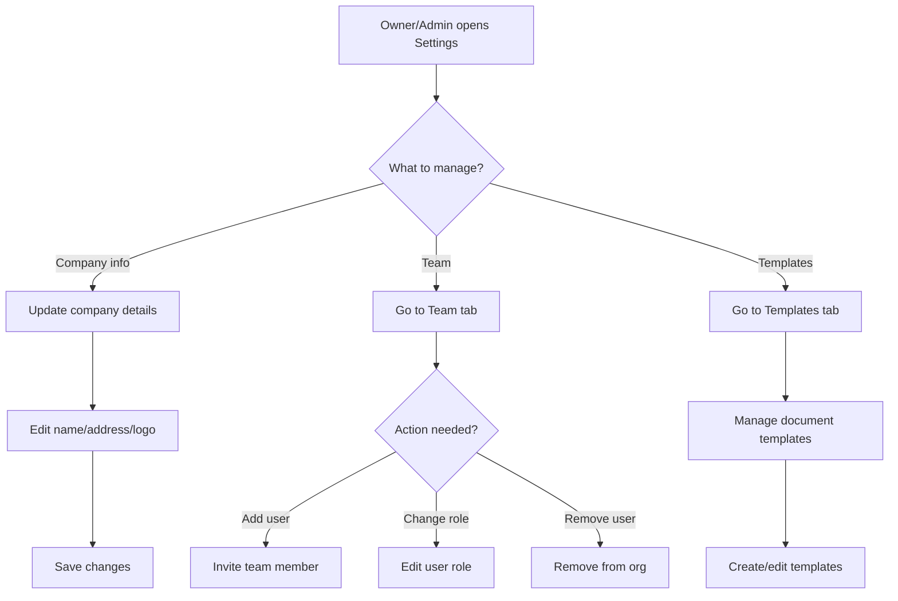

# Company Management

## Purpose
The Company Management module allows administrators and owners to configure organization settings, manage team members, and customize Nexus for their business needs.

## Who Uses This
- **Owners** — Full control over company settings and billing
- **Administrators** — Manage team and operational settings

## Workflow

### Updating Company Settings
1. Navigate to **Settings → Company**
2. Update company information (name, address, logo)
3. Configure default settings
4. Click **Save Changes**

### Managing Team Members
1. Navigate to **Settings → Team**
2. View current team members
3. Edit roles or remove members as needed
4. Invite new members using **Invite Team Member**

### Flowchart

## Key Features
- **Company profile** — Name, address, logo, contact info
- **Team management** — Invite, edit roles, remove members
- **Templates** — Manage document and project templates
- **Default settings** — Configure organization-wide defaults
- **Branding** — Customize appearance with company logo

## Settings Areas
| Area | Purpose |
|------|---------|
| **Company** | Organization profile and branding |
| **Team** | User management and invitations |
| **Templates** | Document and project templates |
| **Integrations** | Third-party service connections |

## Related Modules
- [User Onboarding](./user-onboarding-sop.md)
- [Document Templates](./documents-templates-sop.md)

## Revision History
| Rev | Date | Changes |
|-----|------|--------|
| 1.0 | 2026-02-07 | Initial release |
