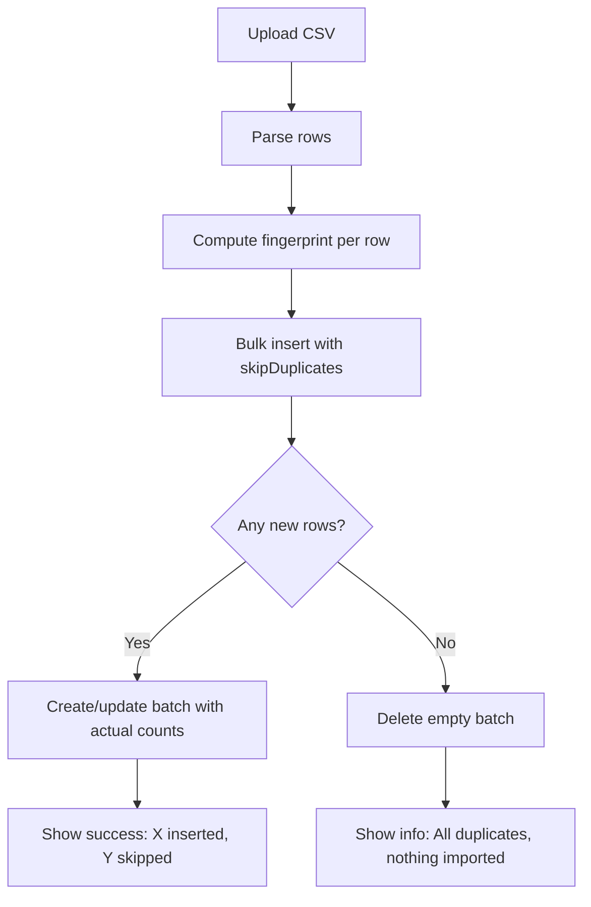

# CSV Import Deduplication

## Purpose
Prevents duplicate transactions when re-importing CSV files from bank/credit card sources (Apple Card, Home Depot, Chase). Each imported row is fingerprinted using a SHA-256 hash of its key fields. If a row with the same fingerprint already exists for the same company and source, it is silently skipped.

## Who Uses This
- **Accounting / Admin** — importing monthly credit card statements
- **Project Managers** — reviewing imported transactions on the Financial page
- **System** — automatic dedup runs transparently during every CSV import

## Workflow

### Step-by-Step Process
1. User navigates to Financial page → CSV Import section
2. User selects source type (Apple Card, HD, Chase) and uploads one or more CSV files
3. System parses each CSV row and computes a fingerprint hash from key fields
4. System attempts bulk insert with `skipDuplicates: true`
5. If some rows already exist (matching `companyId + source + fingerprint`), they are skipped
6. UI shows result: "Imported X new rows, Y duplicates skipped"
7. If ALL rows were duplicates, the batch is auto-deleted (no empty batches left behind)

### Flowchart

## Fingerprint Logic

Each source type hashes different key fields to produce a unique fingerprint:

**Apple Card:**
`SHA-256(date | amount | description | merchant | cardHolder | clearingDate)`

**Home Depot (HD):**
`SHA-256(date | amount | description | sku | qty | purchaser)`

**Chase:**
`SHA-256(date | amount | description | txnType | runningBalance | checkOrSlip)`

Fingerprints are truncated to 40 characters and stored in the `ImportedTransaction.fingerprint` column.

### Why These Fields?
- **Date + Amount + Description** form the base identity of any transaction
- **Source-specific fields** (SKU, merchant, card holder, etc.) disambiguate transactions with identical amounts on the same date
- Fields like `runningBalance` are included for Chase because Chase CSVs can have identical date/amount/description rows distinguished only by balance

## Key Features
- **Transparent** — dedup happens automatically, no user action needed
- **Per-source fingerprinting** — each CSV format hashes the fields most likely to be unique
- **Batch cleanup** — empty batches (100% duplicates) are auto-deleted
- **Feedback** — users see exactly how many rows were new vs skipped
- **Safe re-imports** — users can freely re-upload overlapping date ranges without creating duplicates

## Technical Details

### Database
- Column: `ImportedTransaction.fingerprint` (`String?`, nullable for legacy rows)
- Constraint: `@@unique([companyId, source, fingerprint])`
- Migration: `20260302153248_add_imported_transaction_fingerprint_dedup`

### API
- Service: `apps/api/src/modules/banking/csv-import.service.ts`
  - `computeFingerprint(source, row)` — returns 40-char hex hash
  - `importCsv()` — attaches fingerprints, uses `createMany({ skipDuplicates: true })`

### Frontend
- `apps/web/app/financial/page.tsx`
  - `handleCsvUpload()` displays skip feedback when response includes `skippedCount > 0`

## Edge Cases
- **Legacy rows** (imported before dedup) have `fingerprint: null` — they won't collide with new imports but also can't be deduped retroactively
- **Identical transactions on the same day** — if two genuinely different purchases have identical key fields, only the first will be imported. This is an acceptable trade-off (extremely rare in practice)
- **CSV format changes** — if a bank changes its CSV column layout, the source-specific fingerprint logic in `computeFingerprint()` must be updated

## Related Modules
- [Financial Page — CSV Import UI](../../apps/web/app/financial/page.tsx)
- [CSV Import Service](../../apps/api/src/modules/banking/csv-import.service.ts)
- [Inline Receipt OCR SOP](inline-receipt-ocr-sop.md)

## Revision History
| Rev | Date | Changes |
|-----|------|---------|
| 1.0 | 2026-03-04 | Initial release — fingerprint dedup for Apple Card, HD, Chase |
