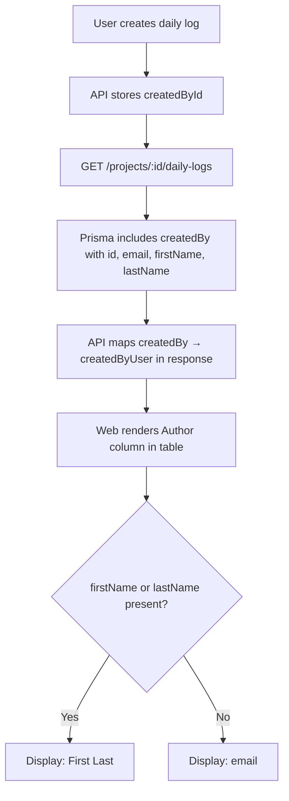

# Daily Log Author Tracking

## Purpose
Every daily log entry now displays the name of the person who created it, directly in the project landing page's daily logs table. This ensures accountability and lets PMs quickly identify who submitted each log without opening individual entries.

## Who Uses This
- Project Managers — review submitted logs by team member
- Superintendents / Foremen — verify their crew's submissions
- Owners / Admins — audit trail visibility across all projects
- Accounting — cross-reference receipt logs with submitters

## How It Works

### Author Column in Daily Logs Table
The daily logs table on the project landing page (`Projects → [Project] → Daily Logs` tab) includes an **Author** column between **Date** and **Type**.

- Displays the author's **first and last name** when available
- Falls back to **email address** if no name is set on the user profile
- Hovering the author cell shows the email as a tooltip
- Column is truncated at 140px with ellipsis for long names

### Data Flow

## Key Details
- **API endpoint**: `GET /projects/:projectId/daily-logs` — now returns `createdByUser.firstName` and `createdByUser.lastName`
- **Visibility**: Author is shown to all users who can see the log (respects existing daily log visibility rules — delayed logs, receipt privacy, client filtering)
- **No additional permissions required** — if you can see the log, you can see who wrote it

## Related Modules
- [Daily Logs — Voice Journal & Summarization]
- [Receipt/Expense OCR Pipeline]
- [Field PETL Scope]

## Revision History
| Rev | Date | Changes |
|-----|------|---------|
| 1.0 | 2026-03-05 | Initial release — Author column added to daily logs table |
