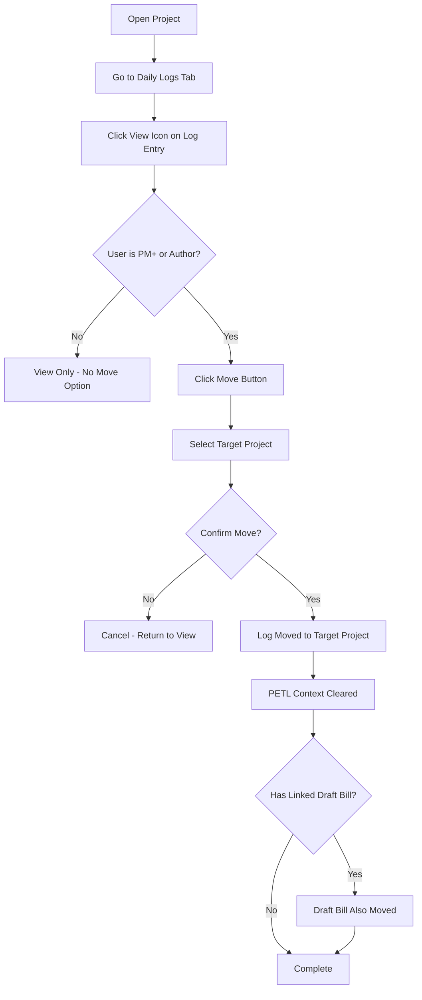

# Daily Log Reassignment

## Purpose
Allows project managers and administrators to move a daily log entry from one project to another when it was created in the wrong project by mistake.

## Who Uses This
- Project Managers (PM+)
- Administrators
- The original author of the daily log

## Workflow

### Step-by-Step Process
1. Navigate to the project containing the daily log you need to move
2. Open the Daily Logs tab
3. Click the view (eye) icon on the daily log entry
4. In the View Daily Log modal, click the "📁 Move" button in the header (visible only to PM+ users or the log author)
5. In the Reassign modal, select the target project from the dropdown
6. Review the warning that PETL context (Building, Unit, Room, SOW Item) will be cleared
7. Click "Move Daily Log" to confirm
8. The daily log is moved to the target project

### Flowchart

## Key Features
- Only PM+ users or the original author can reassign daily logs
- PETL context (Building, Unit, Room, SOW Item) is automatically cleared since these are project-specific
- If the daily log has a linked draft bill (from a receipt), the bill is also moved to the target project
- An audit log entry is created tracking the reassignment
- The move is immediate and updates the UI without page refresh

## Important Notes
- **PETL Context**: Building, Unit, Room, and SOW Item selections will be cleared because these are specific to the original project and may not exist in the target project
- **Draft Bills**: Any uncommitted receipt/bill linked to the daily log will automatically move with it
- **Audit Trail**: All reassignments are logged for accountability

## Related Modules
- [Daily Logs]
- [Bills & Receipts]
- [Project Management]

## Revision History
| Rev | Date | Changes |
|-----|------|---------|
| 1.0 | 2026-02-16 | Initial release |
