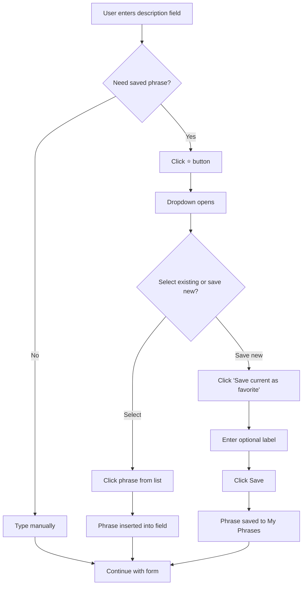

# Description Keeper (Saved Phrases)

## Purpose
The Description Keeper allows users to save frequently-used text phrases and reuse them across the application. This eliminates repetitive typing and ensures consistency in descriptions across invoices, bills, daily logs, and other areas.

## Who Uses This
- **All Users** - Can create and manage personal saved phrases
- **Admins/Owners** - Can promote personal phrases to company-wide and manage company phrases

## Workflow

### Saving a New Phrase

#### Step-by-Step Process
1. Navigate to any field with the Description Keeper enabled (Bill description, Daily Log Subject/Title)
2. Type your desired phrase in the text input
3. Click the ⭐ (star) button to open the saved phrases dropdown
4. Click "⭐ Save current text as favorite" at the bottom of the dropdown
5. Optionally enter a short label to identify the phrase
6. Click "Save" to store the phrase

### Using a Saved Phrase

#### Step-by-Step Process
1. Click the ⭐ button next to the description field
2. Browse the dropdown - your personal phrases appear under "My Phrases"
3. Company-wide phrases appear under "Company Phrases"
4. Click any phrase to insert it into the field
5. The dropdown closes automatically after selection

### Managing Phrases

#### Deleting a Phrase
1. Open the ⭐ dropdown
2. Hover over a phrase in "My Phrases"
3. Click the ✕ button on the right side
4. Confirm deletion when prompted

#### Promoting to Company-Wide (Admins Only)
Admins can promote personal phrases to company-wide via the API:
- `POST /saved-phrases/:id/promote`

### Flowchart

## Key Features

- **Personal Phrases** - Each user has their own private saved phrases
- **Company-Wide Phrases** - Shared phrases visible to all users in the company
- **Categories** - Phrases are categorized (INVOICE, BILL, DAILY_LOG, GENERAL) for context-aware filtering
- **Quick Access** - ⭐ button provides instant access from any enabled field
- **Labels** - Optional short labels help identify phrases at a glance

## Where Description Keeper is Available

| Location | Category | Description |
|----------|----------|-------------|
| Financial Tab → Bills | BILL | Line item description when creating/editing bills |
| Daily Logs Tab → New Log | DAILY_LOG | Subject/Title field for daily log entries |

## Related Modules
- [Bills & Expenses]
- [Daily Logs]
- [Invoicing]

## Tips for Effective Use

1. **Use descriptive labels** - A label like "CMS Discount" is easier to find than scanning full phrases
2. **Keep phrases concise** - Saved phrases work best for frequently-repeated standard text
3. **Category matters** - Phrases saved from a Bill field default to BILL category and appear first when in that context
4. **Company phrases for standards** - Admins should promote commonly-used phrases to company-wide for team consistency

## Revision History

| Rev | Date | Changes |
|-----|------|---------|
| 1.0 | 2026-02-16 | Initial release |
