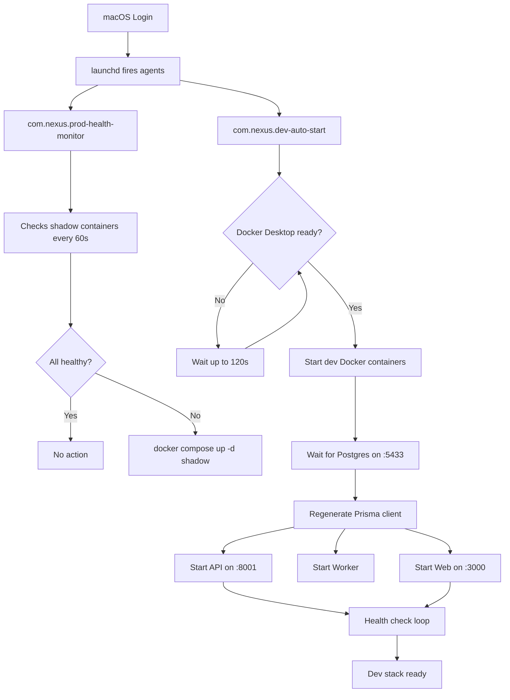

# Zero-Touch Dev Environment Auto-Start

## Purpose
Documents the automated dev stack startup system that brings the full NEXUS development environment online after a macOS reboot — without opening a terminal. Covers the launchd agent, startup script, process architecture, and troubleshooting.

## Who Uses This
- Developers setting up a new NEXUS dev workstation
- System administrators maintaining the Mac Studio dev/prod server
- Anyone onboarding who needs to understand how the dev stack auto-recovers

## Architecture

### Boot Sequence



### What Starts Automatically

**Production stack** (Docker containers with `restart: unless-stopped`):
- `nexus-shadow-api` (:8000)
- `nexus-shadow-web` (:3001)
- `nexus-shadow-worker`
- `nexus-shadow-receipt-poller`
- `nexus-shadow-postgres` (:5435)
- `nexus-shadow-redis` (:6381)
- `nexus-shadow-minio` (:9000/9001)
- `nexus-shadow-tunnel` (Cloudflare)

**Dev infrastructure** (Docker containers):
- `nexus-postgres` (:5433)
- `nexus-postgres-shadow` (:5434)
- `nexus-redis` (:6380)

**Dev host processes** (spawned by dev-auto-start):
- API dev server (nodemon + ts-node, :8001)
- BullMQ import worker (ts-node)
- Next.js web dev server (:3000)

## Key Files

- **Dev auto-start script**: `infra/scripts/dev-auto-start.sh`
- **Dev launchd plist**: `~/Library/LaunchAgents/com.nexus.dev-auto-start.plist`
- **Prod health monitor**: `infra/scripts/prod-health-monitor.sh`
- **Prod launchd plist**: `~/Library/LaunchAgents/com.nexus.prod-health-monitor.plist`
- **Dev start script** (called by auto-start): `scripts/dev-start.sh`
- **Dev auto-start log**: `infra/logs/dev-auto-start.log`
- **Prod monitor log**: `infra/logs/prod-health-monitor.log`

## Critical Implementation Details

### AbandonProcessGroup
The dev-auto-start plist MUST include `AbandonProcessGroup: true`. Without it, launchd kills all child processes (API, worker, web) when the startup script exits — even if they were launched with `nohup`.

### Process Detachment
Each dev process is started with `nohup ... &` followed by `disown` to fully detach from the shell's job table. Both are required:
- `nohup` prevents SIGHUP on terminal close
- `disown` removes from bash job tracking
- `AbandonProcessGroup` prevents launchd cleanup

### nvm PATH
Node.js is managed by nvm, which installs to a user-specific path not visible to launchd. The script explicitly prepends the nvm node path:
```
export PATH="/Users/pg/.nvm/versions/node/v24.12.0/bin:$PATH"
```
This path must be updated when the Node.js version changes.

## Setup on a New Machine

### 1. Copy launchd plists
```bash
# Dev auto-start
cp infra/launchd/com.nexus.dev-auto-start.plist ~/Library/LaunchAgents/

# Prod health monitor
cp infra/launchd/com.nexus.prod-health-monitor.plist ~/Library/LaunchAgents/
```

### 2. Update paths
Edit both plists to reflect the correct:
- Repository path (if not `/Users/pg/nexus-enterprise`)
- nvm Node.js version path
- HOME directory

### 3. Load agents
```bash
launchctl load ~/Library/LaunchAgents/com.nexus.dev-auto-start.plist
launchctl load ~/Library/LaunchAgents/com.nexus.prod-health-monitor.plist
```

### 4. Verify
```bash
launchctl list | grep nexus
```

## Troubleshooting

### Dev processes not running after reboot
1. Check the log: `cat infra/logs/dev-auto-start.log`
2. Verify the agent ran: `launchctl list | grep dev-auto-start`
   - Exit code `0` = ran successfully
   - Exit code non-zero = script error
   - No entry = plist not loaded
3. Common causes:
   - Docker Desktop not starting (check `docker info`)
   - Node not on PATH (nvm version changed)
   - Missing `AbandonProcessGroup` in plist
   - Dev Postgres container name conflict (stale container)

### Container name conflicts
If the log shows "container name is already in use", a stale container exists:
```bash
docker compose -f infra/docker/docker-compose.yml down
docker compose -f infra/docker/docker-compose.yml up -d
```

### Manually trigger the auto-start
```bash
bash infra/scripts/dev-auto-start.sh
```

### Check all process health
```bash
# Dev
curl -s http://localhost:8001/health   # API
curl -s http://localhost:3000          # Web
pgrep -f "ts-node.*worker"            # Worker

# Prod
curl -s https://staging-api.nfsgrp.com/health
curl -s https://staging-ncc.nfsgrp.com
docker ps --filter name=nexus-shadow
```

### Reload agents after changes
```bash
launchctl unload ~/Library/LaunchAgents/com.nexus.dev-auto-start.plist
launchctl load ~/Library/LaunchAgents/com.nexus.dev-auto-start.plist
```

## Related Modules
- [NexEXTRACT Adaptive Frame Extraction SOP](nexextract-adaptive-frame-extraction-sop.md)
- [Vision AI Provider Migration SOP](vision-ai-provider-migration-sop.md)

## Revision History

| Rev | Date | Changes |
|-----|------|---------|
| 1.0 | 2026-03-05 | Initial release — launchd auto-start for dev stack, AbandonProcessGroup fix, troubleshooting guide |
