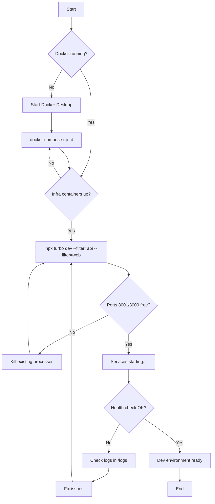

# Dev Environment Startup

## Purpose
Standard procedure for starting and managing the Nexus Enterprise development environment. Ensures consistent port usage and prevents conflicts between dev and production services.

## Who Uses This
- Developers working on Nexus Enterprise
- DevOps engineers debugging local environments
- New team members during onboarding

## Port Architecture

| Service | Dev Port | Prod Port | Notes |
|---------|----------|-----------|-------|
| API | 8001 | 8000 | NestJS + Fastify |
| Web | 3000 | Vercel | Next.js 14 |
| Postgres | 5433 | Cloud SQL | Docker local |
| Redis | 6380 | Cloud Redis | Docker local |

## Workflow

### Step-by-Step Process

1. **Ensure Docker is running**
   - Postgres and Redis must be up before starting the API

2. **Start infrastructure (if not running)**
   ```bash
   docker compose -f infra/docker/docker-compose.yml up -d
   ```

3. **Start the dev stack**
   ```bash
   # Preferred: API + Web only
   npx turbo dev --filter=api --filter=web
   
   # Alternative: All apps
   npm run dev
   ```

4. **Verify services are healthy**
   ```bash
   # Check ports
   lsof -i :8001,3000 -P -n
   
   # Health check
   curl http://localhost:8001/health
   ```

5. **Access the app**
   - Web: http://localhost:3000
   - API: http://localhost:8001

### Flowchart



## Key Commands

### Starting Services
```bash
# Full dev stack (API + Web)
npm run dev

# API only
npm run dev:api

# With Cloud SQL (requires DEV_DB_PASSWORD)
./scripts/dev-start-cloud.sh
```

### Stopping Services
```bash
# Kill specific ports
lsof -ti :8001 :3000 | xargs kill -9

# Stop Docker infra
docker compose -f infra/docker/docker-compose.yml down
```

### Troubleshooting
```bash
# Check what's using ports
lsof -i :8000,8001,3000 -P -n

# View API logs
tail -f logs/api-dev.log

# View web logs  
tail -f apps/web/.next/trace
```

## Environment Files

| File | Purpose |
|------|---------|
| `.env` | Root env with `API_PORT=8001` |
| `apps/web/.env.local` | Web app API URL (localhost:8001) |
| `apps/api/.env` | API-specific overrides (optional) |

## Common Issues

### Port Already in Use
```bash
# Find and kill the process
lsof -ti :8001 | xargs kill -9
```

### API Can't Connect to Database
1. Check Docker: `docker ps`
2. Verify Postgres is on port 5433
3. Check `DATABASE_URL` in `.env`

### Web Shows API Errors
1. Verify API is running: `curl localhost:8001/health`
2. Check `apps/web/.env.local` points to `localhost:8001`

## Related Modules
- Infrastructure Setup
- Database Migrations
- Production Deployment

## Revision History

| Rev | Date | Changes |
|-----|------|---------|
| 1.0 | 2026-02-17 | Initial release - port 8001 for dev, 8000 for prod |
