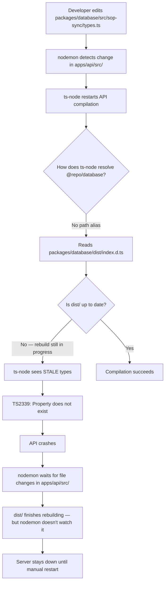

# Dev Server Stability — Monorepo Type Resolution

## Purpose
Documents the root cause and permanent fix for recurring API dev server crashes caused by a race condition between `packages/database` dist rebuilds and `ts-node` type resolution during hot-reload.

## Who Uses This
- Developers working on shared packages (`packages/database`, `packages/types`)
- Anyone debugging "dev server down" issues
- Infrastructure maintainers updating tsconfig or build tooling

## Problem Statement

The API dev server (`nodemon` + `ts-node` on port 8001) would intermittently crash with TypeScript compilation errors like:

```
TSError: ⨯ Unable to compile TypeScript:
src/modules/documents/sop-sync.service.ts(492,52): error TS2339: Property 'cam_id' does not exist on type 'SopFrontmatter'.
```

These errors appeared even though the source types in `packages/database/src/` were correct. The server would enter a crash loop and never recover without manual intervention.

## Root Cause

**Race condition between shared package rebuild and API hot-reload.**

### How TypeScript resolves `@repo/database`

There are two resolution paths:

1. **tsconfig `paths` alias** (preferred) — resolves directly to source: `packages/database/src/index.ts`
2. **Node module resolution** (fallback) — follows `node_modules/@repo/database` symlink → reads `package.json` → `"types": "dist/index.d.ts"`

**Before the fix**, there was no `@repo/database` entry in the root `tsconfig.json` paths. TypeScript fell back to path #2, reading compiled `.d.ts` files from `dist/`.

### The crash sequence



### Why it didn't self-heal

- `nodemon --watch src --ext ts` only watches `apps/api/src/`
- The `packages/database/dist/` rebuild completed *after* the crash
- No file change in `apps/api/src/` = nodemon never retried

## Fix Applied

### Permanent: tsconfig path alias (2026-03-05)

Added `@repo/database` path aliases to `tsconfig.json` (repo root):

```json
"paths": {
  "@repo/database": ["packages/database/src/index.ts"],
  "@repo/database/*": ["packages/database/src/*"],
  ...
}
```

**Effect:**
- **Dev** (`ts-node`): resolves `@repo/database` → source `.ts` files directly. No dependency on `dist/`. Type changes are visible instantly.
- **Prod** (`tsc` build → `node dist/main.js`): resolves via compiled `dist/` as before. Path aliases are a compile-time concern only.

### Immediate recovery (when stuck)

If the server is already in crash-wait state:

```bash
# Option 1: Touch a file to trigger nodemon retry
touch apps/api/src/main.ts

# Option 2: Full restart
npm run dev:api
```

## Diagnostic Procedure

When the dev API is down, follow this checklist:

### 1. Confirm the server is down
```bash
lsof -i:8001 | head -3   # Empty = down
```

### 2. Check the crash log
```bash
tail -50 logs/api-dev.log
```

Look for `TSError` or `nodemon app crashed`.

### 3. Verify types are correct
```bash
cd apps/api && npx tsc --noEmit 2>&1 | grep "error TS"
```

If `tsc` passes but `ts-node` crashed → stale resolution issue (the path alias fix prevents this).

### 4. Check shared package dist freshness
```bash
# Compare source vs dist timestamps
stat -f "%Sm" packages/database/src/sop-sync/types.ts
stat -f "%Sm" packages/database/dist/sop-sync/types.d.ts
```

If source is newer than dist → dist is stale. Rebuild: `npm -w @repo/database run build`

### 5. Recover
```bash
touch apps/api/src/main.ts   # Wake nodemon
# or
npm run dev:api              # Full restart from repo root
```

## Architecture: Dev vs Prod Resolution

| Concern | Dev (ts-node) | Prod (compiled) |
|---------|--------------|-----------------|
| Resolves `@repo/database` via | tsconfig `paths` → source `.ts` | `package.json` → `dist/index.js` |
| Depends on `dist/` build | No | Yes |
| Type changes visible | Instantly | After `npm run build` |
| Crash risk from stale dist | Eliminated | N/A (build is atomic) |

## Prevention Rules

1. **Every shared workspace package** (`packages/*`) that is imported by `apps/api` SHOULD have a tsconfig `paths` alias pointing to its source.
2. **Never remove** the `@repo/database` path alias from root `tsconfig.json`.
3. When adding a **new shared package**, add both bare and wildcard path entries:
   ```json
   "@repo/new-pkg": ["packages/new-pkg/src/index.ts"],
   "@repo/new-pkg/*": ["packages/new-pkg/src/*"]
   ```
4. The `dev-start.sh` script regenerates Prisma client on startup — if crashes persist after Prisma schema changes, ensure `prisma generate` completed before restarting the API.

## Related Modules
- [Dev Server Scripts](/scripts/dev-start.sh)
- [Dev Nuke & Restart](/scripts/dev-nuke-restart.sh)
- [Production Health Monitor](/infra/scripts/prod-health-monitor.sh)
- [SOP Sync System](ncc-sop-sync-system-sop.md)

## Revision History
| Rev | Date | Changes |
|-----|------|---------|
| 1.0 | 2026-03-05 | Initial release — documents race condition root cause and tsconfig path alias fix |
