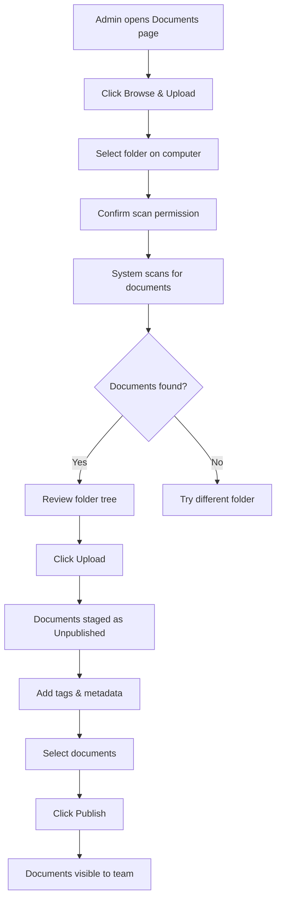

# Document Import System

## Purpose
The Document Import System allows administrators to scan folders, upload documents, and publish them to the organization's electronic document library. It supports safety manuals, BKMs (Best Known Methods), SOPs, and general company documents.

## Who Uses This
- **Administrators** — Upload, organize, and publish documents
- **Owners** — Full access to all document management features
- **Members** — View published documents only

## Workflow

### Step-by-Step Process
1. Navigate to **Admin → Documents**
2. Click **Browse & Upload** to select a folder from your computer
3. Confirm the scan to find supported document types
4. Review the scanned files in the folder tree view
5. Click **Upload** to stage documents in Nexus
6. Tag and categorize documents as needed
7. Select documents and click **Publish** to make them available

### Flowchart

## Key Features
- **Folder scanning** — Recursively scans folders for supported file types
- **Bulk upload** — Upload multiple documents at once
- **Tagging system** — Organize documents with custom tags
- **Categories** — Group documents by safety topic, department, etc.
- **Quick Look** — Preview documents before publishing
- **Bulk actions** — Archive, restore, or publish multiple documents

## Supported File Types
- PDF, DOC, DOCX, XLS, XLSX, PPT, PPTX
- TXT, MD, CSV, JSON, XML, YAML
- JPG, PNG, GIF, BMP, TIFF, WEBP, SVG

## Related Modules
- [Documents & Templates](./documents-templates-sop.md)
- [User Roles & Permissions](./user-roles-sop.md)

## Revision History
| Rev | Date | Changes |
|-----|------|--------|
| 1.0 | 2026-02-07 | Initial release |
