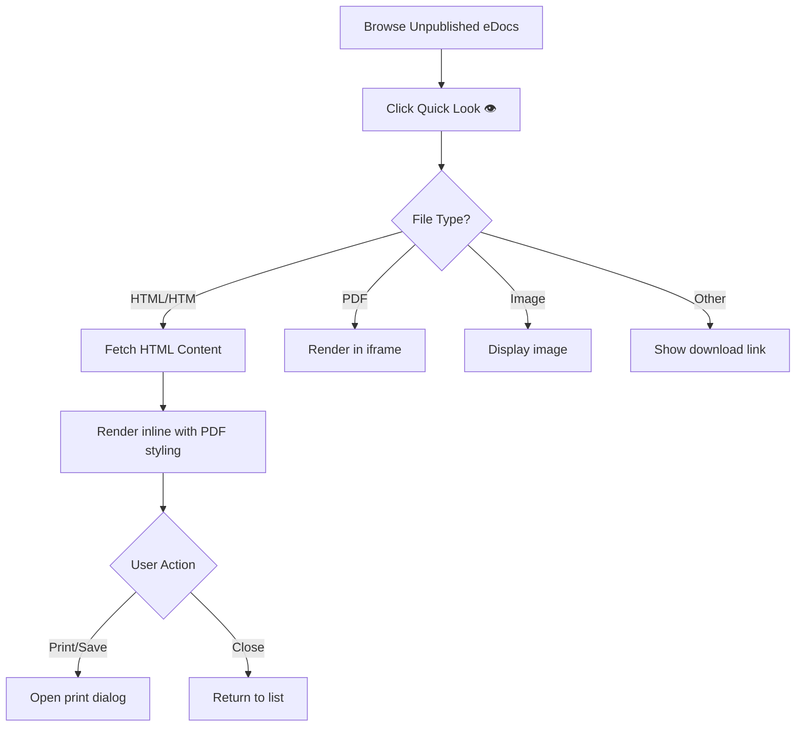

# eDoc Viewer

## Purpose
The eDoc Viewer allows administrators to preview HTML documents directly within the NEXUS application instead of downloading them. Documents are rendered in a PDF-like format with print/save capabilities.

## Who Uses This
- Administrators managing unpublished documents
- Document reviewers previewing content before publication

## Workflow

### Viewing an HTML Document
1. Navigate to **System → Documents** (Admin area)
2. Locate the document in the Unpublished eDocs list
3. Click the **👁️ Quick Look** button on the document row
4. The document renders inline in a modal with PDF-like styling

### Printing or Saving as PDF
1. While viewing a document, click **🖨️ Print / Save PDF** in the header
2. A new browser window opens with print-optimized formatting
3. Use **Save as PDF** in the print dialog to export, or print directly

### Flowchart

## Key Features
- Inline rendering of HTML documents (no download required)
- PDF-like presentation with professional typography
- Print/Save PDF functionality via browser print dialog
- Fallback to raw file content if conversion unavailable

## Related Modules
- Document Import
- Policies & Procedures (PnP)
- Safety Manual

## Revision History
| Rev | Date | Changes |
|-----|------|---------|
| 1.0 | 2026-02-14 | Initial release - HTML inline rendering |
