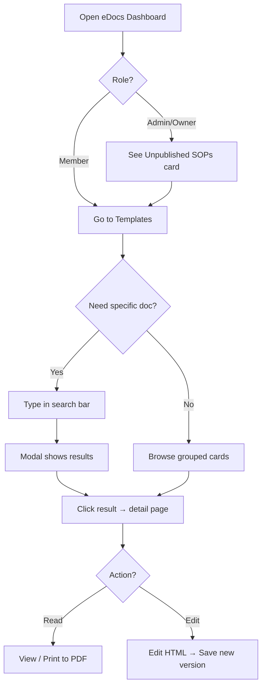

# eDocs Template Search & Management

## Purpose
Provides guidance for browsing, searching, creating, and managing company document templates in the NCC eDocs system. Templates are versioned, typed documents (Invoice, Quote, SOP, Generic) that can be printed to PDF.

## Who Uses This
- **All authenticated users** — browse and view templates
- **Admin / Owner** — create new templates, publish/unpublish, manage versions

## Workflow

### Browsing Templates
1. Navigate to **Documents → Templates** from the eDocs dashboard.
2. Templates are displayed in **grouped cards** organized by type: Invoice, Quote, SOP, Generic.
3. Each card section shows a table with template name, status badge (Published / Unpublished), current version, and last-updated date.
4. Click **Open** on any row to view the full template with reader/editor and print capability.

### Searching Templates
1. Use the **search bar** at the top of the Templates page.
2. Type any keyword — the search matches against template name, code, and description.
3. A **modal overlay** appears with matching results as you type.
4. Each result shows the template name, type badge, status badge, and version count.
5. Click a result to navigate directly to that template's detail page.
6. Press **Escape** or click outside the modal to dismiss.

### Viewing Unpublished SOPs
1. From the eDocs dashboard, Admins see an **Unpublished SOPs** stat card showing the count of draft SOPs.
2. Click the card to jump to Templates filtered to unpublished SOPs only.
3. A blue banner confirms the active filter; click **Show all** to clear it.

### Creating a New Template (Admin/Owner Only)
1. Click **New template** on the Templates page.
2. Select a type (Invoice, Quote, SOP, Generic).
3. Enter a code, label, and optional description.
4. Paste or write the initial HTML content for version 1.
5. Click **Create**. The template appears in the appropriate type group.

### Flowchart

## Key Features
- **Grouped card layout** — templates organized by type as pre-filters
- **Soft search with modal** — instant fuzzy search across all templates regardless of type
- **Status badges** — Published (green) and Unpublished (yellow) visibility at a glance
- **Version tracking** — current version number displayed; multi-version templates show revision count
- **Deep-link filtering** — dashboard card links directly to unpublished SOPs view
- **Role-based actions** — only Admin/Owner can create or edit; all members can browse and read

## Dual-Sync Infrastructure
SOPs and CAMs are synced to both dev and prod databases using:
- `npm run docs:sync:both` — syncs all SOPs + CAMs to both environments
- `npm run docs:sync:dev` — dev only
- `npm run docs:sync` — prod only

## Related Modules
- [eDocs Dashboard](/documents)
- [Template Detail / Reader](/documents/templates/[id])
- [Document Sync Scripts](/scripts/docs-sync-both.sh)

## Revision History
| Rev | Date | Changes |
|-----|------|---------|
| 1.0 | 2026-03-04 | Initial release — grouped cards, search modal, unpublished SOPs card, dual-sync |
