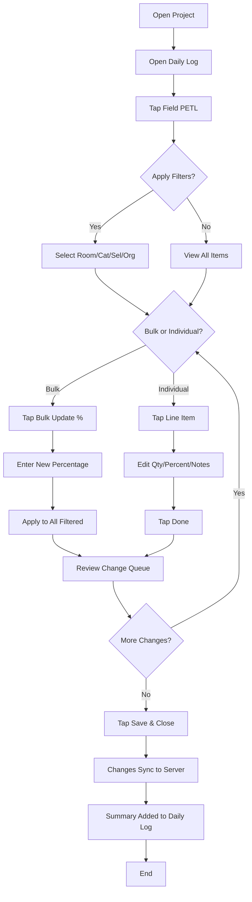

# Field PETL Mobile App

## Purpose
The Field PETL (Project Estimate Task List) module in the Nexus mobile app allows field personnel to update work completion percentages directly from job sites. Changes sync in real-time to the NCC web application and are automatically documented in daily logs.

## Who Uses This
- Field Supervisors
- Project Managers
- Foremen
- Any field personnel tracking work progress

## Workflow

### Accessing Field PETL
1. Open the Nexus mobile app
2. Navigate to **Projects** from the bottom tab bar
3. Select your project from the list
4. Tap **Daily Logs** to view existing logs or create a new one
5. From the daily log screen, tap **Field PETL** to open the PETL editor

### Filtering Line Items
The Field PETL screen provides four filter options to narrow down line items:

- **Room** – Filter by room/location (e.g., "Master Bedroom", "Kitchen")
- **Category** – Filter by work category code (e.g., "FLR", "DRY")
- **Selection** – Filter by selection code (e.g., "R&R", "RPR")
- **Org** – Filter by organization group

To apply filters:
1. Tap any filter button to open the selection modal
2. Use the search bar at the top to quickly find options
3. Select one or more options (multi-select supported)
4. Tap **Done** to apply
5. Active filters show a count badge (e.g., "Room (3)")

Filters combine with AND logic — only items matching ALL active filters are displayed.

### Bulk Updating Completion Percentage
When filters are active, you can update all matching items at once:

1. Apply filters to select the target line items
2. The header shows the count of matching items
3. Tap **Bulk Update %**
4. Enter the new completion percentage (0-100)
5. Tap **Apply to N items**

All filtered items are updated to the specified percentage.

### Individual Line Item Edits
To update a single line item:

1. Tap on any line item row to open the edit modal
2. **Quantity Verification:**
   - Toggle "Qty is correct" if the original quantity matches reality
   - If incorrect, enter the actual quantity observed in the field
3. **Completion Percentage:**
   - Adjust the percentage slider or enter a value directly
4. **Notes:**
   - Add any relevant notes about the work status
5. Tap **Done** to save changes

### Session Change Tracking
The app tracks all changes made during your Field PETL session:

- A change queue appears below the filters showing pending updates
- Tap to expand/collapse the list of changes
- Changes are categorized as "Bulk" or "Edit" with details

### Saving and Syncing
1. When finished, tap **Save & Close** in the header
2. Changes sync automatically to the server
3. A summary of your PETL updates is added to the daily log notes
4. The daily log title is suggested based on your changes (if not already set)

### Flowchart

## Key Features
- **Real-time sync** – Changes push to the server immediately
- **Offline support** – Changes queue locally if offline and sync when connected
- **Multi-select filters** – Combine filters to target specific work items
- **Bulk updates** – Update multiple items at once for efficiency
- **Audit trail** – All changes are logged with timestamps and user attribution
- **Daily log integration** – PETL updates automatically documented in notes

## Tips for Field Use
- Use filters to focus on one room or category at a time
- Bulk update is fastest for completing entire areas (e.g., "All Kitchen items → 100%")
- Add notes for any items with issues or discrepancies
- Review the change queue before saving to verify your updates
- The app works offline — changes will sync when you regain connectivity

## Related Modules
- [Daily Logs](./daily-logs.md)
- [Projects](./projects.md)
- [PETL Web (NCC)](./petl-ncc.md)

## Revision History
| Rev | Date | Changes |
|-----|------|---------|
| 1.0 | 2026-02-11 | Initial release |
