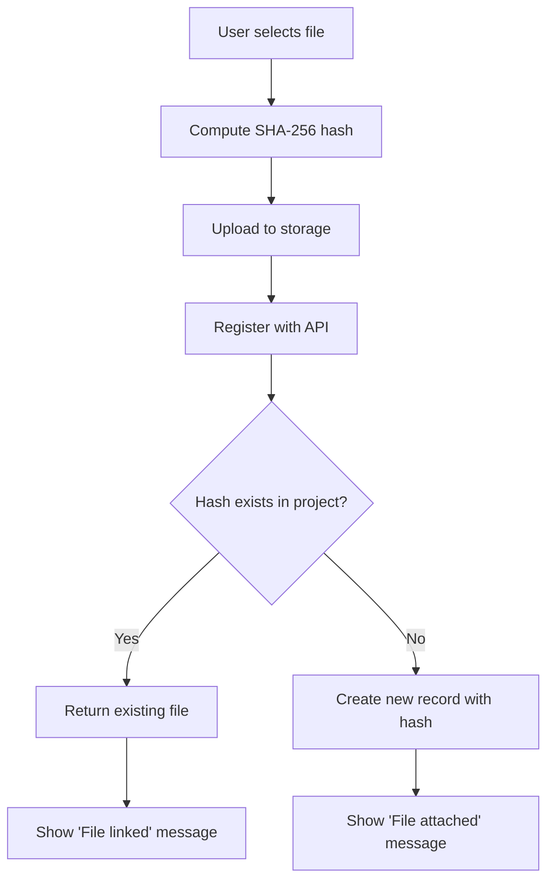

# File Deduplication & Project Link

## Purpose
This module prevents duplicate file storage within projects by detecting identical files using SHA-256 content hashing. When a user uploads a file that already exists in the project, the system automatically links to the existing file instead of creating a duplicate, saving storage space and reducing redundancy.

## Who Uses This
- Project Managers uploading invoice attachments
- Field staff capturing receipt photos
- Accounting staff attaching documentation to bills
- Any user attaching files to project records

## Workflow

### Step-by-Step Process
1. User selects a file to upload (via Take Photo, Upload File, or drag-and-drop)
2. System computes SHA-256 hash of file content in the browser
3. File is uploaded to cloud storage
4. Registration request sent to API with content hash
5. API checks for existing file with matching hash in the same project
6. If match found: returns existing file record with `isDuplicate: true` flag
7. If no match: creates new ProjectFile record with the hash stored
8. User sees confirmation message indicating if file was linked vs newly uploaded

### Flowchart

## Key Features
- **Content-based deduplication**: Uses SHA-256 hash of file contents, not just filename
- **Project-scoped**: Deduplication only occurs within the same project (security boundary)
- **Transparent to users**: UI shows whether file was newly uploaded or linked to existing
- **No cross-tenant linking**: Files are never shared between companies/tenants
- **Audit trail**: Deduplication events logged with `PROJECT_FILE_DEDUP_LINKED` event type

## Attachment Sources
The invoice attachment menu provides three options:
- **📷 Take Photo**: Opens camera for mobile capture
- **📄 Upload File**: Standard file picker for documents, images, PDFs
- **🔗 Project Link**: Browse and select from existing project files (no upload needed)

## Related Modules
- Invoice Management
- Bill Attachments
- Daily Log / Receipt Workflow
- PETL Reconciliation Attachments

## Technical Notes
- Hash computation uses Web Crypto API (SHA-256)
- Hash stored in `ProjectFile.contentHash` field
- Index on `(companyId, projectId, contentHash)` for fast lookups
- Orphaned storage files (from duplicate detection) may accumulate; future cleanup job recommended

## Revision History
| Rev | Date | Changes |
|-----|------|--------|
| 1.0 | 2026-02-14 | Initial release |
