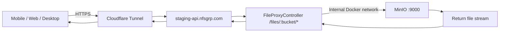

# File Proxy & Attachment Access

## Purpose
Defines how all stored files (daily log attachments, receipts, documents, video frames) are served to clients (mobile app, web app, NexBRIDGE desktop) through the API file proxy. This ensures files stored in MinIO are reachable from any device via the Cloudflare Tunnel, without requiring direct MinIO access.

## Who Uses This
- **Mobile app users** — viewing daily log photos, receipts, PDFs
- **Web app users** — accessing project files, documents, plan sheets
- **NexBRIDGE Connect** — uploading/downloading video assessment frames
- **API developers** — any service that stores or retrieves files from MinIO

## Architecture

### The Problem
MinIO runs inside Docker on the Mac Studio. Its internal hostname (`minio:9000`) is unreachable from external clients. Even `localhost:9000` only works from the Mac Studio itself — not from phones, tablets, or remote browsers.

### The Solution
All file access routes through the API's `FileProxyController` at `/files/:bucket/*`, which is reachable via the Cloudflare Tunnel at `https://staging-api.nfsgrp.com/files/...`.

### Flow

### URL Format
- **Stored in DB**: `gs://nexus-uploads/daily-logs/abc123.jpg`
- **Served to clients**: `https://staging-api.nfsgrp.com/files/nexus-uploads/daily-logs/abc123.jpg`
- **Conversion**: `MINIO_PUBLIC_URL` env var (`https://staging-api.nfsgrp.com/files`) replaces the `gs://` prefix

## Key Configuration

### Environment Variables
- `MINIO_PUBLIC_URL` — Public base URL for file proxy. Set to `https://staging-api.nfsgrp.com/files` in both `.env.shadow` and `docker-compose.shadow.yml` API environment block.
- `MINIO_ENDPOINT` — Internal Docker hostname (`minio`). Used by the API to reach MinIO directly.
- `MINIO_EXTERNAL_ENDPOINT` — Host-reachable endpoint (`localhost`). Used for presigned URLs (web app on same machine).

### Files
- `apps/api/src/modules/uploads/file-proxy.controller.ts` — Public streaming proxy (`GET /files/:bucket/*`)
- `apps/api/src/infra/storage/minio-storage.service.ts` — `getPublicUrlFromUri()` builds proxy URLs
- `apps/api/src/modules/daily-log/daily-log.service.ts` — `signFileUrl()` converts `gs://` URIs to proxy URLs
- `infra/docker/docker-compose.shadow.yml` — `MINIO_PUBLIC_URL` override in API environment

## Workflow

### Step-by-Step: How a Mobile User Views an Attachment
1. User opens a daily log in the mobile app
2. App calls `GET /daily-logs/:id` (authenticated)
3. API fetches log with attachments from Postgres
4. `signAttachmentUrls()` converts each `gs://nexus-uploads/...` fileUrl to `https://staging-api.nfsgrp.com/files/nexus-uploads/...`
5. App receives proxy URLs, loads images via `<Image source={{ uri }}>`
6. When user taps an attachment, `Linking.openURL(proxyUrl)` opens it in the system browser
7. Browser requests the proxy URL → Cloudflare Tunnel → API → MinIO → file streams back

### Step-by-Step: How a File Gets Uploaded
1. Mobile sends file via `POST /daily-logs/:logId/attachments` (multipart)
2. API receives the buffer, calls `gcs.uploadBuffer()` which stores in MinIO
3. MinIO returns `gs://nexus-uploads/daily-logs/abc123.jpg`
4. API saves this URI as `fileUrl` in `DailyLogAttachment` table
5. On read, `signFileUrl()` converts `gs://` → proxy URL

## Legacy Domain Rewrite
Some existing DB records contain URLs with the defunct domain `api-staging.ncc-nexus-contractor-connect.com` (from a prior MINIO_PUBLIC_URL misconfiguration). The `signFileUrl()` method automatically rewrites these to `staging-api.nfsgrp.com` at read time. No DB migration needed.

## Troubleshooting

### Attachments not loading on mobile
1. Check that `MINIO_PUBLIC_URL` is set correctly: `docker exec nexus-shadow-api sh -c 'echo $MINIO_PUBLIC_URL'`
2. Verify file proxy works: `curl -sI https://staging-api.nfsgrp.com/files/nexus-uploads/<any-known-key>`
3. Check if the fileUrl in DB is a `gs://` URI (good) or an old `http://localhost:9000` URL (bad — needs rewrite)

### App crashes when opening attachment
1. The mobile app wraps `Linking.openURL` in try-catch (added 2026-03-11)
2. If crash persists, check if the URL contains `localhost` or `minio:9000` — indicates `signFileUrl()` isn't rewriting
3. Verify `MINIO_PUBLIC_URL` env var is set in the running API container

### File proxy returns 404
1. Verify MinIO container is healthy: `docker ps --filter name=nexus-shadow-minio`
2. Check the bucket exists: `mc ls nexus-minio/nexus-uploads/`
3. Verify the file key matches what's in the DB

## Security Notes
- The file proxy (`FileProxyController`) is `@Public()` — no authentication required
- File keys are opaque CUIDs + timestamps — not guessable
- Cache headers: `public, max-age=31536000, immutable` (files are content-addressed)
- No directory listing — only exact file paths are served
- CORS: `Access-Control-Allow-Origin: *` for cross-origin image loading

## Related Modules
- [Daily Log Attachments] — Primary consumer of the file proxy
- [Video Assessment] — Frame uploads go through direct API upload (not presigned URLs)
- [Document Import] — Scanned documents stored in MinIO, served via proxy
- [Receipt OCR] — Receipt images accessed via proxy for AI processing

## Revision History
| Rev | Date | Changes |
|-----|------|---------|
| 1.0 | 2026-03-11 | Initial release — file proxy architecture, legacy domain rewrite, mobile crash fix |
