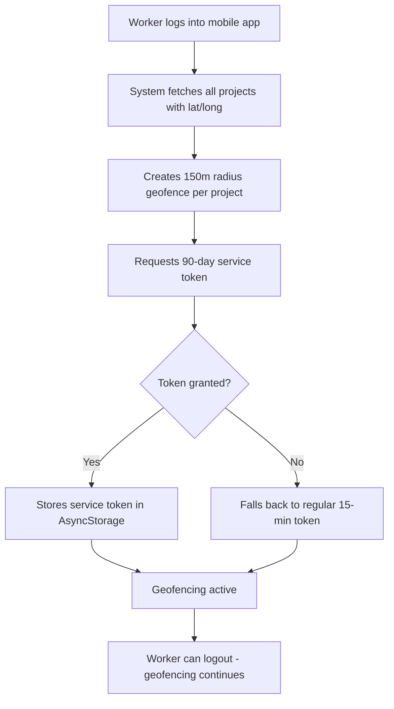
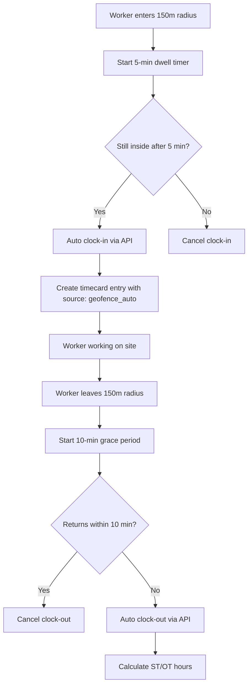

# Automatic Geofencing Time Tracking

## Purpose
The Automatic Geofencing Time Tracking system eliminates manual clock-in/clock-out friction by automatically tracking workers when they arrive at and leave job sites. The system uses GPS geofencing to detect when workers are within 150 meters of a project location and automatically creates timecard entries.

## Who Uses This
- **Field Workers:** Automatically clocked in/out without manual intervention
- **Project Managers:** Can rely on accurate time tracking without reminders
- **HR/Payroll:** Receive accurate timecard data with geofence audit trail
- **Admins:** Can view geofence-tagged entries and troubleshoot issues

## How It Works

### System Architecture
1. **Silent Background Tracking:** App runs geofencing service even when closed or logged out
2. **90-Day Service Tokens:** Long-lived auth tokens allow tracking for months without re-login
3. **Smart Clock Logic:** 5-minute dwell time before clock-in, 10-minute grace period before clock-out
4. **Persistent Across Restarts:** Geofencing survives app closure, logout, and phone restarts

### Geofence Setup Process

### Automatic Clock-In/Out Flow

## Key Features

### 1. Dwell Time Logic
- **Purpose:** Prevents false positives when driving past job sites
- **Implementation:** Worker must remain within 150m for 5 minutes before clock-in
- **User experience:** No accidental clock-ins

### 2. Grace Period
- **Purpose:** Allows short trips away from site without clocking out
- **Implementation:** 10-minute grace period after leaving geofence before auto clock-out
- **User experience:** Workers can run to truck, store, etc. without breaking their timecard

### 3. Work Hours Enforcement
- **Default hours:** 6:00 AM - 8:00 PM
- **Behavior:** Geofencing disabled outside work hours to save battery
- **Override:** Can be configured per project if needed

### 4. Silent Operation
- **No notifications:** Workers are not notified when clocked in/out
- **Rationale:** Reduces notification fatigue, makes tracking seamless
- **Audit trail:** All entries tagged with `source: "geofence_auto"` for verification

## Workflow

### Step-by-Step Process

#### Initial Setup (One-Time Per Worker)
1. Worker installs Nexus mobile app (v2.8.1 or later)
2. Worker logs in with credentials
3. App requests location permissions:
   - iOS: "Allow While Using App" → "Change to Always Allow" in Settings
   - Android: "Allow all the time" when prompted
4. System automatically:
   - Fetches all projects with GPS coordinates
   - Creates geofences for each project (150m radius)
   - Requests 90-day service token from API
   - Stores config in AsyncStorage for persistence

#### Daily Operation (Fully Automatic)
1. Worker arrives at job site (within 150m of project coordinates)
2. System detects geofence entry, starts 5-minute dwell timer
3. After 5 minutes inside geofence:
   - API called: `POST /timecard/me/clock-in` with location data
   - Worker record auto-created if missing
   - DailyTimecard and DailyTimeEntry created
   - Entry tagged with `source: "geofence_auto"`
4. Worker performs work on site (geofencing monitors in background)
5. Worker leaves job site (exits 150m radius)
6. System starts 10-minute grace period
7. If worker doesn't return within 10 minutes:
   - API called: `POST /timecard/me/clock-out`
   - ST/OT hours calculated (first 8 hours ST, rest OT)
   - Entry closed with end timestamp

#### Phone Restart Recovery (Automatic)
1. Phone reboots
2. Nexus app launches (iOS/Android auto-launch background tasks)
3. App reads saved geofence config from AsyncStorage
4. Geofencing restored with same settings
5. Worker doesn't need to take any action

### Admin/PM Verification
1. Log into Nexus web app
2. Navigate to **Time & Payroll → Timecards**
3. Filter by worker and date range
4. Look for entries with `source: "geofence_auto"` tag
5. Verify clock-in/out times match expected job site arrival/departure
6. Manual corrections can still be made if needed

## Troubleshooting

### Worker Not Being Clocked In Automatically

**Check 1: Location Permissions**
- iOS: Settings → Nexus → Location → "Always"
- Android: Settings → Apps → Nexus → Permissions → Location → "Allow all the time"

**Check 2: Geofences Configured**
- Worker must log in at least once for geofences to be created
- Projects must have valid lat/long coordinates in system

**Check 3: Dwell Time**
- Worker must stay within 150m for 5 full minutes
- If worker enters/exits repeatedly, dwell timer resets

**Check 4: Work Hours**
- Geofencing only active 6am-8pm by default
- Early arrivals or late work may not trigger

**Check 5: Background App Refresh (iOS)**
- Settings → General → Background App Refresh → Nexus → On

**Check 6: Battery Saver Mode**
- Android battery saver may disable background location
- Ask worker to whitelist Nexus in battery settings

### Worker Clocked In But Not at Job Site (False Positive)

**Cause:** Project coordinates may be inaccurate or too close to worker's home/commute route

**Resolution:**
1. Verify project GPS coordinates in Nexus web app
2. Adjust coordinates if needed (move away from roads/residential areas)
3. Update geofences (worker logs out and back in)

### Worker Clocked Out Too Early

**Cause:** Worker left site briefly (>10 minutes) and grace period expired

**Resolution:**
1. Explain 10-minute grace period to workers
2. If worker needs longer trips, they should manually clock back in via app
3. PM/Admin can manually adjust timecard if legitimate work occurred

### Token Expired (After 90 Days)

**Symptom:** Geofencing stops working after extended period

**Resolution:**
1. Worker logs out and back in
2. New 90-day service token issued
3. Geofencing resumes automatically

## Related Modules
- **Time & Payroll** — Consumes timecard entries created by geofencing
- **Worker Management** — Auto-creates Worker records if missing
- **Project Management** — Requires projects to have GPS coordinates set
- **Mobile App** — Primary interface for geofencing service

## Technical Details

### API Endpoints Used
- `POST /auth/service-token` — Request 90-day token (SUPER_ADMIN only)
- `POST /timecard/me/clock-in` — Clock in with location data
- `POST /timecard/me/clock-out` — Clock out and calculate hours
- `GET /timecard/me/status` — Check current clock status
- `GET /projects` — Fetch projects with lat/long for geofence setup

### AsyncStorage Keys
- `@nexus_bg_auth` — Stored service token or JWT for background auth
- `@nexus_geofence_config` — Array of project geofences with radius, lat/long
- `@nexus_clock_state` — Current clock-in state and grace period timers

### Background Task
- **Task Name:** `JOB_SITE_GEOFENCE`
- **Frequency:** Triggered by iOS/Android on geofence events
- **Battery Impact:** Low (OS-level geofencing is battery-optimized)

## Revision History

| Rev | Date | Changes |
|-----|------|---------|
| 1.0 | 2026-02-25 | Initial release with v2.8.1 mobile app |
