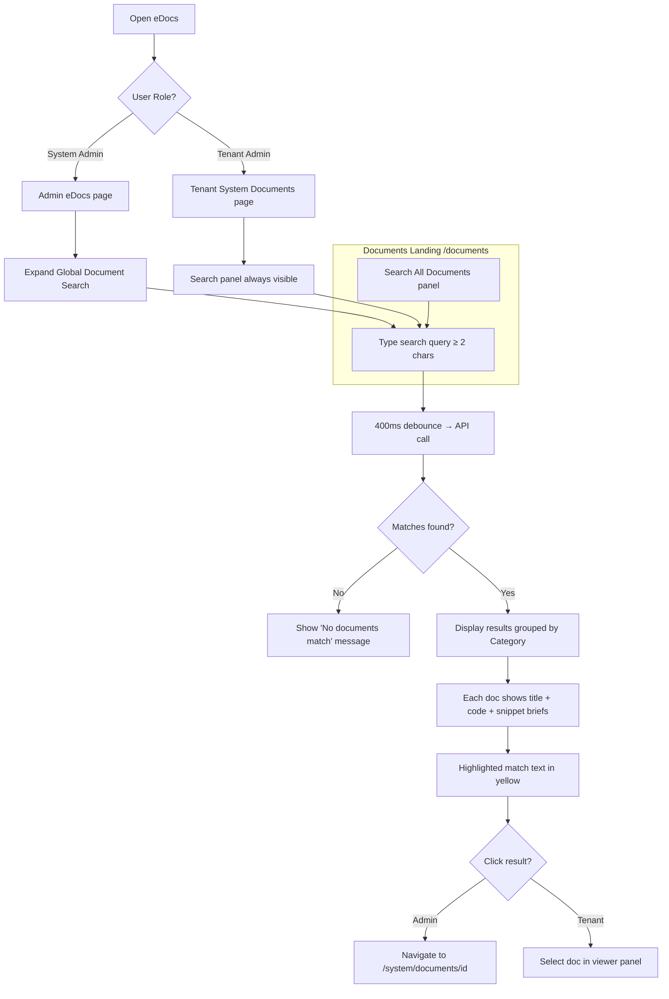

# Global Document Search

## Purpose
Provides full-text search across all System Documents in the NCC eDocs module. Users can search document content, titles, codes, tags, and descriptions from a single input. Results are grouped by SOP category, then by individual document, with highlighted contextual snippets ("Briefs") showing exactly where the search term appears.

## Who Uses This
- **All authenticated users** — search from the Documents landing page (`/documents`)
- **NEXUS System Admins** — also available on the Admin eDocs page (`/admin/documents`)
- **Tenant Admins / Owners** — also available on the Tenant Documents page (`/documents/system`)

## Workflow

### Documents Landing Page (Primary Entry Point)
1. Navigate to **Documents** (`/documents`).
2. The **🔍 Search All Documents** panel is always visible at the top of the page, above the dashboard cards.
3. Type at least 2 characters in the search box. Results load automatically after a 400ms debounce.
4. Results appear grouped by **Category** (e.g., "Safety", "Operations", "Uncategorized").
5. Under each category, matching documents show:
   - Document title and code badge (or green "My Copy" badge for tenant copies)
   - Up to 3 contextual **snippet briefs** with the matching text highlighted in yellow
   - A blue left-border on each snippet for visual scanning
6. Click any document row to navigate to the full document viewer (`/system/documents/[id]`).
7. The search is role-aware: admins search all SystemDocuments; tenants search published docs + their copies.

### Admin: Searching from eDocs Admin
1. Navigate to **Admin → eDocs** (`/admin/documents`).
2. Locate the **🔍 Global Document Search** collapsible section (between the page header and Staged SOPs).
3. Click to expand the section.
4. Type at least 2 characters in the search box. Results load automatically after a 400ms debounce.
5. Results appear grouped by **Category** (e.g., "Safety", "Operations", "Uncategorized").
6. Under each category, matching documents show:
   - Document title and code badge
   - Up to 3 contextual **snippet briefs** with the matching text highlighted in yellow (`<mark>`)
   - A blue left-border on each snippet for visual scanning
7. Click any document row to navigate to the full document viewer (`/system/documents/[id]`).
8. Clear the search box to dismiss results.

### Tenant: Searching Published Documents & Copies
1. Navigate to **Documents → NEXUS System Documents** (`/documents/system`).
2. The **🔍 Search Documents** panel is always visible at the top of the page.
3. Type at least 2 characters. Results appear with the same grouped layout.
4. Results include both:
   - **Published system documents** — shown with the document code badge
   - **My Copies** — tenant-edited copies shown with a green "My Copy" badge
5. Click a result to select and view it in the document viewer panel on the right.

### Flowchart



## Technical Architecture

### API Endpoints
- **Admin search**: `GET /admin/sops/documents/search?q=<query>` — requires ADMIN+ role, searches all active SystemDocuments
- **Tenant search**: `GET /tenant/documents/search?q=<query>` — requires ADMIN/OWNER role, searches published docs + tenant copies

### Search Algorithm
1. Query all active SystemDocuments with their current version's `htmlContent`.
2. Strip HTML tags from content to produce searchable plain text (removes `<style>`, `<script>`, decodes entities).
3. Case-insensitive substring match against: title, description, code, tags[], and plain-text content.
4. For each content match, extract a contextual snippet (~120 characters before and after the match).
5. Return up to 3 snippets per document with `matchStart` and `matchEnd` offsets for highlighting.
6. Group results by `category` (fallback: "Uncategorized"), sorted by match density.

### Response Shape
```json
{
  "groups": [
    {
      "category": "Safety",
      "documents": [
        {
          "id": "clx...",
          "code": "SOP-042",
          "title": "PPE Requirements",
          "snippets": [
            {
              "text": "…all employees must wear [match] at all times…",
              "matchStart": 28,
              "matchEnd": 35
            }
          ],
          "matchCount": 3
        }
      ],
      "totalInGroup": 1
    }
  ],
  "totalMatches": 1
}
```

### Files Modified
- `apps/api/src/modules/documents/system-documents.service.ts` — `searchDocuments()`, `searchTenantDocuments()`, `stripHtml()`, `extractSnippets()`
- `apps/api/src/modules/documents/sop-admin.controller.ts` — `GET documents/search` endpoint
- `apps/api/src/modules/tenant-documents/tenant-documents.controller.ts` — `GET search` endpoint
- `apps/api/src/modules/tenant-documents/tenant-documents.module.ts` — imports `DocumentsModule`
- `apps/web/app/documents/page.tsx` — Documents landing page with always-visible search panel (primary entry point)
- `apps/web/app/admin/documents/page.tsx` — Global Search collapsible panel with debounced fetch and grouped results
- `apps/web/app/documents/system/page.tsx` — Tenant search panel with same grouped results UI

## Key Features
- **Full-text content search** — searches inside the actual HTML body of documents, not just titles
- **Grouped results by category** — pre-filtered by SOP group for fast scanning
- **Highlighted snippet briefs** — contextual excerpts with the match text in yellow `<mark>` tags
- **Debounced input** — 400ms delay prevents excessive API calls while typing
- **Dual-context** — works for both NEXUS System admins (all docs) and tenants (published + copies)
- **Source badges** — tenant results distinguish "My Copy" vs published system documents
- **Click-through navigation** — admin results link to document detail; tenant results select in the viewer
- **INP-safe** — search result rendering wrapped in `startUiTransition` per the INP performance contract

## Related Modules
- [eDocs Template Search & Management](/documents/templates)
- [System Document Detail Viewer](/system/documents/[id])
- [Tenant Document Copies](/documents/copies)
- [eDocs Admin Dashboard](/admin/documents)

## Revision History
| Rev | Date | Changes |
|-----|------|---------|
| 1.0 | 2026-03-04 | Initial release — full-text search, grouped results, highlighted snippets, admin + tenant support |
| 1.1 | 2026-03-04 | Added search to Documents landing page (`/documents`) as primary entry point; role-aware endpoint selection |
