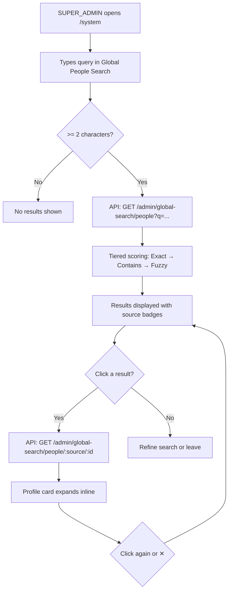

# Global People Search

## Purpose
Provides NEXUS System super administrators with a unified search across all people in the platform — Users, NexNet Candidates, and Tenant Clients — regardless of which tenant they belong to. Supports exact matching, contains matching, and fuzzy/typo-tolerant matching powered by PostgreSQL trigram similarity.

## Who Uses This
- SUPER_ADMIN users only (enforced by API guard)
- Used when locating a specific person across tenants or the marketplace (e.g., support escalation, account investigation, onboarding verification)

## Where to Find It
Navigate to **System → Organization Performance Dashboard** (`/system`). The "Global People Search" card appears at the top of the page, above the TUCKS KPI tiles.

## Workflow

### Searching
1. Log in as a SUPER_ADMIN user.
2. Go to `/system`.
3. Type at least 2 characters into the search input.
4. Results appear automatically after a 300ms debounce.
5. Results are ordered by match quality:
   - **Exact** — full name matches the query exactly
   - **Contains** — name or email contains the query as a substring
   - **Fuzzy** — trigram similarity match (handles typos, e.g., "Ganog" → "Gagnon")

### Viewing a Profile
1. Click any search result row to expand the inline profile card.
2. The profile card shows source-specific details:
   - **Users:** email, phone, user type, profile completion, people token, all tenant memberships (role, profile label, active/inactive, black flag status), linked candidate profile, recent projects
   - **Candidates:** status, source, visibility scope, owning company, linked user account
   - **Clients:** display name, company, tenant, active status, linked user, notes, associated projects
3. Click the row again or press ✕ to collapse the card.

### Flowchart

## Data Sources Searched

- **User** table — all registered users, with tenant memberships aggregated from CompanyMembership
- **NexNetCandidate** — marketplace candidates (excludes soft-deleted)
- **TenantClient** — client contacts within tenants (active only), with owning company name

## Search Algorithm
The search uses a single SQL query with `UNION ALL` across all three sources, scored in tiers:

1. **Tier 0 (Exact):** `lower(full_name) = lower(query)` — score 1.0
2. **Tier 1 (Prefix):** `lower(full_name) LIKE lower(query) || '%'`
3. **Tier 2 (Contains):** name or email contains the query substring
4. **Tier 3 (Fuzzy):** PostgreSQL `pg_trgm` `similarity()` score > 0.15

Results are sorted by tier ascending, then similarity score descending, capped at 25 results (configurable up to 100).

## Technical Details

### API Endpoints
- `GET /admin/global-search/people?q=<query>&limit=25` — search endpoint
- `GET /admin/global-search/people/:source/:id` — profile detail endpoint
- Both require `SUPER_ADMIN` global role (enforced by `GlobalRolesGuard`)
- All calls are audit-logged (`ADMIN_GLOBAL_SEARCH_PEOPLE`, `ADMIN_VIEW_PERSON_PROFILE`)

### Database Dependency
- Requires PostgreSQL `pg_trgm` extension (enabled via migration `20260306183700_add_pg_trgm_extension`)
- No additional indexes required at current scale; GIN trigram indexes can be added if search latency exceeds 100ms

### Files Modified
- `packages/database/prisma/migrations/20260306183700_add_pg_trgm_extension/migration.sql`
- `apps/api/src/modules/admin/admin.service.ts` — `globalSearchPeople()`, `getPersonProfile()`
- `apps/api/src/modules/admin/admin.controller.ts` — two new GET routes
- `apps/web/app/system/page.tsx` — `GlobalPeopleSearch`, `PersonProfileCard` components

## Security & Access Control
- Endpoint is gated behind `SUPER_ADMIN` global role — no tenant-scoped user can access it
- All search and profile-view actions are written to `AdminAuditLog`
- No secrets or password hashes are ever returned in search results or profile cards

## Key Features
- Unified cross-tenant people search from a single input
- Fuzzy typo tolerance via PostgreSQL trigram similarity
- Inline expandable profile cards with full membership, project, and status details
- Sub-100ms search latency
- Full audit trail for all searches and profile views

## Related Modules
- Admin Dashboard (TUCKS)
- NexNet Candidate Pool
- Tenant Client Management
- User Management / Onboarding

## Revision History
| Rev | Date | Changes |
|-----|------|---------|
| 1.0 | 2026-03-06 | Initial release — unified global people search with fuzzy matching and inline profile cards. |
