# Inline Receipt OCR

## Purpose
Enables field crews to photograph a receipt from the mobile app and have the vendor name, amount, and date automatically extracted and filled in — eliminating manual data entry for expense logs.

## Who Uses This
- All field crew members capturing receipts on-site
- Project Managers reviewing expense logs
- Accounting staff who process reimbursements

## Workflow

### Step-by-Step Process
1. Open a project from the Home screen or Projects screen
2. Tap **Add Daily Log** and select **Receipt / Expense**
3. Tap the camera icon or photo library icon to attach a receipt image
4. The app displays **"🔍 Scanning receipt..."** while the image is uploaded and processed
5. On success, the vendor, amount, and date fields auto-fill from the scanned receipt
6. Review and adjust the extracted data if needed (e.g., correct a misread amount)
7. Add any additional notes, then submit the daily log as normal

### Flowchart

```mermaid
flowchart TD
    A[Open Project] --> B[Add Daily Log → Receipt / Expense]
    B --> C[Capture or Pick Photo]
    C --> D{Photo Attached?}
    D -->|No| C
    D -->|Yes| E[Upload to OCR Endpoint]
    E --> F["🔍 Scanning receipt..."]
    F --> G{Scan Successful?}
    G -->|Yes| H[Auto-fill Vendor, Amount, Date]
    G -->|No| I["⚠️ OCR: Could not read receipt"]
    H --> J[User Reviews & Adjusts]
    I --> J
    J --> K[Submit Daily Log]
    K --> L[Syncs to Server via Outbox]
```

## Key Features
- **Instant feedback** — scanning starts as soon as a photo is attached; results appear in seconds
- **Works from both screens** — available on Projects → Daily Logs and Home → Daily Log Create
- **GPT-4 Vision powered** — handles receipts at various angles, lighting conditions, and print quality
- **Graceful offline fallback** — if the device is offline, the scan is skipped silently and the user can enter data manually; the log still saves locally
- **Confidence scoring** — each scan returns a confidence percentage so users know how reliable the extraction is
- **Line items extraction** — where readable, individual line items are extracted (description, quantity, unit price)
- **Auto-title** — if the title field is empty and a vendor is detected, the title auto-fills as "Receipt — {Vendor}"

## Technical Details

### API Endpoint
- `POST /ocr/receipt-scan` — standalone, stateless endpoint
- Accepts multipart file upload (field name: `file`)
- Requires authentication (JWT or DeviceSync)
- Returns: `{ success, vendor, amount, date, subtotal, taxAmount, currency, paymentMethod, lineItems, confidence, notes }`

### Architecture
- **Mobile** (`apps/mobile/src/api/dailyLog.ts`) → `scanReceiptImage()` uploads the image
- **API** (`apps/api/src/modules/ocr/ocr.controller.ts`) → converts to base64, calls OpenAI
- **OCR Provider** (`apps/api/src/modules/ocr/openai-ocr.provider.ts`) → GPT-4 Vision with receipt extraction prompt
- **Module Registration** — `OcrModule` is imported directly in `AppModule` (required for reliable controller registration on Cloud Run cold starts)

### Supported Image Formats
- JPEG, PNG, WebP, GIF
- Maximum file size: 10 MB

## Important Notes
- **Not a replacement for review** — OCR is assistive; users should always verify the extracted amount before submitting
- **Confidence threshold** — scores below 50% typically mean poor image quality; retake the photo if possible
- **Offline behavior** — if the scan fails or times out, the daily log creation is NOT blocked; users simply enter data manually
- **Privacy** — receipt images are sent to OpenAI's API for processing; do not scan receipts containing sensitive personal information unrelated to the project

## Related Modules
- [Daily Logs]
- [Receipt / Expense Tracking]
- [Offline Sync & Outbox]
- [Mobile Photo Capture]

## Revision History
| Rev | Date | Changes |
|-----|------|---------|
| 1.0 | 2026-02-21 | Initial release — inline OCR with GPT-4 Vision, dual-screen support, offline fallback |
