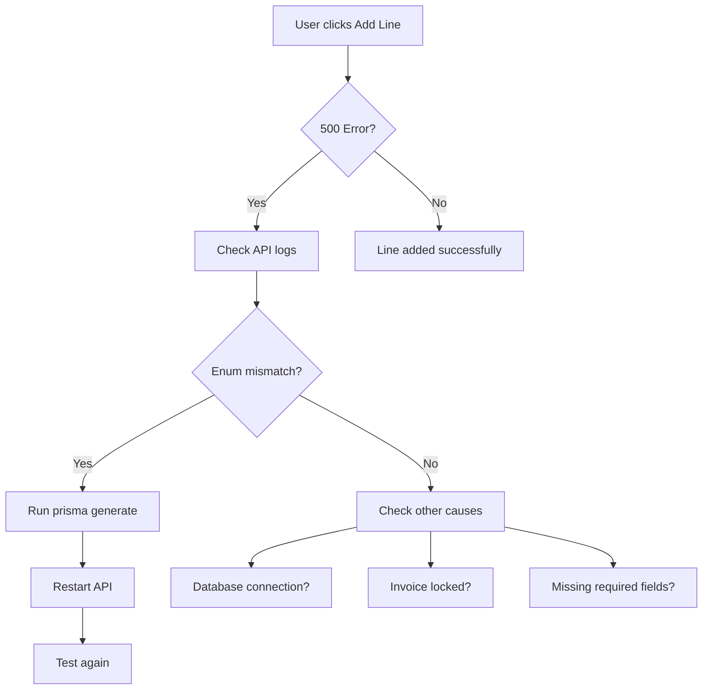

# Invoice Configuration & Troubleshooting

## Purpose
This SOP documents the configuration of company information on printed invoices and troubleshooting common invoice-related errors in the NCC system.

## Who Uses This
- System Administrators
- Finance/Accounting Staff
- Project Managers

---

## Part 1: Company Information on Invoices

### Current State
Company information displayed on printed invoices is currently **hardcoded** in the following location:

**File:** `apps/web/app/projects/[id]/page.tsx`

**Print Preview (line ~19716):**
```
Nexus Fortified Structures LLC
```

**Print/PDF Output (lines ~3005-3009):**
```
Nexus Fortified Structures LLC
123 Construction Way, Suite 100
Tampa, FL 33601
Phone: (555) 123-4567
Building Excellence, Fortifying Futures
```

### Future Enhancement
To make company information editable:
1. Add invoice-specific fields to Company model (`invoicePhone`, `invoiceAddress`, `invoiceTagline`)
2. Create UI in Settings → Company to edit these fields
3. Update invoice print function to fetch from database instead of hardcoded values

### Workaround (Current)
To change company information on invoices, a developer must:
1. Edit `apps/web/app/projects/[id]/page.tsx`
2. Update the hardcoded values in the `printActiveInvoiceAsHtml` function (~line 3005)
3. Update the preview header (~line 19716)
4. Commit and deploy changes

---

## Part 2: Invoice Line Item Troubleshooting

### Error: "Add line failed (500) Internal server error"

**Symptoms:**
- Clicking "Add line" button on invoice returns 500 error
- No specific error message in response

**Root Cause:**
Prisma client out of sync with schema after enum updates (e.g., adding `CREDIT` to `ProjectInvoicePetlLineBillingTag`).

**Resolution:**

1. **Regenerate Prisma Client:**
```bash
npm -w packages/database exec -- npx prisma generate
```

2. **Restart API (Local):**
```bash
# Kill existing API process
pkill -f "nodemon.*api"
# Restart
npm run dev:api
```

3. **Redeploy (Production):**
```bash
git add -A && git commit -m "chore: regenerate prisma client" && git push
```

### Flowchart



---

## Related Files

| File | Purpose |
|------|---------|
| `apps/web/app/projects/[id]/page.tsx` | Invoice UI, print preview, add line item |
| `apps/api/src/modules/project/project.service.ts` | Invoice line item API logic |
| `apps/api/src/modules/project/dto/project-invoice.dto.ts` | Invoice DTOs and validation |
| `packages/database/prisma/schema.prisma` | Database schema including invoice models |

---

## Related Modules
- Project Management
- Financial Reports
- Cost Book

## Revision History
| Rev | Date | Changes |
|-----|------|---------|
| 1.0 | 2026-02-17 | Initial release - Invoice company info location, 500 error troubleshooting |
