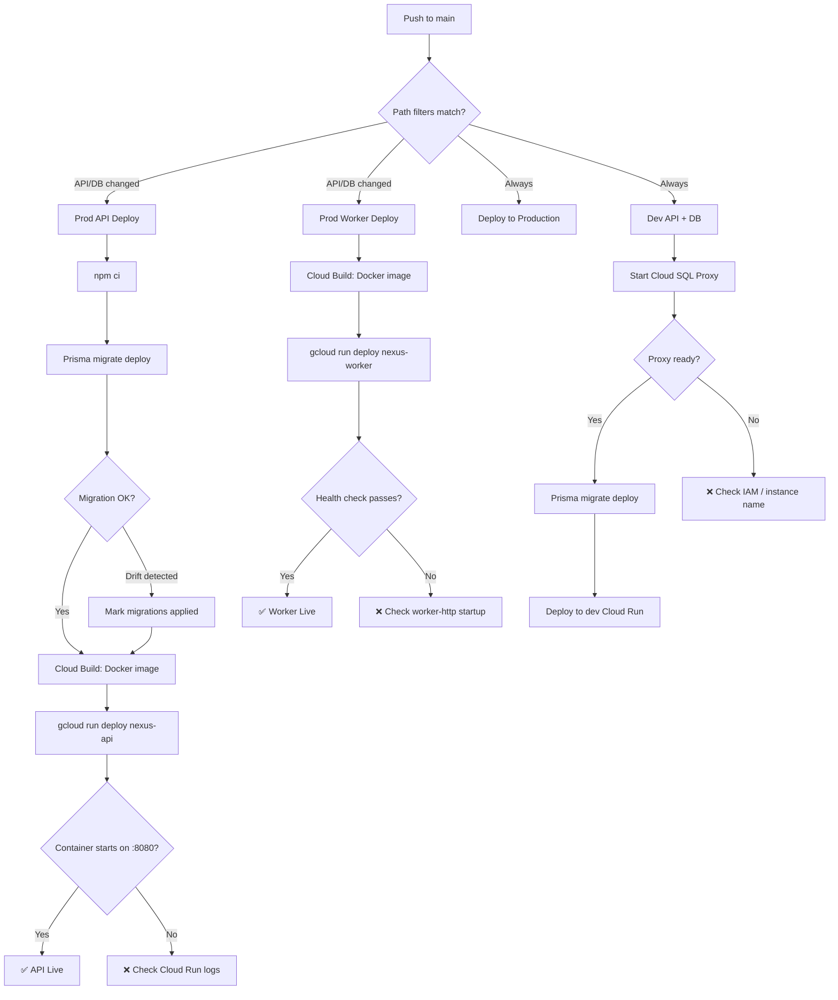
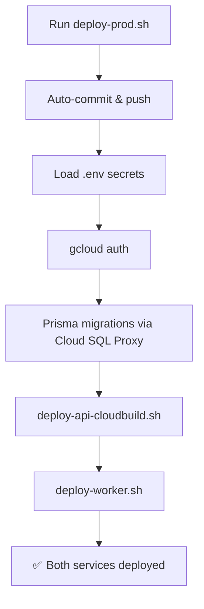

> **LEGACY (GCP)**: This document describes the pre-March 2026 GCP deployment workflow (Cloud Run + Cloud SQL). It is retained for posterity only and should not be used going forward.

# CI/CD Pipeline & Production Deployment

## Purpose
Defines how code moves from `main` to production across all Nexus services (API, Worker, Web), covering both automated GitHub Actions pipelines and manual deploy scripts. Includes Cloud Run architecture, troubleshooting procedures, and known-issue playbooks.

## Who Uses This
- Developers pushing to `main`
- DevOps / Admins managing production infrastructure
- On-call engineers troubleshooting failed deploys

## Production Architecture

### Cloud Run Services

**nexus-api** — NestJS Fastify HTTP API
- Image: `us-docker.pkg.dev/nexus-enterprise-480610/nexus-api/nexus-api`
- Entry: `node dist/main.js`
- Port: 8080 (Cloud Run `PORT` env)
- CPU: 2 vCPU, Memory: 2 Gi, `--cpu-boost` enabled
- Public (unauthenticated)

**nexus-worker** — BullMQ import worker with health-check HTTP wrapper
- Image: Same as API (shared Dockerfile)
- Entry: `node dist/worker-http.js` (CMD override)
- Port: 8080 (health-check server starts BEFORE worker init)
- CPU: 2 vCPU, Memory: 2 Gi, `--cpu-boost` enabled
- Min instances: 1 (always-on), Max: 3, Concurrency: 1
- Timeout: 900s (15 min for large imports)
- Private (no-allow-unauthenticated)

**CRITICAL:** API and Worker share the same Docker image. When deploying changes that affect import logic (`worker.ts`, `worker-http.ts`, `import-xact.ts`, `pricing.service.ts`), both services MUST be redeployed.

### Cloud SQL Instances

- **Production:** `nexusprod-v2` (Postgres 18, us-central1)
- **Development:** `nexusdev-v2` (Postgres 18, us-central1)

### GitHub Actions Service Account
- `nexus-api-deployer@nexus-enterprise-480610.iam.gserviceaccount.com`
- Auth: Workload Identity Federation (no key files)
- Required roles: `artifactregistry.writer`, `cloudbuild.builds.editor`, `cloudsql.client`, `iam.serviceAccountUser`, `logging.viewer`, `run.admin`, `storage.admin`

## Deployment Paths

### Path 1: Automated (GitHub Actions) — Primary

Every push to `main` triggers up to 4 workflows:

1. **Prod API deploy** (`prod-api-deploy.yml`) — Runs Prisma migrations against prod, builds Docker image via Cloud Build, deploys to `nexus-api` Cloud Run. Triggered only when `apps/api/**`, `packages/database/**`, `Dockerfile`, or `scripts/deploy-api.sh` change.

2. **Prod Worker deploy** (`prod-worker-deploy.yml`) — Builds and deploys to `nexus-worker` Cloud Run. Triggered only when `apps/api/**`, `packages/database/**`, or `scripts/deploy-worker.sh` change.

3. **Deploy to Production** (`deploy-production.yml`) — Runs migrations + deploys API. Triggers on every push to `main` (no path filter). Serves as catch-all.

4. **Dev API + DB** (`dev-api-dev-db.yml`) — Runs migrations against dev database via Cloud SQL Proxy, deploys API to dev. Triggers on every push.

### Path 2: Manual Local Deploy (`deploy-prod.sh`)

For cases where you need to deploy directly from your machine:

```bash
./scripts/deploy-prod.sh
```

This script:
1. Auto-commits and pushes uncommitted changes to `main`
2. Loads `.env` for secrets (`PROD_DB_PASSWORD`, `GOOGLE_APPLICATION_CREDENTIALS`)
3. Authenticates to GCP
4. Runs Prisma migrations via Cloud SQL Proxy
5. Deploys API via `deploy-api-cloudbuild.sh`
6. Deploys Worker via `deploy-worker.sh`

**Prerequisites:**
- `PROD_DB_PASSWORD` in `.env`
- `GOOGLE_APPLICATION_CREDENTIALS` in `.env` (or interactive gcloud auth)
- `gcloud` CLI installed and configured

### Path 3: Individual Service Scripts

```bash
# API only
./scripts/deploy-api.sh

# Worker only
./scripts/deploy-worker.sh
```

## Workflow

### Standard Deploy (Push to Main)



### Manual Deploy



## Troubleshooting Playbook

### Container Failed to Start (PORT 8080 timeout)

**Symptoms:** `gcloud.run.deploy` error: "container failed to start and listen on PORT=8080"

**Diagnosis:**
```bash
# Check the revision logs
gcloud logging read \
  'resource.type="cloud_run_revision" AND resource.labels.service_name="nexus-api"' \
  --project=nexus-enterprise-480610 \
  --limit=30 \
  --format="value(textPayload,jsonPayload.message)"
```

**Common causes:**
1. **Missing module** — An import path like `@repo/database/src/foo` works in dev (ts-node) but fails in production (`dist/`). Fix: import from `@repo/database` (package root re-exports).
2. **Slow NestJS bootstrap** — Add `--cpu-boost` and increase CPU/memory in the deploy script.
3. **Missing env vars** — Check Cloud Run service env vars match what the app expects.

### Cloud SQL Proxy Connection Failures (Dev Workflow)

**Symptoms:** `P1001: Can't reach database server`

**Diagnosis:** Check the `Cloud SQL Proxy logs` group in the GitHub Actions log.

**Common causes:**
1. **403 NOT_AUTHORIZED** — Service account missing `roles/cloudsql.client`. Fix:
   ```bash
   gcloud projects add-iam-policy-binding nexus-enterprise-480610 \
     --member="serviceAccount:nexus-api-deployer@nexus-enterprise-480610.iam.gserviceaccount.com" \
     --role="roles/cloudsql.client"
   ```
2. **404 instanceDoesNotExist** — Wrong instance name in workflow. Verify with:
   ```bash
   gcloud sql instances list --project=nexus-enterprise-480610
   ```
   Current instances: `nexusprod-v2` (prod), `nexusdev-v2` (dev).

3. **Proxy starts but connection still fails** — Proxy accepts TCP but upstream rejects. Check the proxy log for the actual error message.

### Schema Drift (Migration Fails with "already exists")

**Symptoms:** `ERROR: type "X" already exists` or `duplicate_object` during `prisma migrate deploy`

**Cause:** Someone ran `prisma db push` directly, which applied schema changes without recording them in the migration history.

**Resolution:** The CI workflows auto-detect this pattern and mark pending migrations as applied. If it happens locally:
```bash
cd packages/database
npx prisma migrate resolve --applied MIGRATION_NAME
npx prisma migrate deploy
```

### Worker Deploy Fails with Invalid Flag

**Symptoms:** `unrecognized arguments: --some-flag`

**Resolution:** Check the gcloud CLI version on the runner. Flag names can differ between versions. Verify with `gcloud run deploy --help`. Known example: `--startup-cpu-boost` was renamed to `--cpu-boost`.

### API Works Locally but Crashes in Docker

**Common cause:** Import paths that reference `src/` instead of using package exports. In the Docker image, TypeScript is compiled to `dist/`, so `@repo/database/src/foo` → `MODULE_NOT_FOUND`.

**Rule:** Always import from the package root (`@repo/database`) and ensure the symbol is re-exported from `packages/database/src/index.ts`.

## Key Files

**Deploy scripts:**
- `scripts/deploy-prod.sh` — Orchestrates full prod deploy (API + Worker)
- `scripts/deploy-api.sh` — Builds and deploys API to Cloud Run
- `scripts/deploy-worker.sh` — Builds and deploys Worker to Cloud Run
- `scripts/deploy-api-cloudbuild.sh` — Alternative API deploy via Cloud Build
- `scripts/db-migrate-prod-with-proxy.sh` — Runs prod migrations via Cloud SQL Proxy

**GitHub Actions workflows:**
- `.github/workflows/prod-api-deploy.yml` — Prod API (path-filtered)
- `.github/workflows/prod-worker-deploy.yml` — Prod Worker (path-filtered)
- `.github/workflows/deploy-production.yml` — Catch-all prod deploy
- `.github/workflows/dev-api-dev-db.yml` — Dev environment deploy

**Docker:**
- `Dockerfile` — Multi-stage build for API + Worker (node:20-alpine, Chromium, Prisma)

## Verification Checklist (Post-Deploy)

1. **API health:** `curl https://nexus-api-<hash>.run.app/health`
2. **Worker health:** Worker is private; check Cloud Run console or `gcloud run services describe nexus-worker --region=us-central1`
3. **GitHub Actions:** All workflow runs green at `github.com/paulgagnon1969/nexus-enterprise/actions`
4. **Logs:** `gcloud logging read 'resource.labels.service_name="nexus-api"' --limit=10 --project=nexus-enterprise-480610`

## Related Modules
- [Dev Environment Startup SOP](dev-environment-startup-sop.md)
- [Database Migrations (Prisma)](../architecture/)
- [Worker Import Pipeline](../api-contracts/)

## Revision History

| Rev | Date | Changes |
|-----|------|---------|
| 1.0 | 2026-02-27 | Initial release — documents full CI/CD pipeline, Cloud Run architecture, troubleshooting playbooks for container startup, Cloud SQL Proxy, schema drift, and import path issues |
