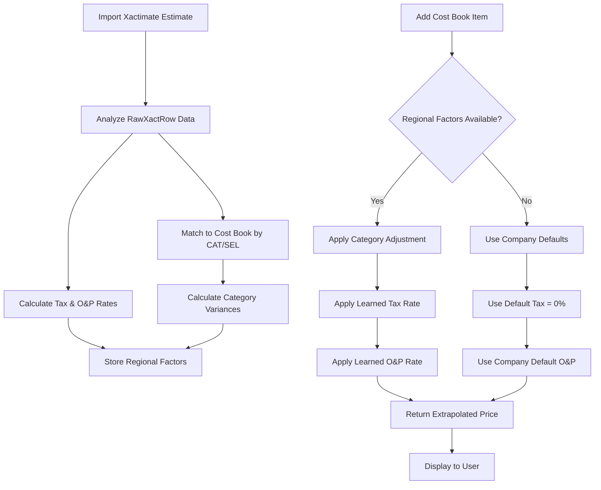

# Local Price Extrapolation

## Purpose
The Local Price Extrapolation system automatically learns regional pricing factors (tax rates, O&P rates, and category-specific price variances) from imported Xactimate estimates (PETL) and applies them when adding cost book items to new estimates. This ensures accurate local pricing without manual adjustments or external API dependencies.

## Who Uses This
- **Admins:** Configure company default O&P rates, view learned factors, override when needed
- **Project Managers:** Import PETL estimates (automatic learning happens in background)
- **Estimators:** Add cost book items to estimates (automatic extrapolation applied)

## Workflow

### Step-by-Step Process

#### 1. Import PETL Estimate (Automatic Learning)

**What Happens:**
When a Project Manager imports an Xactimate estimate (PETL):

1. System analyzes the `RawXactRow` data
2. Calculates aggregate rates:
   - **Tax Rate** = Total Sales Tax ÷ Total Item Amount
   - **O&P Rate** = (Total RCV - Total Item Amount - Total Tax) ÷ (Item Amount + Tax)
3. Matches PETL line items to cost book by CAT/SEL codes
4. Calculates price variances by category and activity
5. Stores learned factors in database

**Result:**
- Project now has regional pricing intelligence
- Tax rate reflects actual project location
- O&P rate reflects actual contractor markup
- Category adjustments show local price variations

**Example:**
- Mary Lewis project (Dallas, TX)
- Learned Tax Rate: 2.87%
- Learned O&P Rate: 20%
- 158 items matched, 5 high-confidence categories

#### 2. Add Cost Book Item to Estimate (Automatic Extrapolation)

**What Happens:**
When an Estimator adds a cost book item to an estimate:

1. System retrieves learned regional factors for the project
2. Applies category-specific price adjustment (if available)
3. Applies learned tax rate
4. Applies learned O&P rate
5. Returns accurate local pricing

**Calculation Flow:**
```
Cost Book Base Price: $1.25/SF
× Category Adjustment: 1.15 (if learned)
= Adjusted Unit Price: $1.44/SF
× Quantity: 5 SF
= Item Amount: $7.20
× Tax Rate: 2.87% (learned from PETL)
= Sales Tax: $0.21
Subtotal: $7.41
× O&P Rate: 20% (learned from PETL)
= O&P Amount: $1.48
= Total RCV: $8.89
```

**UI Display:**
- **Admin View:** Full breakdown showing all adjustments, confidence scores, sample sizes
- **Member View:** Final pricing with "✓ Regional pricing applied"

#### 3. First Project (Bootstrap Mode)

**What Happens:**
When adding cost book items BEFORE any PETL import:

1. No regional factors available yet
2. Falls back to company defaults:
   - Tax Rate: 0% (or manual override)
   - O&P Rate: Company default (typically 20%)
   - Price Adjustment: 1.0x (no adjustment)
3. Shows warning: "Import estimate first for regional pricing"

**Admin Action:**
- Set company default O&P rate in Company settings
- Or manually override tax/O&P rates per project

#### 4. View Learned Factors (Admin)

**Location:** Project Settings → Regional Pricing Intelligence

**Information Displayed:**
- Learned from which estimate (version, date)
- Tax Rate (percentage, confidence score)
- O&P Rate (percentage, sample size)
- Category Adjustments:
  - Category code (e.g., DRY, PLB, ELE)
  - Activity (e.g., R&R, Install)
  - Median variance
  - Sample size
  - Confidence level (High/Medium/Low)

**Admin Actions:**
- View historical changes (as new estimates are imported)
- Manually override tax/O&P rates if needed
- Flag low-confidence categories for review

### Flowchart



## Key Features

### 1. **Automatic Learning**
- No manual configuration required
- Each PETL import refines pricing intelligence
- Historical tracking of rate changes

### 2. **Category-Level Intelligence**
- Understands different construction categories (DRY, PLB, FRM, etc.)
- Activity-specific adjustments (R&R vs Install vs Remove)
- Median variance used (robust to outliers)

### 3. **Confidence Scoring**
- Based on sample size
- High confidence: 10+ matched items
- Medium confidence: 5-9 matched items
- Low confidence: <5 matched items

### 4. **Bootstrap Mode**
- Graceful fallback when no PETL imported yet
- Uses company default O&P rate (20%)
- Shows clear warning to user

### 5. **No External Dependencies**
- Learns from your own PETL data
- No API keys or monthly fees
- Works offline

## Related Modules
- [Cost Book Management] - Base cost book system
- [PETL Import] - Xactimate estimate import
- [Project Estimates] - Estimate creation and management
- [Invoice Generation] - Uses extrapolated pricing for invoices

## Admin Configuration

### Company Settings

**Set Default O&P Rate:**
1. Navigate to Company Settings → Pricing Defaults
2. Set "Default O&P Rate" (e.g., 20%)
3. This is used for bootstrap mode (before PETL import)

### Project Settings

**View Regional Factors:**
1. Navigate to Project → Settings → Regional Pricing
2. View learned tax rate, O&P rate, category adjustments
3. See which estimate factors were learned from

**Manual Override:**
1. Navigate to Project → Settings → Regional Pricing
2. Click "Override" next to tax or O&P rate
3. Enter custom value
4. System will use override instead of learned value

### Cost Book Picker Configuration

**Admin View Settings:**
- Show full pricing breakdown: ✓
- Show confidence scores: ✓
- Show sample sizes: ✓
- Show adjustment factors: ✓

**Member View Settings:**
- Show simple pricing: ✓
- Show "Regional pricing applied" badge: ✓
- Hide technical details: ✓

## Troubleshooting

### Issue: "No regional factors available"

**Symptom:** Warning shown when adding cost book items  
**Cause:** No PETL estimate imported yet for this project  
**Resolution:**
1. Import a Xactimate estimate (PETL) first
2. System will automatically learn regional factors
3. Or set manual tax/O&P overrides in Project Settings

### Issue: "Low confidence adjustment"

**Symptom:** Category shows low confidence score  
**Cause:** Few matched items in that category (<5 samples)  
**Resolution:**
1. Import more estimates to increase sample size
2. Or manually review pricing for that category
3. System will fall back to 1.0x adjustment if confidence too low

### Issue: "Tax rate seems incorrect"

**Symptom:** Learned tax rate doesn't match expected  
**Cause:** PETL data may have incorrect tax rates  
**Resolution:**
1. Review source Xactimate estimate
2. Verify tax rates in Xactimate are correct
3. Manually override tax rate in Project Settings
4. Re-import corrected estimate

### Issue: "Price variance too high"

**Symptom:** Category adjustment shows >50% variance  
**Cause:** Cost book item may be stale or mismatched  
**Resolution:**
1. Review specific cost book items in that category
2. Update cost book prices if outdated
3. System will flag extreme variances (>2x or <0.5x) for review

## Data Integrity

### What Gets Stored

**Per Project:**
- `ProjectRegionalFactors`: Tax rate, O&P rate, confidence score, sample size
- `ProjectCategoryAdjustment`: Category code, activity, median variance, sample size
- `ProjectTaxConfig`: Learned tax rate, source estimate, confidence

**History:**
- Each PETL import updates factors
- Old values are replaced (not historical versioning yet)
- Can see which estimate factors were learned from

### What Gets Applied

**When Adding Cost Book Items:**
- Category-specific price adjustment (median variance)
- Learned tax rate from most recent PETL import
- Learned O&P rate from most recent PETL import
- Metadata stored with extrapolated items for transparency

## Performance Notes

- Learning happens asynchronously after PETL import (doesn't slow import)
- Extrapolation is fast (<50ms per item)
- Database indexes optimize CAT/SEL matching
- Tax rates cached (no external API calls)

## Security & Permissions

- **View Learned Factors:** Admin only
- **Override Tax/O&P:** Admin only
- **View Full Breakdown:** Admin only
- **Add Cost Book Items:** All roles (extrapolation automatic)

## Future Enhancements

### Phase 2 (Planned)
- Multi-project regional intelligence (average across projects in same ZIP)
- Historical trending (show tax/O&P rate changes over time)
- Confidence-based alerts (notify when low confidence)

### Phase 3 (Future)
- Local supplier integration (Home Depot, Lowe's APIs)
- Real-time inventory checking
- ML-based pricing predictions

## Revision History

| Rev | Date | Changes |
|-----|------|---------|
| 1.0 | 2026-02-08 | Initial release - automatic learning from PETL, category-level intelligence, bootstrap mode |
