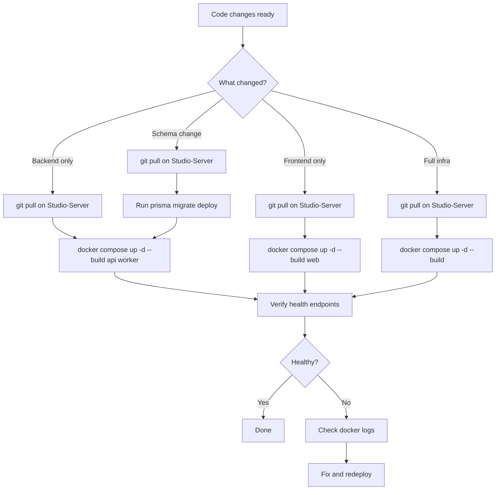

# Local Production Deployment

## Purpose
Defines the standard operating procedure for deploying, maintaining, and troubleshooting the Nexus production environment. Production runs entirely on a local Mac Studio ("Studio-Server") behind a Cloudflare Tunnel — there is no cloud hosting.

## Who Uses This
- System administrators
- Developers deploying code changes
- Warp AI agent (automated deployments)

## Architecture Overview

```
Internet
  │
  ├── staging-ncc.nfsgrp.com ──► Cloudflare Tunnel ──► nexus-shadow-web    (:3001)
  └── staging-api.nfsgrp.com ──► Cloudflare Tunnel ──► nexus-shadow-api    (:8000)
```

All services run as Docker containers on the Mac Studio:

| Container | Role | Port | Image Source |
|-----------|------|------|-------------|
| nexus-shadow-api | NestJS API | 8000 | `apps/api/Dockerfile` |
| nexus-shadow-worker | BullMQ import worker | 8001 | `apps/api/Dockerfile` (CMD override) |
| nexus-shadow-receipt-poller | Receipt email poller | — | `apps/api/Dockerfile` (CMD override) |
| nexus-shadow-web | Next.js frontend | 3001 | `apps/web/Dockerfile` |
| nexus-shadow-postgres | PostgreSQL 18 | 5435 | `postgres:18` |
| nexus-shadow-redis | Redis 8 | 6381 | `redis:8` |
| nexus-shadow-minio | S3-compatible storage | 9000/9001 | `minio/minio:latest` |
| nexus-shadow-tunnel | Cloudflare tunnel | — | `cloudflare/cloudflared:latest` |

Compose file: `infra/docker/docker-compose.shadow.yml`
Database: `NEXUSPRODv3`
Secrets: `.env.shadow` (repo root, git-ignored)

## Workflow

### Standard Deployment (Backend Changes)

1. Ensure all code changes are committed and on `main`
2. Verify type-checking passes: `npm run check-types`
3. On the **Mac Studio**, pull latest code:
   ```bash
   cd /Users/pg/nexus-enterprise && git pull
   ```
4. Rebuild and restart API + Worker:
   ```bash
   docker compose -f infra/docker/docker-compose.shadow.yml up -d --build api worker
   ```
5. Verify health:
   ```bash
   curl -s https://staging-api.nfsgrp.com/health
   docker logs nexus-shadow-api --tail 20
   docker logs nexus-shadow-worker --tail 20
   ```

Expected downtime: ~30–60 seconds during container rebuild.

### Frontend-Only Deployment

1. Pull latest code on the Mac Studio
2. Rebuild web container:
   ```bash
   docker compose -f infra/docker/docker-compose.shadow.yml up -d --build web
   ```
3. Verify at `https://staging-ncc.nfsgrp.com`

### Full Stack Deployment (Rare)

```bash
docker compose -f infra/docker/docker-compose.shadow.yml up -d --build
```

**Warning:** This rebuilds ALL containers including Postgres and Redis. Only needed after compose file changes or infrastructure updates. Data is preserved (volumes are persistent).

### Deploying Database Migrations

1. Run the migration against the prod database from the Mac Studio:
   ```bash
   set -a; source .env.shadow; set +a
   DATABASE_URL="postgresql://${SHADOW_PG_USER:-nexus_user}:${SHADOW_PG_PASSWORD}@127.0.0.1:5435/NEXUSPRODv3" \
     npx --prefix packages/database prisma migrate deploy
   ```
2. Rebuild API + Worker so the new Prisma client is picked up:
   ```bash
   docker compose -f infra/docker/docker-compose.shadow.yml up -d --build api worker
   ```

### Flowchart



## Health Checks

```bash
# All container statuses
docker ps --filter name=nexus-shadow --format 'table {{.Names}}\t{{.Status}}\t{{.Ports}}'

# API health (public)
curl -s https://staging-api.nfsgrp.com/health

# Worker health (local only)
curl -s http://localhost:8001/health

# Tail API logs
docker logs nexus-shadow-api --tail 50 -f

# Tail worker logs
docker logs nexus-shadow-worker --tail 50 -f

# Check tunnel status
docker logs nexus-shadow-tunnel --tail 20
```

## Production Database Access

```bash
# Load credentials
set -a; source .env.shadow; set +a

# Interactive psql session
PGPASSWORD=$SHADOW_PG_PASSWORD psql -h 127.0.0.1 -p 5435 -U ${SHADOW_PG_USER:-nexus_user} -d NEXUSPRODv3

# One-off query
PGPASSWORD=$SHADOW_PG_PASSWORD psql -h 127.0.0.1 -p 5435 -U ${SHADOW_PG_USER:-nexus_user} -d NEXUSPRODv3 \
  --no-psqlrc --pset=pager=off -c "SELECT count(*) FROM \"User\";"
```

## Troubleshooting

**Container won't start:**
```bash
docker logs nexus-shadow-api --tail 100
# Check for missing env vars, port conflicts, or build errors
```

**API returns 502/503:**
- Check if the API container is running: `docker ps --filter name=nexus-shadow-api`
- Check if the tunnel is healthy: `docker logs nexus-shadow-tunnel --tail 20`
- Restart the tunnel: `docker compose -f infra/docker/docker-compose.shadow.yml restart cloudflared`

**Database connection errors:**
- Verify Postgres is running: `docker ps --filter name=nexus-shadow-postgres`
- Check Postgres logs: `docker logs nexus-shadow-postgres --tail 20`
- Verify `.env.shadow` has correct `SHADOW_PG_PASSWORD`

**Docker Desktop not running:**
- The entire production stack depends on Docker Desktop. If it crashes, restart it.
- After Docker restarts, all containers should auto-restart (`restart: unless-stopped`).
- Verify: `docker ps --filter name=nexus-shadow`

## Critical Rules

1. **NEVER** stop or restart Docker Desktop from a script — it takes down production.
2. **NEVER** `docker compose down` on the shadow compose file unless explicitly rebuilding.
3. **NEVER** kill processes by port number — this can kill Docker proxy processes.
4. **NEVER** mix dev and prod DATABASE_URLs.
5. **ALWAYS** deploy API and Worker together — they share the same image.
6. **ALWAYS** verify health after deployment.

## Legacy (Deprecated)

The following are from the previous GCP Cloud Run deployment and must NOT be used:
- `scripts/deploy-prod.sh`
- `scripts/deploy-worker.sh`
- `scripts/prod-db-run-with-proxy.sh`
- `~/.nexus-prod-env`
- GitHub Actions deploy workflows
- Any `gcloud run deploy` commands

## Related Modules
- [Dev & Production Stack Contract](../../WARP.md) — WARP.md infrastructure section
- [Database Schema Changes](../../WARP.md) — migration safety rules

## Revision History
| Rev | Date | Changes |
|-----|------|--------|
| 1.0 | 2026-03-03 | Initial release — local Docker production on Mac Studio |
