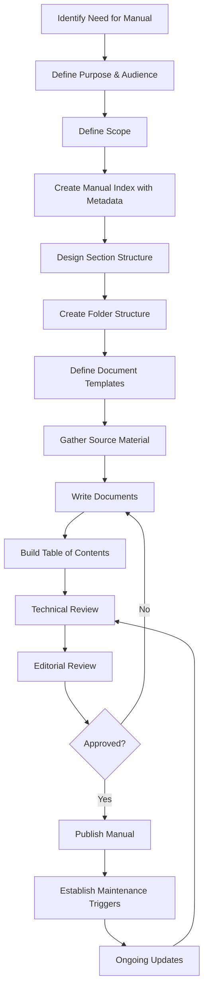
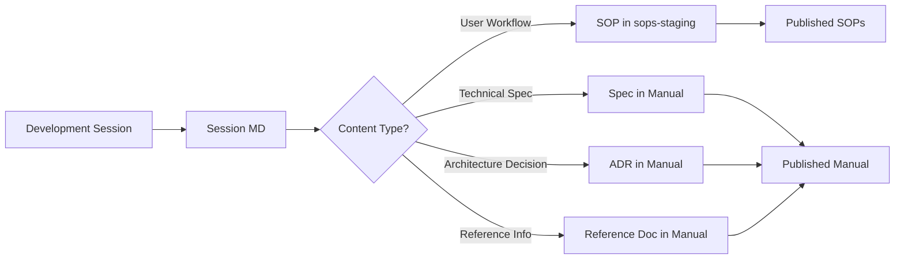

# Manual Making Process

## Purpose
Defines a standardized process for creating, organizing, and maintaining documentation manuals. A manual is an organized collection of documents that serve a specific audience and purpose. This SOP applies to any manual—user guides, programming manuals, operational manuals, or system specifications.

## Who Uses This
- Documentation authors
- Developers creating technical manuals
- Administrators creating operational guides
- Anyone responsible for organized documentation

## Core Concepts

### What Is a Manual?
A manual is a **structured collection of documents** organized to serve a specific purpose and audience. It is not a single document but a curated set of related documents with:
- A clear scope and purpose
- A defined audience
- A logical organization structure
- Cross-references between related sections
- Version control and revision history

### Manual Components
Every manual consists of:
1. **Index/Table of Contents** - Entry point listing all sections
2. **Sections** - Logical groupings of related documents
3. **Documents** - Individual pieces of content (specs, procedures, references)
4. **Cross-References** - Links between related documents
5. **Glossary** (optional) - Definitions of terms used throughout

## Workflow

### Phase 1: Define the Manual

#### Step 1: Identify Purpose and Audience
- What problem does this manual solve?
- Who will read it? (developers, users, admins, etc.)
- What decisions will readers make based on this content?

#### Step 2: Define Scope
- What topics are IN scope?
- What topics are explicitly OUT of scope?
- What other manuals or resources handle out-of-scope topics?

#### Step 3: Create Manual Metadata
Create an `index.md` file with frontmatter:
```markdown
---
title: "[Manual Name]"
type: manual
version: "1.0"
audience: [list of audiences]
created: YYYY-MM-DD
updated: YYYY-MM-DD
maintainer: [name or team]
---
```

### Phase 2: Design the Structure

#### Step 4: Identify Major Sections
Group content into logical sections. Common patterns:
- **By Module/Feature** - One section per system component
- **By Task** - Organized around what users need to do
- **By Role** - Different sections for different audiences
- **Chronological** - Setup → Configuration → Operation → Troubleshooting

#### Step 5: Create Folder Structure
```
docs/[manual-name]/
├── index.md              # Manual entry point, table of contents
├── section-1/
│   ├── index.md          # Section overview
│   ├── document-a.md
│   └── document-b.md
├── section-2/
│   ├── index.md
│   └── ...
└── glossary.md           # (optional) Terms and definitions
```

#### Step 6: Define Document Templates
Each manual should have consistent document formats. Define templates for:
- Specification documents
- Procedure documents
- Reference documents
- Decision records

### Phase 3: Populate Content

#### Step 7: Gather Source Material
Sources for manual content include:
- Session logs (`docs/sessions/`)
- Existing SOPs (`docs/sops-staging/`)
- Code comments and README files
- Architecture documents
- Team knowledge (interviews, meetings)

#### Step 8: Write Documents
For each document:
1. Use the appropriate template
2. Include frontmatter with metadata
3. Write clear, audience-appropriate content
4. Add cross-references to related documents
5. Include diagrams where helpful (Mermaid supported)

#### Step 9: Build the Index
The `index.md` should contain:
- Manual purpose statement
- Audience description
- How to use the manual
- Complete table of contents with links
- Quick reference to most-used sections

### Phase 4: Review and Publish

#### Step 10: Technical Review
- Verify accuracy of technical content
- Check all cross-references work
- Ensure consistent terminology
- Validate code examples and commands

#### Step 11: Editorial Review
- Check for clarity and readability
- Ensure consistent voice and tone
- Verify audience-appropriate language
- Fix grammar and formatting

#### Step 12: Publish
- Move from staging to published location
- Update any external references
- Announce availability to intended audience

### Phase 5: Maintain

#### Step 13: Establish Update Triggers
Define what triggers a manual update:
- New feature added to system
- Process change
- User feedback or questions
- Scheduled periodic review

#### Step 14: Version Control
- Use semantic versioning (MAJOR.MINOR)
- MAJOR: Significant restructure or scope change
- MINOR: New sections, updates, corrections
- Track changes in revision history

### Flowchart



## Document Types

### Specification Document
Describes WHAT something is and HOW it works.
```markdown
---
title: "[Component] Specification"
type: specification
parent: [manual-name]
---
# [Component Name]
## Overview
## Data Model
## API/Interface
## Behavior
## Dependencies
```

### Procedure Document
Describes HOW TO DO something (similar to SOP).
```markdown
---
title: "[Task] Procedure"
type: procedure
parent: [manual-name]
---
# [Task Name]
## Purpose
## Prerequisites
## Steps
## Expected Outcome
## Troubleshooting
```

### Reference Document
Quick-lookup information (tables, lists, commands).
```markdown
---
title: "[Topic] Reference"
type: reference
parent: [manual-name]
---
# [Topic] Reference
## [Category 1]
## [Category 2]
```

### Decision Record
Documents WHY a decision was made.
```markdown
---
title: "ADR-[number]: [Decision Title]"
type: decision
parent: [manual-name]
status: [proposed|accepted|deprecated|superseded]
date: YYYY-MM-DD
---
# ADR-[number]: [Decision Title]
## Context
## Decision
## Consequences
## Alternatives Considered
```

## Session-to-Manual Pipeline

Development sessions generate raw context that feeds into manuals:



### Session Closeout Routine
At end of each development session:
1. Commit all code changes
2. Push to origin
3. Create session MD in `docs/sessions/YYYY-MM-DD-<topic>.md`
4. Identify extractable content:
   - User-facing workflows → SOP
   - Technical specifications → Manual spec doc
   - Design decisions → ADR
5. Create/update relevant documents
6. Update manual index if new sections added

## Key Principles

1. **Single Source of Truth** - Each piece of information lives in one place; other documents link to it
2. **Audience First** - Write for the reader, not the writer
3. **Progressive Disclosure** - Overview first, details on demand
4. **Maintainability** - Structure for easy updates, not just initial creation
5. **Discoverability** - Users should find what they need quickly

## Related Modules
- [Session Documentation]
- [SOP Creation]
- [NCC Programming Manual]

## Revision History
| Rev | Date | Changes |
|-----|------|---------|
| 1.0 | 2026-02-16 | Initial release |
