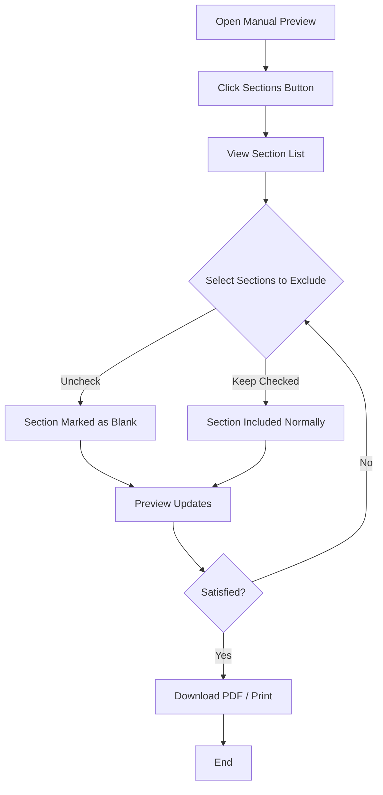

# Manual Section Exclusion

## Purpose
Enable administrators to create customized versions of manuals by excluding specific sections from print/PDF output while retaining them in the table of contents. This allows creation of smaller, targeted handbooks from comprehensive manuals.

## Who Uses This
- System Administrators
- Document Managers
- HR Administrators (for employee handbooks)

## Workflow

### Step-by-Step Process
1. Navigate to System > Documents > Manuals
2. Select the manual you want to customize
3. Click "Preview" to open the preview page
4. Click the "📑 Sections" button in the toolbar to open the section panel
5. Review the list of all sections (chapters and documents)
6. Uncheck the checkbox next to any section you want to exclude from print
7. Excluded sections will show strikethrough text and an orange "Blank" badge
8. The preview will automatically refresh to show the changes
9. Excluded sections display "This Section Intentionally Blank" in the output
10. Download PDF or print when satisfied with the selection

### Flowchart

## Key Features
- Checkbox toggles in the Sections panel for each document
- Real-time preview updates when toggling sections
- TOC entry preserved for excluded sections
- "This Section Intentionally Blank" placeholder in output
- Persisted settings per manual (stored in database)

## Technical Details
- API Endpoint: `POST /system/manuals/:id/documents/:docId/toggle-print`
- Request Body: `{ "includeInPrint": boolean }`
- Database Field: `ManualDocument.includeInPrint` (Boolean, default true)

## Related Modules
- Manual Editor
- Document Management
- PDF Generation

## Revision History
| Rev | Date | Changes |
|-----|------|--------|
| 1.0 | 2026-02-16 | Initial release |
