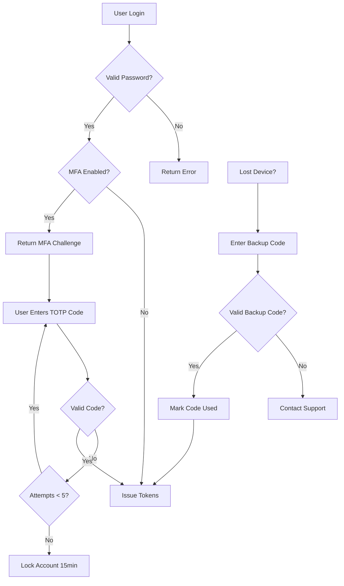

# Multi-Factor Authentication (MFA) - TOTP Implementation

## Purpose
This document defines the security architecture and implementation specification for Time-based One-Time Password (TOTP) multi-factor authentication in Nexus Contractor Connect. MFA adds a critical second layer of security beyond passwords, protecting user accounts from credential theft, phishing, and unauthorized access.

## Who Uses This
- **All Users:** Can enable MFA on their accounts for enhanced security
- **Administrators:** Can enforce MFA policies for their organization
- **SUPER_ADMIN:** Can configure platform-wide MFA requirements
- **Development Team:** Implementation reference for MFA features

## Security Overview

### Why TOTP?
TOTP (RFC 6238) is the industry-standard approach used by Google Authenticator, Microsoft Authenticator, Authy, and 1Password. It provides:

- **Offline Operation:** Codes generate without network connectivity
- **Time-Limited Codes:** 30-second validity window prevents replay attacks
- **No SMS Costs:** Unlike SMS-based MFA, no per-message fees
- **Phishing Resistance:** Codes are domain-agnostic but time-bound
- **Wide Compatibility:** Works with any RFC 6238-compliant authenticator app

### Threat Model
MFA protects against:
| Threat | Protection Level |
|--------|------------------|
| Password database breach | ✅ Full - attacker needs physical device |
| Phishing attacks | ✅ High - codes expire in 30 seconds |
| Credential stuffing | ✅ Full - password alone insufficient |
| Session hijacking | ⚠️ Partial - MFA at login only |
| SIM swapping | ✅ Full - not SMS-dependent |
| Malware on device | ⚠️ Partial - if authenticator app compromised |

## Technical Architecture

### Data Model Changes

**User Model Extensions:**
```
mfaEnabled          Boolean   @default(false)
mfaSecret           String?   // AES-256-GCM encrypted TOTP secret
mfaBackupCodes      String?   // AES-256-GCM encrypted JSON array
mfaEnabledAt        DateTime?
mfaLastUsedAt       DateTime?
```

**New Model - MfaRecoveryAttempt:**
```
id                  String    @id @default(cuid())
userId              String
attemptedAt         DateTime  @default(now())
success             Boolean
ipAddress           String?
userAgent           String?
```

### Cryptographic Specifications

| Component | Algorithm | Details |
|-----------|-----------|---------|
| TOTP Secret | Base32 | 20-byte (160-bit) random secret |
| TOTP Hash | SHA-1 | Per RFC 6238 standard |
| Code Length | 6 digits | Industry standard |
| Time Step | 30 seconds | Standard interval |
| Secret Storage | AES-256-GCM | Encrypted at rest |
| Backup Codes | Crypto random | 8 codes, 10 chars each |

### Secret Encryption
MFA secrets are encrypted before database storage:
- **Algorithm:** AES-256-GCM (authenticated encryption)
- **Key Derivation:** SHA-256 of `MFA_ENCRYPTION_KEY` environment variable
- **IV:** Unique 12-byte random IV per encryption
- **Format:** `{iv}:{authTag}:{ciphertext}` (Base64 encoded)

## Workflow

### Step-by-Step Process

#### MFA Setup Flow
1. User navigates to Security Settings
2. User clicks "Enable Two-Factor Authentication"
3. System generates 20-byte random TOTP secret
4. System displays QR code containing otpauth:// URI
5. User scans QR code with authenticator app
6. User enters 6-digit code from app to verify
7. System validates code against secret
8. On success: encrypt and store secret, generate backup codes
9. Display backup codes (one-time view) for user to save
10. MFA is now active on the account

#### Login Flow with MFA
1. User submits email and password
2. System validates credentials (existing flow)
3. If valid AND user.mfaEnabled === true:
   - Return `{ requiresMfa: true, mfaChallengeToken: <jwt> }`
   - Do NOT issue access/refresh tokens yet
4. Frontend redirects to MFA verification screen
5. User enters 6-digit code from authenticator app
6. System validates code + challenge token
7. On success: issue normal access/refresh tokens
8. On failure: increment attempt counter, return error

#### Recovery Flow (Lost Device)
1. User clicks "Lost access to authenticator?"
2. User enters one of their 8 backup codes
3. System validates backup code
4. On success: mark code as used, issue tokens
5. User prompted to set up new authenticator
6. If all backup codes exhausted: contact support flow

### Flowchart



## API Endpoints

### Setup Endpoints

**POST /auth/mfa/setup**
- Auth: Required (JWT)
- Request: `{}`
- Response: `{ secret: string, qrCodeDataUrl: string, otpauthUri: string }`
- Notes: Returns unencrypted secret for QR display only

**POST /auth/mfa/verify-setup**
- Auth: Required (JWT)
- Request: `{ code: string }`
- Response: `{ success: true, backupCodes: string[] }`
- Notes: Encrypts and stores secret, generates backup codes

**POST /auth/mfa/disable**
- Auth: Required (JWT)
- Request: `{ code: string, password: string }`
- Response: `{ success: true }`
- Notes: Requires both current password and valid TOTP code

### Login Endpoints

**POST /auth/mfa/verify**
- Auth: MFA Challenge Token
- Request: `{ challengeToken: string, code: string }`
- Response: `{ accessToken, refreshToken, user, company }`
- Notes: Completes MFA-protected login

**POST /auth/mfa/verify-backup**
- Auth: MFA Challenge Token
- Request: `{ challengeToken: string, backupCode: string }`
- Response: `{ accessToken, refreshToken, user, company, remainingBackupCodes: number }`
- Notes: Uses and invalidates one backup code

### Management Endpoints

**GET /auth/mfa/status**
- Auth: Required (JWT)
- Response: `{ enabled: boolean, enabledAt?: Date, backupCodesRemaining: number }`

**POST /auth/mfa/regenerate-backup-codes**
- Auth: Required (JWT)
- Request: `{ code: string }`
- Response: `{ backupCodes: string[] }`
- Notes: Invalidates old codes, generates new set

## Security Controls

### Rate Limiting
| Endpoint | Limit | Window | Lockout |
|----------|-------|--------|---------|
| /auth/mfa/verify | 5 attempts | 15 minutes | 15-minute lockout |
| /auth/mfa/verify-backup | 3 attempts | 1 hour | 1-hour lockout |
| /auth/mfa/setup | 3 requests | 1 hour | None |

### Time Window Tolerance
- Accept codes from current time step ± 1 step (90-second total window)
- Compensates for clock drift between server and authenticator app
- Configurable via `MFA_TIME_TOLERANCE` environment variable

### Backup Code Security
- 8 codes generated per setup
- Each code: 10 alphanumeric characters (uppercase, excluding ambiguous: 0, O, I, L)
- Codes are single-use and marked as consumed upon use
- Stored as salted hashes (not reversible)
- User warned when ≤ 2 codes remaining

### Audit Logging
All MFA events are logged to AdminAuditLog:
- `MFA_SETUP_INITIATED`
- `MFA_SETUP_COMPLETED`
- `MFA_SETUP_FAILED`
- `MFA_VERIFY_SUCCESS`
- `MFA_VERIFY_FAILED`
- `MFA_BACKUP_CODE_USED`
- `MFA_DISABLED`
- `MFA_LOCKOUT_TRIGGERED`

## Environment Configuration

```env
# MFA Encryption (REQUIRED for production)
MFA_ENCRYPTION_KEY=your-32-byte-hex-key-here

# MFA Behavior (optional, shown with defaults)
MFA_TIME_TOLERANCE=1          # ±1 time step tolerance
MFA_CODE_LENGTH=6             # TOTP code length
MFA_BACKUP_CODE_COUNT=8       # Number of backup codes
MFA_LOCKOUT_ATTEMPTS=5        # Failed attempts before lockout
MFA_LOCKOUT_DURATION=900      # Lockout duration in seconds
```

## Frontend Implementation Notes

### QR Code Display
- Use `qrcode` npm package to render QR from otpauth URI
- Display manual entry key as fallback (formatted with spaces for readability)
- Example: `JBSW Y3DP EHPK 3PXP` instead of `JBSWY3DPEHPK3PXP`

### Backup Codes Display
- Show codes in a clear, printable format
- Provide "Download as TXT" option
- Require user acknowledgment: "I have saved these codes"
- Never show backup codes again after initial setup

### Code Input UX
- Auto-focus input field
- Accept paste from authenticator apps
- Auto-submit when 6 digits entered
- Clear input on failed attempt
- Show countdown timer to next code (optional)

## Dependencies

**Backend (apps/api):**
```json
{
  "otplib": "^12.0.1",
  "qrcode": "^1.5.3"
}
```

**Types:**
```json
{
  "@types/qrcode": "^1.5.5"
}
```

## Rollout Considerations

### Phase 1: Optional MFA
- Users can opt-in to MFA via settings
- No enforcement at organization level
- Monitor adoption and support tickets

### Phase 2: Admin Enforcement (Future)
- Admins can require MFA for specific roles
- Grace period for users to set up MFA
- Blocked access after grace period expires

### Phase 3: Platform-Wide Policies (Future)
- SUPER_ADMIN can set platform defaults
- Organization-level policy overrides
- Compliance reporting for MFA adoption

## Related Modules
- [Authentication & Access Control](/docs/policies/information-security-policy.md#3-authentication--access-control)
- [Session Management](/docs/policies/information-security-policy.md#5-session-management)
- [Audit & Logging](/docs/policies/information-security-policy.md#6-audit--logging)

## Revision History
| Rev | Date | Changes |
|-----|------|---------|
| 1.0 | 2026-02-16 | Initial release |
