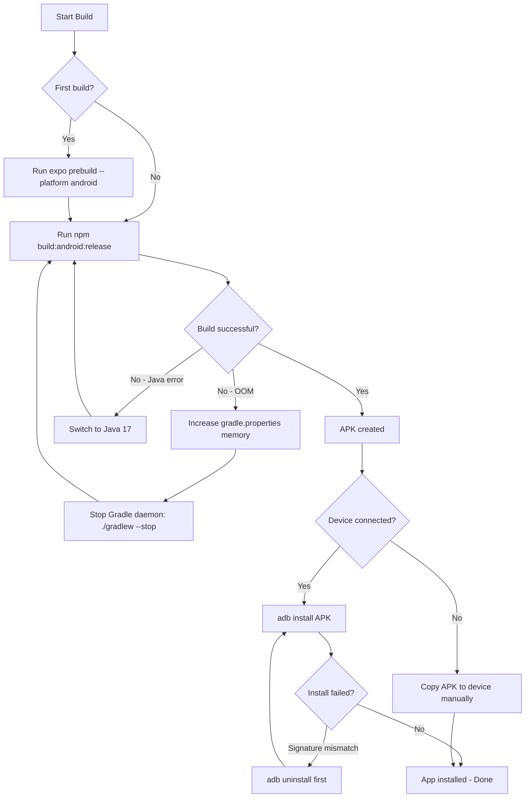

# Mobile Android Local Build SOP

## Purpose
Build and deploy Nexus Mobile Android APKs locally without using EAS (Expo Application Services) cloud builds. This enables faster iteration, offline builds, and full control over the build environment.

## Who Uses This
- Mobile developers
- DevOps engineers
- QA testers needing custom builds

## Prerequisites

### Required Software
- **Java 17** (not newer — Gradle compatibility)
- **Android SDK** with accepted licenses
- **Node.js** and npm
- **ADB** (Android Debug Bridge)

### Verify Installation
```bash
# Check Java version (must be 17.x)
java -version

# Check Android SDK
echo $ANDROID_HOME

# Check ADB
adb --version
```

### Install Java 17 (if needed)
```bash
brew install --cask temurin@17
```

### Accept Android SDK Licenses
```bash
sdkmanager --licenses
```

## Workflow

### Step-by-Step Process

1. **Navigate to mobile app directory**
   ```bash
   cd /Users/pg/nexus-enterprise/apps/mobile
   ```

2. **Build debug APK** (for development testing)
   ```bash
   npm run build:android
   ```

3. **Build release APK** (for production)
   ```bash
   npm run build:android:release
   ```

4. **Install on connected device**
   ```bash
   # List connected devices
   adb devices -l
   
   # Install (specify device if multiple connected)
   adb -s <DEVICE_ID> install /path/to/app-release.apk
   ```

5. **If signature mismatch error occurs** (existing app signed differently)
   ```bash
   adb -s <DEVICE_ID> uninstall com.pg1969.nexusmobile
   adb -s <DEVICE_ID> install /path/to/app-release.apk
   ```

### Flowchart



## Key Files and Locations

### Build Scripts
- `apps/mobile/scripts/build-android-local.sh` — Main local build script
- `apps/mobile/scripts/automator-build-android.sh` — One-click Automator build
- `apps/mobile/scripts/build-android.sh` — Legacy EAS build (deprecated)

### Configuration
- `apps/mobile/android/gradle.properties` — JVM memory settings
- `apps/mobile/.env.production` — Production API URL
- `apps/mobile/src/api/config.ts` — API URL resolution logic

### Output Locations
- Debug APK: `android/app/build/outputs/apk/debug/app-debug.apk`
- Release APK: `android/app/build/outputs/apk/release/app-release.apk`
- Archived builds: `/Volumes/4T Data/nexus-builds/`

## Configuration

### Gradle Memory Settings
Edit `apps/mobile/android/gradle.properties`:
```properties
org.gradle.jvmargs=-Xmx4g -XX:MaxMetaspaceSize=1g -XX:+HeapDumpOnOutOfMemoryError
```

**Note:** `expo prebuild --clean` resets this file. Re-apply after regenerating native project.

### API URL Configuration
Release builds automatically use production API. Controlled by:
```bash
EXPO_PUBLIC_API_BASE_URL=https://nexus-api-979156454944.us-central1.run.app
```

Set in build scripts or `.env.production`.

## Automator One-Click Build

To create an Automator quick action:

1. Open **Automator** → **New Document** → **Application**
2. Add **Run Shell Script** action
3. Set shell to `/bin/bash`
4. Paste contents of `apps/mobile/scripts/automator-build-android.sh`
5. Save as "Build Nexus Android" to Applications folder

Double-click the app to trigger a full release build with macOS notifications.

## Troubleshooting

### OutOfMemoryError (Metaspace)
**Cause:** Gradle JVM running out of memory during Kotlin/lint tasks.
**Fix:** Increase memory in `gradle.properties`, then restart daemon:
```bash
cd apps/mobile/android && ./gradlew --stop
```

### Java Version Incompatible
**Cause:** Using Java 21+ which Gradle doesn't support yet.
**Fix:** Install and use Java 17:
```bash
export JAVA_HOME=$(/usr/libexec/java_home -v 17)
```

### INSTALL_FAILED_UPDATE_INCOMPATIBLE
**Cause:** Existing app on device signed with different key (e.g., EAS build).
**Fix:** Uninstall existing app first:
```bash
adb uninstall com.pg1969.nexusmobile
```

### Hermes Compiler Not Found
**Cause:** Corrupted or incomplete native project.
**Fix:** Regenerate native files:
```bash
npx expo prebuild --platform android --clean
```
Then re-apply gradle.properties memory settings.

### Multiple Devices Connected
**Cause:** ADB doesn't know which device to target.
**Fix:** Specify device ID:
```bash
adb devices -l  # List devices
adb -s R5GL13LHGGH install app.apk  # Use specific device
```

## Related Modules
- Mobile App Development
- API Configuration
- DevOps / CI-CD

## Revision History
| Rev | Date | Changes |
|-----|------|---------|
| 1.0 | 2026-02-16 | Initial release |
