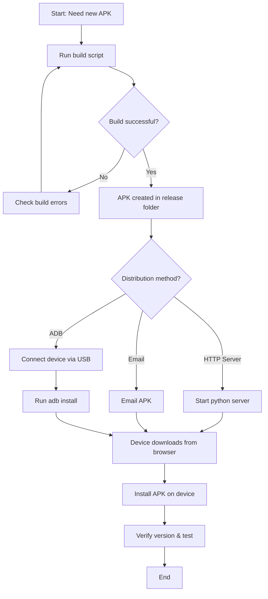

# Mobile App Release & Distribution

## Purpose
This SOP documents the process for building Android release APK files for the Nexus Connect mobile app and distributing them to test devices or production users.

## Who Uses This
- Mobile developers
- Release managers
- QA team members distributing test builds

## Workflow

### Step-by-Step Process

#### 1. Build Android Release APK

Navigate to the mobile app directory and run the release build script:

```bash
cd /Users/pg/nexus-enterprise/apps/mobile
./scripts/build-android-local.sh
```

**Output location:**
```
/Users/pg/nexus-enterprise/apps/mobile/android/app/build/outputs/apk/release/app-release.apk
```

**Build time:** Approximately 1-2 minutes

#### 2. Transfer APK to Device

**Option A: HTTP Server (Recommended for local testing)**

1. Start a local HTTP server from the APK directory:
```bash
cd /Users/pg/nexus-enterprise/apps/mobile/android/app/build/outputs/apk/release
python3 -m http.server 8000
```

2. Get your Mac's local IP address:
```bash
ipconfig getifaddr en0
```

3. On the target device, open a web browser and navigate to:
```
http://[YOUR_MAC_IP]:8000
```

4. Download `app-release.apk` from the browser
5. Tap the downloaded APK to install
6. Stop the server with `Ctrl+C` when done

**Option B: Email**
```bash
open -a Mail /Users/pg/nexus-enterprise/apps/mobile/android/app/build/outputs/apk/release/app-release.apk
```

**Option C: ADB Install (if USB debugging enabled)**
```bash
adb install /Users/pg/nexus-enterprise/apps/mobile/android/app/build/outputs/apk/release/app-release.apk
```

#### 3. Verify Installation

On the device:
1. Check that the app icon appears
2. Launch the app
3. Verify the version badge in the bottom-right corner matches expected version
4. Test core functionality (login, sync, offline features)

### Flowchart



## Key Features

- **Offline-first architecture**: APK includes all necessary code for offline operation
- **Version badge**: Bottom-right corner shows current version (e.g., v1.1.0-dev)
- **Release signing**: APK is signed with release keystore for production distribution

## Prerequisites

- Node.js and npm installed
- Android SDK and build tools configured
- Java Development Kit (JDK) installed
- Release keystore file configured (for production builds)

## Troubleshooting

**Build fails with Gradle errors:**
- Clean the build: `cd android && ./gradlew clean`
- Delete build cache: `rm -rf android/.gradle android/app/build`
- Retry build

**Device can't see HTTP server:**
- Verify both Mac and device are on same Wi-Fi network
- Check firewall settings on Mac
- Verify IP address is correct

**APK won't install on device:**
- Enable "Install from Unknown Sources" in device settings
- Check device has sufficient storage space
- Verify Android version compatibility (6.0+)

## Related Modules

- [Version Badge Management]
- [Mobile App Configuration]
- [Production Deployment]

## Revision History

| Rev | Date | Changes |
|-----|------|---------|
| 1.0 | 2026-02-16 | Initial release |
