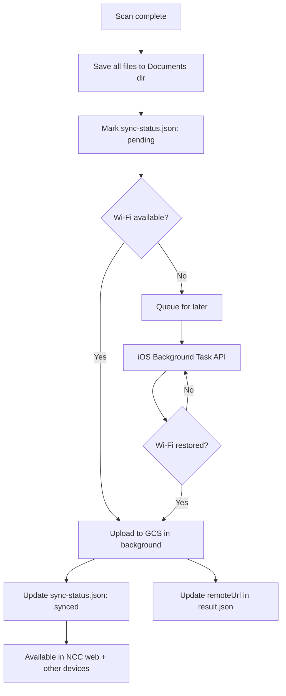
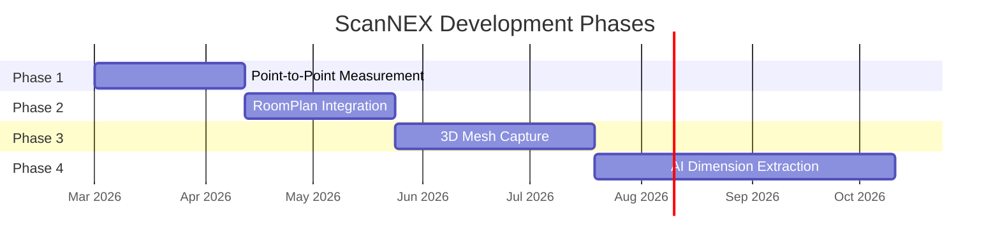
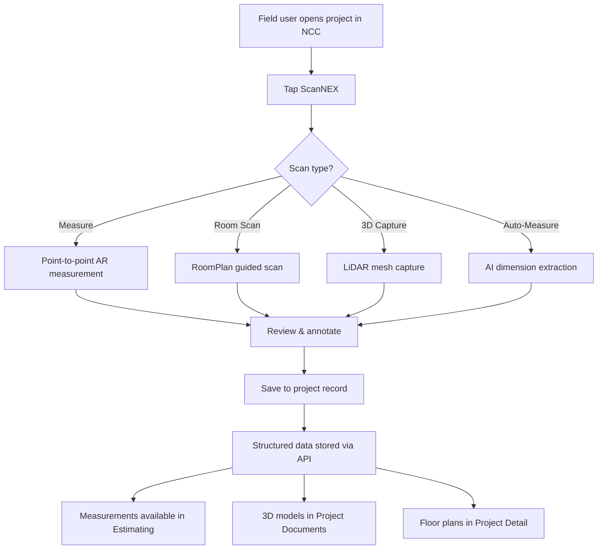
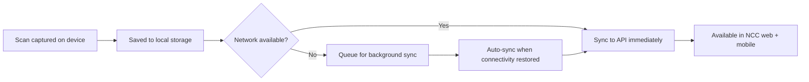

# ScanNEX — LiDAR Scanning & Measurement Module

## Purpose
ScanNEX is the scanning and measurement engine built into the NCC mobile app. Its ultimate goal: **a field tech scans a room once and ScanNEX produces all SF, LF, and accoutrement measurements needed to build an estimate** — no manual tape measure, no re-keying numbers.

It provides field crews with LiDAR-powered room scanning, point-to-point measurement, 3D documentation, and AI-driven dimension extraction — all tied directly to project context so data flows into estimates, daily logs, and downstream workflows without manual re-entry.

This document covers the architecture decision, measurement output specification, technical assessment, implementation roadmap, and development guidance for ScanNEX.

## Decision
**ScanNEX is built as a native module within the NCC mobile app (`apps/mobile`).**

Do NOT create a separate companion app. See [Rationale](#rationale) for full reasoning.

## Who Uses This
- **Field crews** — scanning rooms, measuring damage areas, documenting conditions on-site
- **Estimators** — consuming ScanNEX measurement data in estimates and Xactimate line items
- **Project managers** — reviewing scan documentation, before/after records
- **Mobile developers** — building and extending ScanNEX features
- **Product/architecture leads** — evaluating scanning scope and phasing

## Rationale

### Why a single app is correct for NCC

1. **User friction kills adoption.** Field crews scanning a damaged room need to associate scans with a project immediately. App-switching on a jobsite (gloves, rain, time pressure) creates dropout points.
2. **Mobile inter-app integration is brittle.** Deep links fail if the companion app isn't installed. Shared auth tokens expire. Background data sync gets killed by iOS. The glue code costs more than the feature.
3. **Two apps = double the operational overhead.** Two build pipelines, two App Store reviews, two update cycles, two sets of crash reports. Not justified for a tightly coupled feature.
4. **Data context matters.** Scan results are most useful when tied directly to the project the user is already working in — measurements flow straight into estimates, daily logs, or downstream workflows without a sync step.

### When a companion app WOULD be justified (none currently apply)

- ScanNEX sold independently to non-NCC users (separate product/revenue stream)
- Scanning SDK requires native code that fundamentally conflicts with the Expo/React Native setup
- Scanning needs to run continuously in background (always-on Bluetooth/IoT) in a way that would drain battery if bundled

### Re-evaluation triggers
Revisit this decision if any of the above conditions become true, or if the ScanNEX native module exceeds ~30% of the total app binary size.

---

## Measurement Output Specification

The core value of ScanNEX is producing **structured, estimate-ready measurement data** from a room scan. Every scan must output measurements in three categories that map directly to how restoration estimates are built.

### Measurement categories

**SF (Square Footage) — area measurements**
Used for: flooring, drywall, paint, ceiling texture, carpet, tile, insulation.
- **Floor SF** — total floor area of the room (L × W, accounting for irregular shapes)
- **Wall SF** — area of each wall individually AND total wall area (perimeter × ceiling height, minus deductions for windows/doors)
- **Ceiling SF** — total ceiling area (typically matches floor SF unless vaulted/stepped)
- **Affected area SF** — user-marked damage zones within a room (subset of wall/floor/ceiling)

**LF (Linear Footage) — length measurements**
Used for: baseboard, crown molding, chair rail, cove base, shoe molding, perimeter caulking.
- **Perimeter LF** — total room perimeter (sum of all wall lengths)
- **Wall LF** — individual wall lengths
- **Ceiling perimeter LF** — typically equals room perimeter (for crown molding)
- **Affected perimeter LF** — linear footage of damage along a wall run

**Accoutrements — counted items with individual dimensions**
Used for: windows, doors, closets, built-ins, fixtures — each gets its own Xactimate line items.
- **Windows** — count, individual W × H, type (single-hung, double-hung, casement, picture, sliding), frame material
- **Doors** — count, individual W × H, type (interior, exterior, pocket, sliding, bifold), swing direction
- **Openings** — archways, pass-throughs, cased openings (W × H)
- **Closets** — detected as sub-rooms or openings, with interior dimensions
- **Fixtures** — cabinets, built-in shelving, countertops (dimensions where detectable)

### How RoomPlan maps to these measurements

Apple's RoomPlan SDK outputs a `CapturedRoom` object. Here's the exact mapping:

```
CapturedRoom
├── walls[]              → Wall LF (each wall.dimensions.x = length)
│                        → Wall SF (each wall.dimensions.x × wall.dimensions.y = area)
│                        → Perimeter LF (sum of all wall lengths)
│                        → Total Wall SF (sum of all wall areas, minus deductions)
├── doors[]              → Door accoutrement (door.dimensions = W × H)
│   └── .category        → Door type (standard, open, closet)
├── windows[]            → Window accoutrement (window.dimensions = W × H)
├── openings[]           → Opening accoutrement (opening.dimensions = W × H)
├── floors[]             → Floor SF (calculated from floor polygon vertices)
└── sections[]           → Room shape for irregular layouts

Derived measurements (computed by ScanNEX from raw RoomPlan data):
├── Ceiling SF           = Floor SF (flat ceiling) or computed from wall heights (vaulted)
├── Ceiling Height       = wall.dimensions.y (consistent) or per-wall if varying
├── Window deductions    = Σ(window.W × window.H) per wall → subtracted from Wall SF
├── Door deductions      = Σ(door.W × door.H) per wall → subtracted from Wall SF
├── Net Wall SF          = Gross Wall SF − window deductions − door deductions
└── Trim LF per opening  = 2(W) + 2(H) for each window/door (casing/trim)
```

### ScanNEX room measurement data model

Every room scan produces a `ScanNEXRoomResult` — the structured output consumed by estimating:

```typescript
interface ScanNEXRoomResult {
  roomId: string;
  roomName: string;                    // User-assigned or auto-detected ("Kitchen", "Bedroom 1")
  projectId: string;                   // Linked NCC project
  scannedAt: string;                   // ISO timestamp
  deviceModel: string;                 // e.g. "iPhone 15 Pro" — for accuracy context
  scanMethod: 'roomplan' | 'manual' | 'ai-extract';  // Which phase produced this data

  // — SF measurements —
  floorSF: number;                     // Total floor area
  ceilingSF: number;                   // Total ceiling area
  grossWallSF: number;                 // Total wall area before deductions
  netWallSF: number;                   // Wall area after window/door deductions
  ceilingHeight: number;               // In feet (or average if varying)
  ceilingHeightVaries: boolean;        // True if vaulted/stepped
  walls: ScanNEXWall[];                // Individual wall data

  // — LF measurements —
  perimeterLF: number;                 // Total room perimeter
  ceilingPerimeterLF: number;          // For crown molding (usually = perimeterLF)

  // — Accoutrements —
  windows: ScanNEXWindow[];
  doors: ScanNEXDoor[];
  openings: ScanNEXOpening[];
  fixtures: ScanNEXFixture[];          // Phase 4: AI-detected cabinets, built-ins, etc.

  // — Damage zones (user-marked) —
  affectedAreas: ScanNEXAffectedArea[];

  // — Video walkthrough —
  video: ScanNEXVideo;                 // AR-overlay video recorded during scan

  // — Raw data —
  floorPlanSVG?: string;               // 2D floor plan rendering
  meshUSDZ?: string;                   // 3D mesh file URL (Phase 3)
  pointCloud?: string;                 // Point cloud file URL (Phase 3)
  photos: ScanNEXPhoto[];              // Annotated photos from scan session
}

interface ScanNEXVideo {
  videoId: string;
  localPath: string;                   // On-device path (app documents dir)
  remoteUrl?: string;                  // Cloud URL after sync (GCS)
  durationSeconds: number;
  fileSizeMB: number;
  resolution: '720p' | '1080p';
  codec: 'hevc' | 'h264';
  includesAROverlay: boolean;          // True = measurements visible in video
  recordedAt: string;                  // ISO timestamp
  synced: boolean;                     // Has this been uploaded to cloud?
  gpsCoordinates?: { lat: number; lng: number };
}

interface ScanNEXWall {
  wallId: string;
  label: string;                       // "North wall", "Wall A", etc.
  lengthLF: number;                    // Wall length in feet
  heightFT: number;                    // Wall height in feet
  grossSF: number;                     // L × H
  netSF: number;                       // Gross minus deductions on this wall
  windowDeductionSF: number;           // SF deducted for windows on this wall
  doorDeductionSF: number;             // SF deducted for doors on this wall
  adjacentWindowIds: string[];         // Windows on this wall
  adjacentDoorIds: string[];           // Doors on this wall
}

interface ScanNEXWindow {
  windowId: string;
  wallId: string;                      // Which wall it's on
  widthFT: number;
  heightFT: number;
  areaSF: number;                      // W × H
  trimLF: number;                      // 2W + 2H (casing perimeter)
  type: 'single-hung' | 'double-hung' | 'casement' | 'picture' | 'sliding' | 'unknown';
  sillPresent: boolean;
}

interface ScanNEXDoor {
  doorId: string;
  wallId: string;
  widthFT: number;
  heightFT: number;
  areaSF: number;
  trimLF: number;                      // 2W + H (no trim at floor) or 2W + 2H (cased opening)
  type: 'interior' | 'exterior' | 'pocket' | 'sliding' | 'bifold' | 'closet' | 'unknown';
  swingDirection?: 'left' | 'right';   // If detectable
}

interface ScanNEXOpening {
  openingId: string;
  wallId: string;
  widthFT: number;
  heightFT: number;
  areaSF: number;
  trimLF: number;
  type: 'archway' | 'pass-through' | 'cased-opening' | 'unknown';
}

interface ScanNEXFixture {
  fixtureId: string;
  type: 'cabinet' | 'countertop' | 'shelving' | 'vanity' | 'closet-shelf' | 'other';
  widthFT?: number;
  heightFT?: number;
  depthFT?: number;
  linearFT?: number;                   // For countertops, shelving runs
  detectionConfidence: number;         // 0-1, Phase 4 ML confidence
}

interface ScanNEXAffectedArea {
  areaId: string;
  surface: 'floor' | 'wall' | 'ceiling';
  wallId?: string;                     // If on a specific wall
  areaSF: number;                      // Damaged area in SF
  perimeterLF: number;                 // Perimeter of damaged zone
  description?: string;                // User note: "water damage", "smoke", etc.
}

interface ScanNEXPhoto {
  photoId: string;
  url: string;
  annotations: { label: string; x: number; y: number }[];  // Measurement labels overlaid
  capturedAt: string;
}
```

### Xactimate line item mapping

ScanNEX measurements map directly to Xactimate estimate quantities. The `xactimate-mapping.ts` utility handles this translation:

```
ScanNEX Field          → Xactimate Quantity    → Example Line Items
─────────────────────────────────────────────────────────────────────
floorSF                → Floor area (SF)       → Remove/replace carpet, tile, hardwood, pad
ceilingSF              → Ceiling area (SF)     → Drywall, texture, paint, scrape popcorn
netWallSF              → Net wall area (SF)    → Drywall, prime, paint (2 coats), wallpaper
grossWallSF            → Gross wall area (SF)  → Insulation, vapor barrier (no deductions)
perimeterLF            → Room perimeter (LF)   → Baseboard, shoe molding, cove base, tack strip
ceilingPerimeterLF     → Ceiling perim (LF)    → Crown molding, cove molding
wall.lengthLF          → Wall length (LF)      → Individual wall items, chair rail sections
window.trimLF          → Trim LF per window    → Window casing, stool & apron
window.areaSF          → Deduction / item       → R&R window, clean window, window treatment
door.trimLF            → Trim LF per door      → Door casing, door stop
door — count           → Each (EA)             → R&R door slab, hardware, paint door
window — count         → Each (EA)             → R&R window unit, hardware, screen
affectedArea.areaSF    → Affected area (SF)    → Mold remediation, water extraction, demo
affectedArea.perimLF   → Affected perim (LF)   → Containment barrier, poly sheeting
```

### Accuracy targets

- **SF measurements:** ±2% of actual (RoomPlan with LiDAR achieves this for standard rooms)
- **LF measurements:** ±1 inch per 10 feet (LiDAR raycasting)
- **Accoutrement dimensions:** ±1 inch W and H (RoomPlan detects these reliably)
- **Accoutrement count:** 100% accuracy for doors/windows (RoomPlan auto-detects); fixtures are Phase 4 with lower confidence
- **Non-LiDAR fallback:** ±5-8% for SF/LF (camera-only AR is less precise)

### Component Identity & Material Intelligence (New — Rev 6.0)

ScanNEX now includes a **Component Identity** pipeline that detects, measures, and classifies building components during and after a room scan. This goes beyond raw dimensions to identify what is being measured.

**Capture Pipeline Enhancements:**
- **High-resolution frame capture** — `NexusRoomPlanModule.swift` captures a full-res JPEG per wall as new walls are detected. Stored to Documents dir as `highResFramePaths[]`. Used downstream for AI material classification.
- **Contour detection** — `VisionAnalyzer.swift` runs `VNDetectContoursRequest` (iOS 17+) to identify horizontal trim bands. Classifies by vertical position: baseboard (<15% of wall height), crown (>85%), chair rail (30-45%). Outputs `trimBands[]` with trim type, confidence, and estimated height fraction.
- **LiDAR confidence filtering** — Accumulates `ARFrame.sceneDepth.confidenceMap` samples throughout the scan. Outputs `lidarConfidence` (0-1) as a quality indicator for the scan session.

**Component Profile Types:**
- `ComponentType`: baseboard, crown-molding, casing, chair-rail, shoe-molding, quarter-round
- `ComponentProfile`: Captures type, heightInches, profileStyle (colonial, ranch, craftsman, modern, ogee, etc.), material (MDF, pine, oak, PVC, etc.), finish, color, measurementSource (lidar / ai-inferred / manual), confidence, and capturePhotoUrl
- `EnrichedLineItem`: estimate-ready line items with category, quantity, unit, description, profileStyle, material, finish, dimensionInches, xactimateCode, confidence, and source wall IDs

**Enriched BOM Builder** (`buildEnrichedBOM()` in `roomResultBuilder.ts`):
Produces 9 categories of estimate-ready line items from a room scan:
1. Baseboard (LF) — with profile description: "87.5 LF of 3.5" colonial MDF baseboard"
2. Crown molding (LF)
3. Chair rail (LF)
4. Door casing (LF per door)
5. Window casing (LF per window)
6. Flooring (SF)
7. Wall surface (SF)
8. Ceiling surface (SF)
9. Door/window units (EA)

When component profiles are captured via Material Walk, line items include profile style, material, and finish. Without profiles, items fall back to generic descriptions.

**Material Walk Screen** (`MaterialWalkScreen.tsx`):
A guided post-scan step where the field tech captures close-up photos of each detected component:
- Checklist auto-populates from scan results (detected trim bands, doors, windows)
- Always includes flooring, wall surface, and ceiling surface
- Opens camera for high-quality (0.95) close-up photos
- Builds preliminary `ComponentProfile[]` from captures + trim band height estimates
- On completion, generates enriched BOM and saves to room scan result
- Photos are stored locally and will be sent to server-side AI for profile/material/finish classification (API-side GPT-4o/Gemini integration — future)

**Flow:** LiDAR Scan → Room Result → "Start Material Walk →" → Guided Capture → Enriched BOM

### What ScanNEX does NOT measure (manual input required)

These items need manual field input or photo annotation — they cannot be reliably extracted from a LiDAR scan:

- **Material condition/grade** — builder grade vs. premium (subjective assessment)
- **Hidden damage** — behind walls, under flooring, above ceiling (requires demo/inspection)
- **Appliances** — type, brand, model (photo documentation, not measurement)
- **Paint sheen/color** — visual/subjective
- **Existing conditions** — age, wear, pre-existing damage (field tech judgment)

ScanNEX captures the dimensions and now identifies component profiles. The field tech annotates condition/grade via the review screen.

---

## On-Device Storage & Local Replay

All scan data lives on-device first and syncs to cloud when connectivity is available. Field techs can review any scan locally without network access.

### Storage location

ScanNEX uses the app's **Documents directory** (`FileSystem.documentDirectory` in Expo), which:
- Persists across app launches and updates
- Is NOT purged by iOS under storage pressure (unlike the Cache directory)
- Is included in iCloud backup if the user has it enabled
- Is sandboxed — only the NCC app can access it

```
{documentDirectory}/scannex/
  {projectId}/
    {roomId}/
      result.json              # ScanNEXRoomResult (measurements, accoutrements)
      video.mp4                # AR-overlay walkthrough (HEVC, 30-80MB per room)
      floorplan.svg            # 2D floor plan
      mesh.usdz                # 3D mesh (Phase 3)
      pointcloud.ply           # Point cloud (Phase 3)
      photos/
        photo-001.jpg          # Annotated scan photos
        photo-002.jpg
      sync-status.json         # Tracks what has/hasn't been uploaded
```

### Local replay

All scan results are **immediately replayable on-device** with zero network dependency:

- **Video walkthrough** — plays via `expo-av` (or `react-native-video`). Field tech taps a room in the project → sees the AR-overlay video with measurements visible on-screen.
- **Measurement summary** — rendered from `result.json`. SF/LF/accoutrement breakdown displayed instantly.
- **Floor plan** — SVG rendered inline. Tap any wall/window/door to see its dimensions.
- **Photos** — scrollable gallery with measurement annotations overlaid.
- **3D mesh (Phase 3)** — viewable via `SceneKit`/`ModelIO` in a native viewer bridged to RN.

The review screen (`ScanReviewScreen`) loads everything from local storage. No spinners, no "loading from server." If it was scanned, it's available.

### Sync strategy



**Upload priority:** `result.json` first (tiny, most critical for estimating), then photos, then video last (largest file). This way measurement data is available in the web app within seconds even if the video takes minutes to upload.

### Storage management

- **Per-room estimate:** 30-80MB (video) + 1-5MB (photos) + <1MB (JSON, SVG) = ~35-85MB per room
- **15-room project:** ~500MB-1.2GB on device
- **Cleanup policy:**
  - After successful cloud sync, videos older than 30 days are eligible for local cleanup
  - `result.json` and `floorplan.svg` are NEVER auto-deleted (tiny, critical)
  - User can manually clear synced videos from a storage management screen
  - Before any auto-cleanup, verify `synced: true` in sync-status — never delete unsynced data
- **Storage warning:** Alert the user when ScanNEX local storage exceeds 2GB, with option to purge synced videos

### Video recording settings

- **Default:** 1080p HEVC at 30fps — best quality-to-size ratio on modern iPhones
- **Storage saver mode:** 720p HEVC — halves file size, still sufficient for documentation
- **Codec:** HEVC (H.265) preferred — hardware-encoded on all LiDAR-capable devices, ~40% smaller than H.264
- **Duration:** Typically 2-5 minutes per room. No hard cap, but warn after 10 minutes (thermal concerns)
- **Recording is automatic:** Starts when RoomPlan scan starts, stops when scan ends. No extra button press.

---

## Technical Assessment

This section documents the real capabilities and limitations of Apple's ARKit/LiDAR stack for restoration scanning, based on technical review.

### What ARKit + LiDAR actually provides

**RoomPlan SDK (room-scale scanning)**
- Scans entire rooms and outputs structured data: walls, doors, windows, openings — each with dimensions.
- Highly relevant for restoration — room dimensions, ceiling heights, and floor plans map directly to Xactimate line items.
- Apple does the heavy lifting; moderate integration effort.
- Limitation: room-scale only, not for isolated objects or damage areas.

**ARKit raycasting (point-to-point measurement)**
- User taps two points on any surface, gets the real-world distance between them.
- LiDAR provides per-pixel depth data, making this reliable down to ~1-2cm accuracy.
- This is the proven pattern used by Apple's Measure app, Polycam, Canvas, and others.
- Best tool for measuring specific damage areas, windows, fixtures, wall sections.

**LiDAR mesh capture (3D documentation)**
- ARKit exposes `ARMeshGeometry` — a real-time 3D mesh of the environment.
- Can be exported as USDZ or OBJ for 3D documentation and before/after records.
- Useful for claims documentation, scope validation, and visual project records.

**Automated dimension extraction (ML + point cloud)**
- Raw LiDAR point clouds can be processed to extract object dimensions.
- Requires custom ML models for segmentation (identifying what to measure) and feature extraction (where to measure).
- No off-the-shelf solution exists for restoration-specific objects.
- High complexity, high value — this is the competitive moat.

### Known limitations
- **Device requirement:** LiDAR available only on iPhone 12 Pro+, iPad Pro (2020+). Non-LiDAR devices get camera-only AR (lower accuracy, slower).
- **Reflective/shiny surfaces:** LiDAR struggles with mirrors, glass, polished metal.
- **Outdoor/bright sunlight:** LiDAR accuracy degrades in direct sunlight (infrared interference).
- **Range:** Effective LiDAR range is ~5 meters. Larger rooms may need multiple scan passes.
- **Native Swift required:** All ARKit APIs are native iOS. Requires a custom native module bridged to React Native via Expo config plugin.

### What common advice gets wrong
- **`ARReferenceObject` is for recognition, not measurement.** It scans objects so ARKit can detect them in future sessions — it's not a dimension extraction pipeline.
- **Bounding box dimensions are crude.** An axis-aligned bounding box around a mesh includes empty space (e.g., a chair's bounding box includes the gaps between its legs). Not useful for precise measurements.
- **"Use a library for point cloud processing" is undersold.** Automated dimension extraction from point clouds is a computer vision research problem, not a weekend integration task.

---

## ScanNEX Roadmap — 4 Phases

### Phase 1: Point-to-Point Measurement (Foundation)
**Goal:** Give field crews a reliable measurement tool tied to project context.

- ARKit raycasting for tap-to-measure on any surface
- LiDAR-enhanced depth for devices that support it, camera-only AR fallback
- Measurement overlay rendered in AR (dimensions displayed on-screen in real time)
- Save measurements to project with photo capture of the AR view
- Export measurement data as structured JSON for downstream use

**Tech:** ARKit + RealityKit native module, bridged to RN via Expo config plugin.
**Effort estimate:** 4-6 weeks.
**Devices:** All ARKit-capable iPhones (LiDAR enhances accuracy but not required).

### Phase 2: RoomPlan Integration (Room-Scale Scanning)
**Goal:** Automated room scanning that outputs structured room data for estimating.

- Apple RoomPlan SDK integration for guided room scanning
- Structured output: walls, doors, windows, openings — each with dimensions
- Floor plan generation from scan data
- Data mapping to Xactimate-compatible line items (room dimensions → estimate quantities)
- Multi-room scanning with room linking

**Tech:** RoomPlan SDK (iOS 16+, LiDAR required), native module.
**Effort estimate:** 4-6 weeks.
**Devices:** LiDAR-equipped only (iPhone 12 Pro+, iPad Pro).

### Phase 3: 3D Mesh Capture & Documentation
**Goal:** Full 3D documentation of jobsite conditions for claims, scope validation, and before/after records.

- Real-time LiDAR mesh capture via `ARMeshGeometry`
- Export as USDZ, OBJ, or point cloud formats
- Before/after scan comparison (overlay scans from different dates)
- AR annotation — pin notes, damage markers, and measurements to 3D space
- Cloud storage and sync to project record via NCC API

**Tech:** ARKit mesh APIs, SceneKit/RealityKit for rendering, GCS for storage.
**Effort estimate:** 6-8 weeks.
**Devices:** LiDAR-equipped only.

### Phase 4: AI-Driven Dimension Extraction (Competitive Moat)
**Goal:** Automated identification and measurement of restoration-relevant objects and damage areas.

- ML-based object segmentation (identify walls, windows, damage areas, fixtures from scan data)
- Automatic dimension extraction from segmented objects (no manual tap-to-measure)
- Integration with Vision framework for edge detection and object classification
- Restoration-specific model training: damage patterns, building components, material types
- Auto-population of estimate line items from scan results

**Tech:** Core ML, Vision framework, custom trained models, point cloud processing.
**Effort estimate:** 8-12 weeks (including model training and iteration).
**Devices:** LiDAR-equipped only. ML inference runs on-device via Neural Engine.

### Phase summary



---

## Implementation Guidance

### Package structure
ScanNEX lives as a native module package in the monorepo, consumed by `apps/mobile`:

```
packages/
  scannex/                         # Expo config plugin + native module
    ios/
      ScanNEXModule.swift          # RN bridge — exposes native APIs to JS
      ARMeasurementView.swift      # Phase 1: raycasting measurement AR view
      RoomScanView.swift           # Phase 2: RoomPlan scanning view
      MeshCaptureView.swift        # Phase 3: LiDAR mesh capture
      DimensionExtractor.swift     # Phase 4: ML-based dimension extraction
      Models/                      # Core ML models for Phase 4
    android/
      ARCoreMeasurement.kt         # ARCore equivalent (Phases 1-3, limited)
    src/
      index.ts                     # JS API surface
      types.ts                     # Measurement, RoomScan, Mesh types
      hooks/
        useMeasurement.ts          # Hook for point-to-point measurement
        useRoomScan.ts             # Hook for RoomPlan scanning
        useMeshCapture.ts          # Hook for 3D mesh capture
    app.plugin.js                  # Expo config plugin entry point
    package.json
```

### App-level integration (`apps/mobile`)

```
apps/mobile/
  src/
    features/
      scannex/
        screens/
          ScanNEXHomeScreen.tsx        # Entry point — choose scan type
          MeasurementScreen.tsx        # Phase 1 UI
          RoomScanScreen.tsx           # Phase 2 UI
          MeshCaptureScreen.tsx        # Phase 3 UI
          ScanReviewScreen.tsx         # Review + annotate results
          RoomSummaryScreen.tsx        # Post-scan: SF/LF/accoutrement summary
        components/
          MeasurementOverlay.tsx       # AR dimension labels
          FloorPlanView.tsx            # 2D floor plan from RoomPlan data
          ScanResultCard.tsx           # Scan summary for project detail
          WallBreakdownCard.tsx        # Per-wall SF/LF with deductions
          AccoutrementList.tsx         # Windows, doors, openings with dimensions
          AffectedAreaMarker.tsx       # Damage zone markup on floor plan
          MeasurementSummaryTable.tsx  # Full SF/LF/EA breakdown
        utils/
          xactimate-mapping.ts         # Map ScanNEXRoomResult → estimate line items
          measurement-calc.ts          # Derived calcs: net SF, deductions, trim LF
          scan-export.ts               # Export formats (JSON, PDF, USDZ, XLS)
          scan-storage.ts              # Read/write to Documents dir, sync-status tracking
          scan-sync.ts                 # Background upload to GCS, priority queue
        types.ts                       # ScanNEXRoomResult and related interfaces
        index.ts
```

### Technology stack

| Layer | iOS | Android | Notes |
|-------|-----|---------|-------|
| AR engine | ARKit + RealityKit | ARCore | Android has no RoomPlan equivalent |
| Room scanning | RoomPlan SDK (iOS 16+) | — | iOS-only feature |
| LiDAR mesh | ARMeshGeometry | Depth API (limited) | Full mesh is iOS-only |
| ML inference | Core ML + Vision | TFLite | Separate model formats per platform |
| RN bridge | Expo native module | Expo native module | Single JS API surface |
| 3D rendering | RealityKit / SceneKit | Sceneform | For AR overlays and mesh preview |

### Android strategy
Android gets Phase 1 (ARCore raycasting) and Phase 3 (limited mesh via Depth API on supported devices). Phases 2 and 4 are iOS-first. Android parity for room scanning would require a custom implementation without RoomPlan — evaluate after iOS phases prove out.

---

## Data Flow

### Scan → Project → Estimate



### Offline-first architecture



---

## Key Features by Phase

**Phase 1 — Point-to-Point Measurement**
- Tap-to-measure any surface (LiDAR-enhanced or camera-only)
- Real-time AR dimension overlay (shows feet + inches)
- Measure individual distances: wall length, window W×H, damage zone
- Photo capture with measurement annotations
- Save to project with structured measurement data
- Output: individual LF measurements, manual SF calculations

**Phase 2 — Room Scanning (SF/LF/Accoutrement Engine)**
- Guided room scanning via RoomPlan — walk the room, ScanNEX builds the model
- **Simultaneous AR video recording** — captures the camera feed with measurement overlays baked in. Automatic: starts with scan, stops with scan. No extra steps for the field tech.
- Auto-computed: floor SF, ceiling SF, gross wall SF, net wall SF (with deductions)
- Auto-computed: perimeter LF, ceiling perimeter LF, per-wall LF
- Auto-detected accoutrements: windows (count + W×H), doors (count + W×H), openings
- Auto-computed deductions: window SF and door SF subtracted from wall totals
- Auto-computed trim LF: casing perimeter per window/door
- 2D floor plan generation with labeled walls, doors, windows
- Post-scan review: field tech confirms/adjusts measurements, names the room, marks damage zones
- **Local replay** — video, measurements, floor plan, and photos all available offline immediately after scan
- Multi-room scanning with room linking for whole-structure estimates
- Full `ScanNEXRoomResult` output ready for Xactimate mapping
- **Wi-Fi background sync** — measurement JSON uploads instantly, video queues for Wi-Fi

**Phase 3 — 3D Documentation**
- Full 3D mesh capture of jobsite conditions
- USDZ/OBJ export for 3D viewers and claims packages
- Before/after scan comparison (overlay scans from different dates)
- AR-pinned notes and damage markers anchored to 3D space
- Cloud storage with project linking
- 3D walkthrough viewable in NCC web app

**Phase 4 — AI Dimension Extraction (Competitive Moat)**
- Automatic object segmentation from scan data — no manual tapping
- ML-driven identification of restoration-relevant items: damage patterns, building components, material types
- Auto-detected fixtures: cabinets, countertops, built-in shelving with dimensions
- Material type detection from camera imagery (carpet vs. hardwood vs. tile)
- Auto-population of full estimate line items from a single room scan
- On-device inference via Neural Engine — no cloud round-trip for measurements

## Native Module Architecture — NexusObjectCapture

The `NexusObjectCapture` Expo native module (`apps/mobile/modules/nexus-object-capture/`) provides three scanning capabilities through Apple's `ObjectCaptureSession` and `PhotogrammetrySession` APIs (iOS 17+, LiDAR required).

### Module Functions

| Function | Purpose | Returns |
|----------|---------|--------|
| `isSupported()` | Check if device has LiDAR + iOS 17+ | `boolean` |
| `startCapture()` | Full 3D Object Capture — guided orbit + on-device photogrammetry at `.reduced` detail | `{ modelPath, thumbnailPath, dimensions, boundingBox, referenceImagePaths }` |
| `startPrecisionCapture()` | NexCAD — high-density image capture only (no on-device photogrammetry) | `{ imagePaths, imageCount, totalSizeBytes, persistentDir }` |
| `getDeviceCapabilities()` | Device capability check without starting capture | `{ hasLiDAR, supportsObjectCapture, iosVersion }` |

### 3D Scan vs Precision Scan

**3D Scan** (`startCapture`): Runs Apple's `PhotogrammetrySession` on-device at `.reduced` detail. Produces a USDZ model with bounding box dimensions (5-10mm accuracy). Best for: quick field documentation, equipment inventory, insurance photos with dimensions.

**Precision Scan** (`startPrecisionCapture`): Captures 80-120 HEIC images with LiDAR depth data but does NOT run photogrammetry on the phone. Images upload to the API, which dispatches a `precision_photogrammetry` job through NexMESH to the Mac Studio for `.full` detail reconstruction (~1mm accuracy). Best for: engineering-grade models, SketchUp/CAD export, replacement ordering. See CAM `TECH-INTG-0001b`.

### Swift Implementation Pattern

All async functions use `CheckedContinuation<[String: Any], Error>` with a coordinator pattern:

```swift
AsyncFunction("startCapture") { () async throws -> [String: Any] in
  return try await withCheckedThrowingContinuation { continuation in
    DispatchQueue.main.async {
      let coordinator = ObjectCaptureCoordinator(continuation: continuation) { ... }
      coordinator.start()
    }
  }
}
```

**CRITICAL**: Do NOT use the old Expo Modules `Promise` parameter pattern (e.g., `{ (promise: Promise) in ... }`). Expo Modules Core treats `Promise` as a required JS argument, causing "Received 0 arguments, but 1 was expected" at runtime. Always use `async throws` with `CheckedContinuation`.

Each coordinator includes a `hasResumed` guard to prevent double-resume crashes:

```swift
private var hasResumed = false

private func resumeSuccess(_ result: [String: Any]) {
  guard !hasResumed else { return }
  hasResumed = true
  continuation.resume(returning: result)
  onCleanup()
}
```

### Build & Deploy Notes

- Native module changes require a **full Xcode rebuild** — OTA updates (`eas update`) only push JS changes
- Always **clear Xcode DerivedData** after modifying Swift files in `modules/`: `rm -rf ~/Library/Developer/Xcode/DerivedData/NexusMobile-*`
- Build via: `eas build --platform ios --profile production --local`
- Submit to TestFlight immediately: `eas submit --platform ios --path <ipa-path> --non-interactive`
- Bump `version` in `app.json` before native rebuilds so testers can distinguish builds

## Related Modules
- NCC Mobile App (`apps/mobile`) — host app
- Project Detail — data destination for scans and measurements
- Estimating — consumes measurement data for line items and Xactimate mapping
- Daily Logs — scan attachments for daily documentation
- Documents — 3D models and floor plans stored as project documents
- NexCAD (CAM `TECH-INTG-0001b`) — Precision Scan → Mac Studio → 8 CAD format pipeline
- NexMESH (CAM `TECH-AUTO-0001`) — Distributed compute mesh for off-device photogrammetry
- NEXI Capture (CAM `OPS-ACC-0001`) — Object fingerprinting from 3D Scan reference images
- ScanNEX Component Identity (CAM `EST-INTL-0002`) — Component identification and material intelligence from LiDAR + Vision + Material Walk

## Revision History

| Rev | Date | Changes |
|-----|------|---------|
| 1.0 | 2026-02-28 | Initial architecture decision — single app, no companion |
| 2.0 | 2026-02-28 | Rebranded to ScanNEX. Added technical assessment of ARKit/LiDAR capabilities, 4-phase roadmap, package structure, data flow, and Android strategy |
| 3.0 | 2026-02-28 | Added measurement output specification (SF/LF/accoutrements), RoomPlan-to-Xactimate mapping, ScanNEXRoomResult data model, accuracy targets, deduction logic, and manual-input boundaries |
| 4.0 | 2026-02-28 | Added simultaneous AR video recording, ScanNEXVideo interface, on-device storage architecture (Documents dir with per-project/room structure), local replay without network, Wi-Fi background sync strategy, storage management/cleanup policy, video recording settings |
|| 5.0 | 2026-03-12 | Added NexusObjectCapture native module architecture section. Documented 3D Scan vs Precision Scan, Swift implementation pattern (CheckedContinuation, NOT Promise), build/deploy notes, DerivedData cache gotcha. Fixed startCapture Promise→async throws migration. Added CAM cross-references |
|| 6.0 | 2026-03-13 | Added Component Identity & Material Intelligence section. High-res frame capture, VNDetectContoursRequest trim band detection, LiDAR confidence filtering. ComponentProfile + EnrichedLineItem types. buildEnrichedBOM() producing 9-category estimate-ready line items. MaterialWalkScreen for guided post-scan component capture. Updated "What ScanNEX does NOT measure" to reflect new material identification capabilities. Added EST-INTL-0002 CAM cross-reference |
