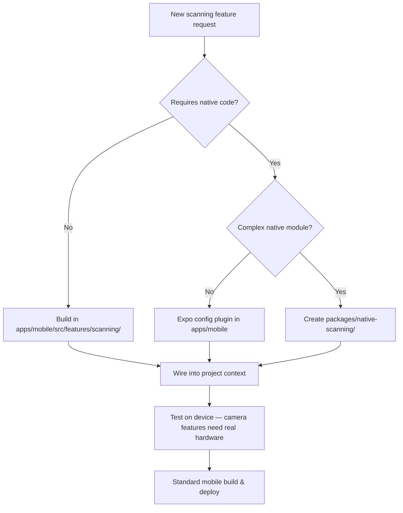

# Mobile Scanning & Measurement Tools — Architecture Decision

## Purpose
Documents the architectural decision to build scanning and measurement capabilities directly into the NCC mobile app (`apps/mobile`) rather than creating a separate companion app. This serves as the reference for future development of any scanning, camera, or measurement features.

## Decision
**Build scanning/measurement tools as a module within the NCC mobile app.**

Do NOT create a separate companion app.

## Who Uses This
- Mobile developers working on `apps/mobile`
- Product/architecture leads evaluating scanning feature scope
- Field crews (end users of scanning features)

## Rationale

### Why a single app is correct for NCC

1. **User friction kills adoption.** Field crews scanning a damaged room need to associate scans with a project immediately. App-switching on a jobsite (gloves, rain, time pressure) creates dropout points.
2. **Mobile inter-app integration is brittle.** Deep links fail if the companion app isn't installed. Shared auth tokens expire. Background data sync gets killed by iOS. The glue code costs more than the feature.
3. **Two apps = double the operational overhead.** Two build pipelines, two App Store reviews, two update cycles, two sets of crash reports. Not justified for a tightly coupled feature.
4. **Data context matters.** Scan results are most useful when tied directly to the project the user is already working in — measurements flow straight into estimates, daily logs, or downstream workflows without a sync step.

### When a companion app WOULD be justified (none currently apply)

- Scanning tool sold independently to non-NCC users (separate product/revenue stream)
- Scanning SDK requires heavy native code that fundamentally conflicts with the Expo/React Native setup (e.g., full Matterport 3D reconstruction)
- Scanning needs to run continuously in background (always-on Bluetooth/IoT) in a way that would drain battery if bundled

### Re-evaluation triggers
Revisit this decision if any of the above conditions become true, or if the scanning native module exceeds ~30% of the total app binary size.

## Implementation Guidance

### Recommended structure
Build scanning as a feature module within `apps/mobile`:

```
apps/mobile/
  src/
    features/
      scanning/
        components/    # Camera viewfinder, measurement overlay, etc.
        hooks/         # useScanner, useMeasurement, useLidar
        screens/       # ScanScreen, MeasurementReviewScreen
        utils/         # Image processing, unit conversion
        types.ts
        index.ts
```

### Technology options (Expo ecosystem)
- **Camera access:** `expo-camera`
- **Barcode/QR scanning:** `expo-camera` barcode scanner or `expo-barcode-scanner`
- **LiDAR depth data:** Available on iPhone 12 Pro+ via Expo config plugin or custom native module
- **AR measurements:** Requires custom native module (ARKit on iOS, ARCore on Android)
- **Image annotation:** React Native Skia or SVG overlay on captured images

### If native code gets complex
Extract heavy native scanning logic into an **Expo config plugin** or **local native module** within the monorepo. This keeps one app binary but isolates native complexity at the build level:

```
packages/
  native-scanning/       # Expo config plugin with native ARKit/ARCore code
    ios/
    android/
    src/
    app.plugin.js
```

This is still a single app — just with the native scanning code cleanly separated from the React Native layer.

## Workflow

### Adding a new scanning feature



### Data flow: Scan → Project


## Key Features (planned)
- Photo/video capture with project tagging
- Barcode/QR scanning for materials and equipment
- Room measurement via LiDAR or AR (iPhone 12 Pro+)
- Damage area markup and annotation
- Offline capture with background sync

## Related Modules
- NCC Mobile App (`apps/mobile`)
- Project Detail (data destination for scans)
- Daily Logs (scan attachments)
- Estimating (measurement data feeds into line items)

## Revision History

| Rev | Date | Changes |
|-----|------|---------|
| 1.0 | 2026-02-28 | Initial architecture decision — single app, no companion |
