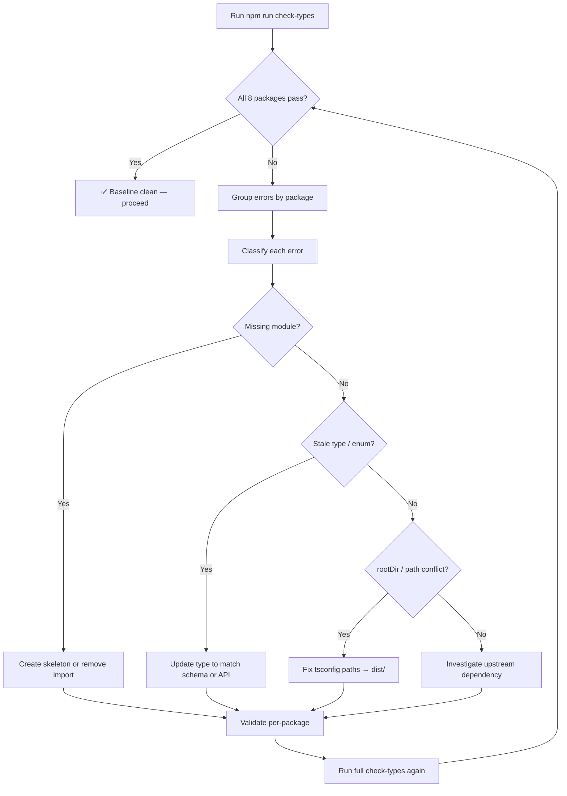

# Monorepo Type Error Triage & Resolution

## Purpose
Defines the standard process for investigating, triaging, and resolving TypeScript type errors across the Nexus Enterprise monorepo. Ensures zero-error `check-types` baseline before production pushes.

## Who Uses This
- Developers working on any app or package in the monorepo
- Warp agents performing pre-push validation
- DevOps reviewing CI/CD pipeline failures

## Workflow

### Step-by-Step Process

1. **Run full monorepo type check** from the repo root:
   ```bash
   npm run check-types
   ```
   This fans out `tsc --noEmit` across all 8 packages via Turborepo.

2. **Identify failing packages.** Turbo output groups errors by package (`api:check-types`, `web:check-types`, `mobile:check-types`, etc.). Note which packages failed and which were cached clean.

3. **Classify each error** into one of these categories:

   | Category | Example | Fix Strategy |
   |----------|---------|--------------|
   | **Missing module** | `Cannot find module './modules/foo/foo.module'` | Create skeleton module or remove dead import |
   | **Stale type reference** | `'avatarUrl' does not exist on type` | Remove field from select/interface or add to schema |
   | **Enum mismatch** | `'PHONE_CALL' not assignable to ClaimJournalEntryType` | Match the Prisma enum exactly |
   | **Upstream API change** | `'GeofencingRegion' has no exported member` | Check `node_modules` types, use correct export name |
   | **rootDir conflict** | `File not under 'rootDir'` | Fix tsconfig path mappings to point to `dist/` |
   | **Extra property** | `'companyId' does not exist in type` | Remove property from Prisma create/update call |

4. **Fix in dependency order.** Shared packages (`@repo/database`, `@repo/icc-client`, `@repo/types`) must pass before apps that consume them (`api`, `web`, `mobile`).

5. **Validate per-package** before running the full suite:
   ```bash
   npm run check-types --workspace=api
   npm run check-types --workspace=mobile
   ```

6. **Run full monorepo check** to confirm zero errors:
   ```bash
   npm run check-types
   ```
   All 8 packages must show `Tasks: 8 successful, 8 total`.

7. **Commit type fixes separately** from feature work so they can be reviewed independently.

### Flowchart



## Key Features
- Turborepo caches passing packages — only changed packages re-check
- Per-package validation (`--workspace=`) for faster iteration
- Prisma-generated types are the source of truth for model shapes
- Path mappings in root `tsconfig.json` control cross-package resolution

## Common Error Patterns (Feb 2026 Baseline)

### API Errors Resolved
- **supplier-bidding**: Module imported in `app.module.ts` but directory never created → skeleton module
- **storage.module**: Transcription module depended on it → skeleton module
- **ICC controller**: Passed `codeType`/`year` not on `ICCSearchParams` → removed from params
- **icc-client rootDir**: Root tsconfig mapped `@repo/icc-client` to source instead of `dist/` → updated path
- **video.service avatarUrl**: Selected `avatarUrl` from User but field not on Prisma model → removed
- **VJN journal share**: Used `"PHONE_CALL"` instead of `"CALL"` enum value; passed `companyId` not on `ClaimJournalEntry` → fixed both

### Mobile Errors Resolved
- **LoginResponse.user.projects**: Geofencing code accessed `projects` but type was `{ id, email }` → added optional `projects` array
- **GeofencingRegion**: Renamed to `LocationRegion` in expo-location → updated type reference
- **region.identifier**: Now optional (`string | undefined`) → added guard before index access

## Related Modules
- [Prisma Schema Management](/docs/sops-staging/) — schema changes drive many type errors
- [CI/CD Pipeline](/docs/architecture/) — `check-types` runs in GitHub Actions pre-merge

## Revision History

| Rev | Date | Changes |
|-----|------|--------|
| 1.0 | 2026-02-26 | Initial release — documents baseline triage of 11 pre-existing type errors |
