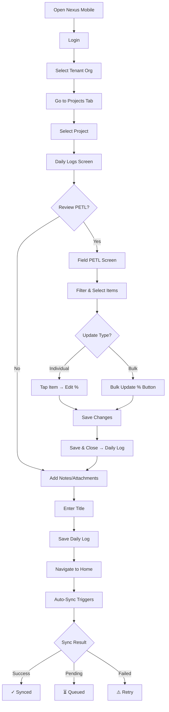

# NCC Mobile Field PETL & Daily Log

## Purpose
This SOP documents the workflow for field crews to update PETL (Project Estimate Tracking Log) completion percentages and create daily logs using the Nexus Mobile app on Android devices.

## Who Uses This
- Field Supervisors
- Project Managers (mobile)
- Crew Leads
- Estimators (field verification)

## Workflow

### Step-by-Step Process

1. **Login & Select Tenant Organization**
   - Open Nexus Mobile app
   - Login with credentials
   - On Home screen, select the appropriate tenant organization from the chip selector
   - Current organization displays as "(current)"

2. **Navigate to Project**
   - Tap "Projects" tab in bottom navigation
   - Select the target project from the list
   - Breadcrumb shows: `Tenant Org / Project Name`

3. **Create Daily Log with PETL Updates**
   - Daily Logs screen opens with breadcrumb header
   - Set the log date (defaults to today)
   - Tap "Review PETL Scope" button to update completion percentages

4. **Update PETL Percentages**
   - Field PETL screen displays all line items
   - Use filters (Room, Category, Selection, Org Group) to narrow scope
   - **Individual Update**: Tap a line item to edit its percentage
   - **Bulk Update**: 
     - Apply filters to select items
     - Tap "Bulk Update %" button
     - Enter new percentage value
     - Button turns amber when pending changes exist

5. **Save PETL Changes**
   - Review changes in the "Line items changed this session" queue
   - Tap "Save & Close" (shows count of pending changes)
   - Returns to Daily Log with auto-populated notes

6. **Complete & Save Daily Log**
   - Add any additional notes, attachments (camera/library)
   - Enter summary title (required)
   - Expand "Additional Details" for weather, crew, safety info
   - Tap "Save Daily Log"

7. **Sync Confirmation**
   - App navigates to Home screen automatically
   - Sync triggers immediately
   - Sync Status section shows:
     - "⟳ Syncing..." during sync
     - "✓ Synced. processed=X failed=0" on success
     - "⚠️" warning if any failures
   - Pending items count displays (amber if > 0)

### Flowchart



## Key Features

### Breadcrumb Navigation
- All screens show `Tenant Org / Project Name` for context
- Prevents accidental data entry to wrong project/tenant

### Pending Changes Indicator
- Bulk Update button turns amber when unsaved changes exist
- Shows count: "Bulk Update % (3 pending)"
- Session changes queue is collapsible/expandable

### Offline-First Sync
- Changes queued locally if offline
- Auto-sync when connectivity restored
- Manual "Sync now" button available on Home
- Wi-Fi only sync toggle available

### Post-Save Navigation
- After saving daily log, returns to Home (not blank form)
- Confirms save was successful
- Shows sync status immediately

## Troubleshooting

### API 500 Errors
- Check network connectivity
- Verify tenant organization is selected
- Large bulk updates may timeout - try smaller batches
- Check if database migrations are current

### Sync Failures
- Review pending items count
- Check Wi-Fi only setting if on cellular
- Manual retry via "Sync now" button
- Check API logs if persistent failures

### Build Issues (Development)
- Ensure Java 17 is set: `export JAVA_HOME=$(/usr/libexec/java_home -v 17)`
- Android Studio SDK required for emulator
- Cloud SQL Proxy needed for production database access

## Related Modules
- [Daily Log Management]
- [Project PETL Web UI]
- [Timecard Mobile]
- [Offline Sync System]

## Technical Notes

### Local Build Commands
```bash
# Build and install on connected device
export JAVA_HOME=$(/usr/libexec/java_home -v 17)
cd apps/mobile
npx expo run:android --variant debug

# Install APK on specific device
adb -s DEVICE_ID install android/app/build/outputs/apk/debug/app-debug.apk
```

### EAS Cloud Build
```bash
# Queue cloud build
eas build --profile development --platform android

# Install latest build
eas build:run --platform android --latest
```

## Revision History
| Rev | Date | Changes |
|-----|------|---------|
| 1.0 | 2026-02-16 | Initial release - Field PETL workflow with breadcrumbs, sync feedback |
