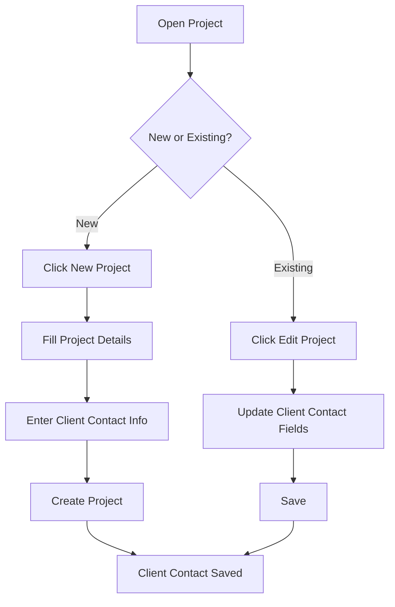

# Project Client Contact Management

## Purpose
This SOP documents how to assign and manage client contact information on projects. Client contact details are used for invoice issuance and project correspondence.

## Who Uses This
- Project Managers (PMs)
- Admins
- Owners

## Workflow

### Adding Client Contact During Project Creation

1. Click **New Project** in the projects sidebar
2. Fill in required project details (Name, Address, City, State)
3. In the **Client Contact** section at the bottom of the form:
   - **Client Name**: Enter the client's full name
   - **Email**: Enter at least one email address for correspondence
   - **Phone**: Enter the client's phone number
4. Click **Create project**

### Editing Client Contact on Existing Projects

1. Navigate to the project
2. Click **Edit project** button (visible to Admin+ roles)
3. Scroll to the **Client Contact** section
4. Update the fields as needed:
   - Client Name
   - Email
   - Phone
5. Click **Save**

### Flowchart

## Key Features
- Client contact fields are optional but recommended for invoicing workflows
- Contact info is stored at the project level
- Fields include: Full Name, Email, Phone
- Data is used for:
  - Invoice generation and delivery
  - Project correspondence
  - Client communication

## Field Details

| Field | Description | Required |
|-------|-------------|----------|
| Client Name | Full name of the primary client contact | No |
| Email | Email address for invoices and correspondence | No |
| Phone | Phone number for direct contact | No |

## Related Modules
- Project Invoicing
- Project Billing
- Client Communication

## Revision History
| Rev | Date | Changes |
|-----|------|---------|
| 1.0 | 2026-02-16 | Initial release - client contact fields added to project create/edit |
