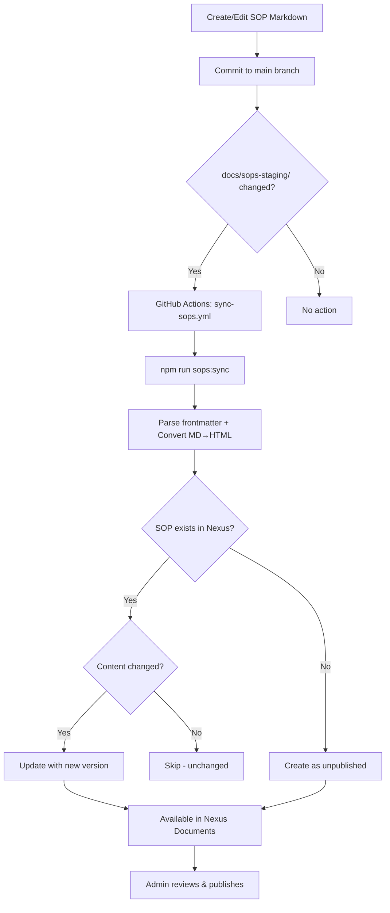

# SOP Sync System

## Purpose
This SOP documents the automated system for syncing Standard Operating Procedures (SOPs) from the codebase to Nexus Documents. SOPs are written as Markdown files, converted to HTML, and uploaded to the Nexus Documents system as unpublished eDocs for review and publication.

## Who Uses This
- Developers creating or updating SOPs
- Project managers reviewing documentation
- Admins publishing SOPs to appropriate audiences

## Workflow

### SOP Creation Flow

#### Step-by-Step Process
1. Developer or Warp creates/updates an SOP Markdown file in `docs/sops-staging/`
2. File must include YAML frontmatter (title, module, revision, tags, status, author)
3. On merge to `main`, GitHub Actions triggers the sync workflow
4. Script converts Markdown → HTML and uploads to Nexus Documents API
5. New SOPs are created as **unpublished** (`active: false`)
6. Updated SOPs create a new version (content hash comparison detects changes)
7. Admin reviews unpublished SOPs in Nexus Documents UI
8. Admin publishes with appropriate role visibility

#### Flowchart



## File Structure

### SOP Staging Directory
```
docs/sops-staging/
├── README.md                          # Workflow documentation
├── company-management-sop.md
├── document-import-sop.md
├── field-petl-mobile.md
├── local-price-extrapolation-sop.md
├── ncc-sop-sync-system-sop.md         # This document
├── projects-estimates-sop.md
├── timecards-sop.md
├── token-authentication-sop.md
├── user-onboarding-sop.md
└── xactimate-activity-codes-sop.md
```

### Required Frontmatter Format
```yaml
---
title: "Human-Readable SOP Title"
module: module-name
revision: "1.0"
tags: [sop, module-name, relevant-tags]
status: draft
created: YYYY-MM-DD
updated: YYYY-MM-DD
author: Warp
---
```

### Code Generation
The SOP code is auto-generated from the `module` field:
- `module: mobile-sync` → `SOP-MOBILE-SYNC`
- `module: document-import` → `SOP-DOCUMENT-IMPORT`

## Commands

### Local Development
```bash
# Preview what would sync (dry run)
npm run sops:sync:dry

# Sync all SOPs to local API
NEXUS_API_TOKEN=<jwt> npm run sops:sync

# Watch mode - auto-sync on file save
NEXUS_API_TOKEN=<jwt> npm run sops:watch

# Sync a specific file
NEXUS_API_TOKEN=<jwt> npx ts-node scripts/import-sops.ts --file token-authentication-sop.md
```

### CI/CD (Automatic)
The GitHub Actions workflow `.github/workflows/sync-sops.yml` runs automatically on:
- Push to `main` branch with changes in `docs/sops-staging/`
- Manual trigger via GitHub Actions UI (`workflow_dispatch`)

## Key Features
- **Automatic versioning** — Each content change creates a new document version
- **Content hash detection** — Only syncs when actual content changes
- **Unpublished by default** — New SOPs require admin review before publication
- **Watch mode** — Real-time sync during local development
- **CI/CD integration** — Automatic sync on merge to main

## Configuration

### Environment Variables
| Variable | Description | Default |
|----------|-------------|---------|
| `NEXUS_API_URL` | Base URL for Nexus API | `http://localhost:3100` |
| `NEXUS_API_TOKEN` | JWT token for authentication | Required |

### GitHub Secrets (for CI/CD)
- `NEXUS_API_URL` — Production API URL
- `NEXUS_API_TOKEN` — Service account JWT with admin permissions

## Technical Implementation

### Script Location
`scripts/import-sops.ts`

### Dependencies
- `gray-matter` — YAML frontmatter parsing
- `markdown-it` — Markdown to HTML conversion
- `ts-node` — TypeScript execution

### API Endpoints Used
- `GET /documents/templates` — Fetch existing templates
- `POST /documents/templates` — Create new template
- `PATCH /documents/templates/:id` — Update template / create new version

### Data Model
SOPs are stored as `DocumentTemplate` records with:
- `type: SOP`
- `code: SOP-{MODULE-NAME}`
- `active: false` (unpublished) or `true` (published)
- Versions tracked in `DocumentTemplateVersion` with content hash

## Related Modules
- [Nexus Documents System](../architecture/documents.md)
- [CI/CD Workflows](../architecture/ci-cd.md)

## Revision History
| Rev | Date | Changes |
|-----|------|--------|
| 1.0 | 2026-02-16 | Initial release |
