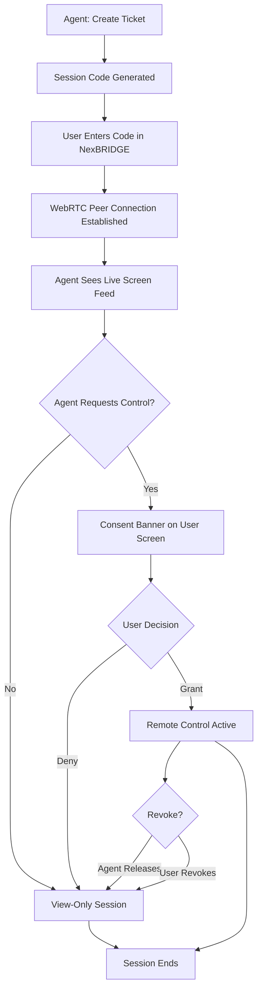

# NexBRIDGE Remote Tech Support & Control

## Purpose
Enables NCC support staff to view a user's NexBRIDGE desktop screen in real time and, with explicit user consent, take remote control of their mouse and keyboard — without any third-party screen-share tool.

## Who Uses This

- **Support staff / admins** — initiate sessions, view screens, request control via the NCC Admin Support panel
- **NexBRIDGE desktop users** — enter session codes, grant/revoke control from within the NexBRIDGE app

## Workflow

### Step-by-Step Process — Support Staff (Agent)

1. Navigate to **NCC Admin → Support** (`/admin/support`)
2. Click **New Support Ticket** — enter a title and optional description
3. A **6-character session code** is generated and displayed (e.g., `A4X7K2`)
4. Share the code with the user verbally or via chat
5. Wait for the user to connect — the viewer panel will show "Waiting for connection…"
6. Once connected, the user's live screen feed appears in the viewer
7. To take control: click **Request Control** — the user will see a consent banner
8. Once the user grants control, the agent's mouse and keyboard control the remote desktop
9. To release control: click **Release Control** (or the user can revoke at any time)
10. Close the session when support is complete

### Step-by-Step Process — End User (NexBRIDGE)

1. Open **NexBRIDGE** → navigate to the **Support** tab
2. Enter the **6-character session code** provided by support staff
3. Click **Connect** — screen sharing begins automatically
4. A status indicator confirms the session is active
5. If the agent requests control, a **consent banner** appears:
   - Click **Grant Control** to allow remote input
   - A **pulsing red border** appears on screen while control is active
6. To revoke control at any time: click **Revoke Control** in the overlay — takes effect immediately
7. Click **Disconnect** to end the session entirely

### Remote Control Flow

## Key Features

- **Zero install** — no TeamViewer, Zoom, or third-party software needed; everything runs within NCC and NexBRIDGE
- **Consent-gated control** — remote control is always opt-in; user must explicitly grant access
- **Visual indicators** — pulsing red border on user's screen while control is active; orange border + crosshair on agent's viewer
- **Instant revoke** — user can reclaim control in one click at any time; agent can also release
- **Peer-to-peer** — WebRTC direct connection; no video stored or logged
- **Scoped sessions** — session codes are single-use and scoped to the user's NCC organization

## Privacy & Security Notes

- No screen content is recorded or stored on any server
- Video streams directly peer-to-peer via WebRTC (STUN/TURN for NAT traversal only)
- Input injection is OS-native (Tauri/enigo Rust module) — no clipboard access, no file system access
- Sessions expire automatically if unused; codes cannot be reused
- All sessions require a valid NCC organization context — anonymous access is not possible

## Related Modules

- NexBRIDGE Desktop App (`apps/nexbridge-connect`)
- NCC Admin Panel (`/admin/support`)
- NCC Support Viewer (`/support/viewer`)
- API Support Session Module (`apps/api/src/modules/support-session`)
- `packages/support-client` — shared WebRTC + signaling library

## Revision History
| Rev | Date | Changes |
|-----|------|---------|
| 1.0 | 2026-03-10 | Initial release |
